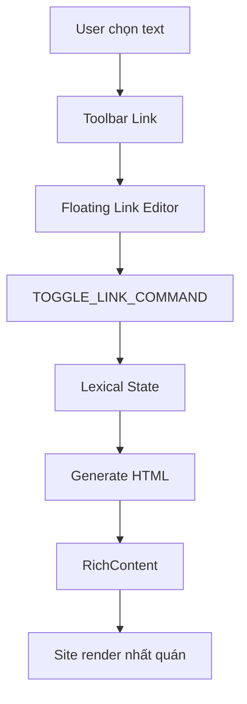

# I. Primer
## 1. TL;DR kiểu Feynman
- Hiện editor dùng chung đã có nền Lexical, nhưng nút Link đang dùng prompt và hành vi chưa giống Playground.
- Mục tiêu chốt: **hành vi + output giống Playground**, còn UI toolbar giữ style hiện tại.
- Mình sẽ làm `Floating Link Editor` theo selection, chuẩn command Lexical, và áp dụng cho toàn bộ màn đang dùng `LexicalEditor`.
- Output HTML sẽ được chuẩn hóa để site render ổn định (đặc biệt link/youtube), không lệch giữa admin và site.
- Phạm vi là toàn hệ thống rich editor + render site thực, không chỉ 1 trang posts edit.

## 2. Elaboration & Self-Explanation
Bài toán gốc không phải thiếu package mà là thiếu “wiring” đúng kiểu Playground ở lớp toolbar/plugin. Khi người dùng bôi đen chữ và bấm Link, Playground mở floating editor ngay tại selection để nhập/sửa/xóa link; hiện tại code đang prompt thô nên trải nghiệm khác.

Kế hoạch là giữ lại kiến trúc editor dùng chung, bổ sung plugin floating link chuẩn Lexical, đồng thời đồng bộ contract render để nội dung lưu ra hiển thị giống nhau ở site. Nói ngắn gọn: cùng một nội dung được tạo ở admin thì lên site phải hiển thị đúng semantics và layout, không sai ngữ nghĩa link/embed.

## 3. Concrete Examples & Analogies
- Ví dụ: bôi đen “Xem chi tiết”, bấm icon Link → nổi floating editor cạnh selection, nhập `/san-pham/a` → Enter để apply; bấm lại vào link có thể sửa URL hoặc remove link, giống flow Playground.
- Ví dụ YouTube: dán `https://youtu.be/xxxxx` → editor chèn block video; lưu xong ra site vẫn đúng tỉ lệ 16:9 và không vỡ layout mobile.
- Analogy: editor là nơi “soạn hợp đồng”, site là nơi “thi hành hợp đồng”. Nếu điều khoản (HTML contract) không chuẩn thì thi hành sẽ lệch.

# II. Audit Summary (Tóm tắt kiểm tra)
- Observation:
  - `app/admin/components/LexicalEditor.tsx` là shared editor cho posts/products/services/seo/settings templates.
  - Đang có `HistoryPlugin`, `LinkPlugin`, `LinkNode`, `AutoLinkNode`, nhưng Link UX hiện là `window.prompt`, chưa theo Playground.
  - Có hạ tầng YouTube node/plugin và RichContent render, nhưng cần siết parity contract cho toàn site.
- Inference:
  - Khoảng cách với Playground chủ yếu ở UX plugin + command flow, không phải thiếu dependency nền.
  - Vì editor shared nên sửa một nơi sẽ phủ toàn bộ màn dùng LexicalEditor.
- Decision:
  - Triển khai đồng loạt trên shared editor + rà render site theo contract mới.

# III. Root Cause & Counter-Hypothesis (Nguyên nhân gốc & Giả thuyết đối chứng)
- Root cause:
  1. Link interaction chưa dùng floating editor theo selection như Playground.
  2. Một số điểm render contract chưa được chuẩn hóa chặt cho output rich content toàn site.
- Counter-hypothesis đã loại trừ:
  - “Thiếu plugin Lexical nên không làm được” → sai, plugin lõi đã có.
  - “Chỉ cần sửa riêng trang posts edit” → sai với yêu cầu áp dụng toàn hệ thống.
- Root Cause Confidence (Độ tin cậy nguyên nhân gốc): **High** (evidence trực tiếp từ shared component + hành vi hiện tại).

# IV. Proposal (Đề xuất)
1. Nâng `LexicalEditor` lên parity hành vi Playground (giữ UI hiện tại):
   - Dùng `@lexical/react/LexicalFloatingLinkEditorPlugin` (hoặc pattern tương đương của playground) để có floating link editor theo selection.
   - Chuẩn hóa nút Link: add/edit/remove link đúng command flow của Lexical.
2. Chuẩn hóa toolbar state:
   - Đồng bộ trạng thái active link, selection change listener, edge case collapsed/range selection.
3. Chuẩn hóa output/render toàn site:
   - Rà `components/common/RichContent.tsx` + CSS global cho link và youtube block để đảm bảo parity output admin↔site.
4. Áp dụng đồng loạt cho tất cả callsite đang import `LexicalEditor`.
5. Static self-review kỹ: typing, null-safety, backward compatibility với content cũ.

# V. Files Impacted (Tệp bị ảnh hưởng)
- **Sửa:** `app/admin/components/LexicalEditor.tsx`
  - Vai trò hiện tại: shared rich editor cho nhiều màn admin.
  - Thay đổi: thêm floating-link behavior chuẩn Playground, chỉnh command wiring và state toolbar.
- **Sửa (nếu cần):** `app/admin/components/nodes/YouTubeNode.tsx`
  - Vai trò hiện tại: custom node YouTube cho editor.
  - Thay đổi: giữ/siết output contract để render ổn định toàn site.
- **Sửa:** `components/common/RichContent.tsx`
  - Vai trò hiện tại: surface render rich HTML cho site.
  - Thay đổi: đồng bộ render contract cho link/embed từ editor.
- **Sửa:** `app/globals.css`
  - Vai trò hiện tại: style global + rich content.
  - Thay đổi: chuẩn hóa style link/youtube responsive theo output editor.
- **Sửa (khi phát hiện conflict):** các route/component site đang dùng `RichContent`
  - Vai trò hiện tại: hiển thị nội dung rich trên site thực.
  - Thay đổi: fix xung đột class/style để output nhất quán.

# VI. Execution Preview (Xem trước thực thi)
1. Đọc kỹ pattern plugin/link hiện có trong `LexicalEditor`.
2. Tích hợp floating link editor theo selection, thay flow prompt cũ.
3. Chuẩn hóa toggle/update/remove link command + active-state.
4. Rà contract HTML sinh ra và render ở `RichContent`/`globals.css`.
5. Quét toàn bộ callsite dùng `LexicalEditor` + callsite render rich content, fix lệch nếu có.
6. Self-review tĩnh và chốt commit.

# VII. Verification Plan (Kế hoạch kiểm chứng)
- Kiểm chứng kỹ thuật:
  - `bunx tsc --noEmit` (vì có thay đổi TS/code).
- Kiểm chứng hành vi thủ công:
  1. Bôi đen text → mở floating link editor đúng vị trí selection.
  2. Add link, edit link, remove link hoạt động đúng.
  3. Keyboard flow cơ bản (Enter/Escape) hoạt động ổn định.
  4. Nội dung lưu xong render đúng trên các trang site dùng rich content.
  5. Nội dung cũ không bị vỡ khi mở lại editor.

# VIII. Todo
1. Refactor Link UX từ prompt sang floating editor theo selection.
2. Đồng bộ command/state cho add-edit-remove link.
3. Rà và chuẩn hóa output contract link/youtube trong render site.
4. Audit toàn bộ callsite `LexicalEditor` và `RichContent`.
5. Static self-review + chạy `bunx tsc --noEmit`.
6. Commit thay đổi (không push).

# IX. Acceptance Criteria (Tiêu chí chấp nhận)
- Hành vi Insert Link giống Playground ở mức interaction: floating editor theo selection, add/edit/remove chuẩn.
- Output HTML sau khi lưu render nhất quán trên site thực ở tất cả màn dùng shared editor.
- Không regression các chức năng rich editor hiện có (bold/italic/list/image/youtube/undo/redo).
- `bunx tsc --noEmit` pass.

# X. Risk / Rollback (Rủi ro / Hoàn tác)
- Rủi ro:
  - Floating editor có thể lệch vị trí trong một số container overflow.
  - CSS global có thể ảnh hưởng layout ở vài page đặc thù.
- Giảm thiểu:
  - Bám pattern chính thức từ Lexical playground/plugin.
  - Chỉ sửa tối thiểu, ưu tiên shared contract, tránh page-specific hack.
- Rollback:
  - Revert commit theo cụm (editor behavior / render contract) nếu phát sinh regression.

# XI. Out of Scope (Ngoài phạm vi)
- Không clone pixel-perfect toàn bộ UI Playground.
- Không mở rộng thêm plugin ngoài scope link parity + render consistency toàn site.
- Không thay đổi schema/data layer.

# XII. Open Questions (Câu hỏi mở)
- Không còn ambiguity sau khi bạn đã chốt:
  - Parity = hành vi + output.
  - Link UX = floating editor theo selection.
  - Rollout = đồng loạt toàn bộ màn dùng `LexicalEditor`.