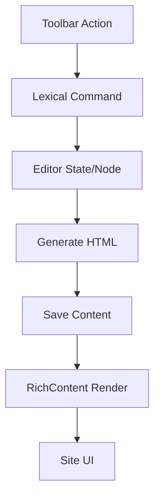
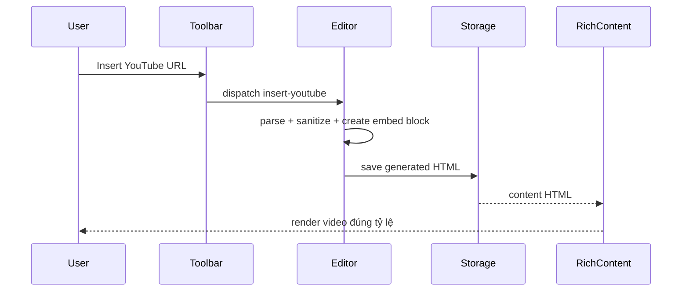

# I. Primer
## 1. TL;DR kiểu Feynman
- Mình đã audit nhanh: repo đang có **1 LexicalEditor dùng chung** cho nhiều màn admin, nhưng toolbar hiện thiếu `undo/redo`, `insert link`, `insert youtube` theo yêu cầu.
- Site đã có `RichContent` + `editor-content`, nhưng vẫn cần siết contract để output từ editor mới (đặc biệt YouTube embed) render đúng ở mọi route.
- Hướng làm: bổ sung command/plugin đúng chuẩn Lexical, tạo node/command YouTube an toàn (chỉ nhận URL), rồi rà toàn bộ callsite render để đảm bảo “editor output == site output”.
- Bạn đã chốt scope: **một đợt cho toàn bộ màn admin Lexical + toàn bộ route site RichContent**.
- Ưu tiên của bạn là **hành vi toolbar + output HTML giống lexical playground** (không ép pixel-perfect toolbar UI).

## 2. Elaboration & Self-Explanation
Hiện editor đang làm tốt phần text/list/image, nhưng thiếu 3 nhóm hành vi quan trọng mà playground có: hoàn tác/làm lại, chèn link, và chèn YouTube. Khi thiếu các command này, người dùng phải thao tác thủ công hoặc không tạo được đúng cấu trúc nội dung ngay trong editor.

Giải pháp bền là:
a) bổ sung đúng command Lexical cho undo/redo + link,
b) thêm YouTube theo kiểu an toàn: nhận URL, parse thành embed URL hợp lệ,
c) xuất HTML ổn định để `RichContent` render nhất quán ở site.

Nói đơn giản: editor phải “nói cùng ngôn ngữ” với site. Nếu editor tạo ra loại node/tag nào thì site phải có style/render contract tương ứng cho loại đó.

## 3. Concrete Examples & Analogies
- Ví dụ cụ thể theo task của bạn: nhập `https://youtu.be/abc123`, bấm nút Insert YouTube → editor chèn block video embed chuẩn. Khi lưu và mở trang site (post/product/service), block video hiển thị đúng tỷ lệ, không vỡ layout.
- Analogy: giống ổ cắm và phích cắm. Editor là phích, site là ổ. Nếu chuẩn chân cắm khác nhau thì cắm vào không chạy; mình sẽ chuẩn hóa để “cắm phát chạy luôn”.

# II. Audit Summary (Tóm tắt kiểm tra)
- Observation:
  - `app/admin/components/LexicalEditor.tsx` là editor dùng chung cho các màn: posts/products/services/seo/settings templates.
  - Toolbar hiện có font/size/color/bold-italic-underline/alignment/heading/list/image; **chưa có** undo/redo, link UI, youtube insert UI.
  - Đã có `HistoryPlugin`, `LinkPlugin`, `LinkNode/AutoLinkNode` trong config, tức là nền tảng có sẵn nhưng chưa expose đầy đủ qua toolbar logic.
  - Render site dùng `components/common/RichContent.tsx` + CSS `.editor-content` trong `app/globals.css`; nhiều route site đã đi qua `RichContent`.
- Inference:
  - Thiếu hành vi chủ yếu nằm ở **editor toolbar + command wiring**, không phải thiếu package.
  - Rủi ro lệch “site != editor” nằm ở phần render cho nội dung mới (YouTube block) nếu không chuẩn hóa ngay trong `RichContent/CSS`.
- Decision:
  - Làm một đợt: nâng editor dùng chung + chuẩn hóa render site cho output mới.

# III. Root Cause & Counter-Hypothesis (Nguyên nhân gốc & Giả thuyết đối chứng)
- Root cause chính:
  1) Toolbar chưa implement các nút/command cần thiết (undo/redo/link/youtube).
  2) Chưa có contract render rõ cho YouTube embed output trên site.

- Trả lời checklist root cause (rút gọn, gồm mục bắt buộc):
  1. Triệu chứng: playground có các hành vi này, editor hiện tại thiếu; output vì thế chưa tương đương kỳ vọng.
  3. Tái hiện: ổn định 100% trên mọi màn dùng `LexicalEditor` vì cùng shared component.
  6. Giả thuyết thay thế: do thiếu dependency Lexical plugin. Đã loại trừ vì `@lexical/link`, `HistoryPlugin` đã có.
  8. Pass/fail: có nút hoạt động đúng + lưu/render site đúng cho link/youtube trên các route chính.

- Counter-hypothesis:
  - “Chỉ cần chỉnh CSS toolbar cho giống là đủ” → sai với ưu tiên của bạn (ưu tiên hành vi + output).
  - “Chỉ sửa 1 màn post” → sai vì editor là shared, scope bạn yêu cầu toàn bộ.

- Root Cause Confidence (Độ tin cậy nguyên nhân gốc): **High** (đã có evidence trực tiếp từ file editor dùng chung và callsites).

# IV. Proposal (Đề xuất)
1. **Bổ sung Undo/Redo chuẩn Lexical**
   - Thêm state theo dõi khả dụng undo/redo qua command listener.
   - Thêm 2 nút toolbar gọi `UNDO_COMMAND` / `REDO_COMMAND`.

2. **Bổ sung Insert Link chuẩn Lexical**
   - Thêm nút Link mở prompt/popover nhập URL.
   - Validate URL tối thiểu, dùng command toggle link (set/unset trên selection).

3. **Bổ sung Insert YouTube (URL-only, safe embed)**
   - Thêm parse utility cho youtube.com / youtu.be / shorts.
   - Chỉ tạo embed URL whitelist domain YouTube.
   - Chèn dưới dạng block HTML/node có class contract rõ để site render ổn định.

4. **Chuẩn hóa render site cho output mới**
   - Cập nhật `RichContent`/`editor-content` để hỗ trợ block YouTube (wrapper ratio, responsive).
   - Audit toàn bộ route site dùng `RichContent` để đảm bảo không bị class override phá layout video/link.

5. **Giữ KISS/YAGNI**
   - Không thay schema/data model.
   - Không đổi editor theo pixel-level playground toàn bộ; chỉ đảm bảo hành vi + output tương đương.

# V. Files Impacted (Tệp bị ảnh hưởng)
## UI / Admin editor
- **Sửa:** `app/admin/components/LexicalEditor.tsx`  
  Vai trò hiện tại: editor dùng chung cho admin.  
  Thay đổi: thêm nút + logic undo/redo, insert link, insert youtube và state toolbar liên quan.

- **Sửa (hoặc Thêm nếu tách riêng):** `app/admin/components/nodes/*` (ví dụ node/plugin YouTube)  
  Vai trò hiện tại: custom node/plugin cho editor (đang có ImageNode).  
  Thay đổi: thêm contract node/command cho YouTube embed an toàn.

## Shared render / Site
- **Sửa:** `components/common/RichContent.tsx`  
  Vai trò hiện tại: cổng render markdown/html/richtext.  
  Thay đổi: đảm bảo render ổn định cho output link/youtube mới, không bị conflict class.

- **Sửa:** `app/globals.css`  
  Vai trò hiện tại: style toàn cục và `editor-content`.  
  Thay đổi: bổ sung style responsive cho embed YouTube trong `.editor-content`.

## Callsites site (audit toàn bộ)
- **Sửa (nếu phát hiện conflict):** các route dùng `RichContent` trong `app/(site)/**` (posts/products/services/trust/use-cases/guides/templates/solutions/features/integrations/compare...).  
  Vai trò hiện tại: hiển thị rich content ngoài site.  
  Thay đổi: đồng bộ class/render contract để giữ 1 chuẩn output từ editor.

# VI. Execution Preview (Xem trước thực thi)
1. Đọc lại `LexicalEditor` và chọn pattern command giống code hiện hữu.
2. Implement undo/redo buttons + register trạng thái khả dụng.
3. Implement insert link UI + command toggle/unset.
4. Implement insert youtube URL flow (parse/validate/sanitize/embed).
5. Cập nhật `RichContent` + `globals.css` cho youtube block.
6. Audit callsites `RichContent` toàn site và fix conflict class nếu có.
7. Static self-review typing/null-safety/edge-case + chuẩn bị commit.

# VII. Verification Plan (Kế hoạch kiểm chứng)
- Static checks:
  - Soát type-safety và branch edge-case (URL lỗi, selection rỗng, unset link).
  - Chạy `bunx tsc --noEmit` (theo rule repo cho thay đổi TS/code).
- Functional checklist thủ công:
  1) Undo/Redo hoạt động trên các màn post/product/service/seo.
  2) Insert link: tạo link, bỏ link, render site click được.
  3) Insert youtube: nhận URL hợp lệ, từ chối URL không hợp lệ, render responsive trên site.
  4) Nội dung cũ không hỏng (backward compatibility).

# VIII. Todo
1. Thêm undo/redo command wiring + UI trong `LexicalEditor`.
2. Thêm insert link command wiring + UI trong `LexicalEditor`.
3. Thêm youtube URL parser + insert block/node an toàn.
4. Cập nhật `RichContent`/`globals.css` để render youtube block chuẩn.
5. Audit toàn bộ callsite `RichContent` trên site và fix xung đột class/render.
6. Self-review tĩnh + chạy `bunx tsc --noEmit`.
7. Tạo commit (không push) theo rule repo.

# IX. Acceptance Criteria (Tiêu chí chấp nhận)
- Có đủ nút: Undo, Redo, Insert Link, Insert YouTube trong toolbar editor dùng chung.
- Hành vi nút đúng chuẩn sử dụng Lexical commands; không phá các nút hiện có.
- YouTube chỉ nhận URL hợp lệ và render embed an toàn, responsive trên site.
- Output HTML từ editor hiển thị nhất quán ở các route site dùng `RichContent`.
- Không có lỗi typecheck (`bunx tsc --noEmit`).

# X. Risk / Rollback (Rủi ro / Hoàn tác)
- Rủi ro:
  - URL parser YouTube thiếu case lạ.
  - Một số route site có class riêng gây lệch khi thêm embed block.
- Giảm thiểu:
  - Whitelist pattern YouTube phổ biến + fallback báo lỗi rõ.
  - Audit toàn bộ callsite trong cùng đợt (đúng yêu cầu của bạn).
- Rollback:
  - Revert commit theo từng cụm: editor toolbar / youtube render / callsite fixes.

# XI. Out of Scope (Ngoài phạm vi)
- Không thêm full bộ plugin playground khác ngoài 4 mục bạn yêu cầu.
- Không redesign toàn bộ toolbar theo pixel-perfect playground.
- Không thay đổi schema Convex/data model.

# XII. Open Questions (Câu hỏi mở)
- Không còn ambiguity đáng kể theo câu trả lời bạn vừa chốt; có thể triển khai ngay theo plan này.