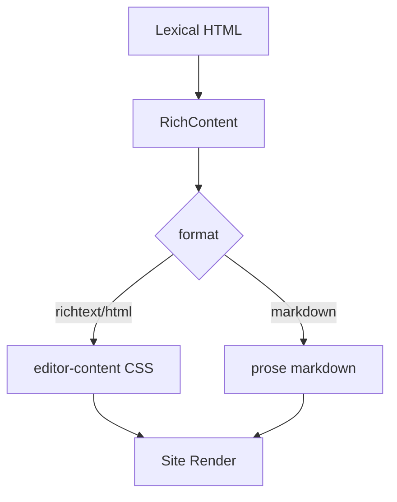

# I. Primer
## 1. TL;DR kiểu Feynman
- Hiện tượng lệch là do **2 hệ style khác nhau**: admin Lexical có CSS riêng, còn site đang trộn thêm `prose` (Tailwind Typography) nên đè heading/list/spacing.
- Mục tiêu bạn chốt: áp dụng cho **toàn bộ nơi dùng RichContent trên site**, ưu tiên **khớp editor 100%** và chấp nhận đổi nhẹ UI.
- Kế hoạch: dựng **1 bộ CSS chuẩn `editor-content`** dùng chung, rồi audit từng điểm gọi `RichContent` để loại tác nhân đè style.
- Không “vá từng trang” nữa: chuẩn hoá theo contract render chung để về sau sinh content nào cũng nhất quán.
- Có checklist verify theo từng route trọng điểm (posts/products/services/trust/use-cases).

## 2. Elaboration & Self-Explanation
Bài toán không nằm ở nội dung sinh ra, mà nằm ở “đường ống render” (render pipeline). Lexical editor tạo HTML với kỳ vọng style cụ thể (h1/h2/list/blockquote/paragraph spacing). Nhưng ra site, nhiều page truyền class có `prose*`, khiến CSS typography ghi đè. Vì vậy cùng 1 HTML nhưng admin nhìn đúng, site nhìn khác.

Cách xử lý bền là đặt **một chuẩn hiển thị duy nhất**: mọi richtext/html render qua `RichContent` phải dùng `editor-content` và không để `prose` can thiệp. Markdown vẫn có thể dùng `prose` riêng vì đó là format khác.

## 3. Concrete Examples & Analogies
- Ví dụ đúng ngữ cảnh: ở `/posts/[slug]` truyền `className="prose-zinc prose-lg ..."`, nên `h1/h2` bị typography scale khác editor. Khi bỏ `prose*` khỏi richtext/html, heading/list trở về đúng nhịp như trong admin.
- Analogy đời thường: cùng một bản Word nhưng một máy mở bằng font mặc định khác -> bố cục lệch. Ta cần “embed style chuẩn” để máy nào mở cũng như nhau.

# II. Audit Summary (Tóm tắt kiểm tra)
- Observation (Quan sát):
  - `RichContent` là điểm vào chung cho rich render: `components/common/RichContent.tsx`.
  - Nhiều route site truyền class chứa `prose*` khi gọi `RichContent` (evidence từ grep):
    - `app/(site)/posts/[slug]/page.tsx`
    - `app/(site)/products/[slug]/page.tsx`
    - `app/(site)/_components/TrustPageContent.tsx`
    - `app/(site)/use-cases/[slug]/page.tsx`
  - Một số route còn render `dangerouslySetInnerHTML` trực tiếp với wrapper `prose` (không đi qua `RichContent`):
    - `templates/[slug]`, `solutions/[slug]`, `integrations/[slug]`, `guides/[slug]`, `compare/[slug]`, `features/[slug]`.
  - CSS editor nằm trong `LexicalEditor.tsx` (global style block), không tự động đồng bộ ra site.
- Inference (Suy luận): lệch chủ yếu do CSS override (prose/route-level classes), không phải do data sai.
- Decision (Quyết định): chuẩn hoá contract render chung cho toàn site qua `editor-content` và loại bỏ override gây lệch.

*Legend: `editor-content` = CSS chuẩn mô phỏng Lexical; `prose` chỉ dành cho markdown.*

# III. Root Cause & Counter-Hypothesis (Nguyên nhân gốc & Giả thuyết đối chứng)
- Root cause chính: **CSS conflict** giữa `editor-content` và `prose*` ở các nơi gọi `RichContent` + các page render HTML thẳng không qua contract chung.
- Counter-hypothesis (Giả thuyết đối chứng) và loại trừ:
  - “Do auto-generate HTML sai tag”: không đủ giải thích vì cùng HTML vẫn hiển thị khác giữa admin/site.
  - “Do dữ liệu DB mất format”: ảnh editor và site cho thấy tag vẫn còn, nhưng visual scale/spacing lệch -> thiên về CSS.
- Root Cause Confidence (Độ tin cậy nguyên nhân gốc): **High** (evidence trực tiếp từ grep + ảnh so sánh + code path).

# IV. Proposal (Đề xuất)
## 1. Contract render thống nhất
- Quy ước mới:
  - `format=richtext|html` => chỉ dùng `editor-content` (không prose).
  - `format=markdown` => dùng `prose` riêng.
- `RichContent` sẽ là “cổng duy nhất” cho rich content trên site.

## 2. Chuẩn hóa call-sites toàn site
- Rà toàn bộ nơi dùng `RichContent` và loại class `prose*` ở richtext/html path.
- Các route đang `dangerouslySetInnerHTML` trực tiếp sẽ chuyển về `RichContent` nếu dữ liệu là rich/html có thể chuẩn hoá.

## 3. Chuẩn CSS dùng chung
- Đặt bộ CSS `editor-content` trong `app/globals.css` (h1/h2/h3, p, ul/ol/li, quote, strong, img, link).
- Giữ tỷ lệ gần `LexicalEditor` để 1 nguồn style.

## 4. Guardrail chống regress
- Thêm helper sanitize className trong `RichContent` để lọc token `prose*` cho richtext/html.
- (Nếu cần) thêm cảnh báo dev-only khi truyền `prose*` vào richtext/html branch.

# V. Files Impacted (Tệp bị ảnh hưởng)
## UI / shared
- Sửa: `components/common/RichContent.tsx`
  - Vai trò hiện tại: renderer chung cho markdown/html/richtext.
  - Thay đổi: enforce contract format-based class, chặn `prose*` ở rich/html.

- Sửa: `app/globals.css`
  - Vai trò hiện tại: global styles app/site.
  - Thay đổi: hoàn chỉnh bộ `editor-content` bám Lexical (không phụ thuộc prose).

- Sửa: `app/(site)/posts/[slug]/page.tsx`
  - Vai trò hiện tại: hiển thị bài viết nhiều layout.
  - Thay đổi: bỏ class prose ở các `RichContent` rich/html callsites.

- Sửa: `app/(site)/products/[slug]/page.tsx`
  - Vai trò hiện tại: hiển thị mô tả/supplemental content.
  - Thay đổi: chuẩn hoá class truyền vào `RichContent`, tránh prose override.

- Sửa: `app/(site)/_components/TrustPageContent.tsx`
  - Vai trò hiện tại: render trust page content.
  - Thay đổi: dùng class không prose cho rich/html.

- Sửa: `app/(site)/use-cases/[slug]/page.tsx`
  - Vai trò hiện tại: render nội dung page.
  - Thay đổi: bỏ prose khi qua `RichContent` rich/html.

- Sửa (nếu áp dụng): `app/(site)/templates/[slug]/page.tsx`, `solutions/[slug]`, `integrations/[slug]`, `guides/[slug]`, `compare/[slug]`, `features/[slug]`
  - Vai trò hiện tại: render HTML trực tiếp bằng `dangerouslySetInnerHTML` + prose.
  - Thay đổi: cân nhắc chuyển qua `RichContent` để đồng nhất pipeline.

# VI. Execution Preview (Xem trước thực thi)
1. Audit toàn bộ callsite `RichContent` + `dangerouslySetInnerHTML` trên site.
2. Chuẩn hoá `RichContent` contract theo format.
3. Chuẩn CSS `editor-content` trong `globals.css` bám Lexical.
4. Gỡ `prose*` khỏi rich/html callsites.
5. Review tĩnh và chạy typecheck.

# VII. Verification Plan (Kế hoạch kiểm chứng)
- Kỹ thuật:
  - `bunx tsc --noEmit`.
- Runtime/manual checklist theo route:
  - `/posts/[slug]` (3 style classic/modern/minimal)
  - `/products/[slug]`
  - `/admin/trust-pages` -> bấm Ghi đè -> xem `/chinh-sach/...`
  - `/use-cases/[slug]`
- Tiêu chí đối chiếu với editor:
  - H1/H2/H3 đúng cỡ tương đối
  - list ul/ol hiển thị marker + indent
  - khoảng cách đoạn và heading nhất quán
  - blockquote/callout giữ style rõ ràng

# VIII. Todo
1. Rà soát toàn bộ callsite RichContent và điểm dangerouslySetInnerHTML trên site.
2. Chuẩn hóa contract class trong `RichContent` theo format.
3. Chuẩn hóa CSS `editor-content` trong `globals.css` theo Lexical baseline.
4. Loại bỏ `prose*` ở rich/html callsites.
5. Kiểm tra lại các route trọng điểm bằng checklist.
6. Chạy `bunx tsc --noEmit`.

# IX. Acceptance Criteria (Tiêu chí chấp nhận)
- Cùng một nội dung richtext: admin editor và site có bố cục/nhịp chữ tương đồng (không còn cảm giác “chữ thường/nhỏ bất thường”).
- Không còn case `prose` đè lên rich/html ở các route đã audit.
- Trust pages và post/product detail hiển thị list/heading đúng.
- Không phát sinh lỗi typecheck.

# X. Risk / Rollback (Rủi ro / Hoàn tác)
- Rủi ro: một số trang đang “đẹp nhờ prose” có thể đổi nhẹ spacing khi chuẩn hoá.
- Giảm thiểu: rollout theo nhóm route + check screenshot trước/sau.
- Rollback: revert từng file callsite hoặc rollback commit chuẩn hoá CSS/contract.

# XI. Out of Scope (Ngoài phạm vi)
- Không thêm tính năng mới của Lexical toolbar.
- Không đổi schema/data model.
- Không redesign UI tổng thể; chỉ chuẩn hoá render rich content.

# XII. Open Questions (Câu hỏi mở)
- Bạn có muốn mình **bắt buộc** chuyển toàn bộ các page đang `dangerouslySetInnerHTML + prose` sang `RichContent` trong cùng đợt này không, hay làm 2 pha (pha 1: route chính, pha 2: các page còn lại)?