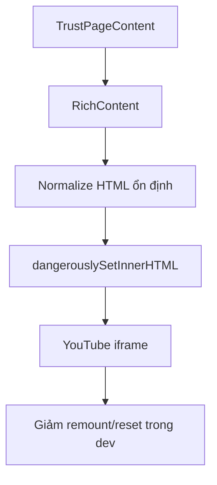

# I. Primer
## 1. TL;DR kiểu Feynman
- Mình đã nghiên cứu thêm (codebase + web): case của bạn hiện **chỉ xảy ra ở localhost dev + Chrome/Edge (Turbopack)**, không đủ evidence là bug production runtime.
- Khả năng cao không còn do `loading="lazy"` nữa, mà do **dev re-render/hydration + DOM replacement** làm iframe YouTube bị remount nên reset.
- Bạn chốt hướng **can thiệp nhẹ**: chỉ harden HTML/CSS/render contract, chưa đụng YouTube IFrame API.
- Kế hoạch: harden `RichContent` để giữ iframe ổn định hơn trong dev (sanitize + normalize + chống layout thrash), không mở rộng scope sang refactor lớn.
- Sau khi fix nhẹ, mình sẽ verify đúng route bạn nêu: `/chinh-sach/policy-cau-hoi-thuong-gap`.

## 2. Elaboration & Self-Explanation
Hiện pipeline là: DB content -> `TrustPageContent` -> `RichContent` -> `dangerouslySetInnerHTML`. Ở dev/Turbopack, các re-evaluation/re-render có thể khiến subtree HTML bị replace. Với iframe YouTube, chỉ cần node bị replace là player reset về đầu.

Ta chưa muốn đi hướng nặng (component hóa player hoặc IFrame API), nên fix nhẹ tập trung vào:
- tránh thay đổi HTML string không cần thiết,
- chuẩn hóa iframe attrs theo 1 contract cố định để giảm diff,
- giảm các yếu tố gây “giựt” do layout/paint quanh embed.

Mục tiêu thực dụng: giảm/khử reset trong môi trường dev Chromium nhưng không đổi lớn kiến trúc.

## 3. Concrete Examples & Analogies
- Ví dụ route thật: mở `/chinh-sach/policy-cau-hoi-thuong-gap`, play video ở giây ~20, scroll lên/xuống qua khỏi viewport, quay lại video vẫn tiếp tục gần trạng thái trước đó (không reset về 0).
- Analogy: iframe như một máy phát nhạc; nếu ta thay cả ổ cắm (DOM node) thì nhạc dừng. Harden lần này là “giữ ổ cắm cố định hơn”, không thay sang dàn âm thanh mới.

# II. Audit Summary (Tóm tắt kiểm tra)
- Observation (Quan sát):
  - `YouTubeNode` đã bỏ `loading="lazy"`.
  - `RichContent` đang normalize bỏ `loading=lazy` cho YouTube iframe cũ.
  - Route policy (`faq/page.tsx` -> `TrustPageContent` -> `RichContent`) không có logic scroll state riêng như `posts/[slug]`.
  - Issue chỉ thấy ở localhost dev + Chromium theo xác nhận của bạn.
- Inference (Suy luận):
  - Nghiêng về hành vi dev rendering/hydration + iframe subtree replacement hơn là lỗi business logic route policy.
- Decision (Quyết định):
  - Làm gói harden nhẹ tại `RichContent` + CSS embed; chưa dùng IFrame API.

# III. Root Cause & Counter-Hypothesis (Nguyên nhân gốc & Giả thuyết đối chứng)
- Root cause nghi ngờ chính:
  1. Dev/Turbopack ở Chromium làm subtree có iframe bị remount khi render lại.
  2. HTML iframe hiện chưa đủ “stable contract” (attrs/style có thể dao động theo lần render nội dung hỗn hợp).

- Checklist bắt buộc (rút gọn):
  1. Triệu chứng: video giựt + reset khi scroll (expected: giữ trạng thái phát).
  3. Tái hiện: có, trên localhost dev Chromium.
  6. Giả thuyết thay thế: mạng yếu/YT throttling; vẫn có thể gây giựt nhưng khó giải thích reset về đầu lặp lại theo scroll.
  8. Tiêu chí pass/fail: play -> scroll out/in nhiều lần mà không reset về 0 trong route policy.

- Counter-hypothesis:
  - “Do CSS ratio thuần túy”: CSS sai gây méo/giựt layout, nhưng reset playback thường do node lifecycle.
  - “Do dữ liệu post lỗi”: cùng content nhưng behavior lệ thuộc môi trường dev Chromium.

- Root Cause Confidence (Độ tin cậy nguyên nhân gốc): **Medium** (evidence thực nghiệm môi trường mạnh, nhưng chưa instrument browser internals).

# IV. Proposal (Đề xuất)
## Option A (Recommend) — Confidence 80%
**Harden nhẹ HTML/CSS tại pipeline hiện tại (không đổi kiến trúc)**
- `RichContent`:
  - normalize YouTube iframe với contract cố định: `src`, `allow`, `allowfullscreen`, remove attrs dễ dao động.
  - đảm bảo output HTML deterministic (cùng input -> cùng output) để giảm DOM churn.
- `globals.css`:
  - harden `.editor-youtube iframe` (display/block, contain boundary phù hợp, tránh repaint không cần).
- Ưu điểm: nhỏ, rollback dễ, đúng mức can thiệp bạn chọn.
- Nhược: nếu nguyên nhân sâu do dev overlay/hot reload, có thể chỉ giảm chứ không triệt 100% mọi case.

## Option B — Confidence 60%
**Tách YouTube embed thành client component ổn định mount (nhưng vẫn không dùng IFrame API)**
- Parse YouTube blocks ra React component riêng để kiểm soát key/memo.
- Ưu điểm: kiểm soát lifecycle tốt hơn.
- Nhược: scope lớn hơn yêu cầu “nhẹ”.

=> Khuyến nghị triển khai Option A trước theo yêu cầu của bạn.

# V. Files Impacted (Tệp bị ảnh hưởng)
- **Sửa:** `components/common/RichContent.tsx`  
  Vai trò hiện tại: cổng render rich/html/markdown.  
  Thay đổi: tăng mức normalize deterministic cho YouTube iframe, giảm khả năng remount do HTML churn.

- **Sửa (nhẹ):** `app/globals.css`  
  Vai trò hiện tại: style chung `editor-content`/`editor-youtube`.  
  Thay đổi: harden CSS tránh jitter layout/paint quanh iframe.

- **(Giữ nguyên):** `app/admin/components/nodes/YouTubeNode.tsx`  
  Vai trò hiện tại: xuất YouTube từ editor.  
  Ghi chú: đã bỏ lazy, chỉ rà lại contract nếu cần đồng bộ attrs.

# VI. Execution Preview (Xem trước thực thi)
1. Audit lại normalize hiện tại trong `RichContent` (điểm tạo churn).
2. Chỉnh normalize deterministic cho YouTube iframe (stable attr order/values).
3. Harden CSS embed trong `globals.css` để giảm giựt visual.
4. Soát route policy + vài route RichContent khác để tránh regress.
5. Typecheck và chốt commit local.

# VII. Verification Plan (Kế hoạch kiểm chứng)
- Static:
  - `bunx tsc --noEmit`.
- Runtime manual (dev Chromium):
  1. Mở `http://localhost:3000/chinh-sach/policy-cau-hoi-thuong-gap`.
  2. Play video 15–30s, cuộn out/in 5–10 lần.
  3. Quan sát: không reset về 0; jitter giảm rõ.
  4. Cross-check 1 route RichContent khác có YouTube.

# VIII. Todo
1. Harden normalize YouTube iframe trong `RichContent` theo hướng deterministic.
2. Harden CSS `.editor-youtube iframe` để giảm jitter khi scroll.
3. Soát regress ở trust/policy + route richcontent mẫu.
4. Chạy `bunx tsc --noEmit`.
5. Commit local (không push) + kèm `.factory/docs`.

# IX. Acceptance Criteria (Tiêu chí chấp nhận)
- Trên localhost dev Chromium, video ở route policy không reset về đầu khi scroll out/in thông thường.
- Mức giựt giảm rõ (không nhảy layout mạnh quanh embed).
- Không phá render markdown và iframe non-YouTube.
- Typecheck pass.

# X. Risk / Rollback (Rủi ro / Hoàn tác)
- Rủi ro: fix nhẹ có thể không xử lý 100% case dev tooling bất thường.
- Giảm thiểu: giữ patch nhỏ, đo lại behavior rõ ràng theo checklist.
- Rollback: revert commit harden nếu phát sinh side effect.

# XI. Out of Scope (Ngoài phạm vi)
- Không migrate dữ liệu.
- Không chuyển sang YouTube IFrame API (mức can thiệp mạnh).
- Không refactor toàn bộ RichContent sang componentized parser.

# XII. Open Questions (Câu hỏi mở)
- Nếu sau Option A vẫn còn reset trong dev, bước kế tiếp bạn có cho phép nâng lên Option B (component ổn định mount) không?