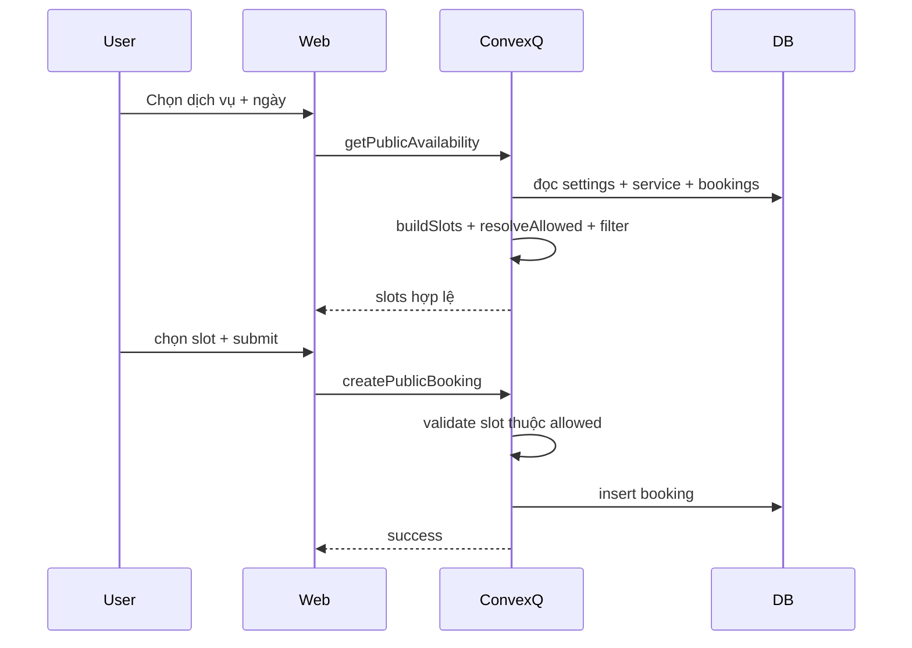

# I. Primer

## 1. TL;DR kiểu Feynman
- Hiện tại hệ thống chỉ có `giờ mở/đóng` + `duration/interval` của dịch vụ để **tự sinh toàn bộ slot**, nên admin chưa có chỗ “tick chọn slot muốn mở bán”.
- Em sẽ thêm cơ chế **slot template**: sinh danh sách slot gợi ý từ giờ mở/đóng + interval dịch vụ, rồi admin chỉ việc tick/bỏ tick.
- Cấu hình sẽ có 3 lớp ưu tiên: **Service override theo thứ** > **Service default** > **Global theo thứ** > **Global default**.
- `/book` sẽ chỉ hiển thị slot theo template đã tick (và vẫn kiểm tra capacity như hiện tại).
- Vẫn hỗ trợ ca qua ngày (22:00 → 02:00) như yêu cầu.

## 2. Elaboration & Self-Explanation
Bài toán của mình giống “đang có cái khung giờ mở cửa, nhưng chưa có danh sách giờ cụ thể được bật/tắt”.
Hiện tại backend `buildSlots()` đang tạo đều theo khoảng cách interval nên slot nào hợp toán học là hiện hết. Điều user cần là: vẫn dựa vào khung đó để gợi ý, nhưng phải có bước **chọn nhanh bằng checkbox** để kiểm soát chính xác slot nào bán.

Cách làm là thêm một lớp dữ liệu “danh sách slot được phép” (allowed slots). Khi người dùng vào `/book`, backend không trả toàn bộ slot sinh tự động nữa, mà trả **giao của slot sinh tự động và slot đã tick** theo thứ/ngày/dịch vụ.

## 3. Concrete Examples & Analogies
- Ví dụ cụ thể:
  - Global: mở 09:00–18:00, default tick tất cả slot mỗi 30 phút.
  - Global override thứ 7: chỉ tick `09:00, 10:00, 11:00`.
  - Service A override riêng: chỉ mở `14:00, 14:30, 15:00` mọi ngày.
  - Khi user chọn Service A vào thứ 7, hệ thống ưu tiên Service A (không dùng global thứ 7).
- Analogy đời thường: giống quán cà phê mở cửa 7h–22h (khung mở), nhưng chỉ nhận order theo các mốc giờ barista rảnh (slot tick).

# II. Audit Summary (Tóm tắt kiểm tra)
- **Observation (Quan sát):**
  - `/admin/bookings/settings` mới có `dayStartHour/dayEndHour` + open day, chưa có state nào cho whitelist slot tick. (file: `app/admin/bookings/settings/page.tsx`)
  - `/book` đang render slot từ `api.bookings.getPublicAvailability`. (file: `app/(site)/book/page.tsx`)
  - Backend `buildSlots(settings, service)` sinh toàn bộ slot theo duration/interval, không có filter theo tick template. (file: `convex/bookings.ts`)
- **Inference (Suy luận):** Thiếu tầng cấu hình “slot allowed list”, nên admin không thể preset khung giờ tiện dụng như yêu cầu.
- **Decision (Quyết định):** Thêm dữ liệu slot template theo 2 cấp (global + service), có override theo thứ, áp dụng lúc query availability và validate create booking.

Trả lời checklist root-cause (tối thiểu):
1. **Triệu chứng:** /book có slot tự sinh nhưng không có cách cấu hình tick nhanh ở admin (expected: tick chọn slot).
2. **Phạm vi ảnh hưởng:** module bookings (settings page), module services (service override), site `/book`, Convex query/mutation.
3. **Tái hiện:** ổn định 100%, chỉ cần vào `/admin/bookings/settings` và `/book` hiện tại.
4. **Mốc thay đổi gần nhất:** các commit gần đây tập trung UX booking, chưa thêm whitelist slot.
5. **Thiếu dữ liệu:** không thiếu dữ liệu nghiệp vụ sau khi đã chốt qua Q&A.
6. **Giả thuyết thay thế:** có thể chỉ sửa UI mà không đổi backend; đã loại vì backend vẫn trả full slot.
7. **Rủi ro fix sai nguyên nhân:** UI tick có nhưng /book không đổi -> mismatch kỳ vọng.
8. **Pass/fail:** tick xong lưu, /book chỉ hiện slot đúng template và booking ngoài template bị chặn.

# III. Root Cause & Counter-Hypothesis (Nguyên nhân gốc & Giả thuyết đối chứng)
- **Root cause (High):** Thiết kế hiện tại chỉ có “slot generation rule” (mở/đóng + interval + duration), chưa có “slot selection layer”.
- **Counter-hypothesis:** lỗi do frontend /book render sai.
  - **Bác bỏ:** `/book` chỉ hiển thị dữ liệu backend trả về; backend chưa filter theo tick list nên frontend không thể tự biết slot nào bị tắt.
- **Root Cause Confidence:** **High** (evidence trực tiếp ở `convex/bookings.ts` và settings UI hiện tại).

# IV. Proposal (Đề xuất)
1. Thêm cấu trúc cấu hình slot template:
   - Global (module setting `bookings`):
     - `slotTemplateDefault: string[]` (áp dụng mọi ngày)
     - `slotTemplateByWeekday: Record<0..6, string[] | undefined>` (override theo thứ)
   - Service-level (fields trong `services`):
     - `bookingSlotTemplateDefault?: string[]`
     - `bookingSlotTemplateByWeekday?: Record<string, string[] | undefined>`
2. Logic resolve slot allowed theo ưu tiên:
   - Service weekday > Service default > Global weekday > Global default > fallback = tất cả slot sinh tự động.
3. Cập nhật UI `/admin/bookings/settings`:
   - Tạo panel “Preset slot”:
     - Dropdown chọn ngày cấu hình (Mặc định/T2..CN)
     - Sinh danh sách slot gợi ý dựa vào giờ mở/đóng + interval mẫu (chọn service mẫu hoặc interval nhập tay nhẹ)
     - Nút tick nhanh: chọn tất cả / bỏ tất cả / reset theo auto.
4. Cập nhật UI `/admin/services/[id]/edit` (và create nếu cần):
   - Cho bật override slot service, cấu hình default + theo thứ.
5. Cập nhật backend bookings:
   - `getPublicAvailability`: build auto slots rồi filter theo allowed template.
   - `createPublicBooking`: validate `slotTime` phải nằm trong allowed template resolved.
6. Tương thích dữ liệu cũ:
   - Nếu chưa có template nào -> hành vi cũ giữ nguyên (không break).

```mermaid
flowchart TD
  A[Admin Save] --> B[Global Template]
  A --> C[Service Template]
  D[/book query] --> E[Build Auto Slots]
  E --> F[Resolve Allowed]
  B --> F
  C --> F
  F --> G[Filter Slots]
  G --> H[Render /book]
  I[Create Booking] --> J[Validate slot in Allowed]
  J --> K[Insert booking]
```



# V. Files Impacted (Tệp bị ảnh hưởng)

## UI
- **Sửa:** `app/admin/bookings/settings/page.tsx`
  - Vai trò hiện tại: trang cấu hình giờ mở/đóng và ngày hoạt động.
  - Thay đổi: thêm UI dropdown + danh sách tick slot template (default + theo thứ), lưu vào module settings mới.

- **Thêm:** `app/admin/bookings/settings/_lib/slotTemplate.ts`
  - Vai trò hiện tại: chưa có.
  - Thay đổi: helper sinh slot gợi ý, normalize/validate HH:mm, resolve theo ngày.

- **Sửa:** `app/admin/services/[id]/edit/page.tsx`
  - Vai trò hiện tại: chỉnh booking fields cơ bản (duration/interval/capacity).
  - Thay đổi: thêm block override slot template cho dịch vụ (default + theo thứ).

- **Sửa (nếu cần parity):** `app/admin/services/create/page.tsx`
  - Vai trò hiện tại: tạo service với booking defaults.
  - Thay đổi: thêm fields template tùy chọn hoặc để trống (không override).

- **Sửa:** `app/(site)/book/page.tsx`
  - Vai trò hiện tại: hiển thị slot từ availability.
  - Thay đổi: không đổi nhiều UI; chỉ đảm bảo trạng thái message rõ khi ngày có mở nhưng template không có slot.

## Server / Data
- **Sửa:** `convex/bookings.ts`
  - Vai trò hiện tại: resolve settings, build slot, query availability, create booking.
  - Thay đổi: thêm đọc template global + service, resolve precedence, filter slot khi query và validate khi create.

- **Sửa:** `convex/services.ts`
  - Vai trò hiện tại: API CRUD services.
  - Thay đổi: mở rộng validator args cho 2 field template mới.

- **Sửa:** `convex/model/services.ts`
  - Vai trò hiện tại: persistence layer cho services.
  - Thay đổi: map persist/update 2 field template mới.

- **Sửa:** `convex/schema.ts`
  - Vai trò hiện tại: định nghĩa schema services/module settings.
  - Thay đổi: thêm optional fields `bookingSlotTemplateDefault`, `bookingSlotTemplateByWeekday` cho services (moduleSettings giữ dynamic value).

# VI. Execution Preview (Xem trước thực thi)
1. Đọc/chuẩn hóa helper xử lý time-slot (`HH:mm`, weekday map, dedupe/sort).
2. Mở rộng schema + service validators/model để lưu override service.
3. Cập nhật bookings resolver để tính allowed slot theo precedence.
4. Cập nhật admin settings UI để tick global default + override theo thứ.
5. Cập nhật service edit/create UI để tick override service.
6. Review tĩnh type/null/compat dữ liệu cũ; đảm bảo fallback hành vi cũ khi chưa cấu hình template.

# VII. Verification Plan (Kế hoạch kiểm chứng)
- Static checks:
  - Type-safe compile: `bunx tsc --noEmit` (theo rule repo khi có đổi TS/code).
- Repro manual:
  1. Cấu hình global default slots + override thứ 7.
  2. Tạo service A có override riêng.
  3. Vào `/book` chọn ngày thứ 7 và ngày thường, so sánh slot theo đúng precedence.
  4. Thử submit slot ngoài template bằng request sửa tay -> backend phải reject.
- Backward compatibility:
  - Xóa/không set template -> /book vẫn sinh slot như trước.

# VIII. Todo
1. Thêm model/helper normalize slot template và weekday override.
2. Mở rộng schema + API service cho service-level slot override.
3. Tích hợp resolve allowed slot vào `getPublicAvailability` và `createPublicBooking`.
4. Bổ sung UI tick template ở `/admin/bookings/settings` (default + theo thứ).
5. Bổ sung UI tick override ở `/admin/services/[id]/edit` (và create nếu cần).
6. Chạy typecheck + review tĩnh + commit.

# IX. Acceptance Criteria (Tiêu chí chấp nhận)
- Admin có thể tick slot ở settings theo default và theo thứ.
- Admin có thể tick override slot cho từng service.
- `/book` chỉ hiển thị slot đúng theo quy tắc ưu tiên đã chốt.
- Booking slot ngoài template bị từ chối ở backend.
- Không cấu hình template vẫn chạy như cũ (không breaking).

# X. Risk / Rollback (Rủi ro / Hoàn tác)
- Rủi ro:
  - Sai precedence dẫn tới /book hiển thị thiếu/dư slot.
  - Dữ liệu template không normalize gây slot “ma” (format lỗi).
- Giảm thiểu:
  - Normalize + validate tại cả UI và backend.
  - Fallback rõ ràng về auto slots khi dữ liệu invalid/rỗng.
- Rollback:
  - Revert commit; vì field mới optional nên rollback an toàn, dữ liệu cũ vẫn dùng được.

# XI. Out of Scope (Ngoài phạm vi)
- Không thay đổi UI calendar tổng thể của `/book` ngoài phần danh sách slot.
- Không thêm engine pricing/dynamic capacity theo khung giờ.
- Không mở rộng sang timezone nâng cao ngoài logic hiện tại.

# XII. Open Questions (Câu hỏi mở)
- Không còn ambiguity quan trọng sau khi đã chốt 4 quyết định với bạn.