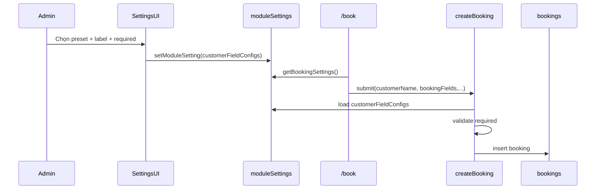

# I. Primer
## 1. TL;DR kiểu Feynman
- Form `/book` hiện đang hard-code `Tên khách` + `Ghi chú`, nên sai ngữ nghĩa khi muốn linh hoạt thông tin người đặt.
- Em sẽ chuyển sang cấu hình field động từ `/admin/bookings/settings`, nhưng vẫn CoC bằng cách chỉ cho chọn từ **3 preset mẫu**.
- Preset mặc định theo xác nhận của anh/chị: **Họ và tên + Số điện thoại + Ghi chú**.
- Mỗi field trong preset sẽ cấu hình được: bật/tắt, label hiển thị, bắt buộc hay không.
- Dữ liệu field bổ sung sẽ lưu vào `bookingFields` object trong bản ghi booking để dễ mở rộng về sau.

## 2. Elaboration & Self-Explanation
Hiện tại trang khách `/book` đang “đóng đinh” 2 input, nên admin không điều chỉnh được theo nghiệp vụ thật từng shop. Khi nghiệp vụ đổi (ví dụ cần số điện thoại bắt buộc), phải sửa code thay vì sửa setting.

Hướng xử lý là tách “form hiển thị gì” thành cấu hình module setting của `bookings`, nhưng để tránh over-customize (mất CoC), chỉ cho chọn trong catalog preset cố định (3 mẫu). Như vậy:
- Vẫn linh hoạt đủ dùng (đổi label, required, bật/tắt).
- Vẫn thống nhất hệ thống (không cho tạo field tùy ý vô hạn).
- Dễ rollback và ít ảnh hưởng logic booking cũ.

## 3. Concrete Examples & Analogies
Ví dụ cụ thể:
- Admin vào `/admin/bookings/settings` chọn preset mặc định:
  1) `full_name` (label: “Họ và tên”, required: true)
  2) `phone` (label: “Số điện thoại”, required: true)
  3) `note` (label: “Ghi chú”, required: false)
- Trang `/book` render đúng 3 input tương ứng, submit lên mutation với payload:
  - `customerName` (canonical cho tương thích list/search cũ)
  - `bookingFields: { full_name: "...", phone: "...", note: "..." }`

Analogy đời thường: giống form in sẵn của quầy lễ tân — có vài mẫu chuẩn để chọn nhanh, rồi đổi nhãn “SĐT/Zalo” cho hợp ngữ cảnh, thay vì tự thiết kế mẫu mới mỗi lần.

# II. Audit Summary (Tóm tắt kiểm tra)
- Observation:
  - `app/(site)/book/page.tsx` đang hard-code state/input `customerName` và `note`, không đọc cấu hình field từ settings.
  - `app/admin/bookings/settings/page.tsx` hiện chỉ quản lý giờ mở cửa, ngày hoạt động, visibilityMode; chưa có cấu hình customer fields.
  - `convex/bookings.ts#createPublicBooking` chỉ nhận `customerName` + `note`, chưa có dynamic fields.
  - `convex/schema.ts` bảng `bookings` chưa có cột chứa object field động.
- Inference:
  - Root cause chính là thiếu abstraction cho booking form fields ở cả UI settings + UI public + mutation + schema.
- Decision:
  - Bổ sung cấu hình fields theo CoC (preset-only) và lưu `bookingFields` object để đảm bảo linh hoạt có kiểm soát.

# III. Root Cause & Counter-Hypothesis (Nguyên nhân gốc & Giả thuyết đối chứng)
- Q1. Triệu chứng (expected vs actual):
  - Expected: Admin cấu hình được field người đặt (label/required/bật-tắt), form khách render theo cấu hình.
  - Actual: Form khách luôn 2 field cố định, không phản ánh nhu cầu nghiệp vụ.
- Q2. Phạm vi ảnh hưởng:
  - User-facing `/book`, admin settings `/admin/bookings/settings`, backend create booking và schema bookings.
- Q3. Tái hiện:
  - Ổn định 100%: mở `/book` luôn thấy hard-coded `Tên khách` + `Ghi chú`.
- Q4. Mốc thay đổi gần nhất:
  - Nhánh gần đây tập trung combobox service/operating hours; chưa có commit nào thêm dynamic booking fields.
- Q5. Dữ liệu còn thiếu:
  - Không thiếu blocker kỹ thuật; đã có quyết định business về preset mặc định và kiểu lưu object.
- Q6. Giả thuyết thay thế:
  - Có thể chỉ đổi label tĩnh là đủ; **đã loại trừ** vì user yêu cầu thêm/bớt field từ settings.
- Q7. Rủi ro fix sai nguyên nhân:
  - Nếu chỉ sửa UI mà không sửa mutation/schema sẽ submit sai hoặc mất dữ liệu field bổ sung.
- Q8. Tiêu chí pass/fail:
  - Pass khi admin đổi setting field thì `/book` đổi theo ngay và dữ liệu lưu đúng `bookingFields`; fail nếu vẫn hard-code hoặc validation required không khớp.

**Root Cause Confidence (Độ tin cậy nguyên nhân gốc): High** — có evidence trực tiếp từ code path site/admin/convex và tái hiện nhất quán.

```mermaid
flowchart TD
  A[Admin settings] --> B[bookingFormFields config]
  B --> C[/book render dynamic fields]
  C --> D[createPublicBooking validate]
  D --> E[save customerName + bookingFields]
  E --> F[/admin/bookings list/detail]
```

# IV. Proposal (Đề xuất)
1. Thêm contract field preset (CoC):
   - Catalog key cố định: `full_name`, `phone`, `note`.
   - Mỗi item cấu hình: `key`, `label`, `required`, `enabled`.
   - Mặc định: full_name + phone + note (theo yêu cầu đã chốt).

2. Mở rộng Booking Settings:
   - Thêm block “Thông tin người đặt”.
   - UI mỗi dòng field dùng dropdown preset key (không custom free-text key), + input label + switch required + switch enabled.
   - Save vào `moduleSettings` của `bookings` với key ví dụ: `customerFieldConfigs` (array/object chuẩn hóa).

3. Cập nhật public `/book`:
   - Đọc settings `customerFieldConfigs`, render input động theo loại field preset.
   - Validation client theo `required` + enabled.
   - Mapping canonical:
     - `full_name` -> `customerName` (để không phá list/search hiện có).
     - toàn bộ field -> `bookingFields` object.

4. Cập nhật Convex mutation + schema:
   - `schema.bookings`: thêm optional `bookingFields: record<string,string>`.
   - `createPublicBooking` args thêm `bookingFields`.
   - Validate required server-side theo config đã lưu (không tin client).
   - Giữ tương thích dữ liệu cũ: record cũ không có `bookingFields` vẫn đọc bình thường.

5. Cập nhật admin list hiển thị:
   - Giữ cột/chữ ký hiện tại dựa `customerName`.
   - Nếu có `phone` trong `bookingFields` thì hiển thị phụ dưới tên để admin thao tác nhanh.



# V. Files Impacted (Tệp bị ảnh hưởng)
## UI
- **Sửa:** `app/admin/bookings/settings/page.tsx`
  - Vai trò hiện tại: cấu hình lịch hoạt động và visibility booking.
  - Thay đổi: thêm section cấu hình field người đặt theo 3 preset dropdown + label/required/enabled.

- **Sửa:** `app/(site)/book/page.tsx`
  - Vai trò hiện tại: form đặt lịch public với field cố định.
  - Thay đổi: render form field động từ settings, validate client theo required, submit `bookingFields`.

- **Sửa:** `app/admin/bookings/page.tsx`
  - Vai trò hiện tại: danh sách booking theo lịch tháng/ngày.
  - Thay đổi: hiển thị thêm thông tin phụ từ `bookingFields` (ưu tiên phone) nhưng không đổi luồng chính.

## Server / Schema / Shared
- **Sửa:** `convex/bookings.ts`
  - Vai trò hiện tại: query/mutation booking public và admin.
  - Thay đổi: mở rộng args/returns liên quan `bookingFields`, validate required dựa module settings, giữ backward compatibility.

- **Sửa:** `convex/schema.ts`
  - Vai trò hiện tại: định nghĩa cấu trúc bảng bookings.
  - Thay đổi: thêm optional field `bookingFields` kiểu object linh hoạt (`record`).

- **Thêm:** `lib/bookings/customerFieldConfig.ts` (hoặc vị trí shared tương đương theo pattern repo)
  - Vai trò hiện tại: chưa có.
  - Thay đổi: chứa constants + normalize helpers cho 3 preset field và default config để dùng chung admin/site/convex.

# VI. Execution Preview (Xem trước thực thi)
1. Đọc/chuẩn hóa contract preset + helper normalize default config.
2. Sửa admin settings để cấu hình dynamic fields qua dropdown preset.
3. Sửa `/book` để render + validate dynamic fields và submit payload mới.
4. Sửa `convex/bookings.ts` + `schema.ts` để lưu/validate `bookingFields`.
5. Sửa admin booking list để hiển thị thông tin phụ hữu ích.
6. Static self-review: typing, null-safety, data compatibility cũ/mới.
7. Trước commit chạy `bunx tsc --noEmit` (không chạy lint/build/unit test theo guideline repo).

# VII. Verification Plan (Kế hoạch kiểm chứng)
- Type safety:
  - `bunx tsc --noEmit` sau khi code xong (vì có thay đổi TS).
- Repro thủ công (không chạy test/lint/build):
  1) Vào `/admin/bookings/settings` đổi label/required/enabled của preset.
  2) Mở `/book` xác nhận field render đúng cấu hình mới.
  3) Submit thiếu field required -> bị chặn đúng message.
  4) Submit đủ dữ liệu -> booking tạo thành công.
  5) Vào `/admin/bookings` xác nhận hiển thị đúng tên + dữ liệu phụ.
- Dữ liệu cũ:
  - Booking cũ không có `bookingFields` vẫn render list ổn, không crash.

# VIII. Todo
1. Tạo shared contract cho 3 preset customer fields + default normalize.
2. Thêm UI cấu hình customer fields ở booking settings (dropdown preset + label/required/enabled).
3. Refactor `/book` sang dynamic field renderer và submit `bookingFields`.
4. Cập nhật Convex schema/mutation/query liên quan `bookingFields` + server-side validation.
5. Cập nhật admin bookings list hiển thị metadata field hữu ích.
6. Self-review tĩnh + chạy `bunx tsc --noEmit` + chuẩn bị commit.

# IX. Acceptance Criteria (Tiêu chí chấp nhận)
- `/book` không còn hard-code 2 field cố định; field hiển thị theo `customerFieldConfigs`.
- Admin có thể bật/tắt field, đổi label, đổi required cho 3 preset.
- Mặc định áp dụng preset: Họ và tên + Số điện thoại + Ghi chú.
- Submit booking lưu được `bookingFields` object; vẫn giữ tương thích `customerName`.
- Server validation bắt buộc hoạt động theo cấu hình settings, không phụ thuộc client.
- `/admin/bookings` vẫn hoạt động bình thường và có thể xem thông tin phụ từ `bookingFields`.

# X. Risk / Rollback (Rủi ro / Hoàn tác)
- Rủi ro:
  - Mismatch giữa config UI và validate server nếu normalize khác nhau.
  - Dữ liệu cũ thiếu `bookingFields` gây null edge-case ở UI admin.
- Giảm rủi ro:
  - Dùng chung helper normalize config cho admin/site/server.
  - Optional chaining + fallback khi render booking cũ.
- Rollback:
  - Revert commit thay đổi các file trên; schema optional nên rollback logic không gây mất dữ liệu booking cũ.

# XI. Out of Scope (Ngoài phạm vi)
- Không thêm custom field key tự do ngoài 3 preset.
- Không đổi workflow xác nhận/hủy booking.
- Không refactor pagination/filter tổng thể của `/admin/bookings`.
- Không chạy lint/unit/integration theo guideline hiện tại.

# XII. Open Questions (Câu hỏi mở)
- Không còn ambiguity blocker cho implementation.