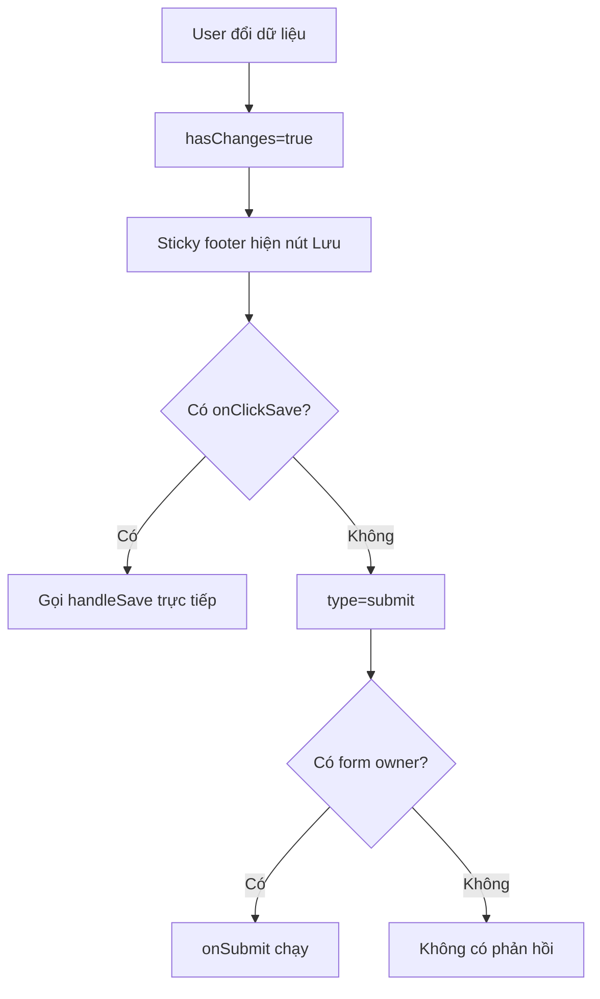

# I. Primer
## 1. TL;DR kiểu Feynman
- Nút “Lưu cài đặt” đang là nút `submit`, nhưng trang `/admin/bookings/settings` không có thẻ `<form>` bao quanh.
- Vì không có form owner, bấm nút không gọi `handleSave`, nên bạn thấy “không phản hồi gì”.
- Fix nhỏ nhất theo lựa chọn của bạn: thêm callback click trực tiếp cho sticky footer.
- Cụ thể: thêm prop `onClickSave` vào `HomeComponentStickyFooter`, ưu tiên gọi callback này khi có truyền vào.
- Ở bookings settings, truyền `onClickSave={handleSave}` để bấm là lưu ngay.

## 2. Elaboration & Self-Explanation
Hiện `BookingSettingsContent` có hàm `handleSave` đầy đủ validate + mutation + toast. Nhưng component footer shared (`HomeComponentStickyFooter`) đang render nút lưu với `type="submit"` và không có `onClick`. Cơ chế này chỉ hoạt động khi nút nằm trong form hoặc có `form="id"` trỏ tới form.

Ở trang bookings settings, layout hiện là nhiều `Card` bên trong `
`, không có `<form>`. Kết quả: bấm nút không phát sinh submit event nào, nên không vào `handleSave`, không loading, không toast — đúng với triệu chứng bạn xác nhận.

## 3. Concrete Examples & Analogies
- Ví dụ repo hiện tại:
  - `app/admin/bookings/settings/page.tsx` dùng `HomeComponentStickyFooter` nhưng không có `<form onSubmit=...>`.
  - `app/admin/home-components/hero/[id]/edit/page.tsx` có `<form> ... <HomeComponentStickyFooter ... /> </form>`, nên pattern `type="submit"` chạy được.
- Analogy đời thường: bạn bấm chuông cửa (nút submit) nhưng nhà chưa lắp chuông (không có form), nên không ai nghe.

# II. Audit Summary (Tóm tắt kiểm tra)
- Observation: Footer dùng shared component `HomeComponentStickyFooter` với nút lưu `type="submit"`.
- Evidence: `app/admin/home-components/_shared/components/HomeComponentStickyFooter.tsx`.
- Observation: Trang bookings settings không bọc UI trong `<form>`.
- Evidence: `app/admin/bookings/settings/page.tsx`.
- Observation runtime từ user: bấm nút không phản hồi (không toast/không loading).
- Inference: submit event không được phát đến `handleSave`.
- Decision: triển khai Option A (theo user chọn): thêm `onClickSave` để gọi save trực tiếp, giữ thay đổi nhỏ, ít ảnh hưởng call-site khác.

# III. Root Cause & Counter-Hypothesis (Nguyên nhân gốc & Giả thuyết đối chứng)
**Root Cause Confidence: High** — mismatch giữa cơ chế submit của footer và cấu trúc trang bookings (không form).

1. Triệu chứng observed (expected vs actual)
   a) Expected: bấm “Lưu cài đặt” → loading + mutation + toast.
   b) Actual: không phản hồi gì.
2. Phạm vi ảnh hưởng
   a) Chủ yếu ở `/admin/bookings/settings`.
   b) Các trang edit home-components dùng form không bị.
3. Khả năng tái hiện
   a) Ổn định: có thay đổi dữ liệu, nút hiện “Lưu cài đặt” nhưng bấm không trigger save.
4. Mốc thay đổi gần nhất
   a) Trang bookings mới gắn sticky footer gần đây (spec nội bộ 2026-04-14).
5. Dữ liệu thiếu
   a) Không cần thêm để chốt root cause chính; runtime đã khớp symptom.
6. Giả thuyết thay thế chưa loại trừ
   a) Overlay/z-index chặn click.
   b) Nút bị disabled sai do `hasChanges`.
   c) Counter-evidence: user thấy nút ở trạng thái lưu được nhưng click không có loading/toast; pattern submit-without-form giải thích trực tiếp và nhất quán hơn.
7. Rủi ro nếu fix sai nguyên nhân
   a) Sửa CSS/z-index không giải quyết lõi; bug vẫn còn.
8. Tiêu chí pass/fail sau sửa
   a) Bấm nút phải gọi `handleSave` (loading, toast success/error).
   b) `disableSave` vẫn giữ hành vi cũ.

# IV. Proposal (Đề xuất)
1. Sửa shared footer để hỗ trợ click-save trực tiếp
   a) Thêm prop mới `onClickSave?: () => void | Promise<void>` vào `HomeComponentStickyFooterProps`.
   b) Trên nút save, thêm `onClick={onClickSave}` khi prop được truyền.
   c) Giữ `type="submit"` làm fallback tương thích ngược cho các trang đang dùng form.
2. Áp dụng tại bookings settings
   a) Truyền `onClickSave={handleSave}` vào `HomeComponentStickyFooter` ở `app/admin/bookings/settings/page.tsx`.
   b) Không đổi logic validate/mutation hiện có.
3. Static review
   a) Soát các call-site khác để đảm bảo không bắt buộc phải sửa thêm.

# V. Files Impacted (Tệp bị ảnh hưởng)
- **Sửa:** `app/admin/home-components/_shared/components/HomeComponentStickyFooter.tsx`
  - Vai trò hiện tại: sticky action bar dùng chung cho nhiều trang admin/home-components.
  - Thay đổi: thêm API `onClickSave` và wiring click handler cho nút save, vẫn giữ submit fallback.
- **Sửa:** `app/admin/bookings/settings/page.tsx`
  - Vai trò hiện tại: trang cài đặt booking, có `handleSave` và dùng sticky footer.
  - Thay đổi: truyền `onClickSave={handleSave}` để lưu hoạt động dù không có form.

# VI. Execution Preview (Xem trước thực thi)
1. Đọc lại footer shared + call-site bookings để xác nhận typings.
2. Cập nhật type props trong `HomeComponentStickyFooter`.
3. Nối `onClickSave` vào nút save.
4. Cập nhật call-site bookings truyền callback `handleSave`.
5. Self-review tĩnh: null-safety, disable logic, backward compatibility.

# VII. Verification Plan (Kế hoạch kiểm chứng)
- Kiểm chứng thủ công tại `http://localhost:3000/admin/bookings/settings`:
  1. Đổi một field bất kỳ → nút “Lưu cài đặt” bật.
  2. Bấm nút → thấy trạng thái “Đang lưu...” và toast thành công/lỗi.
  3. Không đổi dữ liệu → nút disabled hoặc hiện “Đã lưu” đúng như trước.
- Kiểm chứng hồi quy nhanh:
  1. Mở một trang edit home-component đang dùng form.
  2. Bấm lưu để xác nhận submit path cũ không bị vỡ.

# VIII. Todo
1. [pending] Thêm `onClickSave` vào `HomeComponentStickyFooterProps`.
2. [pending] Gắn click handler cho nút save trong sticky footer.
3. [pending] Truyền `onClickSave={handleSave}` tại bookings settings.
4. [pending] Self-review tĩnh và đối chiếu hành vi disable/save label.

# IX. Acceptance Criteria (Tiêu chí chấp nhận)
- Tại `/admin/bookings/settings`, bấm “Lưu cài đặt” luôn trigger save (loading + toast).
- Không còn trạng thái “bấm không phản hồi” khi `hasChanges=true` và `isSaving=false`.
- Các trang khác đang rely vào submit trong form vẫn hoạt động như cũ.

# X. Risk / Rollback (Rủi ro / Hoàn tác)
- Rủi ro: nếu vừa có `onClickSave` vừa nằm trong form, có thể lo double-trigger nếu wiring sai.
- Giảm rủi ro: dùng một luồng ưu tiên rõ ràng (click callback) và giữ disable state hiện tại.
- Rollback: revert 2 file trên là quay về trạng thái trước đó.

# XI. Out of Scope (Ngoài phạm vi)
- Không refactor bookings settings sang full `<form onSubmit>` ở vòng này.
- Không thay đổi UX/text sticky footer ngoài logic click-save.
- Không chỉnh Convex schema/function vì không liên quan root cause.

# XII. Open Questions (Câu hỏi mở)
- Không còn ambiguity cho vòng fix này (đã chốt Option A theo bạn).