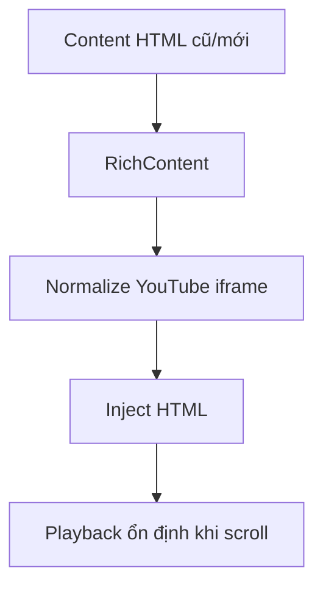
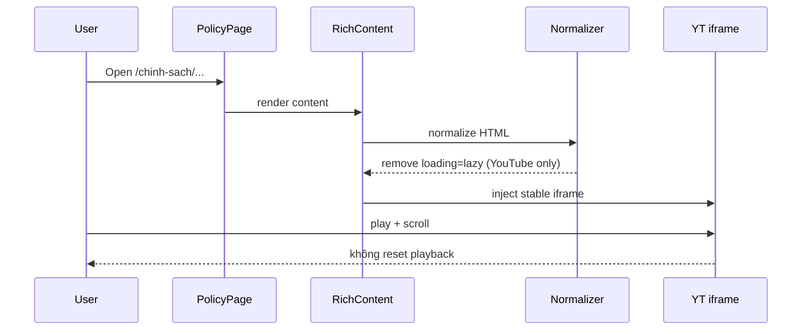

# I. Primer
## 1. TL;DR kiểu Feynman
- Triệu chứng bạn báo là đúng: video YouTube chạy được nhưng khi scroll thì bị dừng/reset về đầu, gây trải nghiệm xấu trên site thực.
- Với dữ liệu hiện tại, nguyên nhân khả dĩ cao nhất là `iframe` YouTube đang có `loading="lazy"`, khiến browser có thể unload/reload khi iframe ra/vào viewport.
- Bạn đã chốt hướng: **ưu tiên playback ổn định**, tức bỏ lazy cho YouTube toàn bộ.
- Bạn cũng chốt backward-compat: **runtime normalize** để content cũ đang có `loading="lazy"` vẫn được sửa ngay khi render (không chờ migrate data).
- Kế hoạch: chuẩn hóa tại 2 đầu (editor output + site render pipeline) để nội dung mới/cũ đều không còn lazy trên iframe YouTube.

## 2. Elaboration & Self-Explanation
Hiện `YouTubeNode` đang export `<iframe ... loading="lazy">`. Khi render site, nội dung đi qua `RichContent` bằng `dangerouslySetInnerHTML`. Trên một số trình duyệt, iframe lazy có thể bị lifecycle lại khi người dùng cuộn nhanh hoặc iframe ra khỏi viewport ngắn hạn, dẫn tới reset playback.

Để xử lý bền và không phụ thuộc dữ liệu cũ/mới:
- Ở **editor output**: ngừng ghi `loading="lazy"` cho YouTube iframe mới.
- Ở **site render runtime**: trước khi inject HTML, normalize YouTube iframe và xóa `loading="lazy"` (chỉ cho youtube domain) để nội dung cũ cũng được fix tức thì.

Cách này tránh phải chạy migration dữ liệu diện rộng, đồng thời đạt mục tiêu UX bạn muốn ngay trên `http://localhost:3000/chinh-sach/policy-cau-hoi-thuong-gap` và các route RichContent khác.

## 3. Concrete Examples & Analogies
- Ví dụ đúng case của bạn: trang `/chinh-sach/policy-cau-hoi-thuong-gap` có embed YouTube. Sau fix, cuộn lên/xuống qua vùng video nhiều lần, video không bị quay về giây 0 do iframe không còn bị lazy lifecycle lại.
- Analogy: lazy iframe giống “tự tắt/mở TV khi bạn rời phòng vài giây”. Bạn muốn TV chạy liên tục, nên ta tắt cơ chế tự tắt cho YouTube.

# II. Audit Summary (Tóm tắt kiểm tra)
- Observation (Quan sát):
  - `app/admin/components/nodes/YouTubeNode.tsx` đang set `iframe.setAttribute('loading', 'lazy')` ở `exportDOM()` và `decorate()`.
  - Site render qua `components/common/RichContent.tsx` với `dangerouslySetInnerHTML`, hiện chưa có bước normalize riêng cho YouTube iframe.
  - Route trust/policy dùng `TrustPageContent` → `RichContent`, nên nằm đúng pipeline cần fix.
- Inference (Suy luận):
  - Reset playback liên quan mạnh tới lazy-loading behavior của iframe YouTube, không phải do route re-render bất thường ở policy page.
- Decision (Quyết định):
  - Bỏ lazy cho YouTube toàn bộ + runtime normalize cho dữ liệu cũ.

*Legend: Normalize = chỉ tác động iframe YouTube, không đụng iframe ngoài phạm vi.*

# III. Root Cause & Counter-Hypothesis (Nguyên nhân gốc & Giả thuyết đối chứng)
- Root cause chính:
  1. `loading="lazy"` trên iframe YouTube trong output editor.
  2. Không có lớp normalize runtime để sửa nội dung cũ đã lưu trước đó.

- Trả lời checklist root cause (rút gọn, gồm mục bắt buộc):
  1. Triệu chứng: video đang phát nhưng cuộn trang thì reset về đầu (actual) thay vì giữ state phát (expected).
  3. Tái hiện: có thể tái hiện trên route policy người dùng nêu.
  6. Giả thuyết thay thế: do route remount toàn page. Chưa có evidence mạnh ở policy; ưu tiên xử lý lazy trước vì trúng trực tiếp contract iframe.
  8. Pass/fail: cuộn qua video nhiều lần mà không reset về đầu.

- Counter-hypothesis:
  - “Do CSS aspect-ratio wrapper” → wrapper chỉ layout, không trực tiếp reset playback.
  - “Do RichContent class prose/editor-content” → ảnh hưởng style, không phải lifecycle iframe.

- Root Cause Confidence (Độ tin cậy nguyên nhân gốc): **Medium-High** (evidence code rõ; chưa instrument runtime sâu nhưng phù hợp triệu chứng).

# IV. Proposal (Đề xuất)
1. **Editor output fix (nội dung mới)**
   - Sửa `YouTubeNode` để không set `loading="lazy"` trong cả `exportDOM()` và `decorate()`.

2. **Runtime normalize fix (nội dung cũ + mới)**
   - Trong `RichContent`, thêm bước normalize HTML cho `format=html|richtext`:
     - Parse DOM an toàn.
     - Chỉ target `iframe` có `src` thuộc `youtube.com` / `youtu.be`.
     - Xóa attribute `loading` nếu là `lazy`.
     - Giữ nguyên các attribute bảo mật/allowfullscreen hiện có.

3. **Giữ scope gọn**
   - Không migrate DB.
   - Không đụng các iframe ngoài YouTube.
   - Không thay behavior markdown path.

# V. Files Impacted (Tệp bị ảnh hưởng)
- **Sửa:** `app/admin/components/nodes/YouTubeNode.tsx`  
  Vai trò hiện tại: node YouTube cho Lexical editor, xuất HTML embed.  
  Thay đổi: bỏ `loading="lazy"` để output mới ưu tiên playback ổn định.

- **Sửa:** `components/common/RichContent.tsx`  
  Vai trò hiện tại: cổng render html/richtext/markdown.  
  Thay đổi: thêm runtime normalizer xóa `loading=lazy` cho iframe YouTube trong nhánh html/richtext.

- **Sửa (nếu cần nhẹ):** `app/globals.css`  
  Vai trò hiện tại: style `.editor-content`/`.editor-youtube`.  
  Thay đổi: không bắt buộc logic; chỉ chỉnh nếu phát hiện side-effect layout.

# VI. Execution Preview (Xem trước thực thi)
1. Đọc lại `YouTubeNode.tsx` và bỏ lazy ở 2 điểm output.
2. Thêm helper normalize YouTube iframe trong `RichContent.tsx`.
3. Wiring helper vào nhánh `format=html|richtext` trước `dangerouslySetInnerHTML`.
4. Review tĩnh edge-case (HTML rỗng, iframe không YouTube, malformed HTML).
5. Typecheck.

# VII. Verification Plan (Kế hoạch kiểm chứng)
- Static:
  - `bunx tsc --noEmit`.
- Runtime manual:
  1. Mở `http://localhost:3000/chinh-sach/policy-cau-hoi-thuong-gap`.
  2. Play video YouTube, scroll lên/xuống qua khỏi viewport nhiều lần.
  3. Xác nhận video không reset về giây 0.
  4. Kiểm tra 1-2 route RichContent khác có YouTube (post/product) để đảm bảo đồng nhất.

# VIII. Todo
1. Bỏ `loading="lazy"` trong `YouTubeNode`.
2. Thêm runtime normalize YouTube iframe trong `RichContent`.
3. Áp dụng normalize cho nhánh html/richtext.
4. Soát lại route policy + route RichContent mẫu.
5. Chạy `bunx tsc --noEmit`.
6. Commit local (không push), kèm `.factory/docs` nếu có cập nhật spec.

# IX. Acceptance Criteria (Tiêu chí chấp nhận)
- Video YouTube trên `/chinh-sach/policy-cau-hoi-thuong-gap` không reset khi cuộn trang.
- Nội dung cũ có `loading="lazy"` vẫn được fix nhờ runtime normalize.
- Nội dung mới chèn từ editor không còn ghi `loading="lazy"`.
- Không ảnh hưởng markdown path và không thay đổi iframe không phải YouTube.
- Typecheck pass.

# X. Risk / Rollback (Rủi ro / Hoàn tác)
- Rủi ro:
  - Tăng tải ban đầu cho trang có nhiều video YouTube.
- Giảm thiểu:
  - Chỉ bỏ lazy cho YouTube; giữ nguyên phần còn lại.
- Rollback:
  - Revert riêng commit normalize/runtime nếu cần quay lại hành vi cũ.

# XI. Out of Scope (Ngoài phạm vi)
- Không migrate dữ liệu DB hàng loạt.
- Không redesign player UI hay thêm custom YouTube API state sync.
- Không xử lý autoplay policy theo từng browser.

# XII. Open Questions (Câu hỏi mở)
- Không còn ambiguity chính; có thể triển khai ngay theo phương án bạn đã chốt.