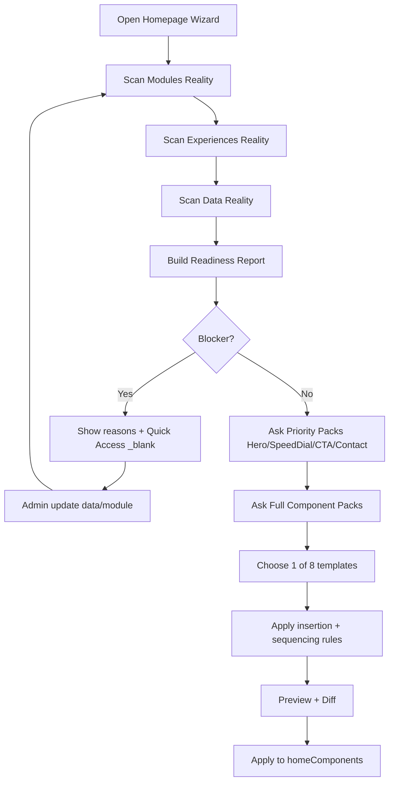

# I. Primer
## 1. TL;DR kiểu Feynman
- Wizard mới sẽ **đọc thật từ /system/modules + /system/experiences** trước khi hỏi, nên không còn hỏi bậy kiểu “dịch vụ” khi module services đang tắt.
- Hệ câu hỏi sẽ phủ **toàn bộ home-components**, gồm: bật/tắt, layout, nguồn dữ liệu, thứ tự, CTA, và luật chèn giữa các block.
- Có **8 template khung mạnh** (best-practice SaaS/ecom/services/content) để bám theo, nhưng vẫn cho phép chèn block ở giữa (vd Hero ... [block xen] ... Blog).
- Ưu tiên hỏi đầu: **Hero + SpeedDial + CTA + Contact** (phần phổ biến, ảnh hưởng conversion lớn).
- Readiness gate sẽ chặn từ đầu nếu thiếu nguyên liệu dữ liệu thực, kèm quick access mở trang `/admin/...` ở `_blank` để bổ sung.

## 2. Elaboration & Self-Explanation
Yêu cầu mới của anh là wizard phải “hiểu hệ thống thật” trước khi hỏi. Em chốt kiến trúc theo 3 lớp:
1) **System Reality Scan (Quét thực trạng hệ thống):** đọc module enabled/feature/setting từ Convex (`admin.modules.*`), đọc experience configs (`*_ui` trong settings), đọc dữ liệu thực (products/services/posts/categories/media/homeComponents).
2) **Question Engine theo ngữ cảnh:** chỉ hỏi những component/layout khả dụng theo module + experience hiện tại, và hỏi sâu toàn bộ home-components.
3) **Template Sequencer + Insertion Rules:** chọn 1 trong 8 khung mạnh, sau đó cho phép chèn block ở điểm hợp lệ (ví dụ giữa Hero và Blog).

Nghĩa là wizard không còn “preset mù”, mà thành một “kiến trúc sư homepage” có nhận thức về module/experience đang bật và dữ liệu thật đang có.

## 3. Concrete Examples & Analogies
- Ví dụ 1 (module services tắt):
  - Scan thấy `services.enabled=false` → wizard ẩn hẳn pack câu hỏi ServiceList/Services.
  - Nếu user cố bật template thiên service, wizard cảnh báo “không khả dụng” và gợi ý mở `/system/modules/services`.

- Ví dụ 2 (Hero trên, Blog dưới, chèn giữa):
  - Chọn template “Story Commerce”: `Hero -> ProductCategories -> ProductList -> Blog -> CTA -> Contact`.
  - Wizard cho chèn `TrustBadges` giữa Hero và ProductCategories hoặc chèn `Testimonials` giữa ProductList và Blog.

- Analogy:
  - Giống lập kế hoạch xây nhà: phải kiểm tra mảnh đất/pháp lý trước (module+experience+dữ liệu), rồi mới chọn mẫu nhà, rồi mới quyết định nội thất chèn ở đâu.

# II. Audit Summary (Tóm tắt kiểm tra)
- Observation:
  1) `convex/admin/modules.ts` đã có đủ API để đọc module enabled/dependencies/features/settings thật (`listModules`, `getModuleByKey`, `getModuleFeature`, `getModuleSetting`, ...).
  2) `/system/experiences/*` đang cấu hình nhiều behavior phụ thuộc module (evidence: pages products/posts/services/wishlist/detail đều check module enabled trước khi cho bật UI toggle).
  3) `lib/home-components/componentTypes.ts` có danh sách đầy đủ 29 loại home-component, thuận lợi để build full question coverage.
  4) Runtime homepage render theo `homeComponents` (convex/homeComponents.ts + renderer), nên apply đúng schema sẽ lên site thật ngay.
- Inference:
  - Khả thi cao để làm wizard “module-aware + experience-aware” mà không phải thay kiến trúc lõi.
- Decision:
  - Triển khai **Reality-first Question Protocol**: Scan thực trạng -> hỏi theo khả dụng -> sinh layout theo template sequence có rule chèn.

# III. Root Cause & Counter-Hypothesis (Nguyên nhân gốc & Giả thuyết đối chứng)
- Root Cause Confidence: **High**
  - Gốc vấn đề là thiếu lớp điều phối dựa trên trạng thái hệ thống thật; hiện chưa có engine ràng buộc câu hỏi theo module/experience/data readiness.
- Counter-hypothesis:
  - “Tăng số câu hỏi thủ công là đủ.”
  - Bác bỏ: nếu không ràng buộc module/experience thì càng hỏi nhiều càng dễ hỏi sai ngữ cảnh.

# IV. Proposal (Đề xuất)
## 1. Reality-first protocol (bắt buộc trước mọi câu hỏi)
### a) Scan Module Reality từ /system/modules
- Đọc:
  - module enabled map
  - feature enabled map
  - module settings quan trọng (vd products variantEnabled, saleMode, ...)
- Kết quả: `ModuleRealitySnapshot`.

### b) Scan Experience Reality từ /system/experiences
- Đọc các keys `*_ui` trong settings (posts/products/services/menu/contact...)
- Kết quả: `ExperienceRealitySnapshot`.

### c) Scan Data Reality
- Đếm/chất lượng dữ liệu thật:
  - products, productCategories, services, posts, testimonials-like signals, contact settings, brand settings, media assets.
- Kết quả: `DataRealitySnapshot`.

### d) Compose Readiness
- Hợp nhất 3 snapshot thành `HomepageReadinessReport` với:
  - blockers
  - warnings
  - availableComponents
  - unavailableComponents + reason (module off / feature off / data missing)

## 2. Full Question Coverage (toàn bộ home-components)
Mỗi component có pack câu hỏi 5 lớp:
1) Vai trò trong funnel (awareness/consideration/conversion/trust/support)
2) Layout/style (theo component support)
3) Data source mapping (module table/field/limit/sort/filter)
4) Interaction/CTA behavior (action, link target, device priority)
5) Sequencing (đặt trước/sau block nào, có được chèn giữa không)

### Ưu tiên hỏi đầu (fixed order)
1. Hero
2. SpeedDial
3. CTA
4. Contact

### Sau đó hỏi mở rộng (dynamic theo availability)
- ProductCategories, ProductList, ProductGrid, CategoryProducts
- ServiceList, Services, Process
- Blog, Testimonials, FAQ, Partners, TrustBadges
- About, Benefits, Features, Stats
- Gallery, Video, Team, CaseStudy, Clients
- Pricing, Countdown, VoucherPromotions, Footer, ...

## 3. 8 template khung mạnh (best-practice)
Mỗi template có thứ tự chuẩn + insertion points:
1) **Conversion Lean 8**
   - Hero -> ProductCategories -> ProductList -> TrustBadges -> Testimonials -> CTA -> FAQ -> Contact
2) **Content Commerce 8**
   - Hero -> ProductList -> Benefits -> Blog -> Testimonials -> CTA -> FAQ -> Footer
3) **Service Authority 8**
   - Hero -> Services -> Process -> CaseStudy -> Testimonials -> CTA -> FAQ -> Contact
4) **Catalog Explorer 8**
   - Hero -> ProductCategories -> CategoryProducts -> ProductGrid -> TrustBadges -> Blog -> CTA -> Footer
5) **Local Biz Lead 8**
   - Hero -> About -> Benefits -> Services -> Testimonials -> FAQ -> Contact -> Footer
6) **Brand Story 8**
   - Hero -> About -> Team -> CaseStudy -> Clients -> Blog -> CTA -> Footer
7) **Promo Campaign 8**
   - Hero -> Countdown -> VoucherPromotions -> ProductList -> Testimonials -> FAQ -> CTA -> Contact
8) **Hybrid Dynamic 8**
   - Hero -> (Product hoặc Service block theo score) -> Trust -> Content -> CTA -> Support -> Footer (điền động theo data)

## 4. Sequencing + Insertion Rules (khung trước/sau, có thể chen)
- Rule cứng:
  - Hero ở top zone.
  - Footer ở bottom zone.
- Rule mềm:
  - Blog mặc định mid/lower zone.
  - CTA có thể đứng giữa hoặc gần cuối.
  - TrustBadges/Testimonials có thể chen giữa Hero và Blog.
- Wizard UI sẽ cho:
  - chọn template khung,
  - rồi drag/reorder trong “vùng hợp lệ”,
  - cảnh báo khi vi phạm rule (vd đặt Footer lên đầu).

## 5. Option count nâng từ 4 lên 8 (đúng yêu cầu)
- Mỗi câu hỏi chiến lược chính có thể có 6–8 option (không chỉ 2–4), ví dụ:
  - Hero layout: split/fullscreen/slider/bento/video/minimal/immersive/story
  - CTA style: button pair/sticky bar/inline card/floating/multi-step/lead-form/phone-first/booking
  - Content density: ultra-lean/lean/balanced/rich/deep...

## 6. Quick Access (không qua /system/data)
- Từ blocker/warning mở thẳng `_blank`:
  - `/admin/products`
  - `/admin/services`
  - `/admin/posts`
  - `/admin/settings`
  - `/admin/media`
  - `/admin/home-components`
- Nếu thiếu module: mở `/system/modules/[key]`.
- Nếu thiếu experience alignment: mở `/system/experiences/[key]`.

## 7. Mermaid - Data flow + decision

# V. Files Impacted (Tệp bị ảnh hưởng)
- **Sửa:** `app/system/modules/homepage/page.tsx`  
  Vai trò: trang cấu hình module homepage.  
  Thay đổi: thêm launcher mở Homepage Smart Wizard v3.

- **Thêm:** `components/modules/homepage/HomepageSmartWizardDialog.tsx`  
  Vai trò: điều phối full flow scan -> hỏi -> template -> review -> apply.

- **Thêm:** `components/modules/homepage/wizard/reality-scan.ts`  
  Vai trò: gom ModuleReality/ExperienceReality/DataReality.

- **Thêm:** `components/modules/homepage/wizard/readiness.ts`  
  Vai trò: tạo blockers/warnings + availability map.

- **Thêm:** `components/modules/homepage/wizard/question-packs/*`  
  Vai trò: pack câu hỏi cho toàn bộ 29 component.

- **Thêm:** `components/modules/homepage/wizard/templates.ts`  
  Vai trò: định nghĩa 8 template khung + insertion points.

- **Thêm:** `components/modules/homepage/wizard/sequencing-rules.ts`  
  Vai trò: luật trước/sau/chèn và validation thứ tự.

- **Thêm:** `convex/homepageWizard.ts`  
  Vai trò: query readiness + mutation apply plan vào `homeComponents`.

- **Sửa (nhẹ):** `lib/modules/configs/homepage.config.ts`  
  Vai trò: feature/settings homepage module.  
  Thay đổi: thêm flags cho smart wizard depth/template mode (nếu cần).

# VI. Execution Preview (Xem trước thực thi)
1. Tạo Convex query: `getHomepageWizardReality()` đọc modules + experiences + data stats.
2. Tạo readiness engine và map component availability theo module/feature/field.
3. Dựng question packs ưu tiên Hero/SpeedDial/CTA/Contact trước.
4. Dựng question packs cho toàn bộ component còn lại (full coverage).
5. Dựng 8 template khung + insertion/sequencing rules.
6. Dựng review + diff + apply modes (replace_all / append_missing).
7. Nối vào `/system/modules/homepage` + quick access `_blank`.
8. Static review + `bunx tsc --noEmit` + commit.

# VII. Verification Plan (Kế hoạch kiểm chứng)
- Kiểm chứng logic:
  1) Module services tắt => không hỏi service pack.
  2) Experience liên quan tắt/mismatch => có warning + link điều hướng đúng.
  3) Mỗi component pack có câu hỏi layout + data binding + sequencing.
  4) Có 8 templates khả dụng và áp được insertion rules.
  5) Hero hỏi trước, SpeedDial hỏi sớm theo yêu cầu.
  6) Quick access mở đúng `_blank`.
- Kiểm chứng kỹ thuật:
  - `bunx tsc --noEmit`.

# VIII. Todo
1. Xây `HomepageRealitySnapshot` (modules + experiences + data).
2. Xây `HomepageReadinessReport` + blockers/warnings.
3. Xây priority question packs (Hero/SpeedDial/CTA/Contact).
4. Xây full packs cho toàn bộ home-components.
5. Xây 8 templates + insertion/sequencing rules.
6. Xây preview/diff/apply pipeline.
7. Tích hợp UI launcher ở `/system/modules/homepage`.
8. Typecheck + review tĩnh + commit.

# IX. Acceptance Criteria (Tiêu chí chấp nhận)
- Wizard đọc được trạng thái thật từ `/system/modules` và `/system/experiences` trước khi hỏi.
- Không còn hỏi component/module không khả dụng theo thực trạng hệ thống.
- Hệ câu hỏi phủ toàn bộ home-components, gồm layout + dữ liệu + sequencing.
- Có ít nhất 8 template khung mạnh với thứ tự trước/sau và điểm chèn hợp lệ.
- Hero/SpeedDial nằm trong nhóm hỏi ưu tiên đầu.
- Readiness gate chặn đúng khi thiếu dữ liệu cốt lõi; quick access `_blank` hoạt động.
- Apply xong homepage hiển thị đúng trên site thật.

# X. Risk / Rollback (Rủi ro / Hoàn tác)
- Rủi ro:
  - Số lượng câu hỏi lớn làm flow dài.
  - Rule sequencing quá chặt có thể hạn chế sáng tạo.
- Giảm thiểu:
  - Progressive disclosure (ẩn/hiện theo ngữ cảnh).
  - “Expert mode” để mở rộng câu hỏi sâu khi cần.
- Rollback:
  - Bọc bằng feature flag; revert commit nếu cần.

# XI. Out of Scope (Ngoài phạm vi)
- Không sinh nội dung AI dài tự động ngoài phạm vi cấu hình homepage blocks.
- Không thay kiến trúc toàn bộ renderer/site runtime.

# XII. Open Questions (Câu hỏi mở)
- Nếu anh muốn, ở bước implement em sẽ thêm 2 chế độ độ sâu:
  - Standard (nhanh)
  - Expert (đầy đủ tối đa)
  nhưng mặc định em sẽ để Expert theo đúng yêu cầu “mạnh nhất có thể”.