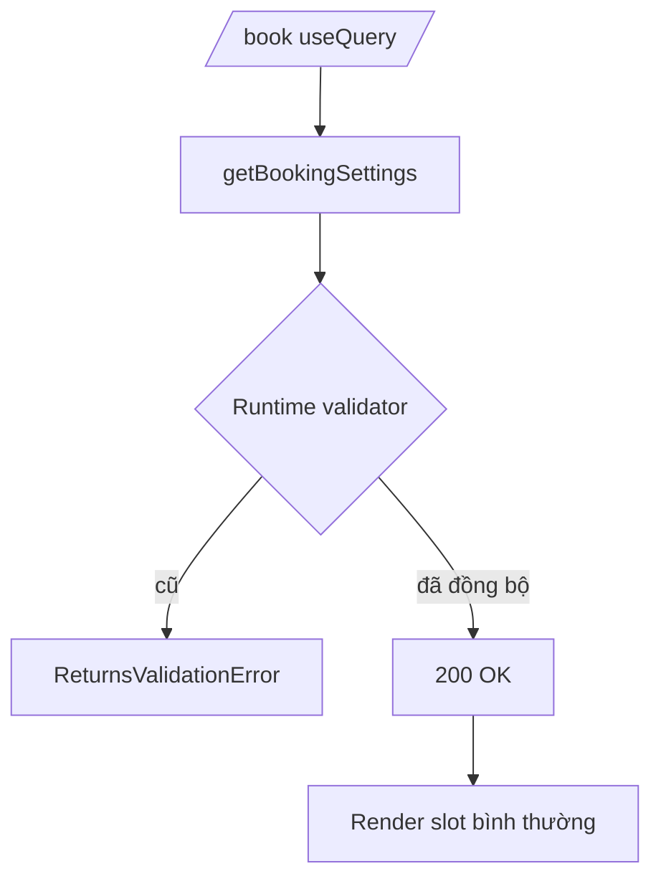

# I. Primer

## 1. TL;DR kiểu Feynman
- Lỗi hiện tại không phải do UI `/book`, mà do **server Convex đang dùng validator cũ** cho `getBookingSettings`.
- Code handler đã trả thêm `slotTemplateDefault` + `slotTemplateByWeekday`, nhưng runtime validator cũ chưa có 2 field này nên nổ `ReturnsValidationError`.
- Hướng fix đã chốt: **giữ tính năng slot template** và đồng bộ lại Convex (code + generated types + deploy function runtime).
- Sau fix, `/book` sẽ đọc settings bình thường, không còn crash ở `useQuery(api.bookings.getBookingSettings, {})`.

## 2. Elaboration & Self-Explanation
Hiện tượng này giống việc “mẫu đơn kiểm tra đầu ra” (validator) vẫn là bản cũ, còn dữ liệu thực tế đã thêm cột mới. Khi server trả object có `slotTemplateByWeekday`, validator cũ nói “field này không hợp lệ” và chặn request.

Vì stacktrace chỉ ra validator đang kỳ vọng object không có slot-template fields, khả năng cao là code chưa được Convex runtime nhận đầy đủ (chưa codegen/deploy đúng phiên bản), hoặc đang trỏ sai deployment.

## 3. Concrete Examples & Analogies
- Ví dụ cụ thể:
  - Handler trả:
    `{ ..., slotTemplateDefault: [], slotTemplateByWeekday: {} }`
  - Validator runtime đang kỳ vọng:
    `{ timezoneDefault, maxAdvanceDays, dayStartHour, dayEndHour, openDays, customerFieldConfigs, visibilityMode }`
  - Kết quả: `Object contains extra field 'slotTemplateByWeekday'`.
- Analogy: giống API trả thêm cột `address`, nhưng schema gateway vẫn bản cũ chỉ cho `name, phone` nên request bị reject.

# II. Audit Summary (Tóm tắt kiểm tra)
- **Observation:**
  - Error log báo rõ `ReturnsValidationError` tại `Q(bookings:getBookingSettings)` vì extra field `slotTemplateByWeekday`.
  - File `convex/bookings.ts` hiện có return validator chứa cả `slotTemplateDefault` và `slotTemplateByWeekday` (theo source local).
- **Inference:** Runtime Convex đang chạy metadata/validator khác với source local (deployment/codegen lệch phiên bản hoặc nhầm deployment).
- **Decision:** Đồng bộ Convex runtime với source mới, verify trực tiếp query `bookings:getBookingSettings` sau deploy.

Checklist root-cause:
1. **Triệu chứng:** `/book` crash khi gọi `getBookingSettings`.
2. **Phạm vi ảnh hưởng:** public `/book` và mọi nơi gọi query này.
3. **Tái hiện:** ổn định, xảy ra ngay khi query chạy.
4. **Mốc thay đổi:** vừa thêm slot-template fields vào booking settings.
5. **Thiếu dữ liệu:** chưa xác nhận deployment Convex hiện tại đang trỏ env nào.
6. **Giả thuyết thay thế:** bug UI React; đã loại vì lỗi phát sinh từ Convex validator server.
7. **Rủi ro fix sai nguyên nhân:** sửa UI nhưng server validator vẫn lỗi, outage còn nguyên.
8. **Pass/fail:** query trả 200 với object có slot-template fields và trang `/book` render bình thường.

# III. Root Cause & Counter-Hypothesis (Nguyên nhân gốc & Giả thuyết đối chứng)
- **Root cause (High):** Mismatch giữa source code và Convex runtime validator của `getBookingSettings`.
- **Counter-hypothesis:** dữ liệu module settings bị bẩn.
  - **Bác bỏ:** Dữ liệu `{}` và `[]` là hợp lệ; lỗi là schema-level “extra field”.
- **Root Cause Confidence:** **High** (message lỗi nêu rõ validator shape cũ).

# IV. Proposal (Đề xuất)
1. Kiểm tra nhanh source `convex/bookings.ts` để chắc chắn `returns` của `getBookingSettings` đã có 2 field slot-template.
2. Đồng bộ generated Convex artifacts (nếu dự án yêu cầu bước codegen).
3. Deploy Convex đúng deployment đang phục vụ app hiện tại.
4. Verify trực tiếp query `bookings:getBookingSettings` trên runtime sau deploy.
5. Verify lại `/book` end-to-end.
6. Nếu vẫn lỗi: audit biến môi trường deployment (dev/prod) để loại trừ trỏ nhầm backend.

# V. Files Impacted (Tệp bị ảnh hưởng)
- **Sửa (nếu thiếu):** `convex/bookings.ts`
  - Vai trò hiện tại: query/mutation bookings + returns validator.
  - Thay đổi: đảm bảo `returns` của `getBookingSettings` khớp với object handler trả về.

- **Sửa (nếu cần):** `convex/_generated/*`
  - Vai trò hiện tại: artifacts generated cho Convex client/server typing.
  - Thay đổi: regenerate để đồng bộ với schema/query mới.

- **Không đổi logic UI:** `app/(site)/book/page.tsx`
  - Vai trò hiện tại: gọi `getBookingSettings`.
  - Thay đổi: không cần sửa thêm nếu backend đã đồng bộ chuẩn.

# VI. Execution Preview (Xem trước thực thi)
1. Đọc và xác nhận shape `returns` hiện tại trong `getBookingSettings`.
2. Chạy bước codegen/deploy Convex đúng env.
3. Gọi lại query để kiểm chứng response contract.
4. Mở `/book` kiểm tra runtime thực tế.
5. Commit hotfix nếu có thay đổi code phát sinh.

# VII. Verification Plan (Kế hoạch kiểm chứng)
- Kiểm chứng kỹ thuật:
  - Query `bookings:getBookingSettings` trả object có `slotTemplateDefault`, `slotTemplateByWeekday` không lỗi validator.
- Kiểm chứng UI:
  - `/book` load không crash tại line `useQuery(api.bookings.getBookingSettings, {})`.
- Type check (nếu có đổi code TS):
  - `bunx tsc --noEmit`.

# VIII. Todo
1. Xác nhận `getBookingSettings.returns` tại source hiện tại.
2. Đồng bộ Convex runtime (codegen + deploy đúng env).
3. Re-verify query `bookings:getBookingSettings` trên runtime.
4. Re-verify `/book` không còn Runtime Error.
5. Commit hotfix (không push).

# IX. Acceptance Criteria (Tiêu chí chấp nhận)
- Không còn `ReturnsValidationError` cho `slotTemplateByWeekday`.
- `/book` render thành công và lấy được settings có slot-template fields.
- Không làm mất tính năng slot template vừa triển khai.

# X. Risk / Rollback (Rủi ro / Hoàn tác)
- **Rủi ro:** deploy nhầm environment khiến lỗi vẫn còn.
- **Giảm thiểu:** kiểm tra rõ deployment target trước khi deploy và verify trực tiếp query runtime.
- **Rollback:** nếu hotfix code làm phát sinh lỗi khác, revert commit gần nhất và redeploy bản ổn định.

# XI. Out of Scope (Ngoài phạm vi)
- Không thay đổi UX/flow slot template.
- Không refactor thêm module bookings/services ngoài phạm vi fix validator-runtime mismatch.

# XII. Open Questions (Câu hỏi mở)
- Không còn ambiguity nghiệp vụ; chỉ cần bạn duyệt để mình triển khai hotfix ngay.