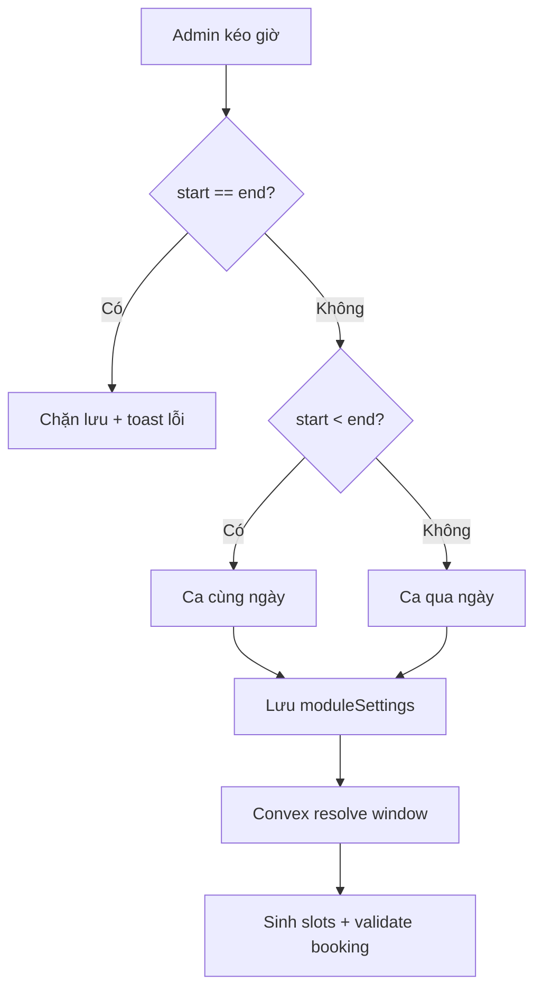

# I. Primer
## 1. TL;DR kiểu Feynman
- Hiện tại trang `/admin/bookings/settings` dùng 2 ô số “Giờ mở cửa/đóng cửa”, nên ca kiểu `23:00 -> 01:00` không lưu được và khó hiểu trực quan.
- Mình sẽ đổi desktop sang **vòng thời gian 24h có 2 tay kéo** (Mở cửa, Đóng cửa), mobile dùng **slider ngang 2 đầu** như bạn chọn.
- Logic validate sẽ đổi từ “mở < đóng” thành “mở != đóng”, cho phép **qua ngày hôm sau** khi giờ đóng nhỏ hơn giờ mở.
- Backend bookings sẽ được cập nhật để hiểu đúng khung giờ qua ngày (không còn rỗng slot khi 23 -> 1).
- UI sẽ show realtime: giờ mở, giờ đóng, trạng thái “qua ngày”, tổng số giờ mở.

## 2. Elaboration & Self-Explanation
- Vấn đề gốc không chỉ là “UI khó nhìn”, mà còn là rule hiện tại đang **chặn** trường hợp kinh doanh hợp lệ (mở khuya, đóng rạng sáng).
- Với mô hình dữ liệu hiện có (`dayStartHour`, `dayEndHour` là số 0-23), ta vẫn hỗ trợ được ca qua ngày bằng quy ước:
  - `dayStartHour < dayEndHour` => cùng ngày.
  - `dayStartHour > dayEndHour` => đóng vào ngày hôm sau.
  - `dayStartHour === dayEndHour` => không hợp lệ (tránh mơ hồ 0h hay 24h).
- Nhờ vậy không cần đổi schema, chỉ cần đổi validate + thuật toán tính slot theo vòng 24h.

## 3. Concrete Examples & Analogies
- Ví dụ cụ thể trong repo:
  - Nếu admin kéo `Mở cửa = 23`, `Đóng cửa = 1`, UI hiển thị:
    - Mở cửa: 23:00
    - Đóng cửa: 01:00 (hôm sau)
    - Tổng giờ mở: 2 giờ
  - Khi lưu, Convex vẫn lưu `dayStartHour=23`, `dayEndHour=1`; logic slot hiểu đây là ca qua ngày.
- Analogy đời thường: giống đồng hồ treo tường chạy theo vòng tròn; kim phút đi qua số 12 thì sang ngày mới, không phải lỗi.

# II. Audit Summary (Tóm tắt kiểm tra)
1. Observation (Quan sát)
   a) `app/admin/bookings/settings/page.tsx` đang render 2 `Input type="number"` cho giờ mở/đóng (khoảng dòng ~143-160).
   b) Rule save hiện tại chặn `dayStartHour >= dayEndHour` với toast “Giờ mở cửa phải nhỏ hơn giờ đóng cửa” (khoảng dòng ~79).
   c) `convex/bookings.ts` build slot theo `start -> end` tuyến tính, nên ca qua ngày sẽ không sinh slot hợp lệ.
2. Inference (Suy luận)
   a) Nếu chỉ đổi UI mà không đổi validate + slot logic thì vẫn không dùng được ca `23 -> 1`.
   b) Đây là vấn đề kết hợp giữa UX và business rule.
3. Decision (Quyết định)
   a) Sửa cả frontend settings + logic Convex liên quan khung giờ.
   b) Không đổi schema để giữ thay đổi nhỏ, dễ rollback.

# III. Root Cause & Counter-Hypothesis (Nguyên nhân gốc & Giả thuyết đối chứng)
1. Root cause
   a) Triệu chứng (#1): expected cho phép giờ đóng nhỏ hơn giờ mở (qua ngày), actual bị chặn bởi điều kiện `start >= end` ở settings page.
   b) Phạm vi ảnh hưởng (#2): admin cấu hình lịch, public availability, create booking validation.
   c) Tái hiện (#3): ổn định 100% khi nhập `23` và `1` tại `/admin/bookings/settings`.
   d) Mốc thay đổi gần nhất (#4): settings bookings mới được tách về admin, nhưng rule vẫn dạng cùng-ngày.
   e) Dữ liệu thiếu (#5): chưa có telemetry user flow; nhưng evidence code đủ để kết luận cho case này.
   f) Giả thuyết thay thế (#6): lỗi do input number/browser locale — đã loại trừ vì chặn từ điều kiện logic trong code.
   g) Rủi ro fix sai (#7): cho lưu được nhưng slot/booking không hiểu qua ngày => mismatch UI/behavior.
   h) Pass/fail (#8): lưu được `23 -> 1`, UI hiển thị “qua ngày”, slot generation không rỗng sai.
2. Counter-hypothesis
   a) Có thể chỉ cần đổi copy text hướng dẫn, không cần đổi logic.
   b) Bác bỏ: vì hiện tại hệ thống hard-block `start >= end`, nên copy không giải quyết được.
3. Root Cause Confidence (Độ tin cậy nguyên nhân gốc): **High**
   a) Lý do: evidence trực tiếp từ điều kiện validate FE + thuật toán sinh slot BE đang giả định cùng ngày.

# IV. Proposal (Đề xuất)
1. UI/UX settings
   a) Desktop: thay cụm 2 input giờ bằng `OperatingHoursDial` (SVG vòng 24h, 2 handle kéo).
   b) Mobile: dùng `input range` 2 đầu (dual-thumb pattern hiện có), giữ thao tác chính xác trên màn nhỏ.
   c) Realtime summary ngay dưới control:
      - Mở cửa: `HH:00`
      - Đóng cửa: `HH:00` (+ badge “Hôm sau” nếu qua ngày)
      - Tổng giờ mở: `X giờ`
2. Validate & save
   a) FE đổi rule từ `start >= end` thành `start === end` là lỗi.
   b) Toast lỗi mới: “Giờ mở và giờ đóng không được trùng nhau”.
3. Booking logic
   a) Thêm helper chuẩn hóa khung giờ dạng vòng 24h trong `convex/bookings.ts`.
   b) `buildSlots`: hỗ trợ ca qua ngày bằng cách cho phép window wrap qua 00:00.
   c) `createPublicBooking`: kiểm tra slot hợp lệ theo cùng helper (không dùng so sánh tuyến tính cũ).
4. Khả năng tương thích dữ liệu cũ
   a) Dữ liệu cũ `start < end` chạy y như trước.
   b) Không migration, không đổi schema.

# V. Files Impacted (Tệp bị ảnh hưởng)
1. Sửa: `app/admin/bookings/settings/page.tsx`
   - Vai trò hiện tại: trang cấu hình booking policy (giờ mở/đóng, ngày mở, visibility...).
   - Thay đổi: thay input giờ bằng control mới (desktop dial + mobile range), cập nhật validate và realtime summary.
2. Thêm: `app/admin/bookings/settings/_components/OperatingHoursDial.tsx`
   - Vai trò hiện tại: chưa có.
   - Thay đổi: component vòng 24h có 2 handle kéo, callback `onChange(startHour, endHour)`.
3. Thêm: `app/admin/bookings/settings/_lib/timeWindow.ts` (nếu cần tách util để tránh lặp)
   - Vai trò hiện tại: chưa có.
   - Thay đổi: helper format giờ, tính duration qua ngày, detect overnight.
4. Sửa: `convex/bookings.ts`
   - Vai trò hiện tại: nguồn logic availability và create booking.
   - Thay đổi: cập nhật build/validate slot theo cửa sổ thời gian vòng 24h, hỗ trợ qua ngày.

# VI. Execution Preview (Xem trước thực thi)
1. Đọc/chỉnh `page.tsx`: thay UI input giờ bằng block control mới + summary realtime.
2. Tạo component dial + xử lý drag (mouse/touch) cho desktop.
3. Thêm mobile dual-range fallback theo lựa chọn của bạn.
4. Đổi rule validate save (`start !== end`).
5. Cập nhật `convex/bookings.ts` để slot/validation hiểu ca qua ngày.
6. Static self-review: typing, edge cases 0/23, wrap logic, null-safety.

# VII. Verification Plan (Kế hoạch kiểm chứng)
1. Repro thủ công
   a) Vào `/admin/bookings/settings`, kéo `23 -> 1`, thấy summary đúng và lưu thành công.
   b) Mở lại trang, dữ liệu hiển thị đúng như đã lưu.
2. Runtime behavior
   a) Case cùng ngày (9 -> 20) hoạt động không đổi.
   b) Case qua ngày (23 -> 1) không báo lỗi “ngoài thời gian hoạt động” sai.
3. Static checks
   a) Chạy `bunx tsc --noEmit` vì có thay đổi TS/code.
   b) Không chạy lint/unit test theo quy ước repo hiện tại.

# VIII. Todo
1. Tạo component vòng giờ 24h desktop với 2 handle kéo + label Mở cửa/Đóng cửa.
2. Tạo fallback mobile slider ngang 2 đầu.
3. Tích hợp vào bookings settings page và realtime summary.
4. Đổi validate save cho phép qua ngày (chặn only start==end).
5. Cập nhật logic Convex build slots + create booking validation theo time window vòng 24h.
6. Tự review tĩnh + chạy typecheck.

# IX. Acceptance Criteria (Tiêu chí chấp nhận)
1. Admin không còn nhập giờ bằng 2 ô số ở desktop; có vòng kéo 2 tay với nhãn rõ ràng.
2. Mobile dùng slider ngang 2 đầu như đã chốt.
3. Hiển thị realtime: giờ mở, giờ đóng, tổng giờ mở; có trạng thái “hôm sau” khi applicable.
4. Lưu được cấu hình `23 -> 1`; không còn toast bắt buộc mở < đóng.
5. Logic booking không bị vỡ cho cả ca cùng ngày và qua ngày.

# X. Risk / Rollback (Rủi ro / Hoàn tác)
1. Rủi ro
   a) Mapping góc <-> giờ có thể lệch 1 đơn vị nếu xử lý drag không snap đúng.
   b) Ngữ nghĩa `bookingDate` với slot sau 00:00 có thể gây kỳ vọng khác ở một số màn hình báo cáo.
2. Rollback
   a) Rollback an toàn theo commit: trả `page.tsx` về 2 input cũ + restore validate cũ + revert helper slot wrap.
   b) Do không đổi schema nên rollback không cần migration data.

# XI. Out of Scope (Ngoài phạm vi)
1. Không đổi schema bookings sang datetime đầy đủ (date-time timezone aware).
2. Không redesign toàn bộ UI booking pages khác ngoài settings và logic liên quan slot/validate.
3. Không thêm analytics/reporting riêng cho ca qua ngày trong phase này.

# XII. Open Questions (Câu hỏi mở)
1. Không còn ambiguity lớn sau khi bạn đã chốt: giờ nguyên, cho phép qua ngày, mobile slider.