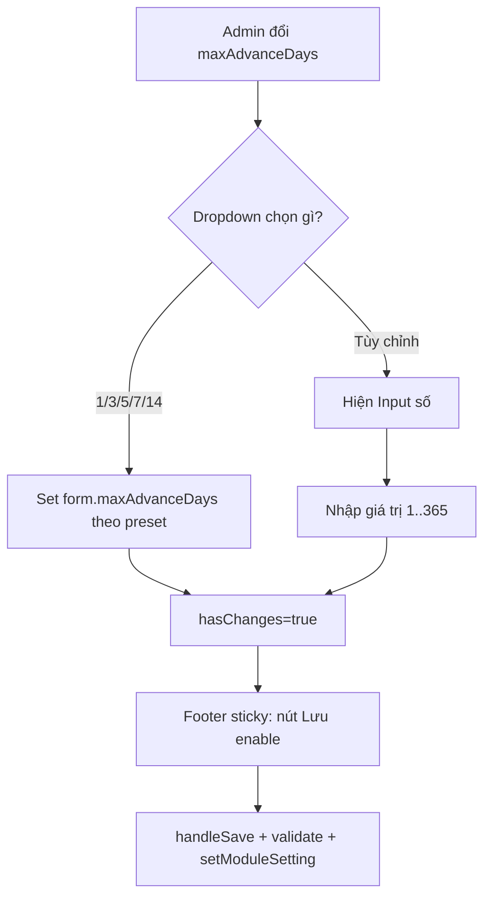

# I. Primer
## 1. TL;DR kiểu Feynman
- Trang `admin/bookings/settings` đang để nhập tay số ngày đặt trước, nên thao tác chậm và dễ nhập nhầm.
- Mình sẽ đổi thành dropdown 6 lựa chọn: `1, 3, 5, 7, 14, Tuỳ chỉnh`.
- Khi chọn `Tuỳ chỉnh` mới hiện ô nhập số tay; còn chọn preset thì set thẳng giá trị.
- Nút Lưu sẽ chuyển thành footer sticky giống pattern Hero để luôn thấy khi cuộn trang.
- Footer chỉ có 1 nút `Lưu`, disabled khi chưa thay đổi (đúng yêu cầu).

## 2. Elaboration & Self-Explanation
Hiện tại field `maxAdvanceDays` dùng `Input type=number`, nên admin phải tự nghĩ số rồi gõ. Với nhu cầu thực tế, phần lớn chỉ dùng vài mốc ngắn ngày. Cách làm mới: cho chọn nhanh 5 mốc cố định (1/3/5/7/14) để bấm là xong; nếu vẫn cần số khác thì chọn `Tuỳ chỉnh` và nhập tay.  
Song song đó, nút lưu hiện nằm cuối trang nên khi chỉnh nhiều card phải cuộn lâu mới tới. Mình sẽ áp dụng footer sticky giống trang Hero edit để nút Lưu luôn nằm dưới màn hình, giúp thao tác nhanh và giảm bỏ sót lưu.

## 3. Concrete Examples & Analogies
- Ví dụ cụ thể theo yêu cầu: admin muốn mở lịch đặt trước 7 ngày chỉ cần chọn `7 ngày` trong dropdown, không cần gõ số. Nếu muốn 20 ngày thì chọn `Tuỳ chỉnh` rồi nhập `20`.
- Analogy đời thường: giống app đặt lịch khám có các nút nhanh “Hôm nay / 3 ngày / 1 tuần”, chỉ khi cần đặc biệt mới mở “Khác…” để tự nhập.

# II. Audit Summary (Tóm tắt kiểm tra)
- Observation:
  - Route `http://localhost:3000/admin/bookings/settings` map tới `app/admin/bookings/settings/page.tsx`.
  - Field hiện tại: `Input type="number"` cho `maxAdvanceDays`.
  - Save action hiện tại là nút thường ở cuối trang, không sticky.
  - Pattern sticky footer đã có sẵn ở `app/admin/home-components/_shared/components/HomeComponentStickyFooter.tsx` và đang dùng ở Hero edit.
- Inference:
  - Có thể tái sử dụng component sticky footer hiện có để giữ consistency UI.
  - Chỉ cần đổi logic UI tại page bookings settings, không cần đụng Convex schema/function.
- Decision:
  - Reuse `HomeComponentStickyFooter` cho trang bookings settings.
  - Áp dụng dropdown preset + custom input cho `maxAdvanceDays`.

# III. Root Cause & Counter-Hypothesis (Nguyên nhân gốc & Giả thuyết đối chứng)
- Root Cause (nguyên nhân gốc):
  1. UX nhập tay cho giá trị hay dùng gây friction không cần thiết.
  2. CTA lưu đặt cuối nội dung làm tăng thao tác cuộn và rủi ro quên lưu.
- Counter-Hypothesis (giả thuyết đối chứng):
  - Có thể giữ input số và chỉ thêm placeholder/hint.  
    → Bị loại vì không giải quyết thao tác nhanh bằng preset, vẫn phải nhập tay.
  - Có thể thêm sticky nhưng giữ input số.  
    → Chỉ giải quyết 1 nửa vấn đề, chưa đạt yêu cầu dropdown 5 preset + custom.
- Root Cause Confidence (Độ tin cậy nguyên nhân gốc): **High** (khớp trực tiếp với hiện trạng code + yêu cầu người dùng).

# IV. Proposal (Đề xuất)
1. Thay block `Input number` của `maxAdvanceDays` bằng:
   - `select` với options: `1 ngày, 3 ngày, 5 ngày, 7 ngày, 14 ngày, Tùy chỉnh`.
   - Nếu giá trị hiện tại nằm ngoài preset, select tự về `Tùy chỉnh`.
   - Khi `Tùy chỉnh` được chọn, render thêm `Input type=number` để nhập tay.
2. Giữ nguyên validation hiện có trong `handleSave` (`1..365`) để bảo toàn logic backend/frontend.
3. Chuyển phần save action cuối trang sang sticky footer:
   - Reuse `HomeComponentStickyFooter`.
   - Chỉ hiển thị nút Lưu (không nút Hủy).
   - Disabled khi `!hasChanges || isSaving` (match yêu cầu).
4. Thêm khoảng đệm đáy (`pb-20`) cho container tránh nội dung bị footer che.

# V. Files Impacted (Tệp bị ảnh hưởng)
- **Sửa:** `app/admin/bookings/settings/page.tsx`
  - Vai trò hiện tại: render toàn bộ Booking Settings UI + handleSave.
  - Thay đổi: thay field `maxAdvanceDays` sang dropdown preset + custom input; tích hợp sticky save footer theo pattern Home Components.

# VI. Execution Preview (Xem trước thực thi)
1. Đọc/đối chiếu block UI `maxAdvanceDays` và save button hiện tại trong `page.tsx`.
2. Thêm hằng preset `[1,3,5,7,14]` + logic xác định `isCustom` từ `form.maxAdvanceDays`.
3. Refactor UI field thành `select + conditional number input`.
4. Import và gắn `HomeComponentStickyFooter`; bỏ nút save cũ cuối trang; thêm `pb-20`.
5. Tự review tĩnh: typing, null-safety, behavior khi dữ liệu cũ không thuộc preset.

# VII. Verification Plan (Kế hoạch kiểm chứng)
- Repro thủ công tại `http://localhost:3000/admin/bookings/settings`:
  1. Giá trị ban đầu thuộc preset → dropdown chọn đúng preset, không hiện input custom.
  2. Giá trị ban đầu ngoài preset (nếu có) → dropdown ở `Tùy chỉnh`, input custom hiển thị đúng số.
  3. Chọn từng preset → giá trị form cập nhật đúng, lưu thành công.
  4. Chọn `Tùy chỉnh` + nhập số hợp lệ/không hợp lệ → validation giữ nguyên.
  5. Cuộn trang dài → nút Lưu sticky luôn thấy; disabled khi chưa đổi.
- Type safety:
  - Chạy `bunx tsc --noEmit` sau khi code (theo quy ước repo khi có thay đổi TS/code).
- Không chạy lint/unit test (theo guideline repo hiện tại).

# VIII. Todo
1. Refactor UI `maxAdvanceDays` sang dropdown preset + custom input.
2. Reuse sticky footer component cho trang bookings settings (chỉ nút Lưu).
3. Đảm bảo `hasChanges/isSaving` điều khiển disabled state đúng.
4. Static self-review + `bunx tsc --noEmit`.
5. Commit thay đổi (không push).

# IX. Acceptance Criteria (Tiêu chí chấp nhận)
- Có dropdown đúng 6 option: `1, 3, 5, 7, 14, Tùy chỉnh`.
- Chỉ khi chọn `Tùy chỉnh` mới hiện ô nhập tay.
- Save footer sticky xuất hiện ở đáy màn hình, chỉ có nút `Lưu`.
- Nút `Lưu` disabled khi chưa có thay đổi hoặc đang lưu.
- Lưu thành công vẫn ghi vào cùng setting key `maxAdvanceDays` như cũ.

# X. Risk / Rollback (Rủi ro / Hoàn tác)
- Rủi ro:
  - Giá trị cũ ngoài preset có thể gây lệch trạng thái hiển thị nếu xử lý mapping sai.
  - Sticky footer có thể che nội dung cuối nếu thiếu padding đáy.
- Rollback:
  - Revert duy nhất file `app/admin/bookings/settings/page.tsx` về commit trước.

# XI. Out of Scope (Ngoài phạm vi)
- Không thay đổi Convex schema/function/settings key.
- Không thay đổi UX các trang settings khác.
- Không thêm preset ngoài bộ `1,3,5,7,14` đã chốt.

# XII. Open Questions (Câu hỏi mở)
- Không còn câu hỏi mở.