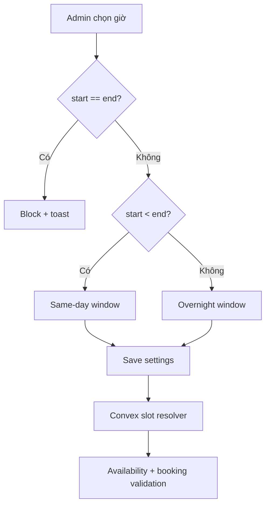

# I. Primer
## 1. TL;DR kiểu Feynman
- Đổi UI giờ hoạt động ở `/admin/bookings/settings`: desktop dùng vòng 24h 2 tay kéo, mobile dùng slider ngang 2 đầu.
- Cho phép ca qua ngày (`23 -> 1`) bằng rule mới: chỉ chặn `start === end`.
- Cập nhật logic Convex để build/validate slot theo cửa sổ thời gian dạng vòng 24h.
- Không đổi schema, không migration, giữ rollback đơn giản.

## 2. Elaboration & Self-Explanation
- Lỗi hiện tại nằm ở cả UX (2 input số khó thao tác) và business rule (`start >= end` bị chặn), nên cần sửa đồng thời FE + BE.
- Ta vẫn dùng `dayStartHour/dayEndHour` (0-23), chỉ đổi cách hiểu:
  - `start < end`: cùng ngày
  - `start > end`: qua ngày hôm sau
  - `start === end`: invalid

## 3. Concrete Examples & Analogies
- Ví dụ: lưu `23 -> 1` thì UI hiển thị “Đóng cửa 01:00 (hôm sau)”, tổng giờ mở `2 giờ`, booking slots vẫn sinh đúng.
- Analogy: kim đồng hồ đi qua số 12 là sang ngày mới, không phải lỗi.

# II. Audit Summary (Tóm tắt kiểm tra)
- `app/admin/bookings/settings/page.tsx` đang dùng 2 input number cho giờ mở/đóng và chặn `start >= end`.
- `convex/bookings.ts` đang giả định cửa sổ cùng ngày khi build slot/validate.
- Nếu chỉ đổi UI mà không đổi logic Convex thì case qua ngày vẫn hỏng.

# III. Root Cause & Counter-Hypothesis (Nguyên nhân gốc & Giả thuyết đối chứng)
- Root cause: điều kiện FE chặn `start >= end` + BE xử lý window tuyến tính.
- Counter-hypothesis (chỉ sửa text hướng dẫn) bị bác bỏ vì vẫn bị hard-block logic.
- Root Cause Confidence: **High** (evidence trực tiếp từ code path settings + bookings logic).

# IV. Proposal (Đề xuất)
1) FE settings
- Thay input giờ bằng `OperatingHoursDial` (desktop) + dual range (mobile).
- Thêm summary realtime: mở cửa, đóng cửa, badge “hôm sau”, tổng số giờ mở.
- Đổi validate save: chỉ lỗi khi `start === end`.

2) BE bookings
- Chuẩn hóa helper xử lý window 24h dạng wrap.
- Sửa build slots + create booking validation để hiểu ca qua ngày.

# V. Files Impacted (Tệp bị ảnh hưởng)
- **Sửa:** `app/admin/bookings/settings/page.tsx` — thay control giờ + validate + summary.
- **Thêm:** `app/admin/bookings/settings/_components/OperatingHoursDial.tsx` — dial 24h 2 handle.
- **Thêm (nếu cần):** `app/admin/bookings/settings/_lib/timeWindow.ts` — format/duration/overnight helpers.
- **Sửa:** `convex/bookings.ts` — slot/validation cho overnight window.

# VI. Execution Preview (Xem trước thực thi)
1. Refactor settings UI sang dial + mobile dual slider.
2. Wiring state + realtime labels.
3. Update validate/save rule.
4. Patch Convex window logic (build + validate).
5. Self-review tĩnh (typing, edge cases 0/23, wrap qua ngày).

# VII. Verification Plan (Kế hoạch kiểm chứng)
- Repro: lưu `23 -> 1` thành công, reload vẫn đúng.
- Regression: `9 -> 20` hoạt động như cũ.
- Behavior: booking không báo sai “ngoài thời gian hoạt động” cho ca qua ngày.
- Theo rule repo: không chạy lint/unit test; chỉ static review và bước verify thủ công theo luồng.

# VIII. Todo
1. Tạo `OperatingHoursDial` cho desktop.
2. Tạo mobile dual slider.
3. Tích hợp vào settings page + summary.
4. Đổi validate save (`start !== end`).
5. Sửa Convex booking window logic hỗ trợ qua ngày.
6. Tự review tĩnh + rà edge cases.

# IX. Acceptance Criteria (Tiêu chí chấp nhận)
- Desktop có dial 2 tay kéo, mobile có slider 2 đầu.
- Hiển thị rõ mở/đóng/tổng giờ + trạng thái qua ngày.
- Lưu được `23 -> 1`; chỉ chặn `start == end`.
- Booking availability/validation đúng cho cả same-day và overnight.

# X. Risk / Rollback (Rủi ro / Hoàn tác)
- Rủi ro: lệch snap giờ khi drag, và khác kỳ vọng quanh mốc qua 00:00.
- Rollback: revert các file trên; không cần migration vì không đổi schema.

# XI. Out of Scope (Ngoài phạm vi)
- Không đổi schema sang datetime đầy đủ timezone-aware.
- Không redesign các màn booking khác ngoài phạm vi settings + logic slot liên quan.

# XII. Open Questions (Câu hỏi mở)
- Không có ambiguity quan trọng ở scope hiện tại.