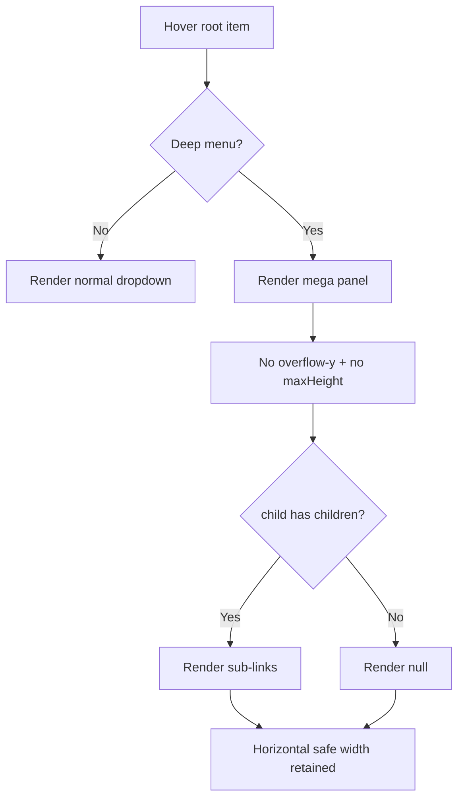

# I. Primer
## 1. TL;DR kiểu Feynman
- Em sẽ sửa đúng 1 file `components/site/Header.tsx` theo spec anh đưa.
- Mục tiêu: bỏ scrollbar dọc trong mega menu desktop/tablet-desktop-mode, bỏ chữ hardcode `Xem thêm`, giữ cơ chế chống cắt ngang.
- Em không đụng mobile menu branch.
- Em sẽ commit local sau khi sửa xong (không push), theo rule repo.

## 2. Elaboration & Self-Explanation
- Hiện tại 3 nhánh header (classic/topbar/allbirds) đều có mega menu dùng `overflow-y-auto` + `maxHeight`, nên panel tự sinh scroll dọc khi cao.
- Trong nhánh render child rỗng vẫn fallback `<Link>...Xem thêm</Link>`, gây sai semantic.
- Cách làm đúng với yêu cầu là:
  1) bỏ mọi ràng buộc scroll theo trục dọc,
  2) thay fallback cứng bằng render rỗng,
  3) giữ anti-overflow ngang qua `maxWidth: calc(100vw - 16px)` + align logic đã có.

## 3. Concrete Examples & Analogies
- Trước sửa: cột child không có grandchildren vẫn hiện `Xem thêm`, dropdown có cả scrollbar dọc.
- Sau sửa: cột đó chỉ còn heading (nếu có), phần list con rỗng thì không render gì; dropdown không còn vertical scrollbar.
- Analogy: kệ nhiều ngăn thì ngăn trống để trống, không dán nhãn giả; cả kệ chỉ cần vừa bề ngang phòng.

# II. Audit Summary (Tóm tắt kiểm tra)
- Đã xác nhận điểm cần sửa trong `components/site/Header.tsx`:
  - `overflow-y-auto`: line ~1014, ~1566, ~1812
  - `maxHeight: 'min(70vh, 560px)'`: line ~1019, ~1571, ~1817
  - hardcode `Xem thêm`: line ~1085, ~1637, ~1883
- Đây khớp hoàn toàn với spec file anh yêu cầu implement.

# III. Root Cause & Counter-Hypothesis (Nguyên nhân gốc & Giả thuyết đối chứng)
- Root Cause (High): vertical scrollbar do chính class/style ở mega panel (`overflow-y-auto` + `maxHeight`).
- Root Cause (High): text `Xem thêm` do fallback branch hardcode khi `child.children.length === 0`.
- Counter-hypothesis đã loại: scrollbar do wrapper ngoài header; evidence cho thấy scrollbar nằm trong panel dropdown.

# IV. Proposal (Đề xuất)
- Em implement theo Option A trong spec (đã chốt):
  1) Gỡ `overflow-y-auto` tại 3 mega menu panel.
  2) Gỡ `maxHeight` tương ứng tại 3 panel.
  3) Gỡ fallback hardcode `Xem thêm` tại 3 branch, thay bằng `null` (không render).
  4) Giữ nguyên toàn bộ logic anti-overflow ngang/align hiện có (`getViewportSafeMaxWidth`, `updateDropdownAlign`, `getDropdownPositionClass`).
  5) Static self-review để bảo đảm không ảnh hưởng branch mobile.

# V. Files Impacted (Tệp bị ảnh hưởng)
- **Sửa:** `components/site/Header.tsx`
  - Vai trò hiện tại: render header/menu cho các style classic/topbar/allbirds.
  - Thay đổi: bỏ vertical scrolling constraints + bỏ fallback `Xem thêm` hardcode ở cả 3 nhánh mega menu.

# VI. Execution Preview (Xem trước thực thi)
1. Chỉnh nhánh classic mega menu (remove overflow-y/maxHeight + fallback `Xem thêm`).
2. Chỉnh nhánh topbar mega menu tương tự.
3. Chỉnh nhánh allbirds mega menu tương tự.
4. Review diff tĩnh đảm bảo không có thay đổi ngoài scope.
5. Chạy `bunx tsc --noEmit` vì có đổi TS/TSX.
6. Commit local với message theo convention repo.

# VII. Verification Plan (Kế hoạch kiểm chứng)
- Static checks:
  - đảm bảo không còn chuỗi `overflow-y-auto`, `maxHeight: 'min(70vh, 560px)'`, `Xem thêm` fallback ở 3 block mục tiêu.
- Type check theo rule repo:
  - `bunx tsc --noEmit`.
- Manual expectations (để tester xác nhận runtime):
  - desktop/tablet-desktop-mode không còn vertical scrollbar trong mega menu;
  - khi đủ không gian ngang, không có horizontal scrollbar;
  - node rỗng không còn hiển thị `Xem thêm`.

# VIII. Todo
1. Sửa classic mega menu theo spec.
2. Sửa topbar mega menu theo spec.
3. Sửa allbirds mega menu theo spec.
4. Self-review diff + chạy `bunx tsc --noEmit`.
5. Commit local (không push).

# IX. Acceptance Criteria (Tiêu chí chấp nhận)
- Không còn vertical scrollbar trong mega menu ở cả 3 style header.
- Không còn fallback hardcoded `Xem thêm`.
- Horizontal anti-clipping behavior giữ nguyên.
- Không ảnh hưởng mobile menu branch.

# X. Risk / Rollback (Rủi ro / Hoàn tác)
- Rủi ro: panel có thể dài hơn ở viewport thấp do bỏ maxHeight (đúng chủ đích spec).
- Rollback: revert commit nếu phát sinh regression ngoài kỳ vọng.

# XI. Out of Scope (Ngoài phạm vi)
- Không đổi data shape menu.
- Không redesign bố cục mega menu.
- Không chỉnh các file ngoài `components/site/Header.tsx`.

# XII. Open Questions (Câu hỏi mở)
- Không còn ambiguity; có thể triển khai ngay theo plan trên.