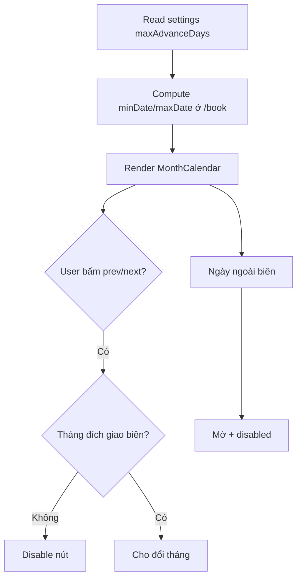

# I. Primer
## 1. TL;DR kiểu Feynman
- Admin đang đặt `maxAdvanceDays` ở `/admin/bookings/settings`, nhưng UI `/book` mới chỉ khóa ô ngày, chưa khóa điều hướng tháng nên user vẫn bấm đi xa rồi gặp trạng thái không đặt được.
- Ta sẽ khóa cả nút `Tháng trước/Tháng sau` theo biên `minDate/maxDate` để giảm click thừa và tránh cảm giác “app lỗi”.
- Ngày ngoài phạm vi vẫn hiển thị nhưng mờ + không click (đúng lựa chọn của anh).
- Không đổi backend/validation; chỉ tăng guard ở UI để đồng bộ với rule đã có ở Convex.

## 2. Elaboration & Self-Explanation
Hiện hệ thống đã có luật đúng ở server (`validateBookingDate` trong `convex/bookings.ts`) nên dữ liệu vẫn an toàn. Vấn đề nằm ở trải nghiệm: user vẫn điều hướng được sang tháng không còn ngày hợp lệ, sau đó thấy cả lịch gần như vô dụng. Cách sửa gọn nhất là đưa “biên hợp lệ” (hôm nay → hôm nay + `maxAdvanceDays`) vào component lịch và dùng biên này để:
- disable nút điều hướng tháng khi bấm sẽ vượt biên,
- giữ các ô ngày ngoài biên ở trạng thái disabled (mờ, không click).

Như vậy UI sẽ dẫn user đi đúng đường ngay từ đầu, giảm thao tác lặp và giảm lỗi thao tác.

## 3. Concrete Examples & Analogies
**Ví dụ bám task:** nếu hôm nay là 15/04 và `maxAdvanceDays = 3`, range hợp lệ là 15–18/04.
- Nút `Tháng trước`: disabled (vì toàn bộ tháng trước nằm ngoài `minDate`).
- Nút `Tháng sau`: disabled nếu tháng sau không chứa ngày nào trong 15–18/04.
- Các ô > 18/04 trong tháng hiện tại: mờ + không click.

**Analogy đời thường:** như thang máy chỉ cho bấm các tầng được cấp quyền; tầng không hợp lệ vẫn thấy trên bảng nhưng nút không bấm được, nên người dùng không mất công thử sai.

# II. Audit Summary (Tóm tắt kiểm tra)
- Observation:
  - `/admin/bookings/settings` có setting `maxAdvanceDays` (file: `app/admin/bookings/settings/page.tsx`).
  - `/book` đang truyền `minDate/maxDate` cho `MonthCalendar` (file: `app/(site)/book/page.tsx`) nên ô ngày đã có disabled theo range.
  - `MonthCalendar` chưa có logic disable nút `Tháng trước/Tháng sau`; luôn cho bấm đổi tháng (file: `components/shared/MonthCalendar.tsx`).
- Inference:
  - User vẫn đi tới tháng không khả dụng dù không chọn được ngày, gây click thừa và cảm giác lỗi.
- Decision:
  - Thêm guard ở `MonthCalendar` cho prev/next theo biên tháng, giữ disabled day như hiện tại.

# III. Root Cause & Counter-Hypothesis (Nguyên nhân gốc & Giả thuyết đối chứng)
**Root Cause Confidence: High** — vì đã xác nhận trực tiếp trong `MonthCalendar` là 2 nút month nav không có `disabled` theo `minDate/maxDate`.

## Trả lời 8 câu audit
1. Triệu chứng: User vẫn bấm sang tháng ngoài phạm vi đặt trước; expected là bị chặn sớm tại UI.
2. Phạm vi: trang public `/book`, component dùng lịch tháng.
3. Tái hiện: ổn định khi `maxAdvanceDays` nhỏ (1–7 ngày).
4. Mốc thay đổi gần nhất: chưa cần truy commit để kết luận; evidence từ code hiện tại đã đủ.
5. Dữ liệu thiếu: không thiếu cho fix UI này.
6. Giả thuyết thay thế: lỗi do backend không chặn — **đã loại trừ** vì `validateBookingDate` đã chặn.
7. Rủi ro fix sai nguyên nhân: có thể chỉ đổi visual mà không chặn nav; user vẫn click thừa.
8. Pass/fail: khi ngoài biên thì nav button disabled đúng, ngày ngoài biên mờ và không chọn được.

# IV. Proposal (Đề xuất)
- Thay đổi `MonthCalendar` để tính 2 cờ:
  - `canGoPrevMonth`: tháng trước có giao với `[minDate, maxDate]`.
  - `canGoNextMonth`: tháng sau có giao với `[minDate, maxDate]`.
- Gắn `disabled={!canGoPrevMonth}` và `disabled={!canGoNextMonth}` cho 2 nút điều hướng.
- Không thay đổi API backend; không đổi shape props hiện có nếu không cần.
- Giữ behavior ngày ngoài phạm vi: mờ + không click (đúng chọn của anh).

# V. Files Impacted (Tệp bị ảnh hưởng)
- **Sửa:** `components/shared/MonthCalendar.tsx`
  - Vai trò hiện tại: render lưới ngày + nav tháng.
  - Thay đổi: thêm tính toán biên và disable prev/next button khi vượt range.
- **Sửa nhẹ (nếu cần):** `app/(site)/book/page.tsx`
  - Vai trò hiện tại: cấp `minDate/maxDate` cho calendar.
  - Thay đổi: giữ nguyên logic chính; chỉ tinh chỉnh nhỏ nếu cần normalize mốc tháng để nav-disable chính xác.

# VI. Execution Preview (Xem trước thực thi)
1. Đọc `MonthCalendar` và thêm helper kiểm tra giao giữa tháng đích với `[minDate, maxDate]`.
2. Nối helper vào 2 nút nav, thêm `disabled` + class disabled theo pattern hiện có.
3. Rà static logic `minDate/maxDate` từ `/book` để đảm bảo không lệch timezone ở format `YYYY-MM-DD`.
4. Self-review: typing, null-safety, edge case range ngắn (1 ngày).

# VII. Verification Plan (Kế hoạch kiểm chứng)
- Static review (không chạy lint/unit test theo AGENTS).
- Manual repro checklist:
  - `maxAdvanceDays=1`: chỉ chọn được hôm nay+1; prev/next bị khóa đúng.
  - `maxAdvanceDays=14`: trong tháng hiện tại còn ngày hợp lệ thì nav hợp lý.
  - Đổi tháng về vùng không hợp lệ: không thể bấm nav sang tháng đó.
  - Ngày ngoài biên luôn mờ + không click.
- Type safety check trước commit: `bunx tsc --noEmit` (theo rule repo khi có đổi code TS).

# VIII. Todo
1. [x] Audit luồng settings và calendar hiện tại.
2. [x] Chốt UX với user: nav disable theo biên, ngày ngoài biên mờ + disable.
3. [ ] Implement `MonthCalendar` nav disable theo min/max.
4. [ ] Rà `book/page.tsx` để đảm bảo range feed vào calendar chính xác.
5. [ ] Self-review + typecheck + chuẩn bị commit.

# IX. Acceptance Criteria (Tiêu chí chấp nhận)
- Nút `Tháng trước/Tháng sau` disabled khi tháng đích không còn ngày nào trong `[minDate, maxDate]`.
- Ngày ngoài `[minDate, maxDate]` hiển thị mờ và không thể chọn.
- Không thay đổi behavior tạo booking ở backend.
- Không phát sinh regressions ở chọn dịch vụ, chọn slot, submit form.

# X. Risk / Rollback (Rủi ro / Hoàn tác)
- Rủi ro: tính sai biên tháng do xử lý date string/timezone có thể khóa nhầm nav.
- Giảm thiểu: dùng cùng chuẩn `YYYY-MM-DD` như hiện có, kiểm tra case đầu/tháng-cuối.
- Rollback: revert thay đổi tại `MonthCalendar.tsx` (và `book/page.tsx` nếu có).

# XI. Out of Scope (Ngoài phạm vi)
- Không đổi rule validate backend (`convex/bookings.ts`).
- Không redesign calendar UI/legend/slot panel.
- Không thêm setting mới trong admin.

