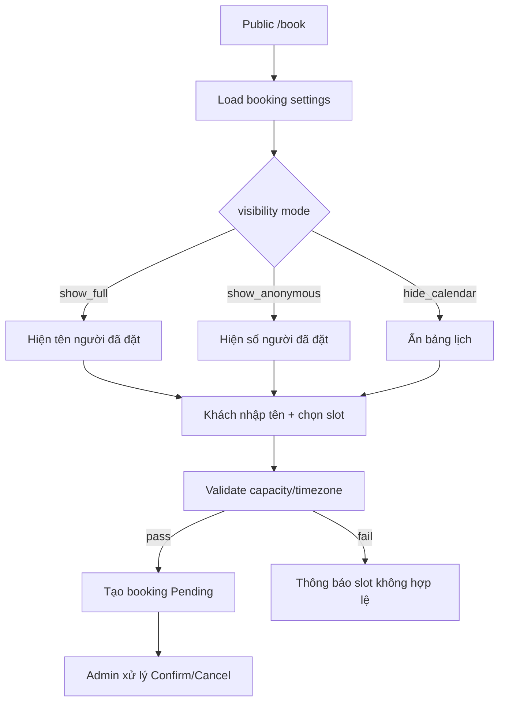
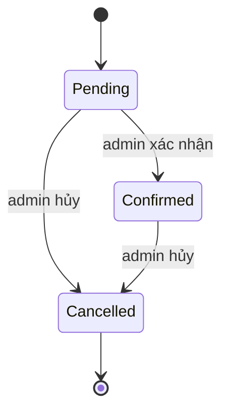

# I. Primer
## 1. TL;DR kiểu Feynman
- MVP sẽ làm **đặt lịch không cần login**, khách chỉ cần điền **tên** để đặt.
- Có route public `/book`, admin quản trị ở `/admin/bookings`, và cấu hình ở `/system/modules/bookings` + `/system/experiences/booking`.
- Public calendar có **3 mode hiển thị** đúng như bạn chốt: `show_full`, `show_anonymous`, `hide_calendar`.
- Core bám KISS: slot cố định + timezone + capacity theo dịch vụ + trạng thái `Pending/Confirmed/Cancelled`.
- Kiến trúc vẫn chừa đường mở rộng cho staff/location sau này mà không phá nền.

## 2. Elaboration & Self-Explanation
Mình sẽ tách rõ:
- **System**: nơi định nghĩa luật chơi (mở ngày nào, slot nào, sức chứa bao nhiêu, public thấy gì).
- **Admin**: nơi xử lý booking thật (xem danh sách, xác nhận/hủy).
- **Public**: nơi khách thao tác cực đơn giản (chọn lịch và nhập tên).

Điểm mới quan trọng theo yêu cầu của bạn:
1) Không cần account/login cho khách.  
2) Calendar public có 3 mức riêng để bạn chủ động giữa minh bạch và riêng tư.

## 3. Concrete Examples & Analogies
- **Mode 1 - show_full**: slot 10:00 hiển thị “An, Bình đã đặt”.
- **Mode 2 - show_anonymous**: slot 10:00 hiển thị “Đã có 2 người đặt”, không lộ danh tính.
- **Mode 3 - hide_calendar**: không hiển thị bảng slot availability cho public (ẩn hẳn UI đó).
- **Analogy**: như phòng chờ spa có bảng điện tử: có nơi hiện tên, có nơi chỉ hiện số người, có nơi tắt bảng hoàn toàn.

# II. Audit Summary (Tóm tắt kiểm tra)
## 1. Observation (Quan sát)
- Repo đã có sẵn khung module runtime (`lib/modules/configs/*`, `ModuleConfigPage.tsx`) và khung experience (`app/system/experiences/*`).
- Chưa có domain booking riêng trong schema/routes.
- User chốt thêm yêu cầu mới: **không login**, chỉ cần tên; và **3 mode visibility** công khai.

## 2. Inference (Suy luận)
- Triển khai nhanh nhất, ít rủi ro nhất là bám framework module/experience hiện có.
- Cần encode visibility mode ở settings để public UI và query cùng đọc chung một source-of-truth.

## 3. Decision (Quyết định)
- Chọn `bookings` làm module key.
- Chốt MVP privacy mode gồm đúng 3 giá trị riêng biệt.

# III. Root Cause & Counter-Hypothesis (Nguyên nhân gốc & Giả thuyết đối chứng)
## 1. Root Cause Analysis
1) Triệu chứng: chưa có booking surface end-to-end trong hệ thống.  
2) Phạm vi: Convex schema/functions + System + Admin + Site route.  
3) Tái hiện: ổn định (không có route `/book`, không có bảng bookings).  
4) Mốc thay đổi gần: codebase đã chuẩn hóa module/experience nhưng chưa có booking module.  
5) Dữ liệu thiếu: không đáng kể, vì behavior đã chốt rõ.  
6) Giả thuyết thay thế: tái dùng `calendarTasks`; không phù hợp do semantics khác.  
7) Rủi ro fix sai nguyên nhân: UI xong nhưng không có engine capacity/slot sẽ phải đập lại.  
8) Tiêu chí pass/fail: đặt được lịch no-login + admin xử lý trạng thái + visibility mode chạy đúng.

## 2. Counter-Hypothesis
- “Chỉ làm form submit, không làm visibility mode ở settings”: sai vì không đáp ứng nhu cầu cơ động/public privacy mà bạn yêu cầu trực tiếp.

## 3. Root Cause Confidence
- **High** — evidence trực tiếp từ codebase và yêu cầu đã clarified.

# IV. Proposal (Đề xuất)
## 1. Product Scope MVP
- Route public: `/book`.
- Input bắt buộc cho khách: `customerName` (không login).
- Trạng thái booking: `Pending | Confirmed | Cancelled`.
- Slot engine: fixed interval + timezone + capacity theo service.
- Visibility mode:
  - `show_full`: hiện danh tính người đặt.
  - `show_anonymous`: hiện đã có người đặt nhưng ẩn danh.
  - `hide_calendar`: ẩn UI lịch/số lượng trên public.

## 2. Data Model
- `bookingServices`: dịch vụ đặt lịch (title, durationMin, slotIntervalMin, capacityPerSlot, active).
- `bookings`: record đặt lịch (serviceId, customerName, bookingDate, slotTime, timezone, status, note?).
- `moduleSettings` cho `bookings`:
  - `timezoneDefault`
  - `bookingWeekdays`
  - `maxAdvanceDays`
  - `visibilityMode` (`show_full` | `show_anonymous` | `hide_calendar`)

## 3. UX Rules
- Copy cực ngắn, rõ (KISS).
- Legend màu thống nhất: còn chỗ / đầy / đã có người đặt.
- Khi mode `hide_calendar`: thay bằng thông điệp ngắn + CTA đặt lịch (không render bảng availability).

# V. Files Impacted (Tệp bị ảnh hưởng)
## 1. Sửa:
- `convex/schema.ts`  
Vai trò hiện tại: schema toàn hệ thống.  
Thay đổi: thêm `bookingServices`, `bookings` và index cho date/slot/status/service.

- `lib/modules/configs/index.ts`  
Vai trò hiện tại: registry module configs.  
Thay đổi: đăng ký module `bookings`.

- `app/system/experiences/_constants.ts`  
Vai trò hiện tại: danh sách experience cards.  
Thay đổi: thêm card “Đặt lịch”.

- `lib/experiences/useSiteConfig.ts`  
Vai trò hiện tại: parse site config cho các experience.  
Thay đổi: thêm parse key `booking_ui`/booking settings cần cho `/book`.

## 2. Thêm:
- `convex/bookings.ts`  
Vai trò hiện tại: chưa có.  
Thay đổi: availability query, create booking no-login, admin list/update status.

- `lib/modules/configs/bookings.config.ts`  
Vai trò hiện tại: chưa có.  
Thay đổi: module runtime config cho bookings.

- `app/system/modules/bookings/page.tsx`  
Vai trò hiện tại: chưa có.  
Thay đổi: trang cấu hình system module bookings.

- `app/system/experiences/booking/page.tsx`  
Vai trò hiện tại: chưa có.  
Thay đổi: trang experience editor cho booking UI.

- `app/admin/bookings/page.tsx`  
Vai trò hiện tại: chưa có.  
Thay đổi: list admin + filter + action đổi trạng thái.

- `app/admin/bookings/[id]/edit/page.tsx` (nếu theo pattern repo cần detail page)  
Vai trò hiện tại: chưa có.  
Thay đổi: xem chi tiết record + chỉnh status.

- `app/(site)/book/page.tsx`  
Vai trò hiện tại: chưa có.  
Thay đổi: public booking form + calendar/slot theo visibility mode.

# VI. Execution Preview (Xem trước thực thi)
1. Tạo schema + Convex functions cho booking engine (read/write/validate).
2. Đăng ký module runtime `bookings` và tạo page `/system/modules/bookings`.
3. Dựng experience `/system/experiences/booking` + wiring config.
4. Dựng `/admin/bookings` để vận hành.
5. Dựng `/book` theo no-login + 3 visibility modes.
6. Rà static typing + edge-cases timezone/capacity.

# VII. Verification Plan (Kế hoạch kiểm chứng)
- Case 1: khách không login, nhập tên, đặt slot còn chỗ => tạo `Pending` thành công.
- Case 2: slot vượt capacity => chặn đúng.
- Case 3: admin đổi `Pending -> Confirmed/Cancelled` thành công.
- Case 4: đổi lần lượt 3 visibility modes ở system => `/book` phản ánh đúng từng mode.
- Case 5: đảm bảo query không fetch-all để lọc JS; dùng index theo date/slot/status.
- Khi code đã đổi: chạy `bunx tsc --noEmit` trước commit (theo rule repo).

# VIII. Todo
1. Tạo booking schema + indexes.
2. Viết Convex functions cho create/list/update/check availability.
3. Thêm module config `bookings` và page system module.
4. Thêm experience booking + constants wiring.
5. Tạo admin bookings list/detail.
6. Tạo public `/book` (no-login, name-only).
7. Cài logic 3 visibility modes.
8. Static review + `bunx tsc --noEmit` + commit.

# IX. Acceptance Criteria (Tiêu chí chấp nhận)
- Khách đặt lịch được tại `/book` mà không cần login, chỉ cần tên.
- Admin thấy đầy đủ booking records ở `/admin/bookings` và xử lý trạng thái được.
- System cấu hình được `show_full/show_anonymous/hide_calendar` và public phản ánh tức thời.
- Rule slot/capacity/timezone hoạt động ổn định cho MVP spa.
- Cấu trúc đủ sạch để mở rộng phase sau (staff/location/notify) không cần rewrite core.

# X. Risk / Rollback (Rủi ro / Hoàn tác)
- Rủi ro timezone làm lệch ngày/slot tại biên ngày.
- Giảm thiểu: normalize server-side, tách `bookingDate` và `slotTime`, validate nhất quán.
- Rollback: commit theo lớp (schema, server, system, admin, public) để revert từng phần.

# XI. Out of Scope (Ngoài phạm vi)
- Login khách hàng.
- Email/SMS notifications.
- Thanh toán/deposit booking.
- Staff shift phức tạp, multi-location, calendar sync ngoài hệ thống.