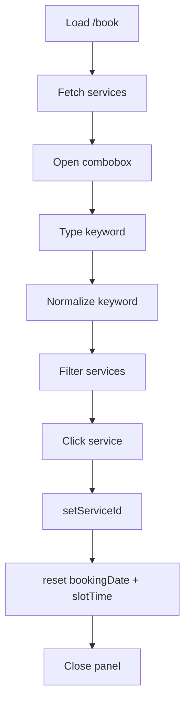

# I. Primer
## 1. TL;DR kiểu Feynman
- Trang `/book` đang dùng thẻ `<select>` nên khó tìm nhanh khi danh sách dịch vụ dài.
- Mình sẽ đổi thành combobox có ô tìm kiếm, gõ **có dấu hoặc không dấu** đều tìm được.
- Khi chọn 1 dịch vụ, danh sách sẽ **đóng ngay** (theo yêu cầu bạn xác nhận).
- Logic hiện có (reset ngày/slot khi đổi dịch vụ, gọi Convex query theo `serviceId`) sẽ giữ nguyên.
- Chỉ sửa nhỏ ở UI trang `/book`, không đổi schema, không đổi API Convex.

## 2. Elaboration & Self-Explanation
Hiện tại input chọn dịch vụ là dropdown cơ bản nên người dùng phải cuộn nhiều nếu có nhiều dịch vụ. Nhu cầu “nâng cấp thành combobox” nghĩa là thay bằng một nút/ô chọn có panel xổ xuống, bên trong có input để lọc nhanh. 

Về dữ liệu, `/book` đã có `services = useQuery(api.bookings.listBookableServices, {})`, nên không cần thêm endpoint mới. Việc mình làm chủ yếu là thay lớp hiển thị (presentation layer):
- thêm state mở/đóng combobox,
- thêm state từ khóa tìm,
- tạo hàm normalize text để so khớp không dấu,
- render danh sách lọc,
- chọn item thì set `serviceId`, reset `bookingDate`/`slotTime`, rồi đóng panel.

Tất cả phần này nằm trong `app/(site)/book/page.tsx`, không lan sang module khác.

## 3. Concrete Examples & Analogies
Ví dụ cụ thể trong repo:
- Dịch vụ có tên `Gội đầu thư giãn`.
- Người dùng gõ `goi dau` (không dấu) trong combobox.
- Hàm normalize sẽ chuyển cả keyword và title về dạng không dấu lowercase để match, kết quả vẫn tìm thấy đúng dịch vụ.

Analogy đời thường:
- Dropdown hiện tại giống lật danh bạ giấy từng trang.
- Combobox giống gõ tên vào ô tìm kiếm danh bạ điện thoại: nhanh hơn nhiều khi danh sách dài.

# II. Audit Summary (Tóm tắt kiểm tra)
- Observation:
  - Route cần sửa: `app/(site)/book/page.tsx`.
  - Dropdown hiện tại dùng `<select>` trong block `bookingConfig.showServiceSelect`.
  - Dữ liệu dịch vụ lấy từ `api.bookings.listBookableServices`.
  - Khi đổi dịch vụ đang reset `slotTime` + `bookingDate` (hành vi cần giữ).
- Inference:
  - Không có primitive combobox dùng chung sẵn cho site-booking; cần dựng combobox inline tối thiểu theo pattern custom đang có trong repo.
- Decision:
  - Chỉ refactor UI chọn dịch vụ tại `/book`, không chạm Convex function.

# III. Root Cause & Counter-Hypothesis (Nguyên nhân gốc & Giả thuyết đối chứng)
- Root Cause Confidence: **High**
- Nguyên nhân gốc:
  1) Triệu chứng: dropdown khó dùng khi cần tìm nhanh dịch vụ (expected: search nhanh, actual: cuộn/chọn thủ công).
  2) Phạm vi: user-facing booking page `/book`.
  3) Tái hiện: ổn định, mở trang là thấy control `<select>` không có search.
  4) Mốc gần nhất: hiện implementation chỉ có `<select>` truyền thống.
  5) Data thiếu: không có (yêu cầu đã rõ).
  6) Counter-hypothesis: vấn đề do backend trả quá nhiều dịch vụ -> loại trừ vì yêu cầu là nâng cấp interaction control, không phải giảm dataset.
  7) Rủi ro fix sai: UX vẫn chậm, có thể làm regress reset state nếu xử lý chọn sai.
  8) Pass/fail: gõ không dấu tìm được dịch vụ có dấu; chọn item đóng panel; form hoạt động như cũ.

# IV. Proposal (Đề xuất)
- Option A (Recommend) — Confidence 90%
  - Sửa trực tiếp `app/(site)/book/page.tsx`, tạo combobox inline local state.
  - Ưu: thay đổi nhỏ nhất, rollback dễ, không tạo coupling mới.
  - Tradeoff: logic combobox chưa tái sử dụng ở nơi khác.
- Option B — Confidence 65%
  - Tách combobox thành component dùng chung (ví dụ `components/site/ServiceCombobox.tsx`).
  - Ưu: tái dùng sau này.
  - Tradeoff: scope lớn hơn yêu cầu hiện tại, nhiều file hơn.

Chọn triển khai theo Option A để bám đúng yêu cầu “nâng cấp dropdown ở `/book`”.

# V. Files Impacted (Tệp bị ảnh hưởng)
- Sửa: `app/(site)/book/page.tsx`
  - Vai trò hiện tại: trang booking public, chứa toàn bộ form đặt lịch và chọn dịch vụ/ngày/slot.
  - Thay đổi: thay block `<select>` bằng combobox searchable (không dấu), thêm state + normalize util + UI panel chọn.

# VI. Execution Preview (Xem trước thực thi)
1. Đọc lại block service selector hiện có trong `/book/page.tsx`.
2. Thêm state combobox (`isServiceOpen`, `serviceQuery`) và helper normalize tiếng Việt không dấu.
3. Thay JSX `<select>` thành button + panel + input tìm kiếm + danh sách lọc.
4. Wire `onSelect` để giữ đúng behavior reset `bookingDate`/`slotTime` như cũ và đóng panel ngay.
5. Static self-review: typing, null-safety, điều kiện rỗng, focus/keyboard cơ bản.
6. Commit thay đổi (không push) theo rule repo.

# VII. Verification Plan (Kế hoạch kiểm chứng)
- Do rule project cấm tự chạy lint/unit test, mình sẽ verify bằng static review + checklist hành vi:
  - Có hiển thị placeholder “Chọn dịch vụ” khi chưa chọn.
  - Gõ `goi dau` tìm được dịch vụ kiểu `Gội đầu...`.
  - Chọn dịch vụ => panel đóng ngay.
  - Khi đổi dịch vụ => `bookingDate` và `slotTime` reset như trước.
  - Không ảnh hưởng logic query availability/monthOverview (vẫn phụ thuộc `serviceId`).

# VIII. Todo
- [ ] Refactor service selector từ `<select>` sang combobox trong `/book/page.tsx`.
- [ ] Thêm filter không dấu cho keyword dịch vụ.
- [ ] Giữ nguyên behavior reset date/slot khi đổi dịch vụ.
- [ ] Self-review static + commit.

# IX. Acceptance Criteria (Tiêu chí chấp nhận)
- `/book` không còn dùng dropdown `<select>` cho dịch vụ.
- Combobox cho phép tìm theo tên có dấu và không dấu.
- Chọn dịch vụ xong dropdown đóng ngay.
- Form booking không regress: chọn dịch vụ mới vẫn reset ngày/slot, submit flow giữ nguyên.

# X. Risk / Rollback (Rủi ro / Hoàn tác)
- Rủi ro:
  - Click outside/keyboard handling chưa đầy đủ có thể làm UX kém.
  - Nếu wiring sai có thể không reset `bookingDate`/`slotTime` đúng lúc.
- Rollback:
  - Revert riêng thay đổi trong `app/(site)/book/page.tsx` về block `<select>` cũ.

# XI. Out of Scope (Ngoài phạm vi)
- Không đổi Convex schema/query/mutation.
- Không thêm component dùng chung mới cho toàn hệ thống.
- Không chỉnh các trang admin/system bookings.

# XII. Open Questions (Câu hỏi mở)
- Không còn ambiguity sau khi bạn đã chốt:
  - chọn xong đóng ngay,
  - filter theo tên + không dấu.