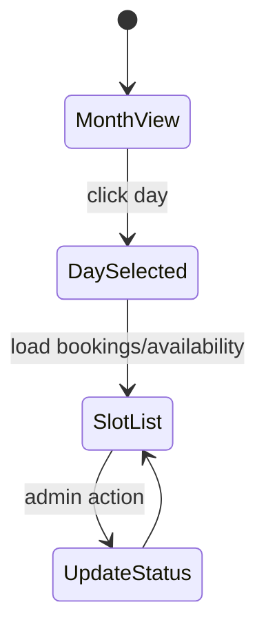

# I. Primer
## 1. TL;DR kiểu Feynman
- Mình sẽ bỏ toàn bộ setting booking khỏi `/system/modules/bookings` như bạn yêu cầu.
- Thêm menu con mới trong nhóm Dịch vụ: **Cài đặt lịch** → route `/admin/bookings/settings`.
- Chuyển toàn bộ cấu hình booking (visibility/maxAdvance/openDays/...) sang trang admin settings này.
- Xóa “Cấu hình đặt lịch” khỏi create/edit dịch vụ; dịch vụ chỉ còn thông tin dịch vụ.
- Refactor `/admin/bookings` và `/book` sang UI **Month calendar + chọn ngày + slot list** cho mượt và dễ dùng hơn.

## 2. Elaboration & Self-Explanation
Hiện tại cấu hình booking đang bị rải ở 3 nơi:
1) `/system/modules/bookings` (module settings),
2) `/admin/services/create|edit` (booking fields theo từng service),
3) `/admin/bookings` (list vận hành).

Bạn muốn tập trung quyền cấu hình về đúng “nơi admin thao tác lịch” và giao diện phải êm hơn. Vì vậy mình sẽ gom cấu hình vào **một điểm duy nhất**: `/admin/bookings/settings`, đồng thời đổi UI lịch thành kiểu lịch tháng ở cả admin/public để đồng nhất trải nghiệm.

## 3. Concrete Examples & Analogies
- Trước: muốn chỉnh đặt lịch phải vào system module + service + bookings → bị phân mảnh.
- Sau: admin chỉ cần vào `/admin/bookings/settings` để chỉnh chính sách, rồi vào `/admin/bookings` để vận hành.
- Analogy: trước giống cài điều hòa ở 3 cái remote khác nhau; sau gom về 1 remote chính.

# II. Audit Summary (Tóm tắt kiểm tra)
## 1. Observation (Quan sát)
- `app/system/modules/bookings/page.tsx` hiện custom form settings cho timezone/open-close/open-day/visibility.
- `app/admin/components/Sidebar.tsx` đã có mục “Đặt lịch” dưới nhóm Dịch vụ, chưa có “Cài đặt lịch”.
- `app/admin/services/create|edit` đang có card “Cấu hình đặt lịch”.
- `app/admin/bookings/page.tsx` hiện dạng table/list, chưa phải month calendar.
- `app/(site)/book/page.tsx` hiện form + grid slot, chưa có calendar month UX.

## 2. Inference (Suy luận)
- Nên tách rõ 2 lớp: 
  - **Operational view**: `/admin/bookings` (lịch hẹn theo ngày/slot).
  - **Policy/config view**: `/admin/bookings/settings`.
- Để không phá data model, giữ `moduleSettings(moduleKey='bookings')` làm source of truth, chỉ đổi surface quản trị.

## 3. Decision (Quyết định)
- Khóa scope đúng yêu cầu: bỏ settings booking khỏi system, chuyển sang admin settings, bỏ booking config khỏi service create/edit.
- UI lịch chốt kiểu: **Month calendar + day slot list** (theo xác nhận của bạn).

# III. Root Cause & Counter-Hypothesis (Nguyên nhân gốc & Giả thuyết đối chứng)
## 1. Root Cause Analysis
1) Triệu chứng: UX hiện tại “không êm”, cấu hình phân tán, khó vận hành.
2) Phạm vi: system module page, admin sidebar, admin bookings pages, public book page, service forms.
3) Tái hiện: ổn định (đọc trực tiếp các file).
4) Mốc thay đổi gần: booking MVP vừa thêm nhanh nên đang đặt config ở nhiều lớp.
5) Data thiếu: không thiếu đáng kể, route settings đã chốt.
6) Giả thuyết thay thế: giữ nguyên system page chỉ đổi UI lịch; không giải quyết triệt để việc phân tán cấu hình.
7) Rủi ro fix sai nguyên nhân: đổi UI nhưng admin vẫn phải chỉnh nhiều chỗ, friction giữ nguyên.
8) Tiêu chí pass/fail: admin chỉ cấu hình tại `/admin/bookings/settings`, service page sạch, lịch tháng hoạt động ở admin/public.

## 2. Counter-Hypothesis
- “Giữ system modules làm nơi config chính rồi link sang admin”: không phù hợp yêu cầu explicit là bỏ khỏi system/modules/bookings.

## 3. Root Cause Confidence
- **High** — yêu cầu user rõ + evidence code hiện trạng.

```mermaid
flowchart TD
  A[Admin Sidebar: Dịch vụ] --> B[/admin/bookings]
  A --> C[/admin/bookings/settings]
  C --> D[moduleSettings: bookings]
  D --> E[/book public]
  D --> B
```

# IV. Proposal (Đề xuất)
## 1. Thay đổi chức năng
- **Bỏ ở System**: `/system/modules/bookings` không còn booking policy fields (giữ module on/off ở list modules tổng).
- **Thêm ở Admin**: `/admin/bookings/settings` với các setting booking.
- **Sidebar**: trong nhóm Dịch vụ thêm mục **Cài đặt lịch** trỏ tới `/admin/bookings/settings`.
- **Service create/edit**: xóa toàn bộ card “Cấu hình đặt lịch”.
- **Admin bookings**: đổi từ table-first sang calendar-first (month view + panel slot/day).
- **Public /book**: UI lịch tháng + chọn ngày + danh sách slot còn chỗ.

## 2. Cấu hình giữ/lược bỏ theo yêu cầu
- Bỏ khỏi UI settings:
  - Giờ mở cửa/đóng cửa
  - Mở cửa Thứ 2…Chủ nhật
  - Hiển thị công khai
  - Số ngày đặt trước tối đa
- Giữ cấu hình tối thiểu thực dụng tại admin settings:
  - timezoneDefault
  - bookingsPerPage (cho admin list fallback)
- Vì backend hiện còn dùng `maxAdvanceDays/visibilityMode/openDays`, mình sẽ chuyển chúng sang **defaults cố định trong code** để không cần UI config nữa (KISS).

## 3. UX lịch (admin/public)
- Header tháng + prev/next.
- Grid ngày trong tháng, highlight ngày chọn + badge số booking.
- Cột phải (hoặc panel dưới mobile): danh sách slot ngày chọn.
- Hành động nhanh ở admin: Confirm/Cancel ngay trên slot/day list.



# V. Files Impacted (Tệp bị ảnh hưởng)
## 1. Sửa:
- `app/system/modules/bookings/page.tsx`  
Vai trò hiện tại: custom settings UI cho booking trong system.  
Thay đổi: rút gọn/loại bỏ settings UI để không còn quản trị policy ở đây.

- `app/admin/components/Sidebar.tsx`  
Vai trò hiện tại: điều hướng admin.  
Thay đổi: thêm sub-item `Cài đặt lịch` dưới nhóm Dịch vụ.

- `app/admin/services/create/page.tsx`  
Vai trò hiện tại: có card booking config per-service.  
Thay đổi: bỏ card “Cấu hình đặt lịch”.

- `app/admin/services/[id]/edit/page.tsx`  
Vai trò hiện tại: có card booking config per-service.  
Thay đổi: bỏ card “Cấu hình đặt lịch”.

- `app/admin/bookings/page.tsx`  
Vai trò hiện tại: bảng list lịch hẹn.  
Thay đổi: chuyển sang month calendar + slot/day list.

- `app/(site)/book/page.tsx`  
Vai trò hiện tại: form + slot grid cơ bản.  
Thay đổi: month calendar + chọn ngày + slot list UX mềm hơn.

- `convex/bookings.ts`  
Vai trò hiện tại: logic availability/create phụ thuộc settings mở rộng.  
Thay đổi: fallback cố định cho các setting đã bỏ khỏi UI, tránh vỡ behavior.

- `lib/modules/configs/bookings.config.ts`  
Vai trò hiện tại: khai báo nhiều settings booking.  
Thay đổi: chỉ giữ settings cần thiết cho admin settings page mới.

## 2. Thêm:
- `app/admin/bookings/settings/page.tsx`  
Vai trò hiện tại: chưa có.  
Thay đổi: trang cấu hình tập trung “Cài đặt lịch”.

# VI. Execution Preview (Xem trước thực thi)
1. Tạo route `/admin/bookings/settings` và chuyển toàn bộ settings UI sang đó.
2. Thêm mục sidebar “Cài đặt lịch” dưới Dịch vụ.
3. Gỡ booking config khỏi service create/edit.
4. Refactor admin bookings thành calendar month view.
5. Refactor public `/book` theo month calendar + slot list.
6. Đồng bộ backend fallback cho settings đã bỏ.
7. Static review + `bunx tsc --noEmit` + commit.

# VII. Verification Plan (Kế hoạch kiểm chứng)
- `/system/modules/bookings`: không còn các field bạn yêu cầu bỏ.
- Sidebar admin: thấy `Dịch vụ > Cài đặt lịch` và route vào được.
- `/admin/services/create|edit`: không còn card booking config.
- `/admin/bookings`: có month calendar, chọn ngày ra slot/day list.
- `/book`: month calendar và slot list hoạt động đặt lịch bình thường.
- `bunx tsc --noEmit` pass.

# VIII. Todo
1. Chuyển settings booking từ system sang `/admin/bookings/settings`.
2. Cập nhật sidebar thêm “Cài đặt lịch”.
3. Bỏ booking config khỏi create/edit service.
4. Làm lại UI `/admin/bookings` theo month calendar.
5. Làm lại UI `/book` theo month calendar.
6. Điều chỉnh fallback backend cho settings bị loại khỏi UI.
7. Typecheck + commit.

# IX. Acceptance Criteria (Tiêu chí chấp nhận)
- Đúng yêu cầu bỏ các field ở `/system/modules/bookings`.
- Có trang `/admin/bookings/settings` và dùng được để admin cấu hình.
- Sidebar nhóm Dịch vụ hiển thị mục “Cài đặt lịch”.
- Service create/edit không còn cấu hình booking.
- `/admin/bookings` và `/book` có UX cuốn lịch tháng + chọn ngày + slot list.

# X. Risk / Rollback (Rủi ro / Hoàn tác)
- Rủi ro: đổi UX lớn ở 2 trang có thể phát sinh edge-case responsive.
- Giảm thiểu: làm từng bước, giữ API cũ, chỉ đổi surface trước.
- Rollback: commit theo lớp (sidebar/settings/service/admin-bookings/public-book) để revert cục bộ.

# XI. Out of Scope (Ngoài phạm vi)
- Tích hợp thư viện calendar bên thứ ba.
- Reminder/email/SMS.
- Đổi state machine booking ngoài Pending/Confirmed/Cancelled.