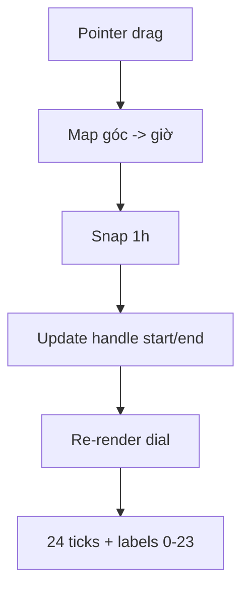

# I. Primer
## 1. TL;DR kiểu Feynman
- Mình sẽ tinh chỉnh `OperatingHoursDial` thành mặt đồng hồ rõ ràng hơn để vuốt dễ: **24 vạch giờ** + **label 0–23 quanh vòng**.
- Giữ nguyên hành vi business hiện tại: kéo và **snap theo 1 giờ**.
- Không đổi schema, không đổi Convex logic; chỉ cải thiện khả dụng UI cho thao tác kéo.

## 2. Elaboration & Self-Explanation
- Vấn đề bạn nêu là “kéo chưa trực quan”, nên phần cần sửa là phần hiển thị/điểm bám thị giác của dial.
- Khi có vạch + số quanh vòng, người dùng định vị điểm giờ nhanh hơn và giảm kéo lệch.
- Vì rule dữ liệu vẫn theo giờ nguyên (0–23), snap 1 giờ là khớp nhất và không phát sinh migration/logic mới.

## 3. Concrete Examples & Analogies
- Ví dụ: muốn kéo từ `23 -> 01`, người dùng bám trực tiếp vào số “23” và “1” trên vòng thay vì ước lượng góc.
- Analogy: giống chỉnh đồng hồ cơ có khắc số và vạch phút — có mốc thì xoay chính xác hơn.

# II. Audit Summary (Tóm tắt kiểm tra)
- Yêu cầu mới chỉ tập trung UI dial: cần “dạng đồng hồ có vạch để vuốt dễ nhìn hơn”.
- Bạn đã chốt chi tiết:
  - 24 vạch giờ
  - Hiện đủ số 0–23
  - Snap theo 1 giờ

# III. Root Cause & Counter-Hypothesis (Nguyên nhân gốc & Giả thuyết đối chứng)
- Root cause: dial hiện tại chưa tối ưu visual anchors (mốc nhìn) cho thao tác kéo nhanh/chính xác.
- Counter-hypothesis: chỉ tăng kích thước tay nắm là đủ → không tối ưu bằng vì vẫn thiếu mốc định hướng quanh vòng.
- Root Cause Confidence: **High** (fit trực tiếp với phản hồi UX của bạn).

# IV. Proposal (Đề xuất)
1) Tinh chỉnh mặt đồng hồ trong `OperatingHoursDial`:
- Vẽ **24 tick marks** phân bố đều quanh vòng.
- Tick major rõ hơn ở các mốc `0, 6, 12, 18` (đậm/dài hơn).
- Render **label số 0–23** nằm trên vòng label riêng (bán kính lớn hơn vòng tick).

2) Tinh chỉnh thao tác kéo:
- Giữ `snapHour = 1h`.
- Tăng vùng hit cho handle (visual + pointer target) để kéo dễ hơn.
- Khi đang drag, tô nổi nhẹ handle active để feedback rõ.

3) Giữ nguyên contract hiện tại:
- `onChange({ startHour, endHour })` không đổi.
- Không đổi validate/save logic và không đụng Convex.

# V. Files Impacted (Tệp bị ảnh hưởng)
- **Sửa:** `app/admin/bookings/settings/_components/OperatingHoursDial.tsx`
  - Vai trò hiện tại: dial chọn giờ mở/đóng.
  - Thay đổi: bổ sung tick 24 giờ, label 0–23, cải thiện feedback kéo/hit-area.
- **Không đổi:** `app/admin/bookings/settings/page.tsx`, `convex/bookings.ts`.

# VI. Execution Preview (Xem trước thực thi)
1. Chỉnh hàm tính toạ độ tick/label theo bán kính riêng.
2. Render 24 tick và labels 0–23.
3. Tăng usability của handle (active state + vùng kéo).
4. Rà lại alignment dark/light mode.

# VII. Verification Plan (Kế hoạch kiểm chứng)
- Manual UI check tại `/admin/bookings/settings` (desktop):
  - Nhìn rõ 24 vạch + số 0–23.
  - Kéo handle bám mốc giờ dễ hơn.
  - Snap đúng giờ nguyên, không nhảy sai.
- Regression:
  - Summary mở/đóng/tổng giờ vẫn đúng.
  - Case qua ngày `23 -> 1` vẫn hiển thị và lưu như cũ.
- Theo rule repo: verify thủ công + review tĩnh, không mở rộng scope.

# VIII. Todo
1. Cập nhật render dial thành clock-style có 24 ticks.
2. Thêm labels 0–23 quanh vòng.
3. Tinh chỉnh handle drag feedback/hit area.
4. Verify thủ công trải nghiệm kéo và regression cơ bản.

# IX. Acceptance Criteria (Tiêu chí chấp nhận)
- Dial hiển thị đúng **24 vạch giờ**.
- Dial hiển thị đủ **số 0–23** quanh vòng.
- Kéo handle dễ bám mốc hơn và vẫn **snap theo 1 giờ**.
- Không làm đổi logic lưu/validate hiện tại.

# X. Risk / Rollback (Rủi ro / Hoàn tác)
- Rủi ro: chữ số dày trên màn nhỏ nếu áp dụng nhầm breakpoint desktop/mobile.
- Rollback: revert riêng `OperatingHoursDial.tsx` về bản trước.

# XI. Out of Scope (Ngoài phạm vi)
- Không thêm đơn vị 30 phút.
- Không đổi mobile slider.
- Không đổi Convex/public booking logic.

# XII. Open Questions (Câu hỏi mở)
- Không còn ambiguity sau khi bạn đã chốt 3 lựa chọn UI ở trên.