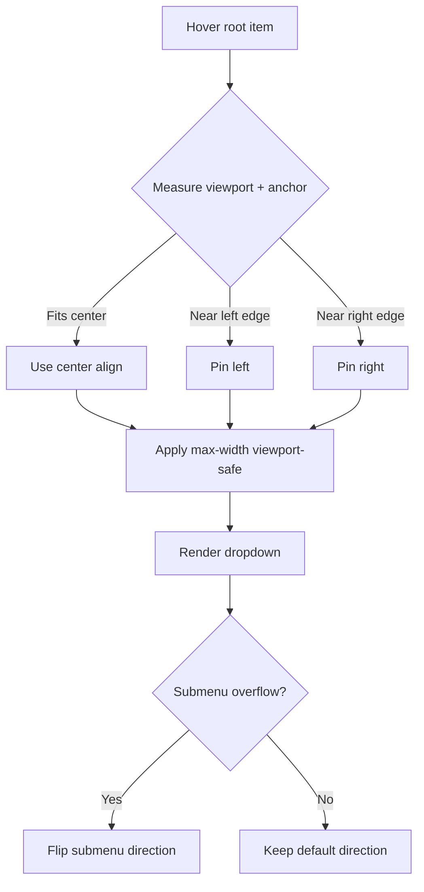

# I. Primer
## 1. TL;DR kiểu Feynman
- Hiện tại menu desktop bật từ `lg` (tablet lớn đã dùng desktop menu), nhưng dropdown đang canh giữa và có width cố định lớn nên dễ tràn mép màn hình.
- Một nhánh còn dùng `overflow-x-clip`, làm submenu con mở sang phải bị cắt.
- Em sẽ giữ **desktop hover menu trên tablet** như anh chọn, nhưng thêm cơ chế “viewport-safe” để dropdown luôn nằm trong màn hình.
- Mega menu sẽ bị giới hạn theo viewport + cho scroll dọc khi nội dung dài (đúng ưu tiên “không bị cắt số 1”).
- Mục tiêu: tablet không bao giờ bị cắt menu theo chiều ngang trong mọi style header đang có.

## 2. Elaboration & Self-Explanation
- Vấn đề cốt lõi không phải do dữ liệu menu, mà do cách đặt vị trí popup: `left-1/2 -translate-x-1/2` + width lớn (`620/820/960`, `720`) khiến popup có thể lệch ra khỏi viewport khi item nằm gần biên trái/phải.
- Ngoài ra, trong nhánh topbar có `overflow-x-clip`; khi submenu dùng `left-full` để bung ngang, phần tràn ra bị cắt.
- Vì anh muốn giữ desktop hover menu trên tablet, hướng tối ưu là không đổi UX chính, chỉ thay cơ chế tính vị trí + ràng buộc kích thước để dropdown luôn an toàn viewport.
- Em ưu tiên patch nhỏ, dễ rollback: thêm logic tính class/inline style theo không gian khả dụng, không đụng schema/data/Convex.

## 3. Concrete Examples & Analogies
- Ví dụ thực tế với item “Liên kết mới”: ở tablet 1024px, dropdown mega 820px canh giữa item gần mép phải sẽ tràn ra ngoài => bị cắt/khó thao tác.
- Sau fix: hệ thống đo biên viewport, tự chuyển anchor sang `right-0` hoặc kẹp max-width `calc(100vw - 16px)` => menu luôn nằm trọn màn hình.
- Analogy: như đặt một tấm bảng lớn trong khung cửa; thay vì đóng đinh cố định ở giữa, ta trượt bảng qua trái/phải vừa đủ để không đụng khung.

# II. Audit Summary (Tóm tắt kiểm tra)
- Observation 1: Desktop nav bật từ `lg`, nên tablet lớn chịu layout desktop (`hidden lg:flex`, `lg:hidden`) trong `components/site/Header.tsx` (line ~887, 1620, 649, 1176...).
- Observation 2: Dropdown dùng `absolute top-full left-1/2 -translate-x-1/2` ở nhiều nhánh (line ~919, 1427) => dễ overflow hai mép.
- Observation 3: Mega menu width cố định lớn qua `getMegaMenuWidthClass` (`620/820/960`) và nhánh allbirds `w-[720px]` (line ~668, 1626).
- Observation 4: Có `overflow-x-clip` trong wrapper mega menu topbar (line ~1430) trong khi submenu dùng `left-full` => nguy cơ cắt submenu.
- Observation 5: `SiteShell` đặt `<Header/>` ngoài `<main overflow-x-hidden>`, nên nguyên nhân chính nằm ở positioning/width của chính Header, không phải main wrapper (`components/site/SiteShell.tsx` line ~19,21).

# III. Root Cause & Counter-Hypothesis (Nguyên nhân gốc & Giả thuyết đối chứng)
- Root Cause (High): Kết hợp giữa (a) vị trí canh giữa cố định và (b) width dropdown lớn cố định, dẫn đến overflow viewport ở tablet.
- Root Cause phụ (High): `overflow-x-clip` cắt nhánh submenu mở ngang.
- Counter-hypothesis A: do z-index thấp -> loại trừ phần lớn vì class đã `z-50`, triệu chứng chính là “bị cắt” không phải “bị che”.
- Counter-hypothesis B: do `main overflow-x-hidden` -> ít khả năng vì header đứng ngoài main trong SiteShell.

# IV. Proposal (Đề xuất)
- Option A (Recommend) — Confidence 90%
  - Thêm viewport-safe positioning cho dropdown desktop:
    - Dùng `maxWidth: calc(100vw - 16px)` (hoặc 24px tùy spacing token).
    - Tính hướng neo dropdown theo vị trí item (left/center/right) để không tràn viewport.
    - Với flyout cấp sâu, thêm cơ chế flip ngang khi không đủ chỗ (`left-full` -> `right-full`).
  - Bỏ `overflow-x-clip` ở mega wrapper topbar.
  - Thêm `max-height` + `overflow-y-auto` cho mega menu dài.
- Option B — Confidence 72%
  - Tách dropdown ra portal (`document.body`) + `position: fixed` theo anchor.
  - Mạnh về chống clipping nhưng code phức tạp hơn đáng kể.

Lý do chọn Option A: đạt mục tiêu “không bị cắt” với thay đổi nhỏ hơn, ít rủi ro hơn, giữ nguyên UX desktop hover trên tablet.

# V. Files Impacted (Tệp bị ảnh hưởng)
- Sửa: `components/site/Header.tsx`
  - Vai trò hiện tại: render toàn bộ site header + desktop/mobile menu + mega menu/flyout.
  - Thay đổi dự kiến: thêm logic tính vị trí viewport-safe cho dropdown/flyout, bỏ `overflow-x-clip`, thêm giới hạn width/height + scroll nội bộ cho mega menu.
- (Có thể) Sửa nhẹ: `components/site/header/*` nếu cần tách helper đo vị trí (chỉ khi cần để giữ code sạch, không bắt buộc).

# VI. Execution Preview (Xem trước thực thi)
1. Đọc lại 3 nhánh header style trong `Header.tsx` để đồng nhất behavior desktop dropdown.
2. Thêm helper tính placement (center/left/right) theo `getBoundingClientRect` của trigger + viewport width.
3. Áp dụng style/class viewport-safe cho mega menu + dropdown thường.
4. Thêm logic flip submenu cấp sâu khi sát mép phải.
5. Gỡ `overflow-x-clip` tại nhánh topbar mega menu.
6. Static self-review: typing/null-safety và ảnh hưởng ngược với hover timeout/state hiện có.

# VII. Verification Plan (Kế hoạch kiểm chứng)
- Repro thủ công trên breakpoint tablet (768, 820, 900, 1024):
  - Hover item đầu/giữa/cuối menu.
  - Hover mega menu 3–5 cột, và submenu sâu.
- Pass condition:
  - Không có dropdown/flyout nào bị cắt ngang màn hình.
  - Có thể truy cập đầy đủ item bằng chuột trên tablet/desktop.
- Theo rule repo: không chạy lint/test tự động trong bước này; chỉ self-review tĩnh + checklist responsive.

# VIII. Todo
1. Chuẩn hoá viewport-safe placement cho desktop dropdown.
2. Bỏ `overflow-x-clip` gây cắt submenu.
3. Bổ sung max-width/max-height + overflow-y cho mega menu.
4. Bổ sung flip direction cho submenu sâu khi sát mép.
5. Rà 3 style header để đảm bảo parity hành vi.

# IX. Acceptance Criteria (Tiêu chí chấp nhận)
- Ở tablet (768–1024), menu desktop hover luôn hiển thị trọn trong viewport, không bị cắt ngang.
- Với menu nhiều cột, chiều rộng không vượt viewport; nội dung dài có thể scroll dọc trong dropdown.
- Submenu cấp sâu không bị cắt khi mở gần biên phải.
- Không làm thay đổi hành vi mobile drawer ở `< lg`.

# X. Risk / Rollback (Rủi ro / Hoàn tác)
- Rủi ro: tăng độ phức tạp logic positioning có thể tạo edge-case hover ở vài item sâu.
- Giảm thiểu: giữ patch tối thiểu trong `Header.tsx`, không thay đổi cấu trúc dữ liệu/state lớn.
- Rollback: revert commit header menu nếu phát sinh regression.

# XI. Out of Scope (Ngoài phạm vi)
- Không redesign toàn bộ IA/menu content.
- Không đổi schema dữ liệu menu.
- Không chuyển toàn bộ sang portal architecture (trừ khi anh đổi quyết định).

# XII. Open Questions (Câu hỏi mở)
- Không còn ambiguity chính; anh đã chốt giữ desktop hover menu + ưu tiên tuyệt đối không bị cắt.