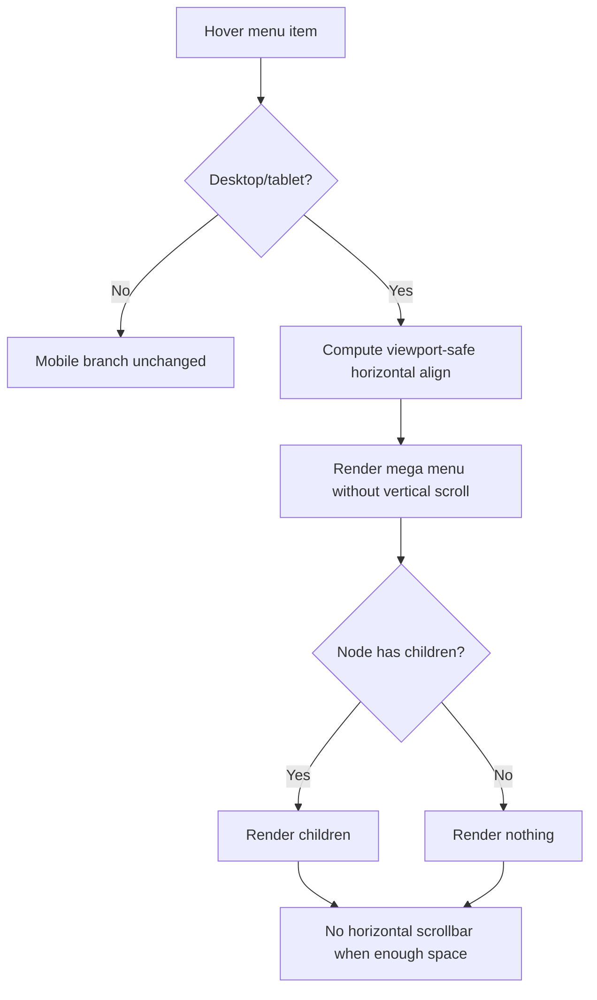

# I. Primer
## 1. TL;DR kiểu Feynman
- Em đã xác nhận 2 vấn đề trong ảnh: thanh cuộn dọc xuất hiện trong mega menu và thanh cuộn ngang vẫn xuất hiện khi nội dung/cột không được co đúng.
- Nguyên nhân trực tiếp là patch trước thêm `overflow-y-auto + maxHeight` và một số khối vẫn giữ width cứng gây dư ngang.
- Em sẽ **bỏ hoàn toàn scroll dọc** (theo yêu cầu), **xóa hardcode “Xem thêm”**, và chỉ giữ cơ chế chống cắt theo chiều rộng.
- Nếu desktop đủ chỗ thì hành vi phải như cũ: không có scroll ngang/dọc, dropdown hiển thị tự nhiên.

## 2. Elaboration & Self-Explanation
- Vấn đề 1 (scroll dọc): do em đã thêm `overflow-y-auto` để an toàn chiều cao; điều này trái với behavior cũ và không đúng ưu tiên của anh (thiếu chiều rộng, không thiếu chiều cao).
- Vấn đề 2 (Xem thêm): trong code có fallback hardcode `Xem thêm` ở các nhánh child không có grandchildren; dẫn đến chiếm slot sai về mặt semantic.
- Vấn đề 3 (scroll ngang khi đủ chỗ): dù đã có max width theo viewport, vài layout grid/column chưa co linh hoạt đủ nên vẫn tạo vùng tràn ngang.
- Hướng sửa: bỏ toàn bộ logic cuộn dọc, giữ/siết lại logic chống tràn ngang (max-width + fit-content + grid co giãn), và dọn fallback hardcode.

## 3. Concrete Examples & Analogies
- Ví dụ theo ảnh 2: mega menu 3 cột, cột giữa không có item con nhưng vẫn hiện “Xem thêm” và thanh cuộn ngang ở đáy.
- Sau fix: cột giữa không render “Xem thêm”; nếu không có item con thì ẩn phần nội dung con luôn. Dropdown chỉ nở theo nội dung trong giới hạn chiều rộng viewport, không thêm thanh cuộn dọc.
- Analogy: như giá sách nhiều ngăn — ngăn trống thì để trống (không dán nhãn giả), và cả kệ phải đặt lọt bề ngang căn phòng, không cần thêm “thanh kéo dọc” trong từng ngăn.

# II. Audit Summary (Tóm tắt kiểm tra)
- Evidence 1: có `overflow-y-auto` tại các mega menu:
  - `components/site/Header.tsx` quanh các line ~1014, ~1566, ~1812.
- Evidence 2: có giới hạn chiều cao gây scrollbar dọc:
  - `maxHeight: 'min(70vh, 560px)'` quanh line ~1019, ~1571, ~1817.
- Evidence 3: còn fallback hardcode “Xem thêm”:
  - quanh line ~1085, ~1637, ~1883.
- Evidence 4: ảnh user cung cấp cho thấy cả vertical scrollbar và horizontal scrollbar trong dropdown.

# III. Root Cause & Counter-Hypothesis (Nguyên nhân gốc & Giả thuyết đối chứng)
- Root Cause (High): patch trước thêm vertical overflow control (`overflow-y-auto`, `maxHeight`) nên xuất hiện thanh cuộn dọc.
- Root Cause (High): fallback hardcode “Xem thêm” chưa được thay bằng rule data-driven cho node rỗng.
- Root Cause (Medium): một số container mega menu vẫn width/column rigid nên có thể tạo overflow ngang trong một số tổ hợp dữ liệu.
- Counter-hypothesis: do wrapper ngoài header (`main overflow-x-hidden`) gây scrollbar trong dropdown — không phù hợp với triệu chứng vì scrollbar đang xuất hiện trong chính panel dropdown.

# IV. Proposal (Đề xuất)
- Option A (Recommend) — Confidence 92%
  - a) Gỡ hoàn toàn mọi `overflow-y-auto` + `maxHeight` ở dropdown/mega menu desktop (3 style).
  - b) Bỏ hardcode `Xem thêm`; nếu node không có con thì không render block fallback.
  - c) Chỉ tối ưu ngang:
    - giữ `maxWidth: calc(100vw - 16px)` cho panel;
    - thêm ràng buộc co giãn grid/cột để không tạo overflow ngang khi đủ chỗ;
    - bảo toàn align linh hoạt trái/giữa/phải đã có.
  - d) Giữ hành vi desktop cũ khi đủ không gian (không scrollbar).

- Option B — Confidence 70%
  - Chuyển mega menu sang layout một cột linh hoạt ở breakpoint tablet để giảm hẳn overflow ngang.
  - Tradeoff: thay đổi UX nhiều hơn so với behavior cũ.

Lý do chọn Option A: đúng yêu cầu “quay về hành vi cũ theo chiều dọc”, sửa tối thiểu, ít rủi ro, và tập trung vào vấn đề thật là chiều rộng.

# V. Files Impacted (Tệp bị ảnh hưởng)
- Sửa: `components/site/Header.tsx`
  - Vai trò hiện tại: render toàn bộ header/menu cho classic/topbar/allbirds.
  - Thay đổi: gỡ vertical scroll constraints, bỏ hardcode “Xem thêm”, siết anti-overflow ngang để tránh scrollbar ngang khi đủ chỗ.

# VI. Execution Preview (Xem trước thực thi)
1. Xóa `overflow-y-auto` và `maxHeight` ở 3 nhánh mega menu desktop.
2. Thay fallback `Xem thêm` bằng render rỗng theo rule data-driven.
3. Rà lại class/style width/grid để chỉ còn anti-overflow ngang cần thiết.
4. Kiểm tra tĩnh các nhánh classic/topbar/allbirds để đảm bảo parity.

# VII. Verification Plan (Kế hoạch kiểm chứng)
- Manual viewport check tại desktop/tablet (1024/1152/1280):
  - a) Menu đủ chỗ: không có scrollbar ngang/dọc.
  - b) Menu sát biên: không bị cắt ngang; panel tự canh trái/phải.
  - c) Node rỗng tầng con: không còn “Xem thêm”.
- Theo rule repo: không chạy lint/test tự động; self-review tĩnh trước bàn giao.

# VIII. Todo
1. Gỡ mọi vertical scrolling trong mega menu desktop.
2. Loại bỏ hardcode “Xem thêm” ở các fallback rỗng.
3. Tinh chỉnh horizontal fitting để tránh scrollbar ngang khi đủ chỗ.
4. Rà parity 3 style header.

# IX. Acceptance Criteria (Tiêu chí chấp nhận)
- Không còn thanh cuộn dọc trong dropdown/mega menu desktop và tablet desktop-mode.
- Khi menu đủ không gian hiển thị, không có thanh cuộn ngang.
- Các slot rỗng không còn hiển thị chữ “Xem thêm” hardcode.
- Không làm thay đổi hành vi mobile menu hiện tại.

# X. Risk / Rollback (Rủi ro / Hoàn tác)
- Rủi ro: bỏ giới hạn chiều cao có thể làm dropdown kéo dài ở viewport thấp.
- Đã chốt với anh: chấp nhận behavior này để giữ như cũ.
- Rollback: revert commit fix v2 nếu phát sinh regressions không mong muốn.

# XI. Out of Scope (Ngoài phạm vi)
- Không đổi kiến trúc menu tree/data schema.
- Không redesign UX menu sang pattern mới.

# XII. Open Questions (Câu hỏi mở)
- Không còn ambiguity; yêu cầu đã chốt rõ: bỏ scroll dọc, bỏ “Xem thêm” hardcode, không scroll ngang khi đủ chỗ.