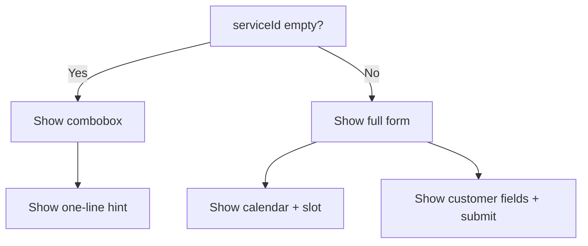

# I. Primer
## 1. TL;DR kiểu Feynman
- Bạn muốn trang `/book` gọn hơn khi chưa chọn dịch vụ.
- Cụ thể: ẩn `Ngày đặt`, `Khung giờ`, `Tên khách`, `Ghi chú`, `Nút đặt lịch` khi `serviceId` rỗng.
- Thay vào đó chỉ hiện 1 dòng nhắc ngắn để hướng user chọn dịch vụ trước.
- Khi đã chọn dịch vụ thì toàn bộ form/khung giờ hiển thị lại như hiện tại, không đổi logic booking.

## 2. Elaboration & Self-Explanation
Hiện tại trang `/book` luôn render gần như toàn bộ form, nên lúc chưa chọn dịch vụ vẫn thấy nhiều phần chưa dùng được. Điều này làm UI “dày” và gây nhiễu. 

Giải pháp là ràng buộc hiển thị theo trạng thái `serviceId`:
- `serviceId` rỗng: chỉ giữ khối chọn dịch vụ + 1 dòng nhắc.
- `serviceId` có giá trị: hiển thị lại các khối còn lại (calendar, slot, customer info, submit).

Vì logic query đã phụ thuộc `serviceId` sẵn (`monthOverview`, `availability` đang skip nếu thiếu `serviceId`), nên thay đổi này chủ yếu là presentation gating (ẩn/hiện UI), không cần sửa Convex hay schema.

## 3. Concrete Examples & Analogies
Ví dụ:
- User vào `/book` lần đầu, chưa chọn dịch vụ.
- Trang chỉ có combobox dịch vụ + dòng “Vui lòng chọn dịch vụ để tiếp tục đặt lịch.”
- User chọn dịch vụ “Gội đầu thư giãn” thì lịch, slot, tên khách, ghi chú, nút đặt lịch hiện ra đầy đủ.

Analogy:
- Giống quy trình checkout nhiều bước: phải chọn sản phẩm trước rồi mới hiện bước nhập thông tin giao hàng.

# II. Audit Summary (Tóm tắt kiểm tra)
- Observation:
  - File đang render tất cả khối form ở `app/(site)/book/page.tsx`.
  - `Khung giờ` đang nằm cột phải và có message khi chưa chọn dịch vụ.
  - `Ngày đặt` có placeholder dashed khi chưa chọn dịch vụ.
- Inference:
  - Có thể giảm nhiễu bằng cách ẩn cả các khối phụ thuộc service thay vì chỉ show placeholder.
- Decision:
  - Chỉ sửa điều kiện render theo `serviceId`; giữ nguyên data flow và mutation submit.

# III. Root Cause & Counter-Hypothesis (Nguyên nhân gốc & Giả thuyết đối chứng)
- Root Cause Confidence: **High**
- 1) Triệu chứng: chưa chọn dịch vụ nhưng vẫn thấy nhiều trường, UI rối.
- 2) Phạm vi: route public `/book`.
- 3) Tái hiện: luôn tái hiện khi mở trang mới.
- 4) Mốc gần nhất: sau khi chuyển sang combobox, các khối form vẫn render đầy đủ.
- 5) Dữ liệu thiếu: không có.
- 6) Giả thuyết đối chứng: do text hướng dẫn chưa rõ -> không đủ, vì bản chất clutter đến từ số lượng block hiển thị.
- 7) Rủi ro nếu fix sai: có thể ẩn quá mức làm mất flow submit khi đã chọn service.
- 8) Pass/fail: chưa chọn service chỉ còn combobox + 1 dòng nhắc; chọn service xong toàn bộ form hoạt động bình thường.

# IV. Proposal (Đề xuất)
- Option A (Recommend) — Confidence 92%
  - Dùng conditional rendering theo `serviceId` để bọc các section:
    - ẩn section `Ngày đặt`, `Tên khách`, `Ghi chú`, `submitMessage`, `button`.
    - ẩn toàn bộ cột phải `Khung giờ` + legend/hint/full names.
    - thêm 1 dòng nhắc ngắn ở dưới combobox khi chưa chọn service.
  - Tradeoff: layout thay đổi chiều cao rõ rệt (đúng mục tiêu “gọn”).
- Option B — Confidence 68%
  - Giữ layout 2 cột nhưng thay nội dung bằng skeleton/placeholder tối giản.
  - Tradeoff: vẫn chiếm không gian, chưa “gọn” như bạn yêu cầu.

Chọn Option A vì khớp chính xác yêu cầu “ẩn hết form thừa + hiện 1 dòng nhắc ngắn”.

# V. Files Impacted (Tệp bị ảnh hưởng)
- Sửa: `app/(site)/book/page.tsx`
  - Vai trò hiện tại: UI trang đặt lịch public.
  - Thay đổi: thêm điều kiện render để ẩn toàn bộ phần phụ thuộc dịch vụ khi `serviceId` rỗng, và thêm 1 dòng nhắc ngắn.

# VI. Execution Preview (Xem trước thực thi)
1. Giữ nguyên block combobox dịch vụ ở đầu form.
2. Bọc các khối `Ngày đặt`, `Tên khách`, `Ghi chú`, `submit`, `button` trong điều kiện `serviceId`.
3. Thêm 1 dòng text ngắn khi chưa chọn service.
4. Bọc cột phải (`Khung giờ` + legend + capacity + show_full`) trong điều kiện `serviceId`.
5. Self-review static tránh regress submit flow.
6. Chạy `bunx tsc --noEmit` (theo rule khi có đổi code TS).
7. Commit local (không push), add kèm `.factory/docs`.

# VII. Verification Plan (Kế hoạch kiểm chứng)
- Kiểm tra tĩnh và hành vi:
  - Chưa chọn service: chỉ thấy combobox + 1 dòng nhắc, không thấy các field khác.
  - Chọn service: toàn bộ form và cột khung giờ hiển thị lại.
  - Đổi service: vẫn reset ngày/slot như logic hiện có.
  - Typecheck pass: `bunx tsc --noEmit`.

# VIII. Todo
- [ ] Thêm điều kiện ẩn/hiện các section theo `serviceId`.
- [ ] Thêm 1 dòng nhắc ngắn khi chưa chọn service.
- [ ] Rà soát logic submit/slot không bị ảnh hưởng.
- [ ] Chạy typecheck và commit.

# IX. Acceptance Criteria (Tiêu chí chấp nhận)
- Khi `serviceId` rỗng: ẩn `Ngày đặt`, `Khung giờ`, `Tên khách`, `Ghi chú`, `Nút đặt lịch`.
- Khi `serviceId` rỗng: có 1 dòng nhắc ngắn yêu cầu chọn dịch vụ.
- Khi chọn dịch vụ: toàn bộ phần bị ẩn xuất hiện lại và hoạt động như cũ.

# X. Risk / Rollback (Rủi ro / Hoàn tác)
- Rủi ro: điều kiện render sai có thể làm mất thông báo lỗi hoặc khối submit sau khi chọn service.
- Rollback: revert commit sửa `app/(site)/book/page.tsx` về version trước.

# XI. Out of Scope (Ngoài phạm vi)
- Không chỉnh Convex queries/mutations.
- Không thay wording khác ngoài dòng nhắc ngắn.
- Không đổi style tổng thể ngoài ẩn/hiện theo điều kiện.

# XII. Open Questions (Câu hỏi mở)
- Không còn ambiguity; yêu cầu đã rõ.