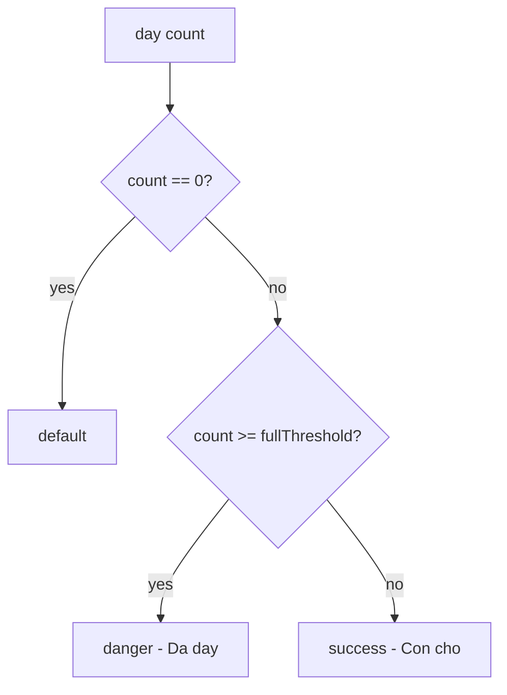

# I. Primer
## 1. TL;DR kiểu Feynman
- Trang `/book` đang tô màu theo 3 mức: còn chỗ (xanh), sắp đầy (vàng), đã đầy (đỏ).
- Yêu cầu của anh/chị là bỏ hẳn mức “Sắp đầy” để người dùng nhìn phát hiểu ngay.
- Em sẽ đổi logic thành 2 mức rõ ràng: **Còn chỗ = xanh**, **Đã đầy = đỏ**.
- Em sẽ đồng bộ cả **màu trên lịch** và **khối chú thích (legend)** để không còn màu vàng.
- Cách làm là thay mapping `getDayTone` ở `app/(site)/book/page.tsx`, không đụng schema/data Convex.

## 2. Elaboration & Self-Explanation
Hiện tại ô ngày trong calendar được quyết định màu bằng số lượng booking trong ngày (`count`) so với ngưỡng (`capacityPerSlot * 4`, `*8`). Cách này sinh ra trạng thái trung gian “warning” (vàng, sắp đầy). Nhưng yêu cầu mới là bỏ mức trung gian để trực quan nhất.

Vậy ta chuyển sang tư duy nhị phân:
- Nếu ngày đó chưa chạm ngưỡng đầy theo rule hiện có thì hiển thị xanh (còn chỗ).
- Nếu chạm/vượt ngưỡng đầy thì hiển thị đỏ (đã đầy).

Ở UI, phần legend bên phải cũng sẽ bỏ dòng “Sắp đầy”, chỉ giữ 2 dòng với màu tương ứng để người dùng không phải suy nghĩ.

## 3. Concrete Examples & Analogies
Ví dụ cụ thể theo code hiện tại:
- Trước: `count=3` -> xanh, `count=5` -> vàng, `count=9` -> đỏ (với `capacityPerSlot=1`).
- Sau: `count=3` -> xanh, `count=5` -> xanh, `count=9` -> đỏ.

Analogy đời thường: giống đèn báo đơn giản ở bãi xe:
- Xanh = còn chỗ vào.
- Đỏ = hết chỗ.
Không có màu trung gian để tránh người dùng phải đoán.

# II. Audit Summary (Tóm tắt kiểm tra)
- Observation:
  - Route cần sửa là `app/(site)/book/page.tsx`.
  - Legend hiện có 3 nhãn: “Còn chỗ”, “Sắp đầy”, “Đã đầy”.
  - `MonthCalendar` hỗ trợ tone `success | warning | danger` qua `getDayTone`.
- Inference:
  - Chỉ cần chỉnh ở page `/book` (mapping + legend), không cần sửa shared component `MonthCalendar` vì vẫn dùng được `success/danger`.
- Decision:
  - Sửa tối thiểu 1 file (`app/(site)/book/page.tsx`) để giảm rủi ro và dễ rollback.

# III. Root Cause & Counter-Hypothesis (Nguyên nhân gốc & Giả thuyết đối chứng)
- Root Cause (High confidence):
  - Trạng thái “Sắp đầy” xuất phát từ rule trong `getDayTone`:
    - `>= capacityPerSlot * 8` => `danger`
    - `>= capacityPerSlot * 4` => `warning`
    - còn lại `success`
  - Legend hardcode 3 dòng nên UI luôn hiển thị “Sắp đầy”.
- Counter-hypothesis đã loại trừ:
  - Không phải do `MonthCalendar` bắt buộc có warning; component chỉ render theo tone truyền vào.
  - Không phải do backend Convex trả về trạng thái text; text/legend nằm ở frontend page.

# IV. Proposal (Đề xuất)
- Đề xuất 1 hướng (Recommend) — Confidence 95%:
  1. Trong `getDayTone` tại `/book`:
     - giữ `count===0 => default` (không có lịch sử booking/neutral).
     - bỏ nhánh warning.
     - chỉ còn:
       - `count >= capacityPerSlot * 8 => danger` (Đã đầy)
       - còn lại `success` (Còn chỗ)
  2. Legend:
     - xoá dòng “Sắp đầy” màu vàng.
     - giữ 2 dòng xanh/đỏ, wording ngắn, rõ.
- Tradeoff:
  - Mất thông tin “gần đầy”, đổi lại UI rõ và dễ hiểu hơn đúng yêu cầu.

# V. Files Impacted (Tệp bị ảnh hưởng)
- Sửa: `app/(site)/book/page.tsx`
  - Vai trò hiện tại: render UI đặt lịch public, gồm calendar tone mapping và legend.
  - Thay đổi: bỏ nhánh warning trong `getDayTone`; xoá legend “Sắp đầy”, chỉ giữ xanh/đỏ.

# VI. Execution Preview (Xem trước thực thi)
1. Đọc block `MonthCalendar` usage trong `app/(site)/book/page.tsx`.
2. Chỉnh `getDayTone` sang mapping 2 trạng thái.
3. Chỉnh block legend tương ứng 2 dòng.
4. Self-review tĩnh để đảm bảo không còn text “Sắp đầy” trên `/book`.
5. Chạy `bunx tsc --noEmit` (vì có thay đổi TS/TSX) theo rule repo trước commit.
6. Commit local (không push).

# VII. Verification Plan (Kế hoạch kiểm chứng)
- Static/type:
  - `bunx tsc --noEmit`.
- Repro thủ công:
  - Mở `http://localhost:3000/book`.
  - Xác nhận legend chỉ còn “Còn chỗ” (xanh) và “Đã đầy” (đỏ).
  - Xác nhận không còn ô ngày màu vàng trong tháng có dữ liệu.
  - Xác nhận ô đỏ vẫn xuất hiện khi đạt ngưỡng đầy.
- Pass/fail:
  - Pass nếu UI không còn “Sắp đầy” cả text lẫn màu.
  - Fail nếu còn bất kỳ nhãn vàng/warning nào liên quan availability.

# VIII. Todo
1. Cập nhật `getDayTone` về 2 trạng thái.
2. Cập nhật legend còn 2 nhãn.
3. Self-review + `bunx tsc --noEmit`.
4. Commit thay đổi local.

# IX. Acceptance Criteria (Tiêu chí chấp nhận)
- `/book` không còn hiển thị nhãn “Sắp đầy”.
- Legend chỉ còn 2 dòng:
  - xanh: Còn chỗ
  - đỏ: Đã đầy
- Calendar day tone không còn dùng `warning` cho availability.
- Typecheck pass.
- Có commit local chứa thay đổi.

# X. Risk / Rollback (Rủi ro / Hoàn tác)
- Rủi ro:
  - Người vận hành mất tín hiệu “gần đầy” trên UI public.
- Rollback:
  - Revert commit để khôi phục nhánh warning + legend 3 trạng thái.

# XI. Out of Scope (Ngoài phạm vi)
- Không đổi schema/data Convex.
- Không đổi thuật toán capacity backend.
- Không chỉnh style/component dùng cho màn khác ngoài `/book`.

# XII. Open Questions (Câu hỏi mở)
- Không có ambiguity chặn triển khai; yêu cầu đã rõ (bỏ “Sắp đầy”, màu dễ hiểu).