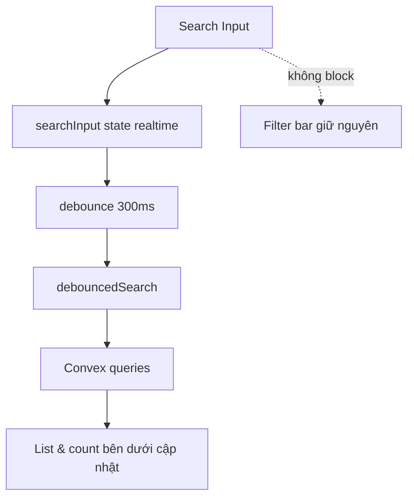

# I. Primer
## 1. TL;DR kiểu Feynman
- Hiện tại mỗi lần gõ 1 ký tự ở ô tìm tên khách, page bắn query ngay nên UI bị cảm giác giật.
- Anh/chị muốn phần filter phía trên (search, trạng thái, dịch vụ, ngày) đứng yên, không bị “reload cảm giác”.
- Em sẽ tách state nhập liệu và state query, thêm debounce 300ms để chỉ query sau khi dừng gõ ngắn.
- Em sẽ bỏ gate loading toàn trang sau lần load đầu; chỉ phần danh sách bên dưới tự cập nhật dữ liệu.
- Kết quả: gõ mượt hơn, input không nhấp nháy/giật, danh sách dưới vẫn cập nhật đúng theo filter.

## 2. Elaboration & Self-Explanation
Trong `app/admin/bookings/page.tsx`, `searchTerm` đang được truyền trực tiếp vào 3 `useQuery` (`monthBookings`, `selectedDateBookings`, `selectedDateCount`). Mỗi ký tự gõ vào đều tạo args mới cho query, khiến trạng thái loading và re-render dày đặc.

Ngoài ra `isLoading` đang gộp nhiều query và có nhánh return spinner toàn trang. Dù spinner chủ yếu xuất hiện lúc đầu, cách gộp này làm trải nghiệm khi filter/search không ổn định về cảm nhận (phần trên cũng bị tác động re-render nặng).

Cách sửa nhỏ, đúng scope:
- Giữ `searchInput` cho ô nhập (cập nhật tức thì).
- Tạo `debouncedSearch` (300ms) làm tham số query.
- Chỉ hiển thị spinner toàn trang khi **initial load**.
- Sau đó luôn render layout đầy đủ; phần list bên dưới hiển thị skeleton/loading nhẹ hoặc giữ dữ liệu cũ trong lúc query mới về.

## 3. Concrete Examples & Analogies
Ví dụ:
- Trước: gõ `A` -> query chạy, gõ `n` -> query chạy, gõ `h` -> query chạy liên tục; cảm giác khựng.
- Sau: gõ `A n h` liên tục, dừng 300ms mới query 1 lần; thanh search vẫn đứng yên.

Analogy: giống tìm kiếm trong điện thoại. Bàn phím phải phản hồi ngay tay người dùng, còn danh sách kết quả có thể cập nhật sau một nhịp ngắn.

# II. Audit Summary (Tóm tắt kiểm tra)
- Observation:
  - File chính: `app/admin/bookings/page.tsx`.
  - `onChange` của search set state ngay và state đó đi thẳng vào args query.
  - Có `isLoading` tổng hợp nhiều nguồn dữ liệu.
- Inference:
  - Nguyên nhân giật đến từ query trigger theo từng ký tự + re-render nặng của toàn tree.
- Decision:
  - Tối ưu theo UI behavior, không đổi backend/Convex schema/function.

# III. Root Cause & Counter-Hypothesis (Nguyên nhân gốc & Giả thuyết đối chứng)
- 1) Triệu chứng: gõ 1 chữ là giật; expected là input mượt, actual là khựng/nhấp nháy cảm giác.
- 2) Phạm vi: trang `/admin/bookings`, đặc biệt vùng filter/search.
- 3) Repro: ổn định, chỉ cần gõ nhanh vào ô “Tìm theo tên khách...”.
- 4) Mốc thay đổi gần nhất: chưa cần xác nhận commit cụ thể để kết luận vì evidence trực tiếp từ code hiện tại.
- 5) Dữ liệu thiếu: chưa có profiler numbers; nhưng đủ evidence hành vi qua luồng state-query hiện tại.
- 6) Giả thuyết thay thế:
  - Do backend chậm? Có thể góp phần, nhưng ngay cả backend nhanh thì query mỗi ký tự vẫn gây churn.
  - Do component Input? Khả năng thấp vì vấn đề xuất hiện theo pattern query args đổi liên tục.
- 7) Rủi ro fix sai nguyên nhân: thêm debounce nhưng vẫn gate loading toàn trang thì UX vẫn khó chịu.
- 8) Tiêu chí pass/fail: filter bar đứng yên khi gõ, chỉ list dưới cập nhật, không “giật chữ”.

**Root Cause Confidence: High** — vì code hiện tại truyền trực tiếp `searchTerm` vào nhiều query và reset page ngay theo từng ký tự.

# IV. Proposal (Đề xuất)
- Option A (Recommend) — Confidence 90%
  - Dùng `searchInput` + `debouncedSearch(300ms)` trong cùng file.
  - Query chỉ dùng `debouncedSearch`.
  - Spinner toàn trang chỉ cho initial load; các lần filter/search sau chỉ loading ở vùng list.
  - Ưu điểm: thay đổi nhỏ, rollback dễ, đúng yêu cầu “thanh trên đứng yên”.
- Option B — Confidence 65%
  - Dùng `useDeferredValue` thay debounce.
  - Ưu điểm: code ngắn; tradeoff: khó kiểm soát tần suất query bằng debounce rõ ràng như 300ms.

# V. Files Impacted (Tệp bị ảnh hưởng)
- Sửa: `app/admin/bookings/page.tsx`
  - Vai trò hiện tại: page admin bookings, chứa filter bar + calendar + list.
  - Thay đổi:
    - thêm state/input debounce cho search.
    - thay args query từ `searchTerm` sang `debouncedSearch`.
    - tinh chỉnh loading strategy: initial-only fullscreen, còn lại loading cục bộ ở list.

# VI. Execution Preview (Xem trước thực thi)
1. Đọc lại block state/query/loading trong `BookingsContent`.
2. Thêm `searchInput`, `debouncedSearch`, effect debounce 300ms.
3. Cập nhật `Input value/onChange` dùng `searchInput`.
4. Cập nhật 3 query dùng `debouncedSearch`.
5. Tách `initialLoading` khỏi loading cục bộ để không chặn filter bar.
6. Self-review static (typing, null-safety, edge khi xoá search).
7. Chạy `bunx tsc --noEmit`.
8. Commit local (không push).

# VII. Verification Plan (Kế hoạch kiểm chứng)
- Repro manual tại `http://localhost:3000/admin/bookings`:
  - Gõ nhanh 5-10 ký tự vào ô tên khách.
  - Quan sát: ô search, dropdown trạng thái/dịch vụ, input date đứng yên; không giật.
  - Quan sát: phần list bên dưới cập nhật sau ~300ms dừng gõ.
- Regression nhanh:
  - Status filter/service filter/date vẫn lọc đúng.
  - Pagination vẫn đúng theo count.
- Static check:
  - `bunx tsc --noEmit`.

# VIII. Todo
1. Thêm debounce 300ms cho search ở page bookings admin.
2. Chuyển query args sang `debouncedSearch`.
3. Tách loading initial và loading cục bộ list.
4. Review tĩnh + typecheck.
5. Commit local.

# IX. Acceptance Criteria (Tiêu chí chấp nhận)
- Khi gõ tên khách, thanh filter phía trên không bị giật/nhấp nháy.
- Không có fullscreen loading khi đang search/filter sau lần load đầu.
- Chỉ danh sách và số lượng bên dưới cập nhật theo điều kiện lọc.
- Search phản hồi theo debounce 300ms.
- Typecheck pass.

# X. Risk / Rollback (Rủi ro / Hoàn tác)
- Rủi ro:
  - Debounce làm kết quả trễ 300ms (chủ đích UX).
  - Nếu xử lý loading cục bộ chưa chuẩn, có thể hiển thị dữ liệu cũ ngắn hạn.
- Rollback:
  - Revert commit để quay lại search realtime cũ.

# XI. Out of Scope (Ngoài phạm vi)
- Không đổi Convex function/schema/index.
- Không refactor component kiến trúc lớn.
- Không thay đổi UI copy/text ngoài phần cần cho loading behavior.

# XII. Open Questions (Câu hỏi mở)
- Không còn ambiguity chính: debounce 300ms đã được anh/chị chọn; yêu cầu scope reload đã rõ (chỉ phần dưới load).