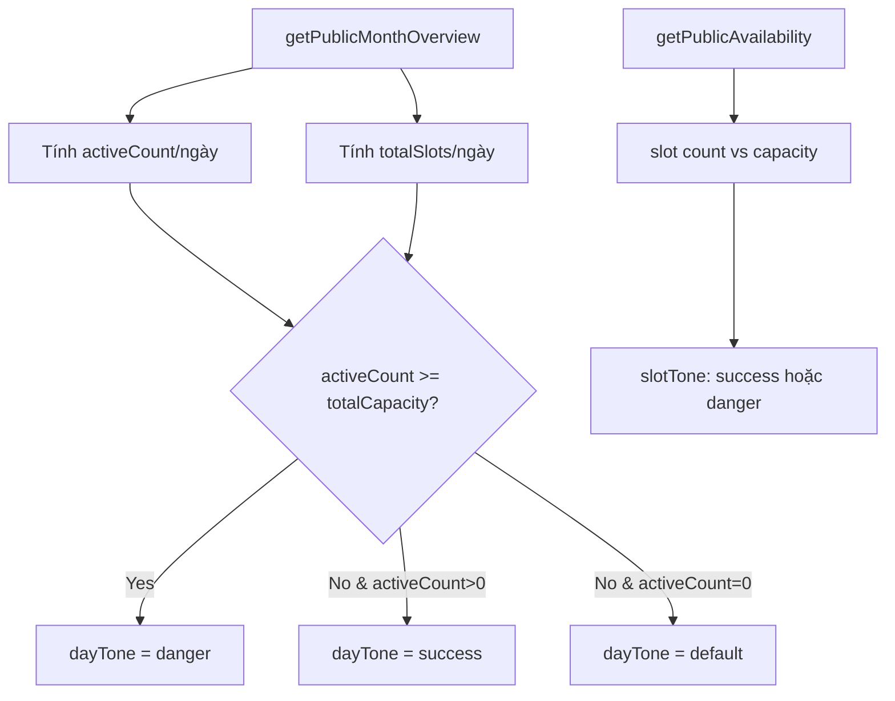

# I. Primer
## 1. TL;DR kiểu Feynman
- Trang `/book` hiện có legend xanh/đỏ nhưng logic tô màu chưa phản ánh đúng trạng thái thực tế nên bạn thấy “không có màu”.
- Ô khung giờ chỉ đang `disabled + opacity`, chưa có màu xanh/đỏ rõ ràng.
- Ô ngày trên lịch đang dùng ngưỡng ước lượng (`capacityPerSlot * 8`) nên không đúng điều kiện “đầy toàn bộ slot”.
- Em sẽ sửa tối thiểu: backend trả thêm trạng thái đầy theo ngày, frontend tô màu cả **ô ngày** và **ô khung giờ** đúng theo dữ liệu thật.

## 2. Elaboration & Self-Explanation
Vấn đề cốt lõi là UI đang hiển thị chú thích (legend) nhưng dữ liệu tô màu không đi cùng định nghĩa trong legend. Ở phần lịch tháng, code đang đoán “đầy” bằng một ngưỡng cứng nên sai với từng dịch vụ/ngày; ở phần khung giờ, trạng thái đầy có nhưng chỉ làm mờ chứ không tô đỏ. Vì vậy người dùng nhìn vào sẽ thấy gần như không có tín hiệu xanh/đỏ như mong đợi. Hướng sửa là lấy đúng dữ liệu năng lực chứa theo ngày từ backend (dựa trên slot thực sự mở) rồi map sang tone `success/danger`, và ở khung giờ thì hiển thị xanh cho slot còn chỗ, đỏ cho slot đầy.

## 3. Concrete Examples & Analogies
- Ví dụ thực tế theo yêu cầu của bạn: ngày 16 có 3 slot (`07:00, 08:00, 09:00`), capacity mỗi slot = 1.
  - Nếu đã có booking ở cả 3 slot => ngày 16 phải **đỏ** (đã đầy toàn bộ slot).
  - Nếu mới có 1–2 slot có booking hoặc còn slot trống => ngày 16 **xanh** (còn chỗ).
- Analogy đời thường: giống bãi xe có 3 ô đỗ; khi cả 3 ô kín thì biển đỏ “hết chỗ”, còn ít nhất 1 ô trống thì biển xanh “còn chỗ”.

# II. Audit Summary (Tóm tắt kiểm tra)
- **Observation (Quan sát):**
  - `app/(site)/book/page.tsx`: legend xanh/đỏ có render, nhưng slot button không tô xanh/đỏ (chỉ `opacity-50` khi full).
  - `MonthCalendar` đã hỗ trợ tone `success/danger`, nhưng `/book` đang truyền `getDayTone` theo ngưỡng cứng `count >= capacityPerSlot * 8`.
  - `convex/bookings.ts#getPublicMonthOverview` chỉ trả `activeCount` theo ngày, chưa có tín hiệu “full day” theo tổng slot thực tế.
- **Inference (Suy luận):** màu không đúng vì thiếu dữ liệu tổng slot/ngày và UI slot chưa map màu trạng thái.
- **Decision (Quyết định):** bổ sung trạng thái đầy/ngày từ backend + map màu rõ ràng cho cả ngày và khung giờ.
- **Root Cause Confidence:** **High** — bằng chứng trực tiếp từ code path render và query trả dữ liệu.

# III. Root Cause & Counter-Hypothesis (Nguyên nhân gốc & Giả thuyết đối chứng)
1. Triệu chứng: expected có xanh/đỏ rõ cho còn chỗ/đầy; actual gần như không có (nhất là khung giờ).
2. Phạm vi ảnh hưởng: trang site `/book` (người dùng cuối đặt lịch).
3. Tái hiện: ổn định, chỉ cần vào `/book`, chọn dịch vụ/ngày có dữ liệu.
4. Mốc thay đổi gần nhất: chưa cần quy về commit cụ thể để kết luận vì evidence đủ ở logic hiện tại.
5. Dữ liệu thiếu: thiếu `isFull` theo ngày từ backend month overview.
6. Giả thuyết thay thế đã loại trừ: không phải do `MonthCalendar` thiếu support tone (component đã có `success/danger`).
7. Rủi ro fix sai nguyên nhân: tô màu “đẹp” nhưng sai ngữ nghĩa availability, gây đặt lịch nhầm.
8. Pass/fail: màu ngày/slot phải nhất quán với dữ liệu capacity thực.

# IV. Proposal (Đề xuất)
- Sửa theo hướng tối thiểu, không đổi schema:
  1) Backend `getPublicMonthOverview` trả thêm metadata theo ngày để xác định “đầy toàn bộ slot” chính xác.
  2) Frontend `/book` dùng metadata đó cho `getDayTone` (đỏ khi full-day, xanh khi còn chỗ nhưng đã có booking).
  3) Frontend `/book` tô màu slot:
     - slot đầy: nền/viền đỏ nhẹ + disabled.
     - slot còn chỗ: nền/viền xanh nhẹ.
     - slot đang chọn: giữ màu brand primary (ưu tiên selected state).
- Không mở rộng scope sang thay đổi UX khác.

# V. Files Impacted (Tệp bị ảnh hưởng)
- **Sửa:** `convex/bookings.ts`
  - Vai trò hiện tại: cung cấp availability theo ngày/slot cho public booking.
  - Thay đổi: mở rộng payload `getPublicMonthOverview.days` (ví dụ thêm `isFull` hoặc `totalSlots/totalCapacity`) để frontend xác định màu đỏ đúng điều kiện “full toàn bộ slot”.

- **Sửa:** `app/(site)/book/page.tsx`
  - Vai trò hiện tại: render lịch, khung giờ và form đặt lịch ở `/book`.
  - Thay đổi: cập nhật `getDayTone` theo dữ liệu full-day mới; cập nhật className/style của slot button để hiện xanh/đỏ rõ ràng theo trạng thái.

- **Không đổi (tận dụng):** `components/shared/MonthCalendar.tsx`
  - Vai trò hiện tại: đã hỗ trợ tone `success/danger`.
  - Thay đổi: không cần sửa nếu mapping tone từ page đã đủ.

# VI. Execution Preview (Xem trước thực thi)
1. Đọc và chỉnh `convex/bookings.ts` ở `getPublicMonthOverview` + validator `returns`.
2. Đọc và chỉnh `app/(site)/book/page.tsx` để map day tone mới và slot tone.
3. Review tĩnh: type safety, null-safety, backward compatibility payload.
4. (Khi implement thực tế) chạy `bunx tsc --noEmit` theo rule repo trước commit code TS.

# VII. Verification Plan (Kế hoạch kiểm chứng)
- Kiểm chứng chức năng (manual):
  - Case A: ngày full toàn bộ slot => ô ngày đỏ, slot đầy đỏ + disabled.
  - Case B: ngày có booking nhưng chưa full => ô ngày xanh, slot còn chỗ xanh.
  - Case C: ngày không booking => ô ngày default, không báo sai “đầy”.
- Kiểm chứng kỹ thuật:
  - Static review payload Convex và consumer TS.
  - `bunx tsc --noEmit` (không chạy lint/unit test theo guideline repo).

# VIII. Todo
1. Cập nhật dữ liệu month overview để có trạng thái full-day chính xác.
2. Cập nhật logic tone cho calendar day tại `/book`.
3. Cập nhật style trạng thái cho slot button (success/danger/selected).
4. Tự review tĩnh + typecheck trước commit.

# IX. Acceptance Criteria (Tiêu chí chấp nhận)
- Legend “Còn chỗ/Đã đầy” khớp trực quan với màu ở cả ô ngày và ô khung giờ.
- Ngày chỉ chuyển đỏ khi **toàn bộ slot trong ngày đã đầy**.
- Slot đầy luôn disabled và hiển thị màu đỏ rõ; slot còn chỗ hiển thị màu xanh rõ.
- Không phát sinh lỗi TypeScript sau thay đổi.

# X. Risk / Rollback (Rủi ro / Hoàn tác)
- Rủi ro: tăng nhẹ tính toán ở `getPublicMonthOverview` khi cần suy ra total slot/ngày.
- Giảm thiểu: chỉ tính trong range tháng đang xem và tái sử dụng helper slot hiện có.
- Rollback: revert 2 file trên là quay về hành vi cũ ngay, không đụng schema/data migration.

# XI. Out of Scope (Ngoài phạm vi)
- Không đổi wording/microcopy của trang.
- Không redesign layout booking page.
- Không thay đổi thuật toán business về capacity/slot ngoài việc phản ánh đúng lên UI.

# XII. Open Questions (Câu hỏi mở)
- Không còn ambiguity sau khi bạn đã chốt:
  - Áp dụng màu cho **cả ô ngày + ô khung giờ**.
  - Màu đỏ ở lịch khi **toàn bộ slot trong ngày đã đầy**.