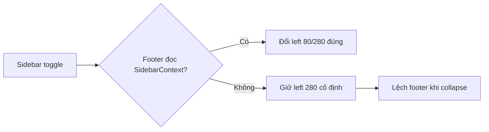

# I. Primer
## 1. TL;DR kiểu Feynman
- Footer sticky ở nhiều trang admin đang bị hardcode `lg:left-[280px]`, nên khi sidebar collapse thì footer không co giãn đúng.
- Hero đã làm đúng vì đọc `isSidebarCollapsed` từ `SidebarContext` và đổi `left` theo state.
- Em sẽ dùng đúng pattern của Hero làm nguồn chuẩn duy nhất cho toàn admin sticky footer.
- Cách làm: gom các footer hardcode sang 1 component dùng chung, rồi thay thế đồng bộ tại các trang create/edit/settings đang dùng footer sticky.
- Không đổi behavior nghiệp vụ submit/save; chỉ chuẩn hóa shell footer + responsive theo sidebar.

## 2. Elaboration & Self-Explanation
Hiện có 2 “hệ”: (a) hệ chuẩn của Hero dùng component `HomeComponentStickyFooter`, (b) hệ cũ copy-paste `
`. Khi sidebar thu gọn, hệ cũ không biết trạng thái sidebar nên giữ offset 280px và lệch layout.  
Mục tiêu của anh là đúng: cần một source-of-truth để mọi trang sticky footer kế thừa chung, tránh phân mảnh logic.  
Kế hoạch là chuẩn hóa vào một component sticky footer ở admin-level (hoặc nâng cấp component hiện tại để dùng toàn cục), sau đó migrate các trang đang hardcode sang component này. Như vậy sau này đổi behavior footer chỉ sửa 1 chỗ.

## 3. Concrete Examples & Analogies
- Ví dụ cụ thể trong repo:
  - Chuẩn: `app/admin/home-components/_shared/components/HomeComponentStickyFooter.tsx` có `isSidebarCollapsed ? 'lg:left-[80px]' : 'lg:left-[280px]'`.
  - Lệch: `app/admin/services/create/page.tsx` và `app/admin/services/[id]/edit/page.tsx` đang hardcode `lg:left-[280px]`.
- Analogy: giống như cả đội dùng chung 1 “ổ khóa master” cho cửa chính; nếu mỗi phòng tự làm khóa riêng thì lúc đổi chìa sẽ hỏng đồng loạt.

# II. Audit Summary (Tóm tắt kiểm tra)
- Observation:
  - Hero edit dùng footer component chuẩn, có đọc sidebar state: `app/admin/home-components/_shared/components/HomeComponentStickyFooter.tsx`.
  - Services create/edit dùng footer hardcode `fixed bottom-0 ... lg:left-[280px]`: `app/admin/services/create/page.tsx:425`, `app/admin/services/[id]/edit/page.tsx:777`.
  - Nhiều trang khác cùng anti-pattern: products, promotions, posts, settings managers, variant form.
- Inference:
  - Lỗi không phải ở route services riêng lẻ, mà ở pattern copy-paste footer không subscribe state sidebar.
- Decision:
  - Chuẩn hóa toàn bộ footer sticky admin theo source-of-truth Hero để loại bỏ drift.

# III. Root Cause & Counter-Hypothesis (Nguyên nhân gốc & Giả thuyết đối chứng)
- 1) Triệu chứng: sidebar collapse nhưng footer vẫn chiếm offset 280px (expected: co theo sidebar; actual: lệch).
- 2) Phạm vi: các trang admin dùng sticky footer hardcode, thấy rõ ở services create/edit.
- 3) Tái hiện: ổn định khi toggle sidebar tại các route có class `lg:left-[280px]` cố định.
- 4) Mốc thay đổi gần nhất: tồn tại song song 2 pattern (component chuẩn vs div hardcode), chưa được hợp nhất.
- 5) Dữ liệu thiếu: không thiếu thêm để kết luận root cause cho bug UI này.
- 6) Giả thuyết thay thế:
  - z-index/padding-bottom gây đè? Không phù hợp vì lệch theo chiều ngang khi toggle sidebar.
  - layout parent width sai? Không phù hợp vì Hero route cùng layout vẫn hoạt động đúng.
- 7) Rủi ro fix sai: sửa riêng services sẽ tái phát ở các trang khác.
- 8) Pass/fail:
  - Pass: mọi sticky footer admin co giãn đúng theo sidebar expanded/collapsed.
  - Fail: còn bất kỳ trang nào hardcode `lg:left-[280px]` cho sticky footer.

**Root Cause Confidence:** High — có evidence trực tiếp từ source code và pattern đối chiếu Hero vs services.

# IV. Proposal (Đề xuất)
- Dùng **một sticky footer component chuẩn ở admin** làm nguồn sự thật duy nhất (thừa kế logic Hero).
- Giữ API linh hoạt để cover các biến thể hiện có:
  - `align='between' | 'end'`
  - hỗ trợ `onCancel`, `submitLabel`, `submittingLabel`, `savedLabel`
  - hỗ trợ custom action area (`children`/slot) cho trường hợp có 2-3 nút (VD: Lưu nháp + Submit)
- Rollout theo batch nhỏ, ưu tiên nơi user report trước:
  1) services create/edit
  2) products/promotion/posts/variant
  3) settings managers
- Sau rollout, loại bỏ hardcode footer fixed ở các file đã migrate.

# V. Files Impacted (Tệp bị ảnh hưởng)
## a) UI Shared (dùng chung)
- **Sửa:** `app/admin/home-components/_shared/components/HomeComponentStickyFooter.tsx`
  - Vai trò hiện tại: footer sticky chuẩn cho home-components.
  - Thay đổi: mở rộng thành API dùng chung admin (giữ backward compatibility cho home-components).

## b) Admin Services (ưu tiên theo yêu cầu)
- **Sửa:** `app/admin/services/create/page.tsx`
  - Vai trò hiện tại: form tạo dịch vụ với footer hardcode.
  - Thay đổi: thay footer hardcode bằng component chuẩn.
- **Sửa:** `app/admin/services/[id]/edit/page.tsx`
  - Vai trò hiện tại: form sửa dịch vụ với footer hardcode.
  - Thay đổi: thay footer hardcode bằng component chuẩn, giữ nguyên logic saveStatus/hasChanges.

## c) Admin pages có cùng anti-pattern (đồng bộ)
- **Sửa:** `app/admin/products/create/page.tsx`
- **Sửa:** `app/admin/products/[id]/edit/page.tsx`
- **Sửa:** `app/admin/products/[id]/variants/components/VariantForm.tsx`
- **Sửa:** `app/admin/promotions/create/page.tsx`
- **Sửa:** `app/admin/promotions/[id]/edit/page.tsx`
- **Sửa:** `app/admin/posts/create/page.tsx`
- **Sửa:** `app/admin/posts/[id]/edit/page.tsx`
- **Sửa:** `app/admin/settings/_components/SettingsPageShell.tsx`
- **Sửa:** `app/admin/settings/_components/ProductSupplementalContentManager.tsx`
- **Sửa:** `app/admin/settings/_components/ProductFrameManager.tsx`

# VI. Execution Preview (Xem trước thực thi)
1. Đọc API component footer chuẩn hiện tại và mở rộng prop để cover đủ các layout nút.
2. Migrate services create/edit trước, map từng button flow sang prop tương ứng.
3. Migrate các trang admin còn lại theo cùng pattern (không đổi business logic submit).
4. Rà tĩnh toàn bộ `app/admin` để đảm bảo không còn footer sticky hardcode `lg:left-[280px]` ở các trang target.
5. Self-review null-safety/typing/backward compatibility.

# VII. Verification Plan (Kế hoạch kiểm chứng)
- Static verification (không chạy lint/unit test theo rule repo):
  - Soát type props tại tất cả điểm gọi component mới.
  - Soát hành vi disabled/label trạng thái save ở từng trang.
- Manual QA checklist (tester/runtime):
  1) Mở services create/edit, toggle sidebar liên tục -> footer co giãn đúng.
  2) Lặp lại với products/promotions/posts/settings managers.
  3) Kiểm tra mobile (<lg): footer full width, không lệch.
  4) Kiểm tra action states: `Đang lưu`, `Đã lưu`, disabled khi không đổi.

# VIII. Todo
- [ ] Mở rộng sticky footer component chuẩn theo API dùng chung admin.
- [ ] Migrate `services/create` và `services/[id]/edit`.
- [ ] Migrate nhóm products/promotions/posts/variant/settings managers.
- [ ] Rà tĩnh loại bỏ footer hardcode sticky ở các file target.
- [ ] Self-review và chuẩn bị commit (không push).

# IX. Acceptance Criteria (Tiêu chí chấp nhận)
- Tất cả route target dùng sticky footer đều co giãn đúng khi sidebar expand/collapse.
- Không còn hardcode footer sticky `lg:left-[280px]` trong các file đã liệt kê.
- Không đổi flow nghiệp vụ save/cancel/publish hiện tại của từng trang.
- Home-components (bao gồm Hero) tiếp tục hoạt động như trước.

# X. Risk / Rollback (Rủi ro / Hoàn tác)
- Rủi ro:
  - Một số trang có nhiều nút action riêng, nếu map prop thiếu có thể lệch bố cục.
  - Khác biệt className màu nút theo module (teal/pink/accent) cần giữ đúng.
- Rollback:
  - Revert theo file batch (services -> products/promotions/posts -> settings), rollback nhỏ, dễ kiểm soát.

# XI. Out of Scope (Ngoài phạm vi)
- Không thay đổi logic business của form/mutation.
- Không đổi schema, không đổi data Convex.
- Không refactor toàn bộ design system ngoài sticky footer.

# XII. Open Questions (Câu hỏi mở)
- Không còn ambiguity chính cho scope hiện tại; có thể triển khai ngay sau khi anh duyệt spec này.