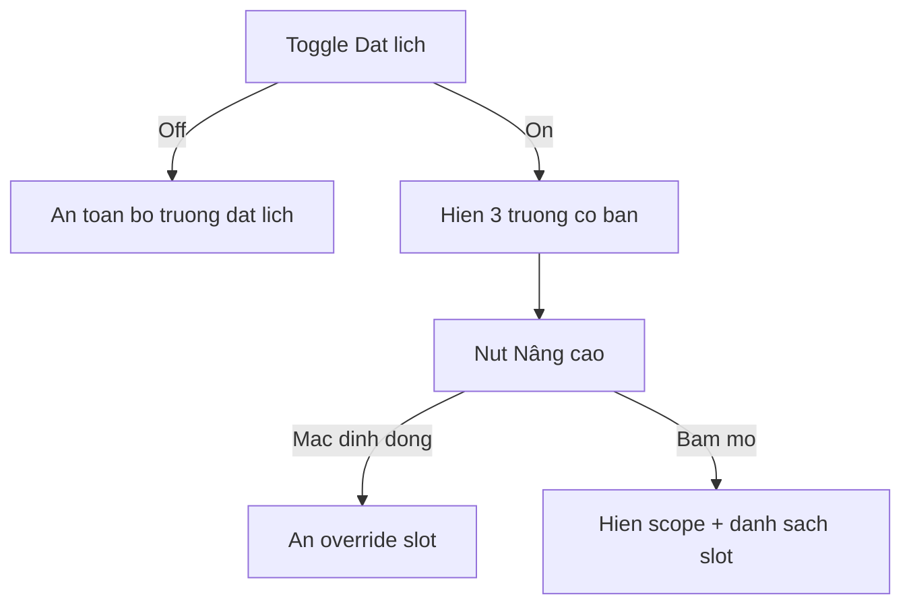

# I. Primer
## 1. TL;DR kiểu Feynman
- Mục “Đặt lịch” hiện nhiều chữ giải thích nhỏ lẻ (helper text) nên nhìn rối và chật.
- Ta sẽ rút gọn text tối đa, đổi nhãn ngắn-dễ hiểu bằng tiếng Việt, chỉ giữ thông tin cốt lõi.
- “Override khung giờ theo dịch vụ” sẽ chuyển thành phần **Nâng cao** và **ẩn mặc định**, bấm mới mở.
- Khối “Đặt lịch” sẽ được dời xuống ngay dưới “Nội dung” để có không gian ngang rộng hơn.
- Áp dụng đồng bộ cho cả trang **sửa dịch vụ** và **tạo dịch vụ**.

## 2. Elaboration & Self-Explanation
Hiện UI đặt lịch đang “nói quá nhiều” ở cùng một chỗ: label dài + helper text dài + block nâng cao luôn hiện (ở trang sửa). Điều này làm người dùng phải đọc nhiều trước khi thao tác. Hướng xử lý là giảm tải nhận thức (cognitive load):
- Giữ 1 công tắc rõ ràng: Bật/Tắt đặt lịch.
- Khi bật mới hiện 3 trường cốt lõi (thời lượng, bước lịch, sức chứa).
- Mọi thứ nâng cao (override theo ngày) đưa vào vùng gập/mở (collapsible) mặc định đóng.
- Rút gọn chữ toàn bộ label/helper theo kiểu “đủ hiểu là được”, tránh giải thích lan man.
- Dời section đặt lịch lên gần nội dung chính (dưới “Nội dung”) để layout đỡ chật ở cột phải.

## 3. Concrete Examples & Analogies
- Ví dụ cụ thể (trong repo):
  - Từ label dài: “Cách nhau bao lâu để nhận khách mới? (phút)” → “Bước lịch (phút)”.
  - Bỏ helper “Ví dụ: 30 là cứ 30 phút có 1 khung giờ mới.” vì trùng nghĩa với nhãn.
  - “Override khung giờ theo dịch vụ” đổi thành “Khung giờ nâng cao”, mặc định ẩn.
- Analogies đời thường:
  - Giống bảng điều khiển máy ảnh: chế độ Auto hiện trước, phần Pro phải bấm mới mở. Người mới không bị ngợp, người nâng cao vẫn đủ công cụ.

# II. Audit Summary (Tóm tắt kiểm tra)
- Observation:
  - `app/admin/services/[id]/edit/page.tsx` có section “Đặt lịch” ở cột phải, nhiều helper text và block override luôn hiện khi bật đặt lịch.
  - `app/admin/services/create/page.tsx` có section “Đặt lịch” tương tự (chưa có override UI nhưng vẫn nhiều helper text).
- Inference:
  - Mật độ chữ cao + bố cục cột phải làm cảm giác chật/rối.
- Decision:
  - Tối giản text, dời vị trí section, ẩn phần nâng cao theo yêu cầu user.

# III. Root Cause & Counter-Hypothesis (Nguyên nhân gốc & Giả thuyết đối chứng)
- Root Cause chính:
  1. UI đặt lịch đang dồn nhiều microcopy (label + ví dụ) trong không gian hẹp.
  2. Cài đặt nâng cao không tách tầng ưu tiên nên trộn với luồng cơ bản.
  3. Vị trí section ở cột phải làm giảm bề ngang, tăng cảm giác chật.
- Counter-hypothesis (giả thuyết đối chứng):
  - Không phải do logic dữ liệu hay validation Convex; vấn đề chủ yếu thuộc lớp trình bày (presentation/UI copy hierarchy).
- Root Cause Confidence (Độ tin cậy nguyên nhân gốc): **High**
  - Reason: evidence trực tiếp từ 2 file UI, trùng khớp phản ánh user về rối/chật/helper text vung vãi.

# IV. Proposal (Đề xuất)
1. Tái bố cục:
   - Dời Card “Đặt lịch” từ cột phải sang cột trái, đặt ngay dưới Card chứa “Nội dung”.
2. Tối giản text + Việt hóa tối đa:
   - Đổi nhãn ngắn gọn, bỏ phần lớn helper text ví dụ.
   - Ưu tiên từ phổ thông, tránh thuật ngữ thừa.
3. Progressive Disclosure (Hiển thị tiến dần):
   - Tắt đặt lịch → ẩn toàn bộ field đặt lịch.
   - Bật đặt lịch → chỉ hiện 3 field cơ bản.
   - “Khung giờ nâng cao” (override) → mặc định đóng, bấm mới mở (chỉ trang edit có phần này).
4. Giữ nguyên data contract:
   - Không đổi schema, không đổi payload API/mutation; chỉ đổi UI và text.

# V. Files Impacted (Tệp bị ảnh hưởng)
- Sửa: `app/admin/services/[id]/edit/page.tsx`
  - Vai trò hiện tại: Trang chỉnh sửa dịch vụ, chứa UI đặt lịch đầy đủ gồm override theo ngày.
  - Thay đổi: Dời vị trí card Đặt lịch xuống dưới Nội dung, rút gọn text, chuyển override thành vùng nâng cao ẩn mặc định.
- Sửa: `app/admin/services/create/page.tsx`
  - Vai trò hiện tại: Trang tạo dịch vụ, chứa UI đặt lịch cơ bản.
  - Thay đổi: Đồng bộ text tối giản + bố cục mới (Đặt lịch dưới Nội dung), ẩn toàn bộ phần đặt lịch khi chưa bật.

# VI. Execution Preview (Xem trước thực thi)
1. Đọc/chỉnh `edit/page.tsx`: tách block “Đặt lịch”, chèn vào cột trái dưới “Nội dung”.
2. Cập nhật copywriting cho label/helper theo bản rút gọn.
3. Thêm state UI cho “Nâng cao” (mặc định `false`) ở trang edit, bọc block override bằng vùng gập/mở.
4. Đọc/chỉnh `create/page.tsx`: dời vị trí card + rút gọn text tương tự.
5. Review tĩnh: typing/null-safety, so khớp payload update/create không đổi.
6. Commit local (không push) theo quy tắc repo.

# VII. Verification Plan (Kế hoạch kiểm chứng)
- Static verification (agent):
  1. So khớp before/after JSX: section “Đặt lịch” nằm dưới “Nội dung” ở cả 2 trang.
  2. Kiểm tra điều kiện hiển thị: toggle off thì ẩn field; toggle on thì hiện field cơ bản.
  3. Kiểm tra phần nâng cao ở edit: mặc định ẩn, bấm mới hiện/ẩn lại.
  4. Đảm bảo mutation params giữ nguyên key cũ (không đổi contract dữ liệu).
- Theo quy tắc repo:
  - Không chạy lint/unit test.
  - Trước commit code TS: chạy `bunx tsc --noEmit`.

# VIII. Todo
1. [pending] Refactor bố cục: dời card Đặt lịch dưới Nội dung ở trang edit
2. [pending] Refactor UX text đặt lịch trang edit theo bản tối giản
3. [pending] Thêm vùng “Nâng cao” ẩn mặc định cho override slot trang edit
4. [pending] Refactor bố cục + text đặt lịch trang create cho đồng bộ
5. [pending] Static self-review + `bunx tsc --noEmit` (nếu có thay đổi TS)
6. [pending] Commit local, không push

# IX. Acceptance Criteria (Tiêu chí chấp nhận)
- Pass khi:
  1. “Đặt lịch” nằm dưới “Nội dung” ở cả create/edit.
  2. Text trong khối đặt lịch ngắn gọn rõ nghĩa, không còn helper text dài rải rác.
  3. Khi tắt đặt lịch: toàn bộ field đặt lịch ẩn.
  4. Ở trang edit: phần override nằm trong “Nâng cao”, mặc định ẩn, bấm mới hiện.
  5. Không thay đổi hành vi lưu dữ liệu booking hiện có (payload keys giữ nguyên).
- Fail khi bất kỳ điều kiện nào ở trên không đạt.

# X. Risk / Rollback (Rủi ro / Hoàn tác)
- Rủi ro:
  - Dời vị trí JSX có thể gây lệch spacing hoặc thứ tự tab/focus.
  - Rút gọn quá mức có thể thiếu ngữ cảnh cho user mới.
- Rollback:
  - Revert 2 file UI về commit trước; vì không đổi schema/data nên rollback an toàn và nhanh.

# XI. Out of Scope (Ngoài phạm vi)
- Không đổi logic Convex/query/mutation/schema.
- Không redesign tổng thể toàn trang dịch vụ ngoài section đặt lịch.
- Không thêm tính năng đặt lịch mới ngoài ẩn/hiện nâng cao và tối giản UI.

# XII. Open Questions (Câu hỏi mở)
- Không còn ambiguity sau khi đã chốt với bạn: áp dụng cả create+edit, nâng cao ẩn mặc định, rút gọn tối đa.