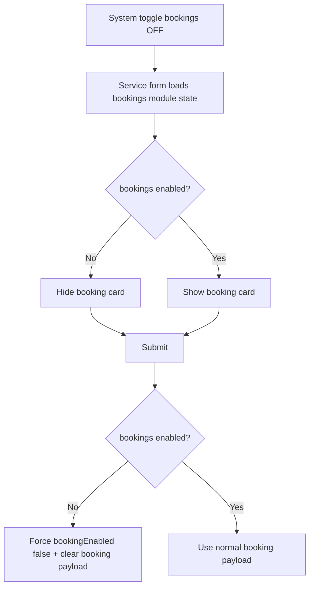

# I. Primer
## 1. TL;DR kiểu Feynman
- Hiện tại trang sửa/tạo dịch vụ chỉ đọc field của module `services`, không hề check trạng thái module `bookings`.
- Vì vậy dù anh tắt `bookings` ở `/system/modules`, card “Đặt lịch” vẫn hiện ở `/admin/services/*`.
- Cách sửa đúng ngữ cảnh: thêm check `bookingsModule.enabled`; tắt thì ẩn toàn bộ card booking.
- Đồng thời khi lưu, nếu `bookings` đang tắt thì ép payload booking về `false/undefined` để đồng bộ data.
- Sửa tối thiểu ở 2 trang: `create` và `edit` service, không mở rộng scope sang module khác.

## 2. Elaboration & Self-Explanation
- Vấn đề này là lệch “nguồn sự thật” (source of truth): UI dịch vụ đang coi booking là field nội bộ của `services`, trong khi nghiệp vụ của anh yêu cầu booking phụ thuộc module `bookings` bật/tắt toàn cục.
- Tức là có 2 lớp:
  a) Lớp module global: `bookings` bật/tắt ở `/system/modules`.
  b) Lớp dữ liệu từng service: `bookingEnabled`.
- Lúc này code chỉ dùng lớp b), không dùng lớp a), nên UI sai kỳ vọng.
- Hướng fix: đưa lớp a) vào form services. Nếu module global tắt thì:
  a) Không render card booking.
  b) Khi submit, không cho lưu booking active nữa (ép false/undefined theo yêu cầu anh).

## 3. Concrete Examples & Analogies
- Ví dụ cụ thể theo case của anh:
  a) Anh tắt `bookings` ở `/system/modules`.
  b) Vào `/admin/services/.../edit` → sau fix sẽ không còn thấy card “Đặt lịch”.
  c) Bấm lưu dịch vụ → payload gửi lên sẽ có `bookingEnabled: false`, các booking fields khác `undefined`.
- Analogy đời thường: như công tắc tổng điện của tầng (module bookings). Nếu công tắc tổng OFF thì công tắc từng phòng (bookingEnabled từng service) không được hoạt động.

# II. Audit Summary (Tóm tắt kiểm tra)
- Observation:
  - `app/admin/services/[id]/edit/page.tsx` render card booking trực tiếp, không query `getModuleByKey('bookings')`.
  - `app/admin/services/create/page.tsx` cũng tương tự.
  - `app/admin/bookings/page.tsx` đã dùng `ModuleGuard moduleKey="bookings"`, nghĩa là pattern check module tồn tại sẵn trong repo.
- Inference:
  - Root cause là thiếu gate theo module `bookings` ở form services, không phải lỗi toggle module.
- Decision:
  - Áp dụng gate tại UI create/edit services + ép dữ liệu khi submit.

# III. Root Cause & Counter-Hypothesis (Nguyên nhân gốc & Giả thuyết đối chứng)
- Root Cause (High confidence):
  - Form services không đọc trạng thái module `bookings` nên luôn hiển thị booking section và cho lưu booking state.
- Counter-hypothesis đã loại trừ:
  - “Toggle module không lưu DB” → không đúng, vì các màn khác (`/admin/bookings`, sidebar) đã dựa trên `isModuleEnabled('bookings')`.
  - “Do field `bookingEnabled` của services vẫn enabled” → đúng một phần, nhưng đây không phải module gate; chỉ là field-level config của module services.
- Trả lời nhanh checklist RCA bắt buộc:
  1) Triệu chứng: tắt module bookings nhưng UI booking ở services vẫn thấy (expected: không thấy).
  2) Ảnh hưởng: admin/service create-edit flow.
  3) Repro: ổn định 100% theo route anh đưa.
  4) Mốc thay đổi gần: code services hiện không có guard bookings.
  5) Thiếu dữ liệu: không thiếu để kết luận fix này.
  6) Giả thuyết thay thế: toggle module hỏng -> đã bị loại trừ.
  7) Rủi ro fix sai: có thể ẩn nhầm UI nhưng chưa ép data hoặc ngược lại.
  8) Pass/fail: tắt module bookings thì card ẩn + lưu ép false.

# IV. Proposal (Đề xuất)
- Đề xuất đã chốt theo yêu cầu anh:
  - Option duy nhất (Recommend) — Confidence 95%
    - Ẩn toàn bộ card “Đặt lịch” khi module `bookings` tắt.
    - Khi submit create/edit service, nếu `bookings` tắt thì ép payload booking:
      - `bookingEnabled = false`
      - `bookingDurationMin / bookingSlotIntervalMin / bookingCapacityPerSlot / bookingSlotTemplate* = undefined`
- Không đổi schema, không đổi Convex functions, chỉ đổi logic client form services.

# V. Files Impacted (Tệp bị ảnh hưởng)
- Sửa: `app/admin/services/create/page.tsx`
  - Vai trò hiện tại: form tạo dịch vụ, có card booking và submit payload.
  - Thay đổi: thêm query trạng thái module `bookings`, ẩn card khi OFF, ép payload booking về OFF khi submit.
- Sửa: `app/admin/services/[id]/edit/page.tsx`
  - Vai trò hiện tại: form sửa dịch vụ, có card booking và submit update payload.
  - Thay đổi: tương tự create; thêm guard module bookings + ép payload booking khi OFF.

# VI. Execution Preview (Xem trước thực thi)
1. Đọc state module `bookings` trong 2 trang services (create/edit).
2. Tạo biến `isBookingsModuleEnabled` từ `getModuleByKey('bookings')`.
3. Bọc render card booking bằng điều kiện `isBookingsModuleEnabled`.
4. Chuẩn hóa submit payload theo `isBookingsModuleEnabled` để ép OFF khi module tắt.
5. Static self-review: typing, nhánh undefined/loading, consistency create/edit.

# VII. Verification Plan (Kế hoạch kiểm chứng)
- Theo rule repo: không chạy lint/test/build.
- Verify tĩnh + checklist logic:
  1) Route `/admin/services/create`: bookings OFF => card booking không render.
  2) Route `/admin/services/[id]/edit`: bookings OFF => card booking không render.
  3) Submit ở cả 2 trang khi bookings OFF => payload booking bị ép false/undefined.
  4) Bật lại bookings => card hiển thị bình thường, behavior cũ giữ nguyên.

# VIII. Todo
- [ ] Thêm module-state query `bookings` ở service create page.
- [ ] Thêm module-state query `bookings` ở service edit page.
- [ ] Ẩn card booking khi module OFF ở cả 2 trang.
- [ ] Ép payload booking OFF khi module OFF ở cả create/update submit.
- [ ] Self-review static (type/null/edge case).

# IX. Acceptance Criteria (Tiêu chí chấp nhận)
- Khi tắt module `bookings` ở `/system/modules`:
  - `/admin/services/create` không còn card “Đặt lịch”.
  - `/admin/services/[id]/edit` không còn card “Đặt lịch”.
  - Lưu service sẽ không thể giữ `bookingEnabled=true`; payload luôn ép OFF.
- Khi bật lại module `bookings`:
  - Card “Đặt lịch” xuất hiện lại và dùng được như trước.

# X. Risk / Rollback (Rủi ro / Hoàn tác)
- Rủi ro thấp: chỉ ảnh hưởng UI + payload ở 2 form services.
- Rollback đơn giản: revert 2 file page.tsx về commit trước.

# XI. Out of Scope (Ngoài phạm vi)
- Không chỉnh schema Convex/table.
- Không refactor ModuleGuard/global architecture.
- Không đụng các route ngoài services create/edit.

# XII. Open Questions (Câu hỏi mở)
- Không còn ambiguity: anh đã chốt ẩn card hoàn toàn + ép false khi lưu.