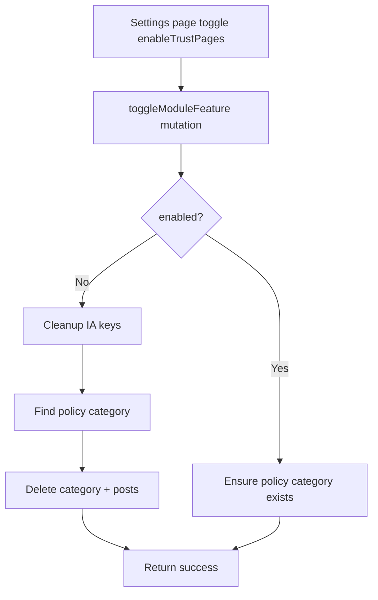

# I. Primer
## 1. TL;DR kiểu Feynman
- Bạn muốn thêm toggle **enableTrustPages** trong trang `/system/modules/settings` (nhóm Features).
- Khi tắt toggle này, hệ thống phải **xóa dữ liệu Trust Pages trong DB** theo scope đã chốt: xóa mapping IA + xóa danh mục “Chính sách” + xóa toàn bộ bài viết trong danh mục đó.
- Khi bật lại toggle, hệ thống chỉ **đảm bảo tồn tại danh mục “Chính sách”**, không tự tạo bài viết.
- Không cần modal xác nhận khi tắt (theo yêu cầu của bạn).
- Giải pháp sẽ cắm vào flow lưu config module settings hiện có (`useModuleConfig` + `toggleModuleFeature`) để giữ đồng bộ với kiến trúc repo.

## 2. Elaboration & Self-Explanation
- Hiện tại `/admin/trust-pages` đang hoạt động nhờ module `settings` và các key IA (`ia_page_*`, `ia_page_map_*`) + dữ liệu post/category.
- Module `settings` mới có feature `enableTrustPagesAutoGenerate`, chưa có công tắc tổng `enableTrustPages` để bật/tắt toàn bộ trust-pages feature set.
- Vì bạn yêu cầu “tắt là xóa DB liên quan trust”, ta cần một mutation cleanup riêng, gọi đúng thời điểm khi feature chuyển từ `true -> false`.
- Để giảm rủi ro phá dữ liệu ngoài phạm vi, cleanup sẽ chỉ chạm:
  - các key IA trust mapping/toggle,
  - category nhận diện là “Chính sách/policy”,
  - posts thuộc category này.
- Khi bật lại (`false -> true`), chỉ tạo category nếu thiếu để admin có khung dữ liệu rỗng, không auto tạo bài.

## 3. Concrete Examples & Analogies
- Ví dụ cụ thể theo repo:
  - Admin vào `/system/modules/settings`, tắt `enableTrustPages`.
  - Backend chạy cleanup:
    - set null các mapping `ia_page_map_*`, reset/tắt các `ia_page_*` theo policy,
    - tìm category “Chính sách” trong `postCategories`,
    - xóa cascade category + posts trong category đó.
  - Kết quả: `/admin/trust-pages` không còn dữ liệu trust cũ; bật lại thì chỉ có category trống.
- Analogy đời thường:
  - Giống tắt một “khu chức năng” trong tòa nhà: không chỉ tắt điện biển hiệu, mà dọn toàn bộ hồ sơ của khu đó; khi mở lại chỉ dựng lại phòng trống, chưa có hồ sơ mới.

# II. Audit Summary (Tóm tắt kiểm tra)
- Observation:
  - `lib/modules/configs/settings.config.ts` chưa có feature `enableTrustPages`.
  - `app/admin/trust-pages/page.tsx` dùng feature `enableTrustPagesAutoGenerate` cho nút auto-generate, chưa có gate tổng.
  - `convex/trustPages.ts` đã có logic tạo category “Chính sách” và thao tác mapping trust.
  - `lib/modules/hooks/useModuleConfig.ts` lưu feature qua `api.admin.modules.toggleModuleFeature`.
- Inference:
  - Điểm phù hợp nhất để gắn side-effect cleanup là backend mutation `toggleModuleFeature` (server authority), không đặt ở UI.
- Decision:
  - Thêm feature mới trong settings definition + seed + backend side-effect cleanup idempotent.

# III. Root Cause & Counter-Hypothesis (Nguyên nhân gốc & Giả thuyết đối chứng)
- Root cause:
  1) Thiếu feature flag tổng cho Trust Pages trong module settings.
  2) Thiếu cleanup lifecycle khi tắt trust-pages feature.
- Counter-hypothesis đã loại trừ:
  - Chỉ gate UI mà không cleanup DB: không đáp ứng yêu cầu “tắt thì xóa DB”.
  - Cleanup ở client sau khi toggle: dễ race condition, không đảm bảo integrity.
- Root Cause Confidence (Độ tin cậy nguyên nhân gốc): **High**
  - Reason: evidence trực tiếp từ các file runtime/config hiện tại; luồng save feature đã xác định rõ.

# IV. Proposal (Đề xuất)
1. Thêm feature `enableTrustPages` vào `settingsModule.features` (label kiểu “Trang tin cậy”).
2. Cập nhật seed/default moduleFeatures cho settings để có bản ghi `enableTrustPages`.
3. Backend:
   - Tạo helper cleanup trust data trong `convex/admin/modules.ts` hoặc tách `convex/lib`:
     - reset/xóa `settings` keys liên quan trust (`ia_page_*`, `ia_page_map_*`, `trust_page_last_autogen_at`),
     - tìm category “Chính sách/policy” rồi xóa cascade category + posts.
   - Trong `toggleModuleFeature`:
     - nếu `moduleKey==='settings' && featureKey==='enableTrustPages'`:
       - `enabled=false`: chạy cleanup,
       - `enabled=true`: ensure category “Chính sách” tồn tại (không tạo posts).
4. UI hành vi:
   - `/system/modules/settings` tự hiện toggle mới trong FeaturesCard (do config-driven), không cần custom UI.
5. Gating tiêu thụ dữ liệu:
   - `/admin/trust-pages` kiểm tra `enableTrustPages`; nếu off thì hiển thị trạng thái tắt + CTA quay về system modules.
   - (Tùy mức chặt) site trust routes có thể fallback 404/empty theo IA toggle hiện có.

# V. Files Impacted (Tệp bị ảnh hưởng)
- **Sửa:** `lib/modules/configs/settings.config.ts`
  - Vai trò hiện tại: định nghĩa module settings (features/settings runtime).
  - Thay đổi: thêm feature `enableTrustPages` trong `features`.
- **Sửa:** `convex/seed.ts`
  - Vai trò hiện tại: seed module features mặc định.
  - Thay đổi: thêm seed record cho `enableTrustPages`.
- **Sửa:** `convex/admin/modules.ts`
  - Vai trò hiện tại: xử lý toggle module/feature.
  - Thay đổi: thêm side-effect cleanup/ensure-category khi toggle `enableTrustPages`.
- **Sửa:** `app/admin/trust-pages/page.tsx`
  - Vai trò hiện tại: trang quản trị trust pages.
  - Thay đổi: gate theo `enableTrustPages`; off thì chặn thao tác và hiển thị trạng thái.
- **Sửa (nếu cần):** `lib/ia/settings.ts`
  - Vai trò hiện tại: lấy IA settings trust toggles/mappings.
  - Thay đổi: đảm bảo xử lý null/false an toàn sau cleanup.

# VI. Execution Preview (Xem trước thực thi)
1. Đọc/sửa config module settings để thêm feature mới.
2. Sửa seed để feature tồn tại ở data mặc định.
3. Implement backend cleanup + ensure category và nối vào `toggleModuleFeature`.
4. Nối gate UI tại `/admin/trust-pages` theo feature mới.
5. Static self-review: typing, null-safety, idempotent cleanup, backward compatibility data.

# VII. Verification Plan (Kế hoạch kiểm chứng)
- Repro chức năng:
  1) Bật `enableTrustPages` -> vào `/admin/trust-pages` truy cập được; category “Chính sách” có (nếu thiếu thì được tạo).
  2) Tắt `enableTrustPages` -> DB không còn category “Chính sách”, không còn posts thuộc category này, mapping trust keys đã reset.
  3) Bật lại -> chỉ category được tạo lại, không có post auto tạo.
- Kiểm tra kỹ thuật:
  - Chạy `bunx tsc --noEmit` vì có thay đổi code TS.
- Không chạy lint/test theo quy ước repo hiện tại trong AGENTS.md.

# VIII. Todo
1. Thêm `enableTrustPages` vào settings module definition.
2. Bổ sung seed feature `enableTrustPages` cho module `settings`.
3. Tạo logic cleanup trust data khi disable feature.
4. Tạo logic ensure category “Chính sách” khi enable feature.
5. Gate trang `/admin/trust-pages` theo feature mới.
6. Chạy `bunx tsc --noEmit` và rà soát static.

# IX. Acceptance Criteria (Tiêu chí chấp nhận)
- `/system/modules/settings` hiển thị toggle feature `enableTrustPages`.
- Toggle OFF:
  - category “Chính sách” bị xóa,
  - posts trong category đó bị xóa,
  - trust IA mapping keys được reset.
- Toggle ON:
  - category “Chính sách” tồn tại,
  - không auto tạo posts.
- `/admin/trust-pages` bị chặn hoặc thông báo đúng khi feature OFF.

# X. Risk / Rollback (Rủi ro / Hoàn tác)
- Rủi ro chính: xóa nhầm category không phải trust nếu matcher quá rộng.
- Giảm rủi ro:
  - matcher ưu tiên slug/name chính xác (`chinh-sach`, `policy`) + audit log ngắn trong result.
  - cleanup idempotent để chạy lặp không lỗi.
- Rollback:
  - bật lại feature để recreate category,
  - dữ liệu posts đã xóa cần khôi phục từ backup nếu cần.

# XI. Out of Scope (Ngoài phạm vi)
- Không thay đổi UI/UX lớn của module settings ngoài thêm toggle.
- Không productize tool migration/restore dữ liệu.
- Không can thiệp các category/posts khác ngoài scope đã chốt.

# XII. Open Questions (Câu hỏi mở)
- Không còn ambiguity theo lựa chọn bạn đã chốt.