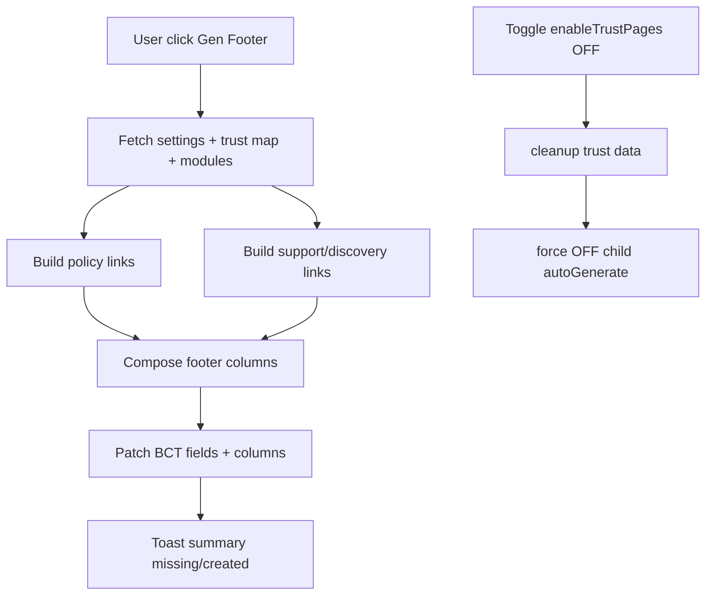

# I. Primer
## 1. TL;DR kiểu Feynman
- Xác nhận của bạn đã rõ: **bấm nút gen footer thì phải sinh luôn cột menu**.
- Cột menu sẽ ưu tiên **trust pages + các trang nền tảng hợp lý** để chuẩn BCT và tốt cho Google.
- Đồng thời giữ rule: tắt `enableTrustPages` thì tự tắt luôn `enableTrustPagesAutoGenerate`.
- Em sẽ làm generator theo hướng **patch tối thiểu**, không phá cấu hình footer ngoài phạm vi cần sinh.

## 2. Elaboration & Self-Explanation
- Khi user bấm “Sinh footer chuẩn BCT”, hệ thống sẽ đọc dữ liệu thật (trust mappings + settings + module routes), rồi dựng bộ cột menu chuẩn.
- Bộ cột menu không chỉ có trust pages, mà thêm các trang “hợp lý” như trang chủ, liên hệ, sản phẩm/dịch vụ (nếu module bật), tránh footer bị nghèo link.
- Nếu thiếu mapping trust, hệ thống vẫn sinh phần còn lại và báo rõ mục nào thiếu.

## 3. Concrete Examples & Analogies
- Ví dụ: Có mapping đầy đủ `/about, /terms, /privacy, /return-policy, /shipping, /payment, /faq` + có `/contact, /products` -> bấm gen sẽ ra cột “Chính sách & Tin cậy”, “Hỗ trợ”, “Khám phá”.
- Analogy: giống “auto fill form chuẩn pháp lý + SEO”: luôn điền khung bắt buộc trước, phần thiếu thì cảnh báo chứ không fail toàn bộ.

# II. Audit Summary (Tóm tắt kiểm tra)
- `FooterForm.tsx` đã có hạ tầng cột menu + BCT fields + route suggestions.
- `settings.config.ts` đã có cả `enableTrustPages` và `enableTrustPagesAutoGenerate`.
- `admin/modules.ts` có cleanup khi tắt trust pages nhưng chưa ép OFF auto-generate child toggle.
- `trust-pages.ts` + `ia/trust-pages.ts` đã có trust slots/mapping keys đủ để dựng menu trust.

# III. Root Cause & Counter-Hypothesis (Nguyên nhân gốc & Giả thuyết đối chứng)
- Root cause 1: thiếu invariant parent-child toggle sync.
- Root cause 2: thiếu generator chuẩn hóa cột menu từ dữ liệu trust + trang nền.
- Counter-hypothesis “do thiếu dữ liệu nguồn” bị loại: nguồn đã có sẵn trong settings/mapping/modules.
- Root Cause Confidence: **High**.

# IV. Proposal (Đề xuất)
## 1) Đồng bộ toggle Trust
- Trong `toggleModuleFeature`:
  - Nếu tắt `enableTrustPages` => ép `enableTrustPagesAutoGenerate=false` ngay cùng transaction logic.
  - Bật lại `enableTrustPages` không tự bật lại child toggle.

## 2) Nút “Sinh footer chuẩn BCT/Google” (create + edit)
- Thêm nút trong `FooterForm` (vì create/edit dùng chung form).
- Nguồn dữ liệu: `settings.getMultiple` + `moduleFeatures` + trust mapping keys.
- Output khi bấm nút:
  - Bật block BCT (`showBctLogo=true`, default `bctLogoType='thong-bao'`, link nếu có).
  - **Sinh cột menu tự động** theo thứ tự ưu tiên:
    1. Cột Chính sách & Tin cậy: trust pages đã active/mapped.
    2. Cột Hỗ trợ: liên hệ, FAQ, hướng dẫn cơ bản.
    3. Cột Khám phá: sản phẩm/dịch vụ/bài viết theo module đang bật.
    4. Cột Tài khoản/Mua hàng (nếu có module phù hợp): giỏ hàng, đơn hàng, wishlist.
- Ràng buộc chất lượng:
  - Deduplicate URL, giữ URL canonical ngắn gọn, label tiếng Việt rõ.
  - Không để cột rỗng; nếu thiếu dữ liệu dùng fallback tối thiểu.
  - Tối đa 4 cột (đúng giới hạn Footer hiện tại).

## 3) Guardrails “chuẩn BCT + Google” trong phạm vi code
- BCT: có khu vực logo + link xác thực + nhóm chính sách dễ thấy trong footer.
- Google/internal linking: tăng liên kết tới trang trust + trang nền chính, anchor text rõ nghĩa.
- Không claim pháp lý vượt phạm vi (không tự khẳng định “đã duyệt” nếu thiếu link xác thực cụ thể).

# V. Files Impacted (Tệp bị ảnh hưởng)
- Sửa: `convex/admin/modules.ts`
  - Vai trò: xử lý toggle features.
  - Đổi: ép OFF `enableTrustPagesAutoGenerate` khi OFF `enableTrustPages`.
- Thêm: `app/admin/home-components/footer/_lib/auto-generate.ts`
  - Vai trò: dựng cột menu chuẩn từ trust + routes/settings.
  - Đổi: helper pure function, trả `Partial<FooterConfig>` + report thiếu dữ liệu.
- Sửa: `app/admin/home-components/footer/_components/FooterForm.tsx`
  - Vai trò: UI form footer.
  - Đổi: thêm nút gen + gọi helper + apply patch + toast kết quả.

# VI. Execution Preview (Xem trước thực thi)
1. Chèn sync logic toggle ở backend.
2. Viết helper generate cột menu/footer patch.
3. Gắn nút gen vào FooterForm, áp dụng cho create/edit cùng lúc.
4. Rà soát null-safety + dedupe + fallback.

# VII. Verification Plan (Kế hoạch kiểm chứng)
- Case A: Tắt `enableTrustPages` -> verify child toggle auto OFF.
- Case B: Create Footer bấm gen -> verify cột menu được sinh (có trust + trang hợp lý).
- Case C: Edit Footer bấm gen -> verify patch đúng, không phá các field ngoài phạm vi.
- Case D: Thử thiếu mapping vài trust pages -> vẫn sinh được + toast báo thiếu.

# VIII. Todo
1. Sync OFF child trust auto-generate khi parent trust OFF.
2. Tạo helper sinh cột menu chuẩn BCT/Google từ dữ liệu thật.
3. Thêm nút gen trong FooterForm (dùng cho create + edit).
4. Review tĩnh edge cases (thiếu mapping, cột rỗng, URL trùng).

# IX. Acceptance Criteria (Tiêu chí chấp nhận)
- Bấm “Sinh footer chuẩn BCT/Google” => **cột menu được sinh tự động**.
- Cột menu chứa trust pages + các trang nền hợp lý theo module bật.
- Toggle trust parent OFF => auto-generate child OFF.
- Không đổi schema, không mở rộng scope ngoài footer/trust toggle sync.

# X. Risk / Rollback (Rủi ro / Hoàn tác)
- Rủi ro overwrite cột user chỉnh tay -> giảm bằng patch có kiểm soát + fallback.
- Rollback: revert commit, không có migration/schema change.

# XI. Out of Scope (Ngoài phạm vi)
- Không triển khai quy trình pháp lý đăng ký/thông báo BCT ngoài UI/footer linking.
- Không làm wizard tạo nội dung policy dài chi tiết.

# XII. Open Questions (Câu hỏi mở)
- Không còn câu hỏi mở sau xác nhận mới của bạn.