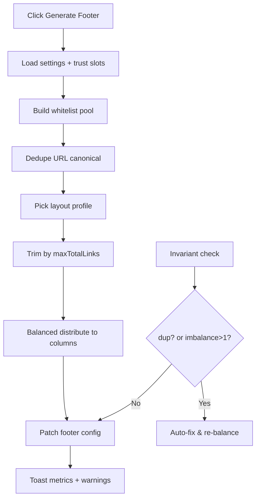

# I. Primer
## 1. TL;DR kiểu Feynman
- Bạn phản hồi đúng trọng tâm: hiện có nút gen nhưng **chưa chuẩn**, bị **trùng link**, có link **không cần thiết** (login/tài khoản), và **phân bổ cột chưa đẹp**.
- Mục tiêu V3: generator phải “sạch” hơn: **không trùng**, **chỉ trang thiết yếu**, **chia item đều giữa các cột với chênh lệch tối đa ±1**.
- Logic sinh sẽ phụ thuộc **layout footer đang chọn** (classic/modern/corporate/minimal/centered/stacked), để số cột và mật độ link phù hợp UI từng kiểu.
- Theo lựa chọn của bạn: ngoài trust pages, nhóm bổ sung chỉ là **Core thiết yếu**: Trang chủ, Liên hệ, Về chúng tôi, FAQ.
- Em sẽ không mở rộng scope sang account/checkout/auth links; chỉ tập trung chất lượng navigation + trust/legal.

## 2. Elaboration & Self-Explanation
- Vấn đề hiện tại không phải thiếu dữ liệu, mà là thuật toán chọn/phân phối link chưa “biên tập”: nó đang trộn nhiều nguồn link theo kiểu cộng dồn, dẫn đến dư thừa.
- “Đẹp” ở đây sẽ được chuẩn hóa thành rule rõ ràng (quantifiable):
  - Không có URL trùng trong toàn footer.
  - Không có nhóm link ngoài phạm vi thiết yếu.
  - Cột menu được cân bằng bằng thuật toán chia đều (balanced bucketing), chênh lệch item count giữa mọi cột không vượt quá 1.
- Generator mới sẽ chia 2 lớp:
  1) **Content selection (chọn nội dung)**: chọn đúng tập link hợp lệ theo trust + core pack.
  2) **Layout distribution (phân phối theo layout)**: quyết định số cột + chia đều theo layout hiện tại.
- Cách này giúp cùng một nguồn dữ liệu nhưng render “đúng tinh thần” từng layout, không phải một template cứng áp cho mọi kiểu.

## 3. Concrete Examples & Analogies
- Ví dụ cụ thể:
  - Input hợp lệ: trust pages bật đủ 7 trang + core 4 trang => tổng pool 11 links (sau dedupe).
  - Layout `classic` (2 cột link visible theo preview): target 2 cột => chia 6/5 (đạt ±1).
  - Layout `centered` (4 cột): target 4 cột => chia 3/3/3/2 (đạt ±1).
- Ví dụ loại trùng:
  - Nếu FAQ xuất hiện từ trust (`/faq`) và core cũng có FAQ, dedupe theo URL giữ 1 bản duy nhất.
- Analogy đời thường:
  - Giống chia ghế khách mời vào bàn tiệc: không để bàn quá đông bàn quá vắng (±1), và không để 1 người ngồi 2 bàn (dedupe).

# II. Audit Summary (Tóm tắt kiểm tra)
- Observation (Quan sát):
  - File `app/admin/home-components/footer/_lib/auto-generate.ts` hiện có nhóm `accountLinks` (đăng nhập/tài khoản/đơn hàng/wishlist/cart), trái với mục tiêu mới của bạn.
  - `buildTrustLinks` + `buildSupportLinks` + `buildDiscoveryLinks` đang tách pool theo nhóm nhưng chưa có một **global dedupe pass** trước khi đóng gói final columns.
  - `FooterPreview.tsx` hiển thị link khác nhau theo layout:
    - `classic`, `corporate` đọc `columns.slice(0,2)`
    - `centered` đọc `columns.slice(0,4)`
    - `modern`, `stacked` flatten links rồi cắt theo số lượng
  - Vì vậy nếu generator không aware layout thì kết quả nhìn sẽ dễ lệch/không hợp lý theo từng style.
- Inference (Suy luận):
  - Cần thuật toán phân phối theo layout-aware capacity thay vì cùng một pack cho mọi style.
- Decision (Quyết định):
  - Thiết kế lại generator theo 2 pha: `select -> dedupe -> balanced distribute` với layout profile riêng.

# III. Root Cause & Counter-Hypothesis (Nguyên nhân gốc & Giả thuyết đối chứng)
- Root Cause (Nguyên nhân gốc):
  1. Thiếu ràng buộc nghiệp vụ “essential-only”, nên generator đưa cả account/auth links.
  2. Thiếu cơ chế dedupe xuyên nhóm (cross-group dedupe) trước khi tạo cột.
  3. Thiếu layout-aware distribution nên số cột/số link không đồng bộ với cấu trúc preview từng style.
- Counter-Hypothesis (Giả thuyết đối chứng):
  - “Do dữ liệu settings lỗi nên trùng”: Confidence thấp, vì trùng chủ yếu do logic gộp nhóm, không phải do source data sai.
  - “Do UI preview lỗi”: Confidence thấp, preview chỉ render dữ liệu theo style; gốc vẫn là generator output.
- Root Cause Confidence (Độ tin cậy nguyên nhân gốc): **High**
  - Reason: Evidence trực tiếp từ code hiện tại trong `auto-generate.ts` và hành vi render trong `FooterPreview.tsx`.

# IV. Proposal (Đề xuất)
## 1. Nguyên tắc business mới (hard constraints)
- Chỉ cho phép các nhóm link:
  - Trust pages (theo `TRUST_PAGE_SLOTS`, chỉ link đang bật).
  - Core thiết yếu (theo quyết định của bạn): `/`, `/contact`, `/about`, `/faq`.
- Cấm sinh các link: login/account/orders/wishlist/cart/checkout/promotions trong auto mode.
- Dedupe toàn cục theo URL canonical.
- Cân bằng cột: `max(counts) - min(counts) <= 1`.

## 2. Layout Profiles (hồ sơ layout)
- Tạo profile map theo `FooterStyle`:
  - `classic`: 2 cột link
  - `corporate`: 2 cột link
  - `centered`: 4 cột link
  - `modern`: 2 cột logic (dù render flattened, vẫn giữ grouping nguồn để ổn định)
  - `stacked`: 2 cột logic
  - `minimal`: 1 cột logic (ưu tiên trust/legal ngắn gọn)
- Mỗi profile có:
  - `targetColumns`
  - `maxTotalLinks` (để tránh quá tải, đặc biệt mobile)
  - `columnTitlePreset` (ví dụ: Chính sách, Hỗ trợ, Thông tin, Tin cậy)

## 3. Thuật toán phân bổ cân bằng (Balanced Distribution)
- Bước a) Build pool theo priority:
  1) Trust pages (cao nhất)
  2) Core thiết yếu
- Bước b) Canonicalize URL + dedupe bằng `Set`.
- Bước c) Trim pool theo `maxTotalLinks` của layout.
- Bước d) Chia đều vào N cột bằng round-robin hoặc bucket size chuẩn:
  - `base = floor(total / N)`
  - `extra = total % N`
  - cột 1..extra nhận `base+1`, còn lại `base`
- Bước e) Gán title cột theo profile và ngữ nghĩa link trong cột.

## 4. Chính sách “đủ nhưng không thừa”
- Nếu trust pages ít (ví dụ chỉ 2-3 links), ưu tiên giữ trust trước, core bù vừa đủ để đạt bố cục đẹp.
- Nếu pool quá nhiều, cắt theo thứ tự ưu tiên; tuyệt đối không thêm links ngoài whitelist để “cho đầy”.

## 5. UX phản hồi sau khi bấm Generate
- Toast success chứa metrics:
  - `X links`, `Y columns`, `balance = [a,b,c...]`, `deduped K`.
- Toast warning nếu thiếu trust mapping:
  - nêu key thiếu, nhưng không fail toàn bộ.

# V. Files Impacted (Tệp bị ảnh hưởng)
- Sửa: `app/admin/home-components/footer/_lib/auto-generate.ts`
  - Vai trò hiện tại: sinh patch footer từ settings/modules/categories.
  - Thay đổi: thay hoàn toàn logic chọn link + dedupe + phân phối cân bằng theo layout profile; loại bỏ account/auth links.

- Sửa: `app/admin/home-components/footer/_components/FooterForm.tsx`
  - Vai trò hiện tại: trigger generate + apply patch.
  - Thay đổi: truyền `current style` vào generator, hiển thị toast metrics mới (balance/deduped/missing).

- Sửa (nếu cần): `app/admin/home-components/footer/_types/index.ts`
  - Vai trò hiện tại: định nghĩa config/footer style.
  - Thay đổi: chỉ thêm type summary nếu cần cho metrics (không đổi schema dữ liệu lưu).

- Sửa (nhẹ, optional guard): `app/admin/home-components/footer/_components/FooterPreview.tsx`
  - Vai trò hiện tại: render theo từng layout.
  - Thay đổi: không đổi layout UI; chỉ thêm guard fallback nếu cột rỗng để tránh hiển thị lệch.

# VI. Execution Preview (Xem trước thực thi)
1. Refactor generator thành các hàm rõ ràng: `buildEssentialPool`, `dedupeByUrl`, `resolveLayoutProfile`, `balanceColumns`.
2. Loại bỏ toàn bộ nhánh account/auth/discovery không nằm trong whitelist mới.
3. Wire style-aware generation từ `FooterForm`.
4. Thêm summary object phục vụ toast và debug nhanh.
5. Static self-review về null-safety, stable order, deterministic output.

# VII. Verification Plan (Kế hoạch kiểm chứng)
- Repro 1: Layout `classic` với 11 links -> verify 2 cột 6/5, không trùng.
- Repro 2: Layout `centered` với 11 links -> verify 4 cột 3/3/3/2.
- Repro 3: Layout `minimal` -> verify chỉ 1 cột, ưu tiên legal/trust.
- Repro 4: dữ liệu có FAQ xuất hiện từ nhiều nguồn -> output chỉ còn 1 `/faq`.
- Repro 5: trust mapping thiếu vài key -> vẫn generate, toast warning có danh sách thiếu.
- Repro 6: không có account links trong output sau generate.

# VIII. Todo
1. Thiết kế layout profiles và ngưỡng max link theo style.
2. Viết lại thuật toán chọn link whitelist + dedupe toàn cục.
3. Cài thuật toán chia cột cân bằng ±1 deterministic.
4. Nối generator với FooterForm theo style hiện tại.
5. Bổ sung toast metrics và cảnh báo thiếu mapping.
6. Rà soát tĩnh edge cases (pool rỗng, pool quá ít, pool quá nhiều).

# IX. Acceptance Criteria (Tiêu chí chấp nhận)
- Sau khi bấm generate:
  - Không có link trùng URL trong toàn bộ footer.
  - Không sinh link login/account/orders/wishlist/cart/checkout.
  - Chỉ gồm trust pages + core thiết yếu (Trang chủ, Liên hệ, Về chúng tôi, FAQ).
  - Số item giữa các cột chênh tối đa 1.
  - Kết quả hợp layout đang chọn (đúng số cột logic theo profile).
- Tính năng vẫn chạy cho cả create và edit footer.

# X. Risk / Rollback (Rủi ro / Hoàn tác)
- Rủi ro: cắt link quá mạnh làm footer thiếu khám phá.
  - Giảm thiểu: giữ core pack tối thiểu + trust đầy đủ trước khi trim.
- Rủi ro: thay thuật toán làm thứ tự link đổi mạnh giữa lần gen.
  - Giảm thiểu: deterministic ordering cố định theo priority table.
- Rollback:
  - Revert commit V3, quay về V2 ngay; không có migration/schema change.

# XI. Out of Scope (Ngoài phạm vi)
- Không thay đổi thiết kế visual của 6 layout (UI/CSS), chỉ thay data generation.
- Không thêm wizard nội dung policy dài.
- Không tích hợp quy trình pháp lý BCT ngoài footer link/block hiện có.

# XII. Open Questions (Câu hỏi mở)
- Không còn ambiguity chính: bạn đã chốt rõ “essential-only” (Option A).
- Nếu bạn muốn, ở bước sau có thể tinh chỉnh thêm `maxTotalLinks` cho từng layout sau khi xem QA screenshot thực tế.