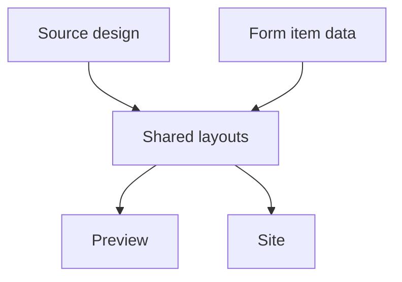

# I. Primer
## 1. TL;DR kiểu Feynman
- Em hiểu ý anh: vấn đề chính không phải “logo to hay nhỏ”, mà là bản refactor hiện tại đã lệch tinh thần của source trong `C:\Users\VTOS\Downloads\partner-logos-section`.
- Source đẹp vì nó gọn, nhịp spacing đều, tỷ lệ logo-text-card vừa phải, không có nhiều phần thừa chen vào.
- Bản hiện tại xấu vì đã thêm quá nhiều deviation: phóng scale quá tay, grid 8 cột, remaining card/modal, toggle mode chi phối layout, header bị nặng.
- Hướng sửa đúng là: lấy source làm chuẩn thị giác, trả 6 layout về đúng rhythm của source, rồi chỉ bọc lại bằng token màu/font của hệ thống.
- Nếu `Hiện tên logo` còn được giữ thì form phải có input `name`; nhưng mode này không được phép phá proportions của source nữa.

## 2. Elaboration & Self-Explanation
Em đã audit lại kỹ hơn theo đúng ý anh: thay vì hỏi “làm sao để nhìn đỡ xấu”, em so trực tiếp source và implementation hiện tại để tìm xem cái gì đã làm mất độ đẹp/gọn của source.

Kết luận là source đẹp vì nó rất tiết chế:
- header ngắn, không top-heavy
- logo size vừa đủ
- spacing giữa item vừa khít
- grid có nhịp cột rõ ràng
- badge thật sự compact
- carousel nhẹ, không nặng như card sản phẩm
- không có các phần “thêm cho hệ thống” chen vào làm vỡ nhịp

Refactor hiện tại bị lệch ở chỗ em đã hệ thống hóa quá mức: thêm `displayMode`, scale logo lên rất mạnh, giữ modal `Xem tất cả`, đẩy grid desktop thành 8 cột, và để spacing/padding lớn hơn source. Thành ra tuy code “đồng bộ” hơn, nhưng UI mất cái đẹp gọn vốn có của source.

Vì vậy lần này em đề xuất không vá lẻ từng chỗ nữa. Em sẽ làm theo nguyên tắc:
- Source là visual contract chính
- Shared components của repo chỉ là lớp tích hợp
- Mọi deviation không thật sự cần sẽ bị bỏ hoặc giảm mạnh

## 3. Concrete Examples & Analogies
### a) Ví dụ cụ thể bám task
Source Grid:
- columns: `2 / 3 / 4 / 5`
- logo: `w-6..8`
- text nhỏ gọn
- gap/padding vừa phải

Current Grid:
- columns: `2 / 4 / 8`
- logo: `h-20..48`
- còn thêm card `+Xem tất cả`
- header và card spacing đều nặng hơn

=> Nhìn vào preview hiện tại thì item bị “trống mà vẫn chật”: card to, logo quá to, cột nhiều, nhịp xấu.

### b) Analogy đời thường
Giống như một mẫu showroom tối giản đẹp sẵn, nhưng khi đưa vào hệ thống lại bị gắn thêm biển, thêm khung, thêm nút, phóng đồ trưng bày lên quá đà. Từng món riêng lẻ không sai, nhưng tổng thể mất độ tinh và gọn.

# II. Audit Summary (Tóm tắt kiểm tra)
- Observation: source `partner-logos.tsx` có spacing rất tiết chế và mỗi layout có rhythm riêng rõ ràng.
- Observation: implementation hiện tại đã thêm các deviation lớn khỏi source: `displayMode`, oversized logo sizing, `grid-cols-8`, remaining card/modal, header spacing nặng hơn.
- Observation: `PartnersForm.tsx` chưa cho nhập `name` cho từng item, trong khi source và mode `Hiện tên logo` đều ngầm cần field này.
- Observation: preview/site parity hiện có, nhưng đang parity theo một bản render đã lệch source.
- Inference: muốn UI đẹp lại thì phải ưu tiên source-faithful trước, không tiếp tục tối ưu theo cảm tính hoặc theo system abstraction nhiều hơn source.
- Decision: spec mới sẽ lấy source làm baseline thị giác, chỉ giữ lại những phần integration thật sự cần cho hệ thống.

# III. Root Cause & Counter-Hypothesis (Nguyên nhân gốc & Giả thuyết đối chứng)
## 1. Root Cause
### a) Triệu chứng quan sát được là gì
- Expected: layout đẹp, gọn, không dư spacing như source folder.
- Actual: preview hiện tại nhìn nặng, spacing vô lý, item proportions xấu.

### b) Phạm vi ảnh hưởng
- Toàn bộ Partners create/edit/preview/site.
- Cả 6 layout `grid | marquee | badge | carousel | clean | divider`.

### c) Có tái hiện ổn định không
- Có. Audit source-vs-current cho thấy mismatch rõ ở hầu hết layout shared.

### d) Mốc thay đổi gần nhất
- Các lần rollout layout mới + display mode là điểm bắt đầu lệch source rõ nhất.

### e) Dữ liệu nào đang thiếu
- Không thiếu blocker kỹ thuật ở mức spec.

### f) Có giả thuyết thay thế hợp lý nào chưa bị loại trừ
- Chỉ giảm logo size thôi: không đủ.
- Chỉ thêm input name thôi: không đủ.
- Chỉ sửa preview thôi: không đủ.

### g) Rủi ro nếu fix sai nguyên nhân là gì
- UI vẫn xấu dù code có vẻ “đúng feature”.
- Càng sửa càng xa source.

### h) Tiêu chí pass/fail sau khi sửa
- Nhìn vào preview phải thấy gần source rõ rệt: gọn, sạch, đều nhịp.
- Không còn các phần thừa phá layout.
- Nếu hiện tên logo thì form nhập đúng dữ liệu name.

## 2. Root Cause Confidence (Độ tin cậy nguyên nhân gốc)
- High — vì mismatch trực tiếp, có evidence rõ giữa source và shared components hiện tại.

# IV. Proposal (Đề xuất)
## 1. Hướng triển khai được chọn
- Refactor lại Partners theo hướng source-faithful.
- Ưu tiên bỏ spacing thừa và deviation không cần thiết.
- Giữ integration cần thiết: token màu, font, preview/site parity.
- Không để system abstraction lấn át visual contract của source nữa.

## 2. Các bước kỹ thuật chính
### a) Khôi phục visual contract theo source
- `Grid`: trả columns về gần source `2/3/4/5`, bỏ 8-column bias.
- `Badge`: trả về compact pills nhỏ-gọn.
- `Carousel`: trả scale card/icon/text về gần source.
- `Clean`, `Divider`, `Marquee`: giảm padding/gap/logo overscale về đúng nhịp source.
- `Header`: giảm `mb/gap` về gần source, tránh top-heavy.

### b) Loại bỏ hoặc giảm mạnh deviation ngoài source
- Bỏ hoặc làm nhẹ `displayMode` để nó không còn phá proportions.
- Bỏ/giảm ảnh hưởng của remaining card/modal trong grid/badge nếu không phù hợp source.
- Không để các toggle phụ làm thay đổi rhythm chính của layout.

### c) Sửa contract dữ liệu đúng với UI
- Nếu `Hiện tên logo` còn tồn tại: thêm input `name` cho từng item trong form.
- Data item phải đủ để render đúng layout source.

### d) Giữ parity đúng cách
- Preview và site tiếp tục dùng shared components chung.
- Nhưng shared components phải được kéo về gần source, không phải shared một phiên bản lệch source.

## 3. Mermaid overview

# V. Files Impacted (Tệp bị ảnh hưởng)
## 1. Shared layouts
- Sửa: `app/admin/home-components/partners/_components/PartnersGridShared.tsx`
  - Vai trò hiện tại: grid đang lệch source mạnh nhất.
  - Thay đổi: khôi phục columns, size, spacing, bỏ phần thừa nếu cần.

- Sửa: `app/admin/home-components/partners/_components/PartnersBadgeShared.tsx`
  - Vai trò hiện tại: badge đang bị phình và mất compact feel.
  - Thay đổi: trả về badge cloud gọn theo source.

- Sửa: `app/admin/home-components/partners/_components/PartnersCarouselShared.tsx`
  - Vai trò hiện tại: carousel đang nặng hơn source.
  - Thay đổi: thu lại card/icon/text rhythm.

- Sửa: `app/admin/home-components/partners/_components/PartnersCleanShared.tsx`
  - Vai trò hiện tại: clean row bị quá scale.
  - Thay đổi: trả về inline balance như source.

- Sửa: `app/admin/home-components/partners/_components/PartnersDividerShared.tsx`
  - Vai trò hiện tại: divider cell còn quá nặng.
  - Thay đổi: giảm density và spacing về gần source.

- Sửa: `app/admin/home-components/partners/_components/PartnersMarqueeShared.tsx`
  - Vai trò hiện tại: marquee chips bị to và dày hơn source.
  - Thay đổi: trả chip rhythm về source.

- Sửa: `app/admin/home-components/partners/_components/PartnersSectionHeader.tsx`
  - Vai trò hiện tại: header spacing nặng hơn source.
  - Thay đổi: giảm spacing/typography để section thoáng đúng chỗ.

## 2. Form / contract
- Sửa: `app/admin/home-components/partners/_components/PartnersForm.tsx`
  - Vai trò hiện tại: form chưa có input `name` per item.
  - Thay đổi: thêm field `name` nếu giữ behavior hiện tên.

- Sửa: `app/admin/home-components/partners/_types/index.ts`
  - Vai trò hiện tại: contract kiểu dữ liệu và normalize helpers.
  - Thay đổi: làm nhẹ/bỏ bớt phần contract nào đang kéo UI xa source.

## 3. Preview / runtime
- Sửa: `app/admin/home-components/partners/_components/PartnersPreview.tsx`
  - Vai trò hiện tại: preview đang phản ánh bản layout lệch source.
  - Thay đổi: cập nhật theo shared components mới bám source.

- Sửa: `components/site/ComponentRenderer.tsx`
  - Vai trò hiện tại: site dùng cùng shared path.
  - Thay đổi: chỉ cập nhật wiring theo contract tối giản mới.

# VI. Execution Preview (Xem trước thực thi)
1. So lại từng layout với source để lấy đúng spacing/size/columns rhythm.
2. Refactor header shared trước.
3. Refactor 6 shared layouts theo source-faithful proportions.
4. Dọn các deviation gây xấu: displayMode impact, remaining card, grid bias.
5. Thêm input `name` vào form nếu giữ hiện tên.
6. Đồng bộ preview/site với shared path mới.

# VII. Verification Plan (Kế hoạch kiểm chứng)
- Static verification:
  - `bunx tsc --noEmit` sau implement.
- Code-path verification:
  - Item có thể nhập `name` khi cần.
  - Preview/site cùng render gần source.
  - Không còn 8-column grid và overscaled spacing như hiện tại.
- Repro checklist:
  - So side-by-side với source folder cho từng layout.
  - Kiểm tra cảm giác thị giác: gọn, đều, không dư spacing.
  - Kiểm tra mobile/tablet/desktop không bị thô hoặc trống vô lý.

# VIII. Todo
1. Khôi phục header và spacing theo source.
2. Refactor 6 shared layouts về source-faithful proportions.
3. Dọn deviation ngoài source gây xấu.
4. Thêm input `name` vào form nếu giữ hiện tên.
5. Đồng bộ preview/site.
6. Typecheck và commit local sau implement.

# IX. Acceptance Criteria (Tiêu chí chấp nhận)
- Partners nhìn gần source trong folder download hơn rõ rệt.
- Không còn cảm giác dư spacing, card nặng, logo scale quá tay.
- Nếu hiện tên logo thì mỗi item có input `name` hợp lệ.
- Preview/site parity vẫn giữ.

# X. Risk / Rollback (Rủi ro / Hoàn tác)
- Rủi ro chính: giữ quá nhiều logic phụ sẽ tiếp tục làm layout lệch source.
- Giảm rủi ro bằng cách lấy source làm chuẩn và chỉ giữ integration tối thiểu.
- Rollback: thay đổi tập trung trong module Partners, revert được theo commit cục bộ.

# XI. Out of Scope (Ngoài phạm vi)
- Không chỉnh các home-component khác.
- Không đổi token màu/font toàn hệ thống.
- Không thêm layout mới.

# XII. Open Questions (Câu hỏi mở)
- Không còn blocker lớn. Mặc định sẽ ưu tiên “source-faithful trước, system hóa sau” để tránh lặp lại tình trạng spacing dư và layout xấu.