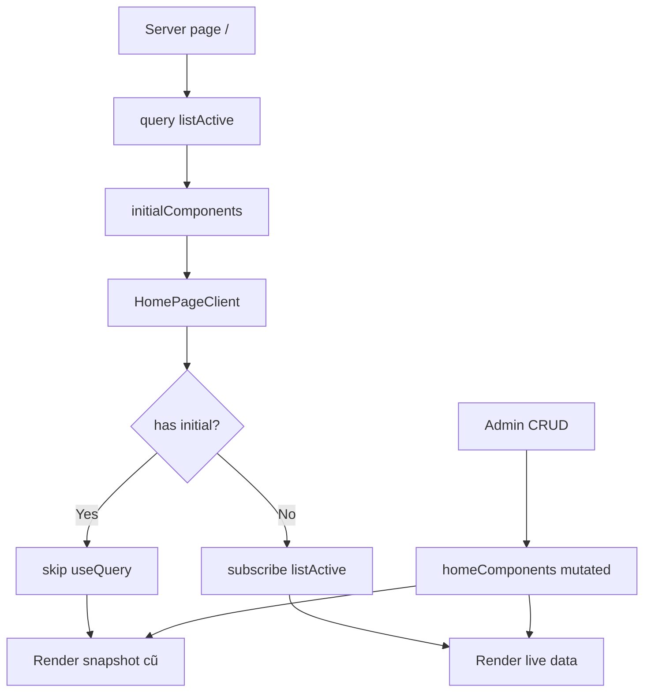

# I. Primer

## 1. TL;DR kiểu Feynman
- Lỗi lần này không còn nằm ở create form nữa, mà nằm ở chính homepage `/` của site.
- Route `/` đang lấy danh sách home-components ở server trước, rồi truyền snapshot xuống client.
- Nhưng client lại có điều kiện `skip` realtime query nếu đã có snapshot ban đầu.
- Vì snapshot luôn có, tab homepage đang mở không hề subscribe Convex realtime cho phần body.
- Kết quả là CRUD ở `/admin/home-components` xong thì homepage chỉ đổi sau khi F5.
- Hướng sửa tối thiểu: vẫn giữ SSR snapshot cho SEO/first paint, nhưng homepage client phải luôn `useQuery(api.homeComponents.listActive)` và chỉ dùng snapshot làm fallback lúc query chưa sẵn sàng.

## 2. Elaboration & Self-Explanation
Anh đang nói rất rõ: sau khi CRUD ở `/admin/home-components`, tab site homepage `/` đang mở sẵn phải tự đổi ngay, nhưng hiện tại vẫn cần F5. Audit sâu hơn cho thấy đây là lỗi ở boundary giữa server render và client realtime subscription.

Cụ thể, route `/` hiện đang làm 2 bước:

a) server gọi Convex để lấy `initialComponents`,
b) client nhận `initialComponents` rồi render homepage.

Điểm sai nằm ở bước b): client có `useQuery(api.homeComponents.listActive)` nhưng lại chỉ bật query này khi **không có** `initialComponents`. Trong thực tế homepage luôn có `initialComponents`, nên query realtime bị `skip`.

Nói cách khác:
- Server render đang đúng cho SEO và first load.
- Convex provider ở client cũng có sẵn.
- Nhưng code homepage đã tự tắt subscription realtime của phần body.

Đó là lý do vì sao create/update/delete đều dính hết: không phải lỗi riêng một mutation nào, mà là homepage body không hề nghe realtime update.

## 3. Concrete Examples & Analogies
Ví dụ sát task:
- Tab A mở `http://localhost:3000/`.
- Tab B vào `/admin/home-components`, tạo thêm một Hero mới hoặc xóa một section đang active.
- Mutation Convex chạy xong và DB đã đổi.
- Nhưng Tab A vẫn đang render từ `initialComponents` cũ vì `HomePageClient` không subscribe `listActive`.
- Chỉ khi F5, server query lại `listActive` và gửi snapshot mới, nên homepage mới đổi.

Analogy đời thường:
- Giống như anh chụp một tấm ảnh danh sách trưng bày lúc 9h sáng rồi đưa cho nhân viên ngoài sảnh. Trong ngày kho thay đổi liên tục, nhưng ngoài sảnh không bật màn hình live mà cứ nhìn tấm ảnh cũ. Chỉ khi chụp lại ảnh mới (F5) thì ngoài sảnh mới thấy cập nhật.

# II. Audit Summary (Tóm tắt kiểm tra)

## Observation
- User xác nhận bề mặt lỗi là `Trang site /`.
- User xác nhận kỳ vọng là `đang mở sẵn vẫn tự đổi`.
- User xác nhận cả `tạo mới, sửa, xóa` đều tái hiện.
- `app/(site)/page.tsx` đang SSR:
  - `const initialComponents = await client.query(api.homeComponents.listActive);`
  - rồi render `<HomePageClient initialComponents={initialComponents} />`
- `app/(site)/_components/HomePageClient.tsx` đang có:
  - `const shouldFetchLive = !initialComponents;`
  - `useQuery(api.homeComponents.listActive, shouldFetchLive ? undefined : 'skip')`
- `components/providers/convex-provider.tsx` cho thấy Convex React client vẫn được mount bình thường ở client.
- `convex/homeComponents.ts` cho thấy source of truth của homepage là `listActive`, đọc trực tiếp bảng `homeComponents` theo index `by_active_order`.

## Inference
- CRUD admin không phải root cause chính, vì mọi mutation đều ghi vào cùng bảng `homeComponents` và homepage lại đọc từ `listActive`.
- Root cause nằm ở homepage client đã skip query realtime ngay từ đầu nếu có SSR snapshot.

## Decision
- Sửa nhỏ nhất và đúng nhất là ở `HomePageClient.tsx`: luôn subscribe realtime, giữ `initialComponents` chỉ làm fallback trong lúc `useQuery` chưa trả dữ liệu.
- Không cần đổi schema, không cần refactor mutation admin, không cần invalidation thủ công.

# III. Root Cause & Counter-Hypothesis (Nguyên nhân gốc & Giả thuyết đối chứng)

## Root Cause Confidence (Độ tin cậy nguyên nhân gốc)
- High — Homepage body đang chủ động `skip` Convex realtime query khi có `initialComponents`, khiến tab `/` mở sẵn không theo dõi thay đổi CRUD.

## Trả lời 8 câu audit bắt buộc
1. Triệu chứng quan sát được là gì (expected vs actual)?
   - Expected: đang mở sẵn `/` thì sau create/update/delete ở admin, homepage tự đổi ngay.
   - Actual: homepage không đổi cho tới khi F5.
2. Phạm vi ảnh hưởng (user, module, môi trường)?
   - Ảnh hưởng site homepage `/`, module `home-components`, trong runtime client của site.
3. Có tái hiện ổn định không? điều kiện tái hiện tối thiểu?
   - Có. Chỉ cần mở sẵn `/`, sang `/admin/home-components` CRUD active components ở tab khác là tái hiện.
4. Mốc thay đổi gần nhất (commit/config/dependency/data)?
   - Chưa xác định commit gây ra, nhưng code hiện tại cho thấy logic `skip` đã hiện diện ở `HomePageClient.tsx`.
5. Dữ liệu nào đang thiếu để kết luận chắc chắn?
   - Không thiếu dữ liệu quan trọng; evidence tĩnh đủ mạnh vì query realtime bị skip trực tiếp trong code.
6. Có giả thuyết thay thế hợp lý nào chưa bị loại trừ?
   - Có: vấn đề ở dynamic import section, memoization, hoặc mutation không đẩy đúng data. Nhưng các giả thuyết này yếu hơn rõ rệt.
7. Rủi ro nếu fix sai nguyên nhân là gì?
   - Có thể sửa lan sang admin mutations hoặc cache server không cần thiết, tăng scope mà vẫn không làm homepage live.
8. Tiêu chí pass/fail sau khi sửa?
   - Pass: tab `/` đang mở sẵn tự cập nhật sau create/update/delete, không F5.
   - Fail: vẫn chỉ thấy dữ liệu mới sau refresh.

## Counter-Hypothesis (Giả thuyết đối chứng)
- Giả thuyết A: mutation admin không ghi đúng dữ liệu.
  - Evidence chống lại: `convex/homeComponents.ts` có `create/update/remove/toggle/reorder`, homepage đọc từ `listActive` trên cùng bảng.
- Giả thuyết B: Convex provider trên site không hoạt động.
  - Evidence chống lại: `components/providers/convex-provider.tsx` có `ConvexReactClient` và `ConvexProvider` đầy đủ.
- Giả thuyết C: dynamic import hoặc renderer con chặn update.
  - Evidence chống lại: nếu query gốc không subscribe thì toàn body đã stale trước khi tới renderer con.
- Giả thuyết D: homepage body skip realtime query.
  - Evidence ủng hộ mạnh: `HomePageClient.tsx` đang explicit `skip` khi có `initialComponents`.

# IV. Proposal (Đề xuất)

## Option duy nhất hợp lý trong ngữ cảnh
- Option A (Recommend) — Confidence 96%: giữ SSR snapshot cho homepage nhưng luôn bật `useQuery(api.homeComponents.listActive)` ở client, chỉ dùng `initialComponents` làm fallback tạm thời.
  - Vì sao tốt nhất: sửa đúng root cause, scope nhỏ, không chạm data model, không phá SEO/SSR hiện có.
  - Tradeoff: client homepage sẽ luôn có subscription realtime cho danh sách active components, nhưng đây chính là behavior user mong muốn.

## Cách làm cụ thể
1. Sửa `app/(site)/_components/HomePageClient.tsx`:
   - bỏ `const shouldFetchLive = !initialComponents;`
   - bỏ `'skip'` trong `useQuery`
   - đổi thành `const components = useQuery(api.homeComponents.listActive);`
   - giữ `const resolvedComponents = components ?? initialComponents;`
2. Giữ nguyên `app/(site)/page.tsx`:
   - tiếp tục SSR `initialComponents` để first paint và SEO không đổi.
3. Review lại loading logic trong `HomePageClient.tsx`:
   - đảm bảo flow `isDataReady` vẫn ổn khi `components` còn `undefined` lúc hydration.
4. Chỉ nếu phát hiện section con nào vẫn không rerender sau khi parent list đổi:
   - audit tiếp key/render boundary trong `HomeComponentRenderer`, nhưng đây là vòng 2 chứ không phải bước đầu.

# V. Files Impacted (Tệp bị ảnh hưởng)

## UI / site
- Sửa: `app/(site)/_components/HomePageClient.tsx`
  - Vai trò hiện tại: client renderer chính của homepage, quyết định dùng SSR snapshot hay Convex query.
  - Thay đổi: luôn subscribe realtime `listActive`, dùng snapshot chỉ làm fallback thay vì điều kiện để skip query.
- Giữ nguyên: `app/(site)/page.tsx`
  - Vai trò hiện tại: SSR homepage và truyền `initialComponents`.
  - Thay đổi: không cần sửa trong vòng fix tối thiểu; chỉ dùng làm context của data flow.

## Server / Convex
- Giữ nguyên: `convex/homeComponents.ts`
  - Vai trò hiện tại: source of truth cho `listActive` và toàn bộ CRUD home-components.
  - Thay đổi: chưa cần sửa vì query hiện tại đã đúng với yêu cầu realtime.

# VI. Execution Preview (Xem trước thực thi)

1. Đọc lại `HomePageClient.tsx` để xác nhận loading flow sau hydration.
2. Bỏ gate `shouldFetchLive` và chuyển homepage sang luôn subscribe `listActive`.
3. Review tĩnh nhánh render `resolvedComponents`, `isDataReady`, empty state, và deferred sections.
4. Nếu có sửa TS code, chạy `bunx tsc --noEmit`.
5. Commit local kèm spec, không push.

# VII. Verification Plan (Kế hoạch kiểm chứng)

## Verification Plan
- Repro thủ công sau khi sửa:
  - mở tab A ở `/`
  - mở tab B ở `/admin/home-components`
  - tạo mới component active → tab A tự hiện section mới, không F5
  - sửa title/config/order → tab A tự đổi đúng, không F5
  - xóa component active → tab A tự mất section tương ứng, không F5
- Soát tĩnh để đảm bảo:
  - loading skeleton không bị giữ sai khi hydration
  - empty state vẫn đúng nếu không có component active
  - deferred sections vẫn hoạt động vì danh sách nguồn `resolvedComponents` vẫn cùng shape
- Nếu có thay đổi code TS, chạy `bunx tsc --noEmit` trước commit.
- Không chạy lint/unit test theo quy ước repo.

# VIII. Todo

1. Sửa `HomePageClient.tsx` để luôn subscribe `api.homeComponents.listActive`.
2. Review logic fallback `initialComponents` và loading state.
3. Typecheck TS nếu có sửa code.
4. Commit local kèm spec.

# IX. Acceptance Criteria (Tiêu chí chấp nhận)

- Tab homepage `/` đang mở sẵn tự cập nhật sau create/update/delete home-components ở admin.
- Không cần F5 để thấy thay đổi active components.
- SSR snapshot ban đầu vẫn hoạt động cho first load.
- Không thay schema Convex và không cần thêm invalidation thủ công.

# X. Risk / Rollback (Rủi ro / Hoàn tác)

- Rủi ro chính: nếu loading logic đang vô tình dựa vào `skip`, việc luôn subscribe có thể lộ ra một flash loading ngắn khi hydration.
- Cách giảm rủi ro: giữ `initialComponents` làm fallback và review kỹ nhánh `isDataReady`.
- Rollback: revert sửa đổi tại `HomePageClient.tsx`; thay đổi hẹp, dễ hoàn tác.

# XI. Out of Scope (Ngoài phạm vi)

- Không refactor lại toàn bộ homepage renderer.
- Không sửa mutation/admin CRUD flow.
- Không thay đổi `homeComponentStats` hay cơ chế counter.
- Không sửa docs/README ngoài spec đang lưu.

# XII. Open Questions (Câu hỏi mở)

- Không còn ambiguity đủ lớn để chặn triển khai; root cause đã có evidence trực tiếp trong code.