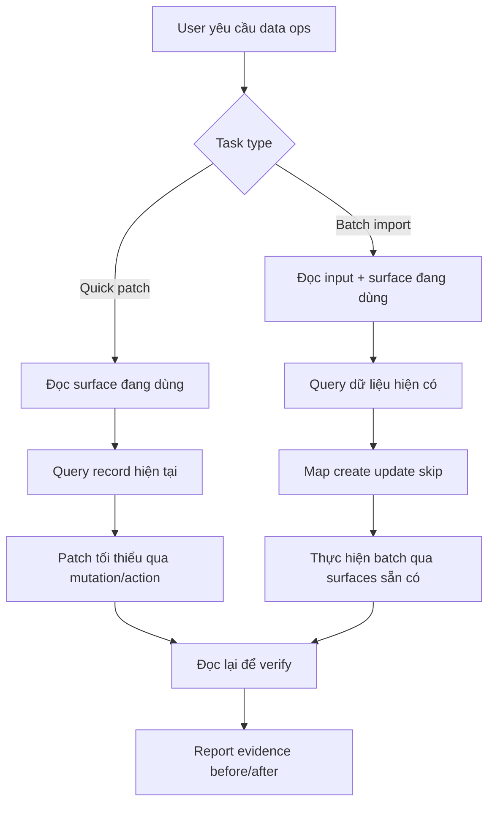

# I. Primer
## 1. TL;DR kiểu Feynman
- Repo này đã có rule rất rõ cho thao tác dữ liệu thật trên Convex: đọc đúng surface đang dùng, dùng lại query/mutation có sẵn, patch tối thiểu, rồi đọc lại để verify.
- Spec KDC bạn đưa là ví dụ tốt cho một workflow import/sửa data dựa trên evidence, không chọc thẳng DB và không mở rộng schema khi chưa cần.
- Em đề xuất tạo **một skill mới riêng** cho data ops Convex, thay vì nhét hết vào skill master hiện có.
- Skill mới này sẽ bao quát cân bằng cả 2 nhóm việc: **sửa dữ liệu thật nhanh** và **import batch vào Convex**.
- Phạm vi bạn chọn là **SKILL.md tối giản**, nên em sẽ không productize thêm checklist/examples riêng ở vòng này.
- Skill mới sẽ đóng vai trò “playbook thao tác dữ liệu thật”, còn `system-extension-guideline` tiếp tục là master skill cho thay đổi hệ thống rộng hơn.

## 2. Elaboration & Self-Explanation
Bài toán ở đây không phải “thêm một skill viết chung chung về Convex”, mà là đóng gói đúng kinh nghiệm thao tác dữ liệu thật trong repo này thành một skill đủ rõ để agent dùng lại nhất quán.

Từ spec KDC, em rút ra một pattern rất đáng giữ:

a) luôn đọc dữ liệu thật trước,

b) bám đúng query/mutation/action đang là source of truth,

c) chỉ thêm function mới khi capability hiện tại thật sự thiếu,

d) patch tối thiểu,

e) verify bằng đọc lại sau khi ghi,

f) bàn giao phải có evidence: function nào dùng, record nào chạm, before/after ngắn gọn.

Repo hiện tại cũng đã có rule này ngay trong `AGENTS.md` ở mục `Convex Real Data Ops (Best Practices)`. Nghĩa là tri thức cốt lõi đã tồn tại, nhưng đang nằm ở guideline chung của repo chứ chưa được đóng thành một skill chuyên dụng để agent tự kích hoạt khi user nói kiểu:
- “sửa nhanh dữ liệu Convex giúp mình”
- “import batch vào Convex”
- “đọc data thật rồi patch record này”
- “dùng query/mutation có sẵn để update menu/settings/products”

Nếu không có skill riêng, agent dễ rơi vào 2 lỗi:
- hoặc xử lý theo hướng code-first, tạo thêm schema/function không cần thiết,
- hoặc làm thiếu bước evidence/verify sau mutate.

Vì vậy hướng tốt nhất là tạo một skill riêng, scope nhỏ nhưng sắc: chỉ lo **real data operations trên Convex**.

## 3. Concrete Examples & Analogies
Ví dụ sát với spec KDC:
- User nói: “Nhập ảnh + sản phẩm từ thư mục local vào Convex, nhớ đọc category hiện có trước.”
- Skill sẽ hướng agent đi theo luồng: đọc query hiện có → lấy snapshot categories/products → map dữ liệu đầu vào → upload storage nếu cần → gọi mutation create/update → đọc lại để verify → trả report created/skipped/errors.

Ví dụ sửa data nhanh:
- User nói: “Đổi featured product ở homepage sang record X.”
- Skill sẽ ép agent: tìm route/surface đang đọc field đó → xác định đúng query/mutation → đọc record hiện tại → patch đúng field cần đổi → đọc lại → báo before/after.

Analogy đời thường:
- Skill này giống một “quy trình nhập/xuất kho chuẩn”. Không được tự phá kệ kho để lấy hàng ra nhanh hơn. Phải xem sổ kho trước, sửa đúng món, rồi kiểm hàng lại sau khi thao tác.

# II. Audit Summary (Tóm tắt kiểm tra)
- Observation: `AGENTS.md` đã có rule rất rõ cho Convex real data ops, đặc biệt các nguyên tắc: ưu tiên query/mutation/action có sẵn, đọc trước khi ghi, patch tối thiểu, verify sau khi ghi, và bàn giao có evidence.
- Observation: repo đã có các skill lớn như `system-extension-guideline`, `module-creator`, `module-qa-tester`, nhưng chưa có skill riêng tập trung vào **thao tác dữ liệu thật** trên Convex.
- Observation: `system-extension-guideline` đang bao quát thay đổi hệ thống rộng: schema, queries/mutations, seed/cleanup, wizard wiring. Scope này rộng hơn nhiều so với nhu cầu “tạo/sửa data thật”.
- Observation: spec KDC cung cấp đúng mẫu workflow import/sửa data mà repo này cần học: bám surface có sẵn, không bypass business logic, verify bằng query sau khi mutate, và hạn chế capability gap ở mức tối thiểu.
- Observation: bạn đã chốt yêu cầu rõ qua AskUser:
  - hướng triển khai: `Skill mới riêng cho data ops`
  - trọng tâm: `Cả hai cân bằng`
  - mức productize: `Chỉ SKILL.md tối giản`

# III. Root Cause & Counter-Hypothesis (Nguyên nhân gốc & Giả thuyết đối chứng)
## Root Cause Confidence (Độ tin cậy nguyên nhân gốc): High
Lý do:
- Vấn đề không phải thiếu guideline hoàn toàn; vấn đề là **thiếu một skill chuyên dụng, kích hoạt đúng ngữ cảnh**, để biến guideline rải rác + pattern từ spec KDC thành workflow có thể tái dùng.
- `system-extension-guideline` quá rộng cho các task data ops hàng ngày; nếu dùng nó cho mọi yêu cầu sửa data thật sẽ tạo noise và tăng nguy cơ mở rộng scope.
- Pattern KDC chứng minh repo đã có đủ “nguyên tắc đúng”, chỉ thiếu lớp đóng gói thành skill.

## Trả lời 5/8 câu bắt buộc theo Audit Protocol
1. Triệu chứng quan sát được là gì?
- Expected: khi user yêu cầu tạo/sửa dữ liệu Convex, agent có một playbook chuyên dụng, nhất quán, ưu tiên read-before-write và evidence-based.
- Actual: hiện chỉ có guideline chung trong `AGENTS.md` và skill rộng hơn, chưa có skill chuyên biệt cho data ops.

2. Phạm vi ảnh hưởng?
- Ảnh hưởng vào cách agent xử lý các task dữ liệu thật trong toàn repo, đặc biệt các module dùng Convex như products, settings, menus, homepage, services, posts.

3. Có tái hiện ổn định không? điều kiện tái hiện tối thiểu?
- Có. Mỗi khi user yêu cầu “sửa data thật”, “import batch”, “update record nhanh”, tình huống này đều tái diễn.

4. Mốc thay đổi gần nhất?
- Không có evidence rằng đây là bug do commit gần đây; đây là capability gap ở lớp workflow/skill.

5. Dữ liệu nào đang thiếu để kết luận chắc chắn?
- Không thiếu dữ liệu quan trọng để lên spec. Chỉ còn phần xác nhận wording cuối cùng khi thực thi SKILL.md.

6. Có giả thuyết thay thế hợp lý nào chưa bị loại trừ?
- Có: gộp capability này vào `system-extension-guideline`. Nhưng bạn đã chọn skill riêng, và evidence cho thấy scope riêng là hợp lý hơn.

7. Rủi ro nếu fix sai nguyên nhân là gì?
- Nếu gói skill quá rộng, agent sẽ tiếp tục mở scope không cần thiết.
- Nếu skill quá hẹp, agent lại không cover đủ import batch và sửa data nhanh.

8. Tiêu chí pass/fail sau khi sửa?
- Có skill mới, mô tả kích hoạt rõ.
- Nội dung skill hướng đúng 2 workflow chính: quick patch và batch import.
- Skill buộc agent dùng query/mutation/action sẵn có, read-before-write, verify-after-write, evidence handoff.
- Không chồng lấn khó hiểu với master skill hiện có.

## Counter-Hypothesis (Giả thuyết đối chứng)
- Giả thuyết A: chỉ cần cập nhật `AGENTS.md` là đủ.
  - Bị bác bỏ vì rule trong AGENTS là nền tảng repo, không phải skill có trigger rõ để agent tự dùng theo ngữ cảnh.
- Giả thuyết B: gộp vào `system-extension-guideline` là tốt hơn.
  - Không phù hợp bằng vì skill master đang xử lý cả module/experience/home-component/seed/schema; quá rộng cho task data ops hàng ngày.
- Giả thuyết C: nên tạo skill đầy đủ gồm checklist + examples ngay.
  - Chưa cần vì bạn đã chọn mức tối giản `chỉ SKILL.md`; làm thêm lúc này là mở rộng scope.

# IV. Proposal (Đề xuất)
## Option A (Recommend) — Confidence 92%
Tạo **skill mới riêng** trong `.factory/skills/convex-real-data-ops/SKILL.md`, tập trung vào thao tác dữ liệu thật trên Convex cho cả 2 nhóm việc:
- quick patch / sửa dữ liệu thật nhanh
- import batch / nhập dữ liệu vào Convex

Vì sao đây là hướng tốt nhất trong ngữ cảnh hiện tại:
- Khớp đúng lựa chọn của bạn.
- Tách biệt rõ với skill master để giảm noise.
- Tái sử dụng trực tiếp pattern KDC + rule sẵn có trong AGENTS.
- Giữ scope nhỏ, dễ rollback, đúng KISS/YAGNI.

### Nội dung chính SKILL.md đề xuất
1. Frontmatter rõ trigger:
   - user mentions: sửa data thật, import data Convex, patch record, update settings/menu/products bằng Convex, upload storage rồi create record, v.v.
2. When to use:
   - chỉnh dữ liệu thật qua query/mutation/action có sẵn
   - import batch từ file/folder/json/excel vào Convex
   - verify before/after trên production-like/local deployment
3. Core workflow 2 nhánh:
   - Quick Patch Flow
   - Batch Import Flow
4. Guardrails bắt buộc:
   - không thêm schema/table/function nếu chỉ cần sửa data
   - đọc trước khi ghi
   - patch tối thiểu
   - bám đúng source of truth
   - verify sau khi ghi
   - evidence khi bàn giao
5. Output contract:
   - functions đã dùng
   - records đã chạm
   - fields đã đổi
   - before/after ngắn gọn
   - verify steps
   - skipped/errors nếu là batch

### Mermaid flow đề xuất

### Cấu trúc nội dung SKILL.md dự kiến
- `Overview`
- `When to use`
- `When NOT to use`
- `Core principles`
- `Workflow A: Quick patch`
- `Workflow B: Batch import`
- `Evidence checklist`
- `Output format`
- `Conflict resolution` với `system-extension-guideline`

# V. Files Impacted (Tệp bị ảnh hưởng)
- Thêm: `.factory/skills/convex-real-data-ops/SKILL.md`
  - Vai trò hiện tại: chưa có skill chuyên cho thao tác dữ liệu thật Convex.
  - Thay đổi: thêm một skill mới tối giản, đóng gói workflow sửa data thật và import batch dựa trên pattern KDC + AGENTS rules.

- Sửa: không dự kiến sửa `.factory/skills/system-extension-guideline/SKILL.md`
  - Vai trò hiện tại: master playbook mở rộng hệ thống.
  - Thay đổi: không sửa ở vòng này để tránh chồng scope; nếu cần có thể tham chiếu chéo ở vòng sau.

- Sửa: không dự kiến sửa `AGENTS.md`
  - Vai trò hiện tại: chứa rule nền cho Convex Real Data Ops.
  - Thay đổi: không sửa vì skill mới sẽ kế thừa từ đó, không thay thế.

# VI. Execution Preview (Xem trước thực thi)
1. Đọc kỹ style các skill hiện có để bám format frontmatter + section headings.
2. Tạo thư mục skill mới `convex-real-data-ops` trong `.factory/skills`.
3. Viết `SKILL.md` tối giản, bám pattern KDC và rule Convex Real Data Ops trong AGENTS.
4. Rà lại wording để tránh trùng scope với `system-extension-guideline`.
5. Review tĩnh nội dung: trigger rõ, workflow rõ, guardrails rõ, output contract rõ.
6. Commit thay đổi tối thiểu theo rule repo.

# VII. Verification Plan (Kế hoạch kiểm chứng)
- Static verification:
  - frontmatter hợp lệ: `name`, `description` rõ trigger và đúng naming convention.
  - file path đúng: `.factory/skills/convex-real-data-ops/SKILL.md`.
  - scope không lấn sang module creation / schema design / QA rộng.
- Content verification:
  - có đủ 2 luồng: quick patch và batch import.
  - có nêu read-before-write, patch tối thiểu, verify-after-write, evidence handoff.
  - có phần `When NOT to use` để tránh agent dùng sai ngữ cảnh.
- Theo repo rule:
  - không chạy lint/test/build vì task này chỉ thêm skill markdown và AGENTS cấm tự chạy.

# VIII. Todo
1. Tạo spec cho skill mới `convex-real-data-ops`.
2. Viết `SKILL.md` tối giản theo pattern skill hiện có.
3. Đảm bảo skill cover cân bằng quick patch và batch import.
4. Review tĩnh để tránh chồng scope với `system-extension-guideline`.
5. Commit thay đổi tối thiểu sau khi bạn duyệt spec và em thực thi.

# IX. Acceptance Criteria (Tiêu chí chấp nhận)
- Có skill mới riêng cho data ops Convex trong `.factory/skills/convex-real-data-ops/SKILL.md`.
- Skill mô tả rõ khi nào dùng cho sửa dữ liệu thật nhanh và khi nào dùng cho import batch.
- Skill bắt buộc bám query/mutation/action có sẵn trước khi nghĩ đến việc thêm capability mới.
- Skill nêu rõ quy trình đọc trước khi ghi, patch tối thiểu, đọc lại để verify.
- Skill có output contract evidence-based khi bàn giao.
- Không mở rộng sang checklist/reference/examples ở vòng này.

# X. Risk / Rollback (Rủi ro / Hoàn tác)
- Rủi ro 1: skill trùng vai trò với `system-extension-guideline`.
  - Giảm thiểu: ghi rõ conflict resolution và when-not-to-use.
- Rủi ro 2: skill mô tả quá ngắn, trigger không đủ mạnh.
  - Giảm thiểu: mô tả frontmatter phải chứa từ khóa thực tế user hay nói: Convex, data thật, import batch, patch record, query/mutation.
- Rủi ro 3: skill thiên quá nhiều về import hoặc quá nhiều về patch.
  - Giảm thiểu: chia 2 workflow song song, cân bằng theo yêu cầu của bạn.
- Rollback:
  - nếu skill wording chưa ổn, rollback rất dễ vì chỉ là thêm 1 file skill mới; có thể sửa hoặc xóa skill mà không ảnh hưởng code runtime.

# XI. Out of Scope (Ngoài phạm vi)
- Không tạo thêm checklist.md, examples.md, reference.md ở vòng này.
- Không sửa `system-extension-guideline` hoặc `AGENTS.md` nếu chưa thật sự cần.
- Không thêm helper script, command, hay automation để mutate data.
- Không đụng vào code Convex runtime của app ở bước này.

# XII. Open Questions (Câu hỏi mở)
- Không còn ambiguity lớn. Scope đã đủ rõ để thực thi: skill mới riêng, cân bằng quick patch + batch import, chỉ cần SKILL.md tối giản.

Nếu bạn duyệt spec này, bước tiếp theo em sẽ tạo skill mới `convex-real-data-ops` theo đúng khung trên.