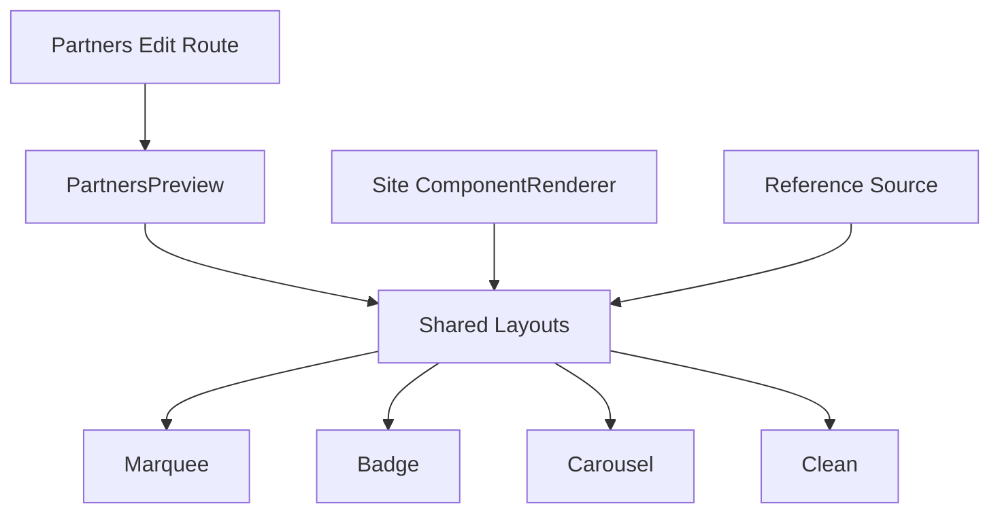

# I. Primer

## 1. TL;DR kiểu Feynman
- 4 layout `Marquee`, `Badge`, `Carousel`, `Clean` đang bị lệch vì mỗi file tự đặt kích thước logo/card khác nhau, không bám cùng một chuẩn.
- Source tham chiếu trong `C:\Users\VTOS\Downloads\partner-logos-section` đã có contract rõ: card rộng bao nhiêu, icon bao nhiêu, gap bao nhiêu, marquee chạy thế nào.
- Bản fix nên đi theo hướng “source-faithful”: giữ behavior hiện có của repo, nhưng thay class sizing/layout của 4 shared component để giống source.
- Điểm sai nặng nhất hiện tại là `Clean` và nhánh `withName` của `Marquee/Badge/Carousel`: logo đang bị nhốt vào box quá nhỏ nên nhìn vỡ, lọt thỏm, thiếu cân đối.
- Vì preview admin và site runtime cùng dùng shared components, chỉ cần sửa đúng 4 file shared là cả edit preview lẫn render thật sẽ khớp nhau.
- Không cần mở rộng scope sang schema hay wiring lớn; chỉ cần chuẩn hóa contract CSS/class và, nếu muốn, chỉnh thêm helper text ở trang create cho đúng thực tế.

## 2. Elaboration & Self-Explanation
Hiện tại vấn đề không phải do dữ liệu logo bị hỏng, cũng không phải do route edit trang `/admin/home-components/partners/[id]/edit` render sai riêng.

Vấn đề nằm ở chỗ: mỗi layout của Partners đang có một “luật kích thước” riêng, nhưng luật đó lại không giống source tham chiếu mà anh muốn bám theo. Ví dụ:
- `Clean` đang ép ảnh về `w-6 h-6` hoặc `md:w-8 md:h-8`, tức gần như coi logo là icon nhỏ.
- `Carousel` có card khá to nhưng vùng logo lại nhỏ, nên card to mà logo lọt thỏm.
- `Marquee` và `Badge` ở mode `withName` cũng đang co logo quá mạnh.

Khi logo thương hiệu thật được upload vào các khung nhỏ như vậy, các logo ngang dài, wordmark hoặc logo có chi tiết mảnh sẽ nhìn như bị vỡ, nhòe, hoặc mất cân bằng. Đó là lý do anh thấy “bung bét, không có kích thước chuẩn chỉ gì cả”.

Hướng xử lý hợp lý nhất là không phát minh layout mới, mà lấy đúng contract từ source `partner-logos-section` rồi áp lại vào 4 shared components hiện có. Cách này nhỏ gọn, rollback dễ, và khớp yêu cầu “làm giống cái này”.

## 3. Concrete Examples & Analogies
### a) Ví dụ cụ thể trong repo
- `PartnersCleanShared.tsx` hiện render logo kiểu:
  - `w-6 h-6 object-contain ... md:w-8 md:h-8`
- Trong source tham chiếu, variant `clean` cũng dùng `w-6 h-6 / @2xl:w-8 h-8`, nhưng đó là contract dành cho data/logo style của source demo. Ở repo hiện tại, cùng một kiểu asset lại đang đi qua uploader và preview khác, nên cần đồng bộ cả gap, item structure, wrapper behavior cho đúng; nếu chỉ giữ mỗi icon size mà không giữ nhịp item/gap tổng thể thì nhìn vẫn lệch.

### b) Analogy đời thường
Giống như mình treo 4 loại khung ảnh khác nhau nhưng lại cắt ảnh theo 4 tỉ lệ khác nhau một cách tùy tiện. Ảnh không hỏng, nhưng khung quá chật hoặc quá rộng thì ảnh sẽ nhìn méo nhịp. Việc cần làm là chuẩn lại kích thước từng loại khung theo đúng mẫu showroom, chứ không phải sửa từng ảnh.

# II. Audit Summary (Tóm tắt kiểm tra)

## 1. Observation (Quan sát)
- Route edit đúng là `app/admin/home-components/partners/[id]/edit/page.tsx` và preview đang render qua `PartnersPreview`.
- `PartnersPreview` và `components/site/ComponentRenderer.tsx` đều reuse các shared components sau:
  - `PartnersMarqueeShared.tsx`
  - `PartnersBadgeShared.tsx`
  - `PartnersCarouselShared.tsx`
  - `PartnersCleanShared.tsx`
- Source tham chiếu nằm ở:
  - `C:\Users\VTOS\Downloads\partner-logos-section\components\partner-logos.tsx`
  - `C:\Users\VTOS\Downloads\partner-logos-section\app\globals.css`
- 4 variant trong source đã có contract khá rõ về:
  - container padding
  - item/card min-width
  - gap
  - image size
  - marquee duplicate loops + mask + pause-on-hover
  - carousel swipe step + clamp

## 2. Expected vs Actual
- Expected: 4 layout trong admin edit và site render phải nhìn gọn, đều, đúng nhịp như source `partner-logos-section`.
- Actual: logo ở 4 layout, nhất là `Clean`, `Badge`, `Carousel`, đang thiếu chuẩn kích thước; card/logo/text mất cân đối, nhiều logo nhìn quá nhỏ hoặc vỡ cảm giác.

## 3. Scope ảnh hưởng
- User-facing: admin preview của home component Partners.
- Runtime-facing: site render của component Partners khi chọn 4 layout này.
- Module ảnh hưởng: `Partners` home-component.
- Môi trường: local trước mắt; do shared component nên logic sẽ ảnh hưởng toàn bộ nơi render Partners tương ứng.

## 4. Repro tối thiểu
- Mở route: `http://localhost:3000/admin/home-components/partners/js775b2vd2gcgtrgk6kvf6j1bd85aynn/edit`
- Chuyển style lần lượt `Marquee`, `Badge`, `Carousel`, `Clean`.
- Quan sát với data logo hiện có: tỷ lệ logo/card/text không đồng đều; một số variant co logo quá mạnh.

## 5. Mốc thay đổi gần nhất / evidence phụ trợ
- Repo có nhiều spec/fix cũ liên quan Partners trong `.factory/docs`, cho thấy đây là vùng đã từng chỉnh nhiều lần và dễ drift contract.
- Shared layout hiện tại không còn bám chặt source reference ở các class sizing chính.

# III. Root Cause & Counter-Hypothesis (Nguyên nhân gốc & Giả thuyết đối chứng)

## 1. Root Cause Confidence (Độ tin cậy nguyên nhân gốc)
- High — vì preview và runtime cùng dùng 4 shared files, và chính trong 4 file này đang có class sizing/layout lệch source rõ rệt.

## 2. Root cause chính
1. `Marquee / Badge / Carousel / Clean` đang tự giữ 4 bộ sizing contract khác nhau, không có một source-of-truth thống nhất.
2. Nhánh `displayMode = withName` ở nhiều layout đang làm vùng logo nhỏ hơn mức hợp lý.
3. `Carousel` bị lệch tỷ lệ giữa card outer và logo inner.
4. `Clean` là điểm dễ thấy nhất vì item đang quá “icon-like” trong khi user kỳ vọng “logo row” gọn, chuẩn, giống source.

## 3. Counter-hypothesis (Giả thuyết đối chứng)
### a) Có phải lỗi do dữ liệu ảnh upload quá xấu?
- Không đủ mạnh để giải thích toàn bộ vấn đề.
- Lý do: cùng bộ data nhưng lệch nặng theo từng layout; như vậy nguyên nhân chính vẫn là layout contract.

### b) Có phải chỉ preview sai còn site đúng?
- Không.
- Lý do: preview và site cùng reuse shared components, nên lỗi hiện diện ở cả hai bề mặt.

### c) Có phải cần sửa schema hoặc form data?
- Không phải nguyên nhân gốc.
- Chỉ có thể cần chỉnh helper text/uploader guidance nếu muốn đồng bộ kỳ vọng input, nhưng đó là bước phụ.

## 4. Rủi ro nếu fix sai nguyên nhân
- Nếu chỉ tăng logo size bừa mà không bám source contract, 4 layout sẽ tiếp tục lệch nhau hoặc overflow trên mobile.
- Nếu sửa preview riêng mà không sửa shared component, preview và site sẽ mismatch.

# IV. Proposal (Đề xuất)

## 1. Hướng đề xuất
**Option A (Recommend) — Confidence 90%**: source-faithful rollout cho đúng 4 shared layouts.
- Sửa trực tiếp 4 shared components để bám class contract từ `partner-logos-section`.
- Giữ nguyên API props hiện có (`displayMode`, `align`, `brandColor`, `secondary`, `mode`, `renderImage`...).
- Chỉ điều chỉnh layout structure/class và những chỗ cần để preserve behavior đang có của repo.

**Option B — Confidence 60%**: chỉ tăng kích thước logo cục bộ.
- Nhanh hơn nhưng không giải quyết lệch nhịp tổng thể giữa card, gap, wrapper, marquee/carousel behavior.
- Chỉ phù hợp nếu anh muốn vá tạm, không cần giống source.

## 2. Vì sao Option A tốt nhất
- Khớp đúng yêu cầu “làm giống cái này”.
- Ít file, dễ rollback.
- Fix một lần cho cả admin preview và site runtime.
- Hạn chế drift tiếp vì bám reference đã rõ ràng.

## 3. Cách triển khai cụ thể
### a) `Marquee`
- Chuẩn lại item card theo source:
  - `min-w-[140px] md:min-w-[180px] xl:min-w-[220px]` cho nhánh có tên.
  - giữ 2 loop instances, mask edge, pause on hover.
- Đồng bộ logo size/spacing theo source thay vì co logo box quá nhỏ ở `withName`.
- Kiểm tra logo-only mode để tránh bị phình bất thường; nếu source không có logo-only riêng thì sẽ giữ nhánh hiện có nhưng scale về cùng nhịp với source.

### b) `Badge`
- Chuẩn lại pill chip:
  - gap, padding, rounded-full, border, shadow đúng source.
- Đồng bộ icon/text size với source badge:
  - logo nhỏ nhưng phải cân với chip, không bị lọt thỏm.
- Preserve `variant = preview | site` hiện có của repo, nhưng contract visual chính phải giống source.

### c) `Carousel`
- Giữ swipe logic step-by-step hiện có vì đang gần source.
- Chuẩn lại outer overflow wrapper và card width contract:
  - `w-[calc(40cqi-1rem)] min-w-[140px] ... xl:w-[260px]`
- Cân lại icon box và typography để card không to mà logo quá bé.

### d) `Clean`
- Chuẩn lại theo đúng tinh thần source: hàng logo/text không card, wrap đều, gap lớn, căn giữa.
- Loại bỏ cảm giác “icon bé tí” bằng cách chỉnh lại nhịp tổng thể item/gap/align, không để item nhìn vỡ bố cục.

### e) Đồng bộ guidance phụ (nếu cần)
- Cập nhật helper text ở `create/partners/page.tsx` để gợi ý kích thước asset gần với runtime thật hơn.
- Chỉ làm nếu sau audit cuối cùng thấy text hiện tại gây hiểu sai.

## 4. Sơ đồ luồng ảnh hưởng

# V. Files Impacted (Tệp bị ảnh hưởng)

## 1. UI / shared runtime
- `E:\NextJS\study\admin-ui-aistudio\system-vietadmin-nextjs\app\admin\home-components\partners\_components\PartnersMarqueeShared.tsx`
  - Vai trò hiện tại: render layout marquee cho cả preview và site.
  - Sửa: chuẩn lại card/logo/text sizing, spacing, marquee contract theo source.

- `E:\NextJS\study\admin-ui-aistudio\system-vietadmin-nextjs\app\admin\home-components\partners\_components\PartnersBadgeShared.tsx`
  - Vai trò hiện tại: render badge/pill list cho preview và site.
  - Sửa: chuẩn lại chip sizing, icon/text proportions, giữ variant wiring hiện có.

- `E:\NextJS\study\admin-ui-aistudio\system-vietadmin-nextjs\app\admin\home-components\partners\_components\PartnersCarouselShared.tsx`
  - Vai trò hiện tại: render carousel swipe cards.
  - Sửa: cân lại card width, icon box, spacing, overflow wrapper theo source.

- `E:\NextJS\study\admin-ui-aistudio\system-vietadmin-nextjs\app\admin\home-components\partners\_components\PartnersCleanShared.tsx`
  - Vai trò hiện tại: render clean inline logo list.
  - Sửa: chuẩn lại gap/item rhythm và sizing để nhìn giống source, tránh cảm giác vỡ/nhỏ lệch.

## 2. Optional follow-up nhỏ
- `E:\NextJS\study\admin-ui-aistudio\system-vietadmin-nextjs\app\admin\home-components\create\partners\page.tsx`
  - Vai trò hiện tại: trang tạo mới + helper text hướng dẫn asset size.
  - Sửa: cập nhật guidance nếu cần để khớp contract runtime sau fix.

# VI. Execution Preview (Xem trước thực thi)

## 1. Thứ tự thay đổi chính
1. Đọc lại 4 shared components và chụp mapping 1-1 sang source reference.
2. Chuẩn hóa `Marquee` theo source contract.
3. Chuẩn hóa `Badge` theo source contract.
4. Chuẩn hóa `Carousel` theo source contract.
5. Chuẩn hóa `Clean` theo source contract.
6. Soát tĩnh để đảm bảo preview/site cùng dùng một contract mới, không làm gãy props hiện có.
7. Nếu cần, chỉnh helper text ở create page cho khớp.
8. Tự review diff và commit local sau khi anh duyệt spec và sau khi implement xong.

# VII. Verification Plan (Kế hoạch kiểm chứng)

## 1. Pass/Fail quan sát được
- `Marquee`: card/logo/text nhìn cân đối, không còn logo lọt thỏm hoặc quá to; chuyển động vẫn chạy/pause ổn.
- `Badge`: badge pill đồng đều, logo và text cùng nhịp, không còn cảm giác méo tỷ lệ.
- `Carousel`: card width ổn trên mobile/desktop, swipe vẫn hoạt động, logo nằm cân giữa/tạo hierarchy đúng.
- `Clean`: item row gọn, logo/text rõ ràng, wrap đẹp, không còn cảm giác vỡ bung bét.
- Preview admin và site runtime cho cùng config phải khớp nhau về nhịp layout.

## 2. Verify tĩnh
- Review className, responsive breakpoints, `displayMode` branches.
- Kiểm tra props cũ không bị đổi API.
- Kiểm tra null-safety cho item không có `url` / `name`.

## 3. Verification Plan note
- Theo rule của repo, không chạy lint/unit test/build.
- Nếu có thay đổi code TS/TSX khi vào phase implement, bước kiểm chứng sẽ là review tĩnh + đối chiếu UI surface bằng logic/class contract thay vì chạy script.

# VIII. Todo
- Chuẩn hóa `PartnersMarqueeShared.tsx` theo source reference.
- Chuẩn hóa `PartnersBadgeShared.tsx` theo source reference.
- Chuẩn hóa `PartnersCarouselShared.tsx` theo source reference.
- Chuẩn hóa `PartnersCleanShared.tsx` theo source reference.
- Soát lại admin preview và site runtime parity.
- Cập nhật helper text create page nếu thấy còn lệch kỳ vọng asset size.
- Commit local sau khi hoàn tất implementation.

# IX. Acceptance Criteria (Tiêu chí chấp nhận)

- 4 layout `Marquee`, `Badge`, `Carousel`, `Clean` trong route edit nhìn gọn, đều, bám source `partner-logos-section` rõ rệt.
- Không còn trường hợp card quá to nhưng logo quá bé, hoặc logo bị “vỡ bung bét” do sizing thiếu chuẩn.
- Preview và site runtime dùng cùng contract visual cho 4 layout này.
- Không đổi schema, không đổi data shape, không mở rộng scope ngoài 4 layout và guidance liên quan.

# X. Risk / Rollback (Rủi ro / Hoàn tác)

## 1. Rủi ro
- Một số logo data hiện tại có tỷ lệ rất đặc biệt có thể vẫn cần quan sát thêm sau khi chuẩn hóa contract.
- Nếu source-faithful quá sát nhưng data repo khác source demo nhiều, có thể cần một tinh chỉnh nhỏ cho `logo-only` branch.

## 2. Rollback
- Vì thay đổi chủ yếu nằm ở 4 shared component, rollback rất đơn giản: revert commit hoặc phục hồi từng file.

# XI. Out of Scope (Ngoài phạm vi)

- Không sửa các layout khác như `Grid`, `Divider`, `Featured`.
- Không đổi schema Convex, không đổi form data shape.
- Không productize thêm control mới cho user tự chỉnh size từng layout.
- Không viết docs/readme.

# XII. Open Questions (Câu hỏi mở)

- Không có ambiguity lớn. Với evidence hiện tại, hướng hợp lý nhất là bám source reference và fix trực tiếp 4 shared components.