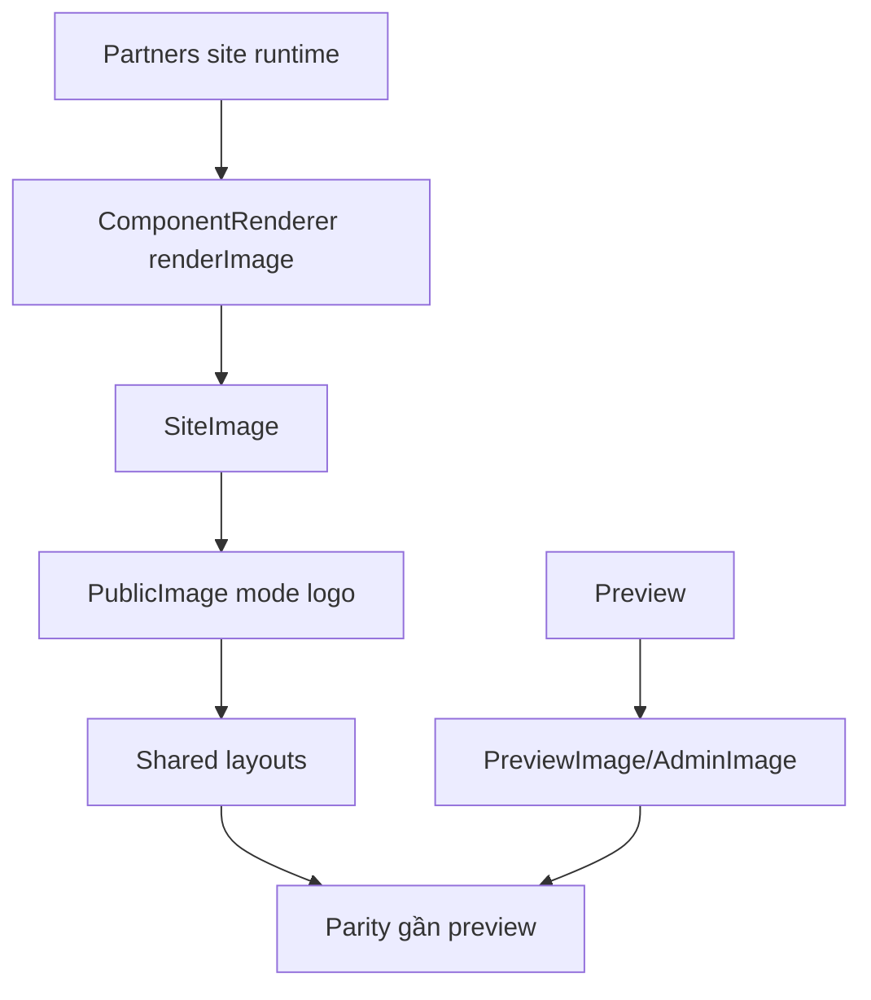

# I. Primer
## 1. TL;DR kiểu Feynman
- Preview đã đúng vì nó dùng ảnh `unoptimized` qua `PreviewImage/AdminImage`.
- Site runtime chưa đúng vì ảnh Partners đang đi qua `SiteImage -> PublicImage` với mode mặc định `primary`, nên pipeline render khác preview.
- Nghĩa là layout Grid không còn là thủ phạm chính; khác biệt nằm ở cách ảnh được render ở site.
- Em sẽ chuẩn hóa toàn bộ ảnh của Partners trên site sang contract ảnh giống preview hơn, thay vì chỉ vá riêng Grid.
- Mục tiêu là preview và site nhìn giống nhau nhất có thể trên tất cả layout Partners: grid, marquee, badge, carousel, clean, divider.

## 2. Elaboration & Self-Explanation
Hiện tại có 2 đường render ảnh khác nhau:
- Preview:
  - `PartnersPreview` truyền `PreviewImage`
  - `PreviewImage` dùng `AdminImage`
  - `AdminImage` mặc định `unoptimized = true`
- Site runtime:
  - `ComponentRenderer` truyền `SiteImage`
  - `SiteImage` dùng `PublicImage`
  - `PublicImage` mặc định chọn `mode = 'primary'`
  - `mode='primary'` không cùng contract với preview

Khi cùng một class CSS được áp vào 2 pipeline ảnh khác nhau, kết quả thực tế có thể lệch nhau ở site vì:
1. cách Next/Image xử lý khác
2. mode ảnh khác
3. unoptimized/optimized khác
4. normalize URL/runtime behavior khác

User đã chốt phạm vi là “Chuẩn hóa image mode cho toàn bộ Partners layouts”. Vậy hướng đúng là sửa ở tầng runtime image contract của Partners, không chỉ riêng Grid. Điều này giữ scope gọn nhưng vẫn xử lý đúng nguyên nhân.

## 3. Concrete Examples & Analogies
### a) Ví dụ cụ thể bám task
Hiện tại:
- Grid preview: logo full card đúng ý
- Grid site: cùng class nhưng ảnh qua pipeline khác nên cảm giác không full như preview

Sau khi sửa:
- mọi `renderImage` của Partners trong `ComponentRenderer.tsx` sẽ dùng cùng image mode/runtime contract đã chuẩn hóa
- Grid, Marquee, Badge, Carousel, Clean, Divider đều cùng behavior gần preview hơn

### b) Analogy đời thường
Giống 2 màn hình cùng mở một file thiết kế, nhưng một màn hình bật chế độ scale khác. Layout không sai; vấn đề là chế độ hiển thị ảnh không đồng nhất. Muốn giống nhau thì phải chuẩn hóa chế độ hiển thị, không chỉ chỉnh từng khung.

# II. Audit Summary (Tóm tắt kiểm tra)
- Observation: Preview dùng `PreviewImage -> AdminImage`, mặc định `unoptimized`.
- Observation: Site dùng `SiteImage -> PublicImage`, mặc định `mode='primary'`.
- Observation: `PublicImage` có các mode riêng (`hero | primary | thumb | logo | decorative`), trong đó hành vi runtime phụ thuộc mode.
- Observation: `ComponentRenderer.tsx` đang truyền `SiteImage` cho toàn bộ layouts Partners nhưng chưa truyền mode chuyên biệt cho Partners.
- Inference: site runtime của Partners đang dùng contract ảnh generic, không phải contract tối ưu cho logo/partner assets.
- Decision: chuẩn hóa toàn bộ ảnh Partners sang mode/runtime phù hợp hơn để site khớp preview.

# III. Root Cause & Counter-Hypothesis (Nguyên nhân gốc & Giả thuyết đối chứng)
## 1. Root Cause
### a) Triệu chứng quan sát được là gì
- Expected: site render thực giống preview đã duyệt.
- Actual: preview OK nhưng site runtime lệch.

### b) Phạm vi ảnh hưởng
- Toàn bộ layouts Partners ở site runtime.
- Không chỉ Grid, vì tất cả đều đang dùng `SiteImage` generic trong `ComponentRenderer.tsx`.

### c) Có tái hiện ổn định không? điều kiện tái hiện tối thiểu?
- Có. Chỉ cần cùng data Partners giữa preview và site là có khả năng thấy lệch do image pipeline khác nhau.

### d) Mốc thay đổi gần nhất
- Các lần trước chủ yếu sửa layout/shared components, chưa chuẩn hóa image contract giữa preview và site.

### e) Dữ liệu nào đang thiếu để kết luận chắc chắn?
- Không thiếu blocker để fix theo hướng parity image mode.

### f) Có giả thuyết thay thế hợp lý nào chưa bị loại trừ?
- Chỉ sửa Grid CSS: không đủ vì user nói site runtime nói chung chưa khớp, và mọi layout Partners đều dùng chung `SiteImage` pattern.
- Chỉ tăng/giảm size class ở runtime: có thể che bớt triệu chứng nhưng không giải quyết lệch pipeline.

### g) Rủi ro nếu fix sai nguyên nhân là gì?
- Preview/site vẫn lệch dù CSS đã bị chỉnh thêm.
- Một layout đúng hơn nhưng layout khác lại lệch hơn.

### h) Tiêu chí pass/fail sau khi sửa?
- Site runtime của Partners nhìn gần preview rõ rệt trên tất cả layouts.
- Không còn lệch do image mode generic.

## 2. Root Cause Confidence (Độ tin cậy nguyên nhân gốc)
- High — vì evidence trực tiếp nằm ở việc preview và site đang dùng hai image pipelines khác nhau, và site chưa có mode chuyên biệt cho Partners.

# IV. Proposal (Đề xuất)
## 1. Hướng triển khai được chọn
- Chuẩn hóa image mode/runtime contract cho toàn bộ Partners trên site.
- Không đổi shared layout logic nếu chưa cần.
- Ưu tiên sửa ít file nhưng đúng lớp nguyên nhân.

## 2. Các bước kỹ thuật chính
### a) Chuẩn hóa `SiteImage` usage cho Partners
- Trong `ComponentRenderer.tsx`, mọi `renderImage` của Partners sẽ truyền mode phù hợp cho asset dạng logo.
- Mặc định nghiêng về `mode='logo'` hoặc contract tương đương với preview behavior.

### b) Nếu cần, tinh chỉnh `SiteImage` để Partners có preset rõ ràng
- Có thể giữ `SiteImage` generic nhưng truyền mode rõ ràng từ các callsite Partners.
- Chỉ thêm abstraction mới nếu thật sự cần; ưu tiên patch tối thiểu.

### c) Rà toàn bộ 6 layouts Partners trong `ComponentRenderer.tsx`
- Grid
- Marquee
- Badge
- Carousel
- Clean
- Divider
- Bảo đảm tất cả dùng cùng image mode/parity contract.

### d) Giữ nguyên preview pipeline
- Preview đang đúng nên không sửa preview nếu không bắt buộc.

## 3. Mermaid overview

# V. Files Impacted (Tệp bị ảnh hưởng)
- Sửa: `components/site/ComponentRenderer.tsx`
  - Vai trò hiện tại: cấp `renderImage` cho toàn bộ layouts Partners nhưng chưa truyền image mode chuyên biệt.
  - Thay đổi: chuẩn hóa mọi callsite Partners sang image mode/runtime phù hợp để site khớp preview.

- Sửa nhỏ nếu cần: `components/site/ComponentRenderer.tsx` phần `SiteImage`
  - Vai trò hiện tại: wrapper generic cho `PublicImage` với mode mặc định `primary`.
  - Thay đổi: chỉ tinh chỉnh nếu cần preset rõ hơn cho Partners mà không ảnh hưởng component khác.

- Không dự kiến sửa: `app/admin/home-components/partners/_components/PartnersGridShared.tsx`
  - Vai trò hiện tại: layout đã đúng ở preview.
  - Thay đổi: chỉ động đến file này nếu sau audit cuối còn mismatch không đến từ image mode.

# VI. Execution Preview (Xem trước thực thi)
1. Đọc lại toàn bộ callsite `renderImage` của Partners trong runtime.
2. Chuẩn hóa mode ảnh cho 6 layouts Partners.
3. Giữ preview nguyên trạng.
4. Review tĩnh để chắc không ảnh hưởng layout khác.
5. Typecheck và commit local.

# VII. Verification Plan (Kế hoạch kiểm chứng)
- Static verification:
  - `bunx tsc --noEmit`
- Repro checklist:
  - So sánh preview và site ở Grid.
  - So sánh preview và site ở ít nhất 1 layout khác như Marquee hoặc Clean.
  - Bảo đảm ảnh logo không bị méo/crop bất ngờ sau khi đổi mode.
  - Bảo đảm không làm ảnh ngoài Partners đổi behavior.

# VIII. Todo
1. Chuẩn hóa image mode runtime cho toàn bộ Partners.
2. Review lại 6 callsite `renderImage` trong `ComponentRenderer.tsx`.
3. Typecheck.
4. Commit local kèm spec.

# IX. Acceptance Criteria (Tiêu chí chấp nhận)
- Site render thực của Partners khớp preview rõ rệt hơn.
- Cả 6 layouts Partners dùng cùng image runtime contract.
- Không gây side effect cho các component ngoài Partners.
- Không cần chỉnh lại layout CSS lớn để đạt parity cơ bản.

# X. Risk / Rollback (Rủi ro / Hoàn tác)
- Rủi ro: đổi mode ảnh có thể làm một vài logo render khác nhẹ so với hiện tại.
- Giảm rủi ro: chỉ giới hạn thay đổi ở callsite Partners, không sửa global behavior cho toàn app.
- Rollback: revert các callsite/runtime preset của Partners là đủ.

# XI. Out of Scope (Ngoài phạm vi)
- Không refactor toàn bộ image system của app.
- Không sửa preview nếu preview đã đúng.
- Không quay lại chỉnh spacing/layout trừ khi parity issue còn tồn tại sau khi chuẩn hóa image mode.

# XII. Open Questions (Câu hỏi mở)
- Không còn blocker lớn. Mặc định em sẽ sửa ở runtime image contract của toàn bộ Partners trước vì đây là hướng nhỏ nhất nhưng bao phủ đúng scope user chọn.