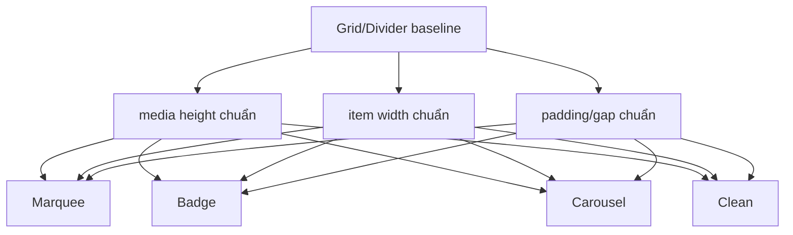

# I. Primer
## 1. TL;DR kiểu Feynman
- Anh nói đúng: hiện `Grid` và `Divider` đã có kích thước tương đối chuẩn, còn `Marquee`, `Badge`, `Carousel`, `Clean` vẫn đang “bung tùm lum”.
- Gốc vấn đề không phải chỉ vì logo to hơn, mà vì 4 layout này chưa có một `sizing contract` (hợp đồng kích thước) thống nhất như Grid/Divider.
- Hiện mỗi layout tự xài `min-w`, `min-h`, `padding`, `gap` khác nhau nên nhìn lệch nhịp, lúc quá to, lúc quá nhỏ, lúc card dài bất thường.
- Em sẽ chuẩn hóa 4 layout này về cùng một hệ kích thước chuẩn: media height, item min-width, padding, caption spacing, theo 2 mode `withName` và `logoOnly`.
- Mục tiêu là nhìn đồng bộ với Grid/Divider: logo lớn, giữ AR, nhưng item không còn phình lung tung theo từng layout.

## 2. Elaboration & Self-Explanation
Sau khi đọc lại code hiện tại, em thấy `Grid` và `Divider` đã bắt đầu có logic kích thước khá rõ:
- `Grid` có `logoWrapperClassName`, `logoClassName`, `itemClassName`, chia khá rõ media/caption.
- `Divider` cũng có cell height tương đối ổn định theo `showName` và `logoOnly`.

Nhưng 4 layout còn lại chưa có chuẩn tương đương:
- `Marquee`: item width đang dựa trên `min-w-[200px] / 260px / 320px` và media wrapper tăng theo cảm tính, nên chiều dài chip bị bung.
- `Badge`: badge pill có media wrapper quá nhỏ hoặc quá ngắn, nên logo và text không cùng một chuẩn thị giác với Grid.
- `Carousel`: card width dùng `calc(cqi)` + `min-w`, còn media area lại dùng một bộ `min-h/min-w` khác, gây card lúc dài lúc dày không đều.
- `Clean`: hiện gần như chỉ là hàng flex với wrapper tối thiểu, chưa có “module size” chuẩn nên cảm giác thiếu khung chuẩn hóa.

Tức là: các layout này đã được đẩy sang image-first occupancy, nhưng chưa được đưa vào cùng một hệ đo lường. Kết quả là “khít ảnh” có, nhưng “ổn định kích thước” thì chưa.

Hướng đúng bây giờ không phải tiếp tục scale từng layout riêng lẻ, mà là tạo một sizing contract chung rồi map từng layout theo contract đó.

## 3. Concrete Examples & Analogies
### a) Ví dụ cụ thể bám task
Hiện tại:
- `Grid`: một card có vùng logo khá chuẩn, text nằm dưới, spacing dễ đoán.
- `Marquee`: item lại có thể quá dài vì `min-w` lớn theo breakpoint, trong khi logo area và text area không bị khóa theo cùng nhịp.
- `Carousel`: card có outer width một kiểu, inner media area một kiểu khác, nên thị giác dễ bị “bung”.

Sau khi sửa:
- `Marquee`, `Badge`, `Carousel`, `Clean` sẽ cùng bám một bộ chuẩn như:
  - chiều cao vùng ảnh chuẩn cho `withName`
  - chiều cao vùng ảnh chuẩn cho `logoOnly`
  - padding chuẩn
  - khoảng cách ảnh ↔ tên chuẩn
- mỗi layout vẫn giữ style riêng, nhưng không còn lệch scale quá xa so với Grid/Divider.

### b) Analogy đời thường
Giống 6 mẫu thẻ trưng bày cùng một bộ thương hiệu. Hiện có 2 mẫu đã theo đúng size frame, còn 4 mẫu tuy ảnh đẹp hơn rồi nhưng frame mỗi cái một cỡ. Em sẽ chuẩn hóa lại kích thước frame trước, rồi mới giữ style riêng của từng mẫu.

# II. Audit Summary (Tóm tắt kiểm tra)
- Observation: `PartnersGridShared.tsx` có contract sizing tương đối rõ: `logoWrapperClassName`, `logoClassName`, `itemClassName`, `nameClassName`.
- Observation: `PartnersDividerShared.tsx` cũng có cell height ổn định hơn nhờ grid cell + media height rõ theo `showName`/`logoOnly`.
- Observation: `PartnersMarqueeShared.tsx` đang dùng `min-w-[200px] / 260px / 320px` với `showName`, làm chip có thể quá dài và scale lệch khỏi Grid/Divider.
- Observation: `PartnersBadgeShared.tsx` dùng wrapper rất nhỏ (`min-h-[28px] min-w-[56px]...`) nên chưa có cảm giác cùng chuẩn với Grid/Divider.
- Observation: `PartnersCarouselShared.tsx` đang trộn 2 hệ đo: outer card width theo `calc(cqi)` và inner media area theo `min-h/min-w` riêng, dễ tạo cảm giác bung.
- Observation: `PartnersCleanShared.tsx` hiện chỉ là flex item với media wrapper tối thiểu, thiếu module size ổn định.
- Inference: root cause là 4 layout này chưa có shared sizing contract, dù đã được chuyển sang image-first occupancy.
- Decision: chuẩn hóa 4 layout này theo cùng hệ sizing baseline của Grid/Divider.

# III. Root Cause & Counter-Hypothesis (Nguyên nhân gốc & Giả thuyết đối chứng)
## 1. Root Cause
### a) Triệu chứng quan sát được là gì
- Expected: Marquee, Badge, Carousel, Clean có kích thước ổn định, nhìn cùng chuẩn với Grid/Divider.
- Actual: 4 layout này vẫn phình/teo không đều, dẫn tới cảm giác “bung tùm lum”.

### b) Phạm vi ảnh hưởng
- 4 layout Partners:
  - Marquee
  - Badge
  - Carousel
  - Clean
- Ảnh hưởng cả preview và site vì đều dùng chung shared components.

### c) Có tái hiện ổn định không? điều kiện tái hiện tối thiểu?
- Có. Chỉ cần chuyển qua 4 tab này trong preview edit page là thấy scale không đồng đều so với Grid/Divider.

### d) Mốc thay đổi gần nhất
- Các vòng trước đã đẩy 4 layout sang image-first occupancy, nhưng chưa chuẩn hóa kích thước theo một contract chung.

### e) Dữ liệu nào đang thiếu để kết luận chắc chắn?
- Không thiếu blocker. Evidence nằm trực tiếp ở class `min-w`, `min-h`, `gap`, `padding` của 4 shared layouts.

### f) Có giả thuyết thay thế hợp lý nào chưa bị loại trừ?
- Chỉ giảm logo size riêng từng layout: không đủ vì vấn đề là thiếu chuẩn tổng thể, không chỉ scale ảnh.
- Chỉ sửa site runtime: không đủ vì preview cũng đang lệch.
- Chỉ sửa text size: không xử lý được outer frame đang bung.

### g) Rủi ro nếu fix sai nguyên nhân là gì?
- Layout có thể đỡ “to” hơn nhưng vẫn không đều.
- Hoặc 1 layout đẹp hơn nhưng 3 layout còn lại vẫn lệch chuẩn.

### h) Tiêu chí pass/fail sau khi sửa?
- 4 layout nhìn cùng hệ kích thước với Grid/Divider.
- Không còn cảm giác layout này phình, layout kia tóp.
- `withName` và `logoOnly` đều ổn định.

## 2. Root Cause Confidence (Độ tin cậy nguyên nhân gốc)
- High — vì chênh lệch nằm trực tiếp ở sizing classes hiện tại của 4 shared components, và Grid/Divider đã cho sẵn baseline để đối chiếu.

# IV. Proposal (Đề xuất)
## 1. Hướng triển khai được chọn
- Chuẩn hóa 4 layout theo một sizing contract chung.
- Dùng Grid/Divider làm baseline trực giác.
- Giữ style riêng từng layout nhưng không cho phép mỗi layout tự “sáng tác” scale riêng nữa.

## 2. Các bước kỹ thuật chính
### a) Tạo sizing baseline dùng chung ở mức logic
- Không nhất thiết tách file mới nếu chưa cần, nhưng trong implementation sẽ áp cùng một bộ quy ước:
  - `media height` cho `withName`
  - `media height` cho `logoOnly`
  - `item min-width`
  - `padding`
  - `caption gap`
- Các giá trị này sẽ bám gần Grid/Divider thay vì đang quá phân tán.

### b) Marquee
- Giảm độ “dài bất thường” của chip/card.
- Khóa lại `min-width` theo baseline nhỏ hơn và ổn định hơn.
- Giữ marquee motion nhưng item không còn phình lớn quá mức.

### c) Badge
- Tăng wrapper ảnh lên mức chuẩn hơn, nhưng khóa pill height và padding theo baseline.
- Tránh tình trạng badge quá bé hoặc quá mảnh so với Grid/Divider.

### d) Carousel
- Đồng bộ outer card width và inner media sizing.
- Giảm tình trạng outer frame một hệ, media frame một hệ.
- Card vẫn là carousel card, nhưng tỷ lệ sẽ nhất quán hơn.

### e) Clean
- Biến item từ flex quá tự do thành module có nhịp ổn định hơn.
- Logo vẫn prominent nhưng không còn “trôi” thiếu khung chuẩn.

## 3. Mermaid overview

# V. Files Impacted (Tệp bị ảnh hưởng)
- Sửa: `app/admin/home-components/partners/_components/PartnersMarqueeShared.tsx`
  - Vai trò hiện tại: marquee item đang quá tự do về min-width và media wrapper.
  - Thay đổi: chuẩn hóa item width, media height, padding theo baseline.

- Sửa: `app/admin/home-components/partners/_components/PartnersBadgeShared.tsx`
  - Vai trò hiện tại: badge/pill có scale nhỏ và chưa cùng chuẩn với Grid/Divider.
  - Thay đổi: cân lại wrapper ảnh, pill height và padding.

- Sửa: `app/admin/home-components/partners/_components/PartnersCarouselShared.tsx`
  - Vai trò hiện tại: outer card và inner media đang dùng hai hệ kích thước lệch nhau.
  - Thay đổi: đồng bộ tỷ lệ card/media theo sizing contract.

- Sửa: `app/admin/home-components/partners/_components/PartnersCleanShared.tsx`
  - Vai trò hiện tại: item clean thiếu module sizing chuẩn.
  - Thay đổi: thêm nhịp kích thước ổn định hơn cho logo + caption.

- Không dự kiến sửa: `PartnersGridShared.tsx`, `PartnersDividerShared.tsx`
  - Vai trò hiện tại: 2 layout baseline đã tương đối ổn.
  - Thay đổi: chỉ dùng làm reference, không đụng nếu không có regression.

# VI. Execution Preview (Xem trước thực thi)
1. Đọc lại 4 shared layouts và đối chiếu baseline Grid/Divider.
2. Chuẩn hóa media height / item width / padding / caption gap.
3. Giữ `withName` và `logoOnly` tương thích.
4. Kiểm tra parity preview/site qua shared layouts.
5. Typecheck và commit local.

# VII. Verification Plan (Kế hoạch kiểm chứng)
- Static verification:
  - `bunx tsc --noEmit`
- Repro checklist:
  - Trong edit page, chuyển qua `Marquee`, `Badge`, `Carousel`, `Clean` và so sánh trực quan với `Grid`, `Divider`.
  - Kiểm tra `withName` và `logoOnly` cho từng layout.
  - Bảo đảm logo giữ AR, không crop/méo.
  - Site runtime phải bám cùng sizing contract vì dùng chung shared components.

# VIII. Todo
1. Chuẩn hóa sizing contract cho Marquee.
2. Chuẩn hóa sizing contract cho Badge.
3. Chuẩn hóa sizing contract cho Carousel.
4. Chuẩn hóa sizing contract cho Clean.
5. Rà parity preview/site.
6. Typecheck và commit local.

# IX. Acceptance Criteria (Tiêu chí chấp nhận)
- 4 layout `Marquee`, `Badge`, `Carousel`, `Clean` không còn bung scale lung tung.
- 4 layout này nhìn cùng chuẩn kích thước với `Grid` và `Divider`.
- Logo vẫn lớn, giữ AR, không méo/crop.
- Không phá đặc trưng riêng của từng layout.

# X. Risk / Rollback (Rủi ro / Hoàn tác)
- Rủi ro: nếu chuẩn hóa quá mạnh, một layout có thể mất cá tính vốn có.
- Rủi ro: giảm width quá tay có thể làm text chật trong `withName`.
- Giảm rủi ro: chỉ chuẩn hóa baseline, không ép 4 layout thành cùng một shape.
- Rollback: thay đổi tập trung ở 4 shared components nên revert dễ.

# XI. Out of Scope (Ngoài phạm vi)
- Không chỉnh lại Grid/Divider trừ khi phát hiện regression.
- Không đổi schema dữ liệu, uploader, hay runtime image mode toàn app.
- Không xử lý white padding nằm bên trong file ảnh gốc.

# XII. Open Questions (Câu hỏi mở)
- Không còn ambiguity lớn. Em sẽ mặc định lấy `Grid` và `Divider` làm sizing benchmark để kéo 4 layout còn lại về cùng chuẩn.