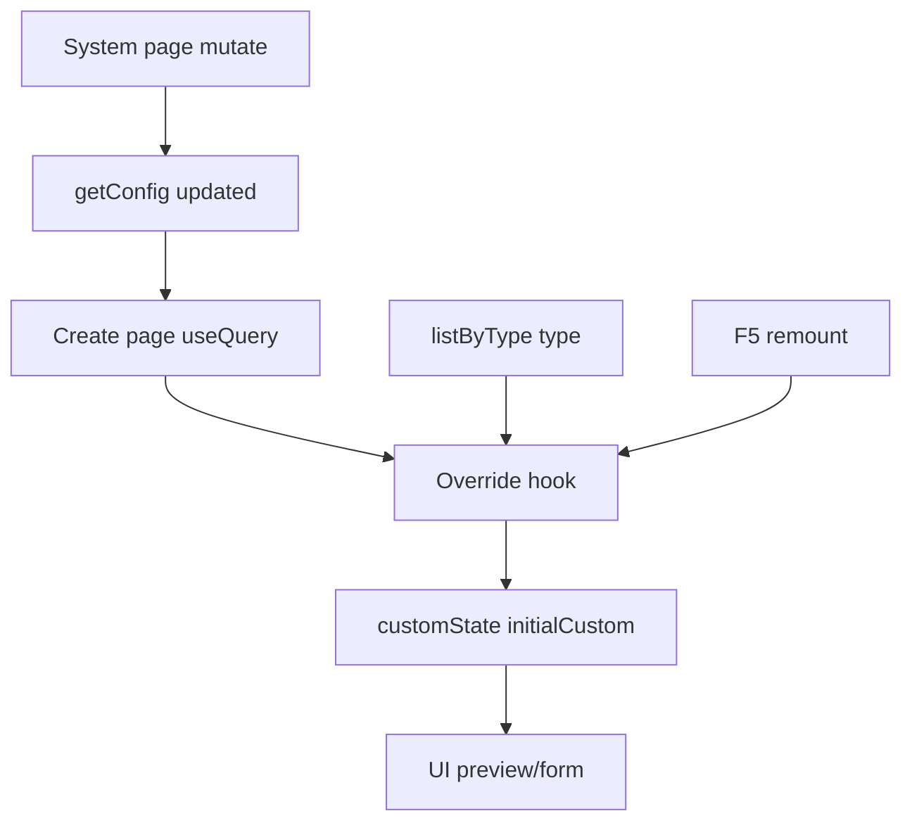

# I. Primer

## 1. TL;DR kiểu Feynman
- Trang `/admin/home-components/create` đang đọc realtime từ Convex, nên lỗi này nhiều khả năng không nằm ở cache của Next.js.
- Chỗ đáng nghi nhất là các hook override của form create đang trộn `getConfig()` với `listByType(type)` rồi giữ thêm local state.
- Khi đi từ trang system sang create bằng SPA navigation, state cục bộ có thể bị seed theo dữ liệu cũ hoặc seed chậm, nên nhìn như “không nhận ngay”.
- F5 làm remount toàn bộ page, nên state được dựng lại từ đầu và trông như đã “nhận đúng”.
- Hướng sửa tối thiểu: bỏ phụ thuộc không cần thiết vào `listByType(type)` ở create-mode, lấy `homeComponentSystemConfig.getConfig` làm source of truth trực tiếp cho state ban đầu và đồng bộ lại khi config đổi.
- Chỉ mở rộng sang `getStats()`/counter table nếu sau khi sửa hook mà badge/count trên page create vẫn chậm cập nhật.

## 2. Elaboration & Self-Explanation
Vấn đề user mô tả là: thay đổi cấu hình home-component xong vào trang tạo component thì UI chưa phản ánh ngay, phải F5 mới thấy. Vì Convex vốn realtime, hành vi này tạo cảm giác hệ thống “không realtime”.

Sau khi audit tĩnh, route `/admin/home-components/create` là client page dùng `useQuery(...)`. Nghĩa là bản thân route này không phải kiểu fetch server bị cache cứng. Do đó, hướng nghi ngờ hợp lý hơn là state trong client bị lệch giữa:

a) dữ liệu realtime từ Convex,
b) local state trong hook,
c) dữ liệu phụ `listByType(type)` dùng để quyết định có “seed from settings” hay không.

Ở hai hook `useTypeColorOverrideState` và `useTypeFontOverrideState`, code đang làm việc theo kiểu:
- đọc config hệ thống,
- đọc list component theo type,
- tính `shouldSeedState`,
- đổ vào `customState` + `initialCustom`.

Mẫu này dễ tạo ra tình huống: config mới đã về, nhưng local state chưa resync theo cách determinisitic (ổn định, dự đoán được) trong lần chuyển trang đầu tiên. Khi F5, component mount mới hoàn toàn nên state được dựng lại “đúng”.

## 3. Concrete Examples & Analogies
Ví dụ bám sát task:
- Admin bật custom màu/chữ cho type `hero` trong `/system/home-components`.
- Ngay sau đó admin bấm qua `/admin/home-components/create/hero`.
- `getConfig()` có thể đã chứa giá trị mới, nhưng hook create vẫn nhìn thêm `listByType('hero')` và local `customState` cũ, nên UI chưa hiển thị đúng block custom hoặc giá trị mới.
- Sau khi F5, toàn bộ hook chạy lại từ đầu và hiển thị đúng.

Analogy đời thường:
- Giống như bảng điện tử trong cửa hàng đã nhận giá mới từ server, nhưng tờ giấy note dán tạm ở quầy chưa được thay. Khách nhìn vào quầy vẫn thấy giá cũ. Khi “dọn quầy” lại (F5/remount), note cũ biến mất và mọi thứ mới đồng bộ.

# II. Audit Summary (Tóm tắt kiểm tra)

## Observation
- `app/admin/home-components/create/page.tsx` dùng `useQuery(api.homeComponents.getStats)` và `useQuery(api.homeComponentSystemConfig.getConfig)`.
- Không thấy literal `hard-dynamic` trong repo; user đang mô tả hành vi “phải phản ánh ngay, không cần F5”.
- `app/admin/home-components/_shared/hooks/useTypeColorOverride.ts` và `useTypeFontOverride.ts` đều:
  - đọc `getConfig()`
  - conditionally đọc `listByType(type)`
  - seed vào `customState` / `initialCustom`
  - có logic resync bằng `useEffect`
- `convex/homeComponents.ts:getStats` đang đọc từ bảng counter `homeComponentStats`, không đọc trực tiếp từ `homeComponents`.

## Inference
- Lỗi chính nhiều khả năng là stale derived state ở client hook, không phải Next route cache.
- Badge/count trên trang create có thể là nguồn lệch phụ nếu counter table cập nhật/subscription chậm hơn mong đợi.

## Decision
- Ưu tiên sửa ở hook state create/edit trước vì đây là thay đổi nhỏ, đúng trọng tâm realtime UX, ít rủi ro rollback.
- Chỉ đụng `getStats()` nếu evidence sau sửa hook cho thấy count/badge vẫn cần F5.

# III. Root Cause & Counter-Hypothesis (Nguyên nhân gốc & Giả thuyết đối chứng)

## Root Cause Confidence
- High: local derived state trong hook override đang là nguồn gây stale khi điều hướng SPA.
- Medium: counter table `homeComponentStats` có thể góp phần làm badge/count chậm phản ánh.
- Low: route cache của Next.js là nguyên nhân chính.

## Trả lời 8 câu audit bắt buộc
1. Triệu chứng quan sát được là gì?
   - Expected: chỉnh cấu hình xong vào create page thấy ngay dữ liệu mới.
   - Actual: phải F5 mới thấy đúng.
2. Phạm vi ảnh hưởng?
   - User/admin ở flow `/system/home-components` → `/admin/home-components/create` và các create form type cụ thể.
3. Có tái hiện ổn định không? điều kiện tối thiểu?
   - Theo mô tả user: có, khi chỉnh home-component/config rồi điều hướng sang create page trong cùng session.
4. Mốc thay đổi gần nhất?
   - Chưa xác định chính xác commit gây ra; audit hiện dựa trên code hiện tại.
5. Dữ liệu nào đang thiếu?
   - Thiếu runtime repro/log để xác nhận query nào về chậm hơn và component nào remount/không remount.
6. Có giả thuyết thay thế hợp lý nào chưa bị loại trừ?
   - Có: `getStats()` dựa trên counter table khiến UI count/badge chậm cập nhật; chưa loại trừ hoàn toàn.
7. Rủi ro nếu fix sai nguyên nhân là gì?
   - Sửa nhầm ở route/cache sẽ tăng độ phức tạp nhưng không hết lỗi, gây tốn công và tăng scope.
8. Tiêu chí pass/fail sau khi sửa?
   - Pass: đổi config rồi mở create page/type page là thấy đúng ngay không cần F5.
   - Fail: vẫn cần refresh mới thấy hidden type, custom block, màu/chữ, hoặc badge/count đúng.

## Counter-Hypothesis (Giả thuyết đối chứng)
- Giả thuyết A: Next.js cache route create.
  - Evidence chống lại: route là client component, dùng Convex `useQuery`, không thấy dấu hiệu fetch cache server-side tại đây.
- Giả thuyết B: stats counter là nguyên nhân duy nhất.
  - Evidence chống lại: vấn đề user mô tả rộng hơn badge/count; còn liên quan “nhận config” sau F5.
- Giả thuyết C: stale local state trong hook create/edit.
  - Evidence ủng hộ: có pattern seed từ nhiều nguồn dữ liệu + local state + effect sync.

# IV. Proposal (Đề xuất)

## Option duy nhất hợp lý trong ngữ cảnh
- Option A (Recommend) — Confidence 88%: sửa tối thiểu tại hook override để create-mode bám `getConfig()` làm source of truth, giảm/loại bỏ phụ thuộc `listByType(type)` cho bước seed ban đầu.
  - Vì sao tốt nhất: scope nhỏ, đúng điểm nghi ngờ mạnh nhất, rollback dễ, không đụng schema/data model.
  - Tradeoff: nếu badge/count vẫn lệch thì cần patch vòng 2 ở `getStats()`.

## Cách làm cụ thể
1. Với `useTypeColorOverrideState`:
   - Tách rõ 2 mode:
     - create-mode: state ban đầu và resync bám `overrideState`/`systemColors` từ `getConfig()`.
     - existing-data mode (nếu thật sự cần): chỉ dùng `listByType(type)` khi có requirement giữ hành vi riêng cho type đã có dữ liệu.
   - Tránh để `shouldSeedState` phụ thuộc `listByType(type)` làm thay đổi seed trong lần mount đầu tiên theo cách khó đoán.
   - Đảm bảo khi `overrideState` đổi từ Convex thì `customState` và `initialCustom` được đồng bộ lại nếu user chưa thao tác local.
2. Với `useTypeFontOverrideState`:
   - Áp dụng cùng pattern như color hook để bỏ lệch hành vi giữa font và color.
3. Với `app/admin/home-components/create/page.tsx`:
   - Giữ nguyên nếu sau audit lại thấy hidden type đã theo `getConfig()` realtime tốt.
   - Chỉ patch nếu cần tách rõ loading/undefined state để tránh flash cũ.
4. Chỉ nếu còn lỗi ở badge/count:
   - Xem xét đổi `getStats()` sang đọc trực tiếp count theo type từ `homeComponents` cho bề mặt create page, hoặc bổ sung query count hẹp hơn thay vì dựa hoàn toàn vào `homeComponentStats`.

# V. Files Impacted (Tệp bị ảnh hưởng)

## UI / hooks
- Sửa: `app/admin/home-components/_shared/hooks/useTypeColorOverride.ts`
  - Vai trò hiện tại: dựng state override màu cho create/edit từ config hệ thống + listByType + local state.
  - Thay đổi: làm state sync ổn định cho create-mode, giảm stale state khi điều hướng SPA.
- Sửa: `app/admin/home-components/_shared/hooks/useTypeFontOverride.ts`
  - Vai trò hiện tại: dựng state override font theo pattern tương tự color.
  - Thay đổi: áp dụng cùng chiến lược sync để font nhận realtime ngay.
- Có thể sửa: `app/admin/home-components/create/page.tsx`
  - Vai trò hiện tại: render danh sách loại component với visibility và count.
  - Thay đổi: chỉ tinh chỉnh nếu cần xử lý loading/recompute để tránh hiển thị trạng thái cũ lúc query chưa ổn định.

## Server / Convex
- Có thể sửa: `convex/homeComponents.ts`
  - Vai trò hiện tại: cung cấp `getStats`, `listByType`, create/update/remove counters.
  - Thay đổi: chỉ đụng nếu cần fix riêng count/badge realtime; không phải vòng sửa đầu tiên.

# VI. Execution Preview (Xem trước thực thi)

1. Đọc kỹ nơi dùng `useTypeColorOverrideState` và `useTypeFontOverrideState` để xác nhận create-mode/edit-mode.
2. Chỉnh logic seed/resync trong hai hook để source of truth là `getConfig()` cho create flow.
3. Soát các form create tiêu biểu đang dùng hook này để tránh phá behavior nhập tay của user.
4. Nếu cần, tinh chỉnh page create để xử lý loading ban đầu nhất quán.
5. Review tĩnh toàn bộ diff, kiểm tra null-safety, dependency array, và backward compatibility.
6. Nếu có thay đổi TS code khi thực thi thật, chạy `bunx tsc --noEmit` trước commit theo quy ước repo; không chạy lint/unit test.
7. Commit thay đổi cục bộ, không push.

# VII. Verification Plan (Kế hoạch kiểm chứng)

## Verification Plan
- Kiểm tra tĩnh các case sau sau khi sửa:
  - đổi hidden type ở system rồi mở `/admin/home-components/create` không cần F5 vẫn đúng.
  - đổi color override rồi mở `/admin/home-components/create/[type]` không cần F5 vẫn thấy đúng.
  - đổi font override rồi mở `/admin/home-components/create/[type]` không cần F5 vẫn thấy đúng.
  - local chỉnh form không bị reset sai khi query realtime về lại.
- Review dependency arrays của `useEffect` để tránh loop hoặc stale closure.
- Chỉ chạy `bunx tsc --noEmit` khi vào pha thực thi có thay đổi TS code.
- Không chạy lint/unit test theo quy ước dự án hiện tại.

# VIII. Todo

1. Xác định đầy đủ các create form đang dùng hai hook override.
2. Refactor logic seed/resync ở color hook.
3. Refactor logic seed/resync ở font hook.
4. Soát ảnh hưởng đến create page và preview liên quan.
5. Chỉ nếu còn lệch badge/count: audit thêm `getStats()` và counter table.
6. Review tĩnh, typecheck TS nếu có sửa code, rồi commit.

# IX. Acceptance Criteria (Tiêu chí chấp nhận)

- Khi đổi cấu hình home-component ở system, mở create page hoặc create detail page thấy trạng thái mới ngay, không cần F5.
- Hidden type ở `/admin/home-components/create` phản ánh đúng realtime.
- Color/font override ở form create phản ánh đúng realtime khi vừa điều hướng sang.
- Không làm mất khả năng chỉnh local state trong form.
- Không thay schema, không mở rộng scope sang docs hay refactor lớn.

# X. Risk / Rollback (Rủi ro / Hoàn tác)

- Rủi ro chính: đồng bộ quá mạnh có thể làm reset input local của admin khi họ đang chỉnh form.
- Cách giảm rủi ro: chỉ resync khi state còn pristine/initial hoặc khi chuyển sang create-mode ban đầu.
- Rollback: revert 2 hook override về pattern cũ; đây là thay đổi nhỏ, phạm vi hẹp.

# XI. Out of Scope (Ngoài phạm vi)

- Không thay đổi schema Convex.
- Không refactor toàn bộ home-component create flow.
- Không tối ưu toàn bộ counter architecture nếu chưa có evidence nó là nguyên nhân còn lại.
- Không sửa docs/README.

# XII. Open Questions (Câu hỏi mở)

- Không có ambiguity lớn đủ để chặn triển khai; có thể bắt đầu theo hướng trên ngay.