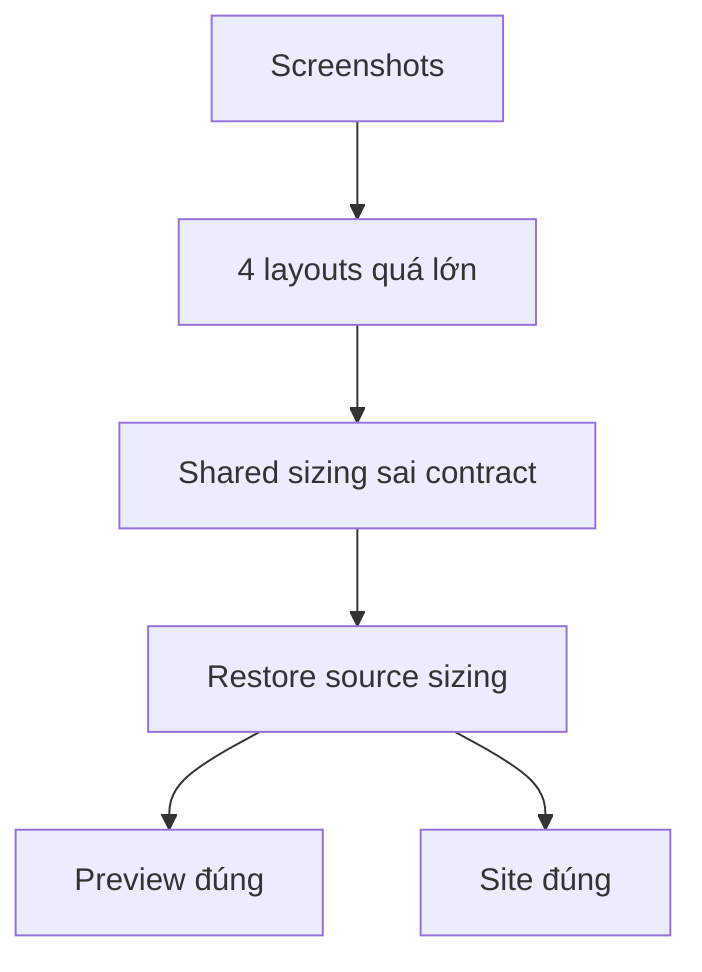

# I. Primer
## 1. TL;DR kiểu Feynman
- Em xem kỹ 5 screenshot anh gửi rồi: đúng là 4 layout `Marquee`, `Badge`, `Carousel`, `Clean` đang bị vỡ nặng, ảnh website bị phóng bự chành bành.
- Root cause là em đã áp sai triết lý `image-first occupancy` cho 4 layout này, trong khi source `partner-logos-section` giữ chúng ở kiểu `icon/logo-sized`, không phải kiểu ảnh fill gần full khung như Grid.
- Nói ngắn: `Grid/Divider` có thể chịu được kiểu ảnh lớn hơn, nhưng `Marquee/Badge/Carousel/Clean` thì không; chúng phải quay về sizing nhỏ-gọn đúng source.
- Lượt fix tới sẽ không “siết thêm” nữa; sẽ gỡ phần em tự chế và restore 4 layout này về đúng shell source.
- Mục tiêu: 4 layout hết nát, preview/site trở lại đúng nhịp source, logo không còn chiếm gần full card/frame như hiện tại.

## 2. Elaboration & Self-Explanation
Qua screenshot anh gửi:
- `Marquee`: item đầu tiên đang hiển thị gần như cả screenshot web lớn, nghĩa là wrapper/logo area đang bị cho quá nhiều chiều cao/rộng.
- `Badge`: pill bị mất nghĩa, vì ảnh bên trong lớn như một mini-banner thay vì logo badge.
- `Carousel`: slide card đang chứa ảnh web gần full bề mặt, làm card nhìn như khung screenshot chứ không phải logo card.
- `Clean`: layout tối giản bị phá hẳn vì logo không còn là điểm nhấn nhỏ-gọn mà thành block lớn.

Đối chiếu source `C:\Users\VTOS\Downloads\partner-logos-section\components\partner-logos.tsx`:
- `clean` dùng `w-6 h-6`, `@2xl:w-8 h-8`
- `badge` dùng `w-3.5 h-3.5`, `@2xl:w-4 h-4`, `@5xl:w-5 h-5`
- `carousel` dùng `w-5 h-5`, `@2xl:w-6 h-6`
- `marquee` ở source cũng là item gọn, không phải ảnh fill to như banner

Tức là source muốn 4 layout này hiển thị theo kiểu:
- logo/icon cỡ nhỏ-vừa
- shell/card/pill gọn
- text và nhịp spacing là thứ chính giữ layout đẹp
- không dùng “logo chiếm tối đa khung” như Grid

Lỗi của em ở các vòng trước là lấy rule đúng cho Grid rồi đẩy sang 4 layout còn lại. Đó là sai chuẩn.

## 3. Concrete Examples & Analogies
### a) Ví dụ cụ thể bám task
Hiện tại `Carousel` screenshot của anh cho thấy:
- card có ảnh web chiếm gần hết card
- nhìn giống card preview website, không giống carousel logo

Sau khi sửa đúng source:
- card vẫn giữ shell carousel
- bên trong chỉ có logo nhỏ-vừa trong logo box gọn
- text mới là phần cân thị giác còn lại
- không còn cảm giác “nhét nguyên screenshot vào card”

### b) Analogy đời thường
Giống dùng ảnh hồ sơ để in lên name tag. Name tag chỉ cần logo/avatar nhỏ gọn. Nếu phóng ảnh full gần kín thẻ thì thẻ hỏng ngay. 4 layout này chính là “name tag/pill/card nhỏ”, không phải “poster”.

# II. Audit Summary (Tóm tắt kiểm tra)
- Observation: screenshot user gửi cho thấy `Marquee`, `Badge`, `Carousel`, `Clean` đều đang render ảnh quá lớn so với shell layout.
- Observation: source `partner-logos-section` dùng sizing icon-like rất nhỏ cho 4 layout này, không dùng media wrapper lớn.
- Observation: code hiện tại của repo ở 4 layout này đã bị em thay bằng `min-h/min-w` wrapper lớn và `max-w/max-h` image-first logic.
- Observation: vấn đề xuất hiện ngay trong preview route edit, nên đây là lỗi ở shared layout sizing, không phải chỉ runtime site.
- Inference: root cause là áp sai design contract từ Grid sang 4 layout vốn phải giữ compact sizing theo source.
- Decision: gỡ occupancy contract ở 4 layout và restore source-faithful compact sizing.

# III. Root Cause & Counter-Hypothesis (Nguyên nhân gốc & Giả thuyết đối chứng)
## 1. Root Cause
### a) Triệu chứng quan sát được là gì
- Expected: 4 layout gọn, logo nhỏ-vừa, đúng shell source.
- Actual: ảnh bự chành bành, phát nát toàn bộ layout.

### b) Phạm vi ảnh hưởng
- `Marquee`
- `Badge`
- `Carousel`
- `Clean`
- Cả preview và site vì dùng chung shared components.

### c) Có tái hiện ổn định không? điều kiện tái hiện tối thiểu?
- Có. Chỉ cần chuyển tab trong preview edit là thấy ngay, đúng như screenshot anh gửi.

### d) Mốc thay đổi gần nhất
- Sau các commit mở rộng `image-first occupancy` và `tighten sizing contract` cho 4 layout này.

### e) Dữ liệu nào đang thiếu để kết luận chắc chắn?
- Không thiếu. Screenshot + source file + code hiện tại đã đủ evidence.

### f) Có giả thuyết thay thế hợp lý nào chưa bị loại trừ?
- “Ảnh gốc có viền trắng nên nhìn to”: không đúng, vì vấn đề là toàn shell bị ảnh chiếm quá mức.
- “Runtime image mode gây lệch”: không phải gốc hiện tại, vì preview cũng nát.
- “Chỉ cần giảm nhẹ vài pixel”: không đủ, vì contract hiện tại sai loại hoàn toàn.

### g) Rủi ro nếu fix sai nguyên nhân là gì?
- Càng vá nhỏ càng không cứu được 4 layout.
- Có thể tiếp tục giữ layout ở trạng thái nửa poster nửa logo card.

### h) Tiêu chí pass/fail sau khi sửa?
- 4 layout quay lại compact shell như source.
- Ảnh không còn chiếm gần full card/frame.
- Preview và site khớp nhau.

## 2. Root Cause Confidence (Độ tin cậy nguyên nhân gốc)
- High — vì evidence trực tiếp từ screenshot trùng khớp với việc code hiện tại đã lệch xa source sizing contract.

# IV. Proposal (Đề xuất)
## 1. Hướng triển khai được chọn
- Restore 4 layout về source-faithful compact/icon-sized rendering.
- Gỡ các wrapper/phần sizing em đã bơm thêm ở các vòng trước.
- Không đụng `Grid` và `Divider` trong lượt này.

## 2. Các bước kỹ thuật chính
### a) Marquee
- Bỏ wrapper lớn hiện tại.
- Trả lại item `min-w`, `padding`, `logo size` gần source.
- Không để ảnh website chiếm phần lớn chip/card.

### b) Badge
- Trả pill về đúng compact rhythm của source.
- Logo chỉ ở size badge-level, không còn media block lớn.

### c) Carousel
- Thu nhỏ media box về icon/logo box source-like.
- Outer card width/padding quay lại nhịp source.

### d) Clean
- Bỏ module hóa/min-width đang làm item nở.
- Trả về item nhẹ như source.

### e) Guardrail
- Không tiếp tục benchmark theo Grid.
- Không giữ lại image-first wrapper nếu nó trái source ở 4 layout này.

## 3. Mermaid overview

# V. Files Impacted (Tệp bị ảnh hưởng)
- Sửa: `app/admin/home-components/partners/_components/PartnersMarqueeShared.tsx`
  - Vai trò hiện tại: marquee đang dùng wrapper/logo sizing quá lớn.
  - Thay đổi: gỡ sizing phình và trả về chip sizing gần source.

- Sửa: `app/admin/home-components/partners/_components/PartnersBadgeShared.tsx`
  - Vai trò hiện tại: badge đang render logo như media block lớn.
  - Thay đổi: trả về badge compact icon-sized như source.

- Sửa: `app/admin/home-components/partners/_components/PartnersCarouselShared.tsx`
  - Vai trò hiện tại: carousel card/media box bị phình quá mức.
  - Thay đổi: thu card/media về nhịp source.

- Sửa: `app/admin/home-components/partners/_components/PartnersCleanShared.tsx`
  - Vai trò hiện tại: clean item bị nở và mất cảm giác tối giản source.
  - Thay đổi: trả về sizing nhẹ, gọn, đúng source.

- Không sửa: `app/admin/home-components/partners/_components/PartnersGridShared.tsx`
  - Vai trò hiện tại: Grid là contract khác.
  - Thay đổi: giữ nguyên để không trộn chuẩn.

- Không sửa: `app/admin/home-components/partners/_components/PartnersDividerShared.tsx`
  - Vai trò hiện tại: Divider không nằm trong feedback “bự chành bành” lần này.
  - Thay đổi: giữ nguyên.

# VI. Execution Preview (Xem trước thực thi)
1. Đối chiếu source file và 4 shared layouts.
2. Gỡ các wrapper/min-size/padding đã phình sai chuẩn.
3. Re-apply sizing compact theo source cho từng layout.
4. Rà preview/site parity.
5. Typecheck và commit local.

# VII. Verification Plan (Kế hoạch kiểm chứng)
- Static verification:
  - `bunx tsc --noEmit`
- Repro checklist:
  - Xem 4 tab `Marquee`, `Badge`, `Carousel`, `Clean` trong trang edit.
  - So với screenshot lỗi hiện tại để xác nhận không còn ảnh bự chành bành.
  - So trực giác với source `partner-logos-section` để xác nhận shell compact hơn.
  - Xác nhận Grid/Divider không regression.

# VIII. Todo
1. Restore Marquee theo source sizing.
2. Restore Badge theo source sizing.
3. Restore Carousel theo source sizing.
4. Restore Clean theo source sizing.
5. Typecheck.
6. Commit local kèm spec.

# IX. Acceptance Criteria (Tiêu chí chấp nhận)
- `Marquee`, `Badge`, `Carousel`, `Clean` không còn bị ảnh chiếm khung quá mức.
- 4 layout này quay lại compact sizing gần source rõ rệt.
- Preview và site cùng khớp behavior.
- Không làm hỏng `Grid` và `Divider`.

# X. Risk / Rollback (Rủi ro / Hoàn tác)
- Rủi ro: kéo về source có thể làm vài logo nhìn nhỏ hơn bản lỗi hiện tại, nhưng đó là đúng contract của 4 layout này.
- Giảm rủi ro: chỉ sửa 4 layout đang sai, không lan sang Grid/Divider.
- Rollback: revert 4 shared files là đủ.

# XI. Out of Scope (Ngoài phạm vi)
- Không chỉnh lại Grid/Divider.
- Không sửa uploader/schema.
- Không xử lý crop/trim khoảng trắng nằm bên trong file ảnh gốc.

# XII. Open Questions (Câu hỏi mở)
- Không còn blocker. Em sẽ bám đúng source folder làm chuẩn duy nhất cho 4 layout này.