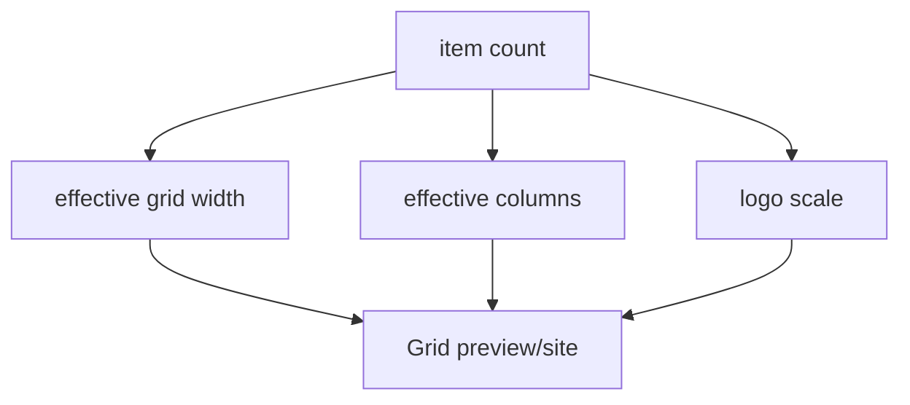

# I. Primer
## 1. TL;DR kiểu Feynman
- Chỗ dư spacing hiện tại chủ yếu do Grid đang bám đúng size logo của source, nhưng item quá ít nên preview frame rộng làm khoảng trống lộ rất rõ.
- Với 2 logo trong khung desktop 1280px, grid 4–5 cột sẽ luôn trống nhiều nếu không có rule co cụm hoặc tăng max-width item.
- Source đẹp vì thường nhìn với nhiều logo hơn và tỷ lệ grid/card được cân bằng theo danh sách dày hơn, không phải 2 item lẻ trong khung rộng.
- Em sẽ chỉnh Grid preview/site theo hướng: item to hơn vừa phải, giảm outer spacing, và thêm rule co cụm theo số lượng ít để 2–3 logo không bị “lọt thỏm”.
- Em sẽ không quay lại kiểu phóng logo quá tay; thay vào đó sẽ sửa đúng root cause là layout distribution và container behavior.

## 2. Elaboration & Self-Explanation
Sau khi đọc lại code hiện tại và so với source, vấn đề trong ảnh không phải chỉ là `logo h-6 w-6` nhỏ. Vấn đề lớn hơn là cách Grid đang trải item trên một vùng quá rộng:
- `PartnersGridShared.tsx` đang dùng container `max-w-7xl` toàn chiều ngang
- preview Grid desktop đang dùng `grid-cols-4 2xl:grid-cols-5`
- khi chỉ có 2 item, lưới vẫn giữ logic phân phối như một danh sách dài

Kết quả là mỗi item nằm trên một cột riêng trong một grid rất rộng, nên nhìn giữa các item có một vùng trống lớn. User cảm giác là “ảnh nhỏ + spacing dư”, nhưng thực ra spacing dư đến từ cả 3 yếu tố cùng lúc:
1. grid có quá nhiều cột so với số item
2. container section quá rộng
3. item card chưa đủ lớn để cân bằng vùng trắng còn lại

Source `partner-logos-section` đẹp vì nó giả định nhịp layout với số logo đủ nhiều. Khi chỉ có 2 logo trong preview desktop, nếu mình giữ nguyên contract grid rộng thì sẽ luôn bị lỏng. Vì vậy lần sửa này cần thêm logic density cho trường hợp ít item:
- 1–2 item: co cụm grid/container lại
- 3–4 item: giảm số cột hiệu dụng
- >=5 item: quay về rhythm source chuẩn

Đây là fix đúng bản chất hơn là chỉ “tăng logo thật lớn”.

## 3. Concrete Examples & Analogies
### a) Ví dụ cụ thể bám task
Hiện tại preview Grid desktop với 2 logo đang gần như:
- container rộng ~1280px
- chia 4 hoặc 5 cột
- mỗi card chiếm 1 cột
- còn 2–3 cột trống vô hình

Sau khi sửa, với 2 logo sẽ thành:
- grid co lại còn 2 cột thực dụng
- container con của grid chỉ rộng vừa đủ cho 2 card
- card rộng hơn, logo lớn hơn chút
- khoảng trống giữa 2 card giảm mạnh

### b) Analogy đời thường
Giống như đặt 2 món đồ lên một kệ dài 5 ngăn: dù món không nhỏ, nhìn vẫn bị thưa. Cách đúng không phải chỉ phóng to món đồ, mà là đổi sang kệ 2 ngăn khi chỉ có 2 món.

# II. Audit Summary (Tóm tắt kiểm tra)
- Observation: `PartnersGridShared.tsx` đang dùng `columnsClassName = 'grid-cols-2 min-[480px]:grid-cols-3 xl:grid-cols-4 2xl:grid-cols-5'` và wrapper `max-w-7xl`.
- Observation: `PartnersPreview.tsx` trên desktop truyền `columnsClassName = 'grid-cols-4 2xl:grid-cols-5'` và `maxVisible = 20`.
- Observation: trong source `partner-logos.tsx`, Grid dùng `2 / 3 / 4 / 5` cột, nhưng source không giải quyết riêng trường hợp chỉ có 2 item trong preview desktop cực rộng.
- Observation: item logo hiện tại trong Grid `withName` đang `h-6..8`, card `p-4..5`, tức không quá lớn; khoảng trống cảm nhận đến từ phân phối grid rộng nhiều hơn là chỉ từ logo size.
- Inference: root cause chính là thiếu density rule theo item count cho Grid preview/site, không chỉ là thiếu scale logo.
- Decision: thêm logic co cụm theo số item và tăng size item/logo vừa phải để lấp khoảng trống hợp lý.

# III. Root Cause & Counter-Hypothesis (Nguyên nhân gốc & Giả thuyết đối chứng)
## 1. Root Cause
### a) Triệu chứng quan sát được là gì
- Expected: 2 logo trong preview Grid nhìn gọn, logo to rõ, không có khoảng trắng vô lý.
- Actual: 2 card nằm thưa trong khung rộng nên nhìn rất dư spacing.

### b) Phạm vi ảnh hưởng
- Chủ yếu là Grid của Partners trong preview và site khi item count thấp.
- Có thể ảnh hưởng cả mode `withName` lẫn `logoOnly`.

### c) Có tái hiện ổn định không
- Có. Chỉ cần ít item (đặc biệt 1–2 logo) trên desktop preview là thấy rõ.

### d) Mốc thay đổi gần nhất
- Sau khi kéo layout về source-faithful, Grid giữ rhythm nhiều cột nhưng chưa có rule thích ứng khi danh sách quá ít.

### e) Dữ liệu nào đang thiếu
- Không thiếu blocker. Đủ evidence để viết fix plan.

### f) Có giả thuyết thay thế hợp lý nào chưa bị loại trừ
- Chỉ tăng logo size: không đủ vì card vẫn bị phân bố trên grid quá rộng.
- Chỉ giảm padding card: không đủ vì cột trống vẫn còn.
- Chỉ giảm max-width toàn section: có thể giúp nhưng sẽ ảnh hưởng các layout khác nếu làm quá rộng.

### g) Rủi ro nếu fix sai nguyên nhân là gì
- Tăng logo quá mạnh nhưng spacing vẫn xấu.
- Làm Grid đẹp cho 2 item nhưng phá rhythm khi có 6–10 item.

### h) Tiêu chí pass/fail sau khi sửa
- 1–2 logo trong preview desktop không còn bị lọt thỏm.
- 3–5 logo vẫn giữ nhịp đẹp.
- Nhiều logo vẫn bám source rhythm.

## 2. Root Cause Confidence (Độ tin cậy nguyên nhân gốc)
- High — vì evidence nằm trực tiếp ở `columnsClassName`, `max-w-7xl`, và case preview 2 item trong ảnh.

# IV. Proposal (Đề xuất)
## 1. Hướng triển khai được chọn
- Giữ source-faithful làm baseline.
- Thêm density/adaptive layout cho Grid theo số lượng item.
- Tăng kích thước logo/card vừa phải, không phóng cực đoan.

## 2. Các bước kỹ thuật chính
### a) Thêm rule co cụm theo item count cho Grid
- Trong `PartnersGridShared.tsx`, tính `effectiveColumns` hoặc `grid wrapper max-width` theo `items.length`:
  - 1 item: center, card đơn rộng hơn
  - 2 item: grid 2 cột, wrapper co lại
  - 3 item: grid 3 cột hoặc 2 cột tùy breakpoint
  - >=4 hoặc >=5 item: quay về rhythm source hiện tại

### b) Tăng vừa phải kích thước item/logo
- `withName`: logo tăng từ `h-6..8` lên mức gần `h-10..14` tùy breakpoint, card rộng hơn chút.
- `logoOnly`: tăng lớn hơn `withName`, nhưng vẫn nằm trong giới hạn hợp lý để không quay lại lỗi cũ.

### c) Giảm outer spacing của Grid section
- Rà lại `mt-6`, `gap-3`, `p-4/p-5` để chặt hơn khi item ít.
- Có thể thêm wrapper con `mx-auto` riêng cho grid list thay vì full width section.

### d) Giữ nguyên các layout khác trừ khi thật sự cần
- Fix này ưu tiên Grid trước vì ảnh user chỉ ra đúng Grid.
- Không mở rộng scope sang Badge/Clean/Carousel nếu chưa thấy evidence tương tự.

## 3. Mermaid overview

# V. Files Impacted (Tệp bị ảnh hưởng)
- Sửa: `app/admin/home-components/partners/_components/PartnersGridShared.tsx`
  - Vai trò hiện tại: render Grid với column class cố định tương đối rộng.
  - Thay đổi: thêm adaptive density theo số item, tăng card/logo vừa phải, co cụm grid khi item ít.

- Sửa: `app/admin/home-components/partners/_components/PartnersPreview.tsx`
  - Vai trò hiện tại: truyền `columnsClassName` desktop khá rộng cho Grid.
  - Thay đổi: tinh chỉnh cách preview truyền columns/maxVisible để không tạo khoảng trống vô lý khi item ít.

- Sửa nhỏ nếu cần: `components/site/ComponentRenderer.tsx`
  - Vai trò hiện tại: site render Grid cùng shared component.
  - Thay đổi: chỉ cần nếu muốn parity item-count behavior giữa preview và site.

# VI. Execution Preview (Xem trước thực thi)
1. Đọc lại Grid shared + Preview wiring.
2. Thêm logic item-count adaptive cho Grid.
3. Tăng size logo/card vừa phải.
4. Thu gọn grid wrapper để 1–2 item không bị thưa.
5. Giữ parity preview/site.

# VII. Verification Plan (Kế hoạch kiểm chứng)
- Static verification:
  - `bunx tsc --noEmit` sau khi implement.
- Repro checklist:
  - 2 logo, desktop preview: không còn spacing dư như ảnh.
  - 3 logo, tablet/desktop: nhịp grid vẫn đẹp.
  - 6+ logo: vẫn giữ gần source.
  - So sánh `withName` và `logoOnly` để chắc logo lớn hơn nhưng không bị thô.

# VIII. Todo
1. Thêm adaptive density theo item count cho Grid.
2. Tăng kích thước logo/card vừa phải.
3. Thu gọn wrapper/cột preview cho case ít item.
4. Đồng bộ preview/site nếu cần.
5. Typecheck và commit local sau implement.

# IX. Acceptance Criteria (Tiêu chí chấp nhận)
- Preview Grid với 1–2 logo không còn khoảng trống dư rõ rệt.
- Logo nhìn to hơn và card cân đối hơn.
- Nhiều item vẫn giữ rhythm đẹp, không bị vỡ layout.
- Không quay lại lỗi phóng logo quá tay.

# X. Risk / Rollback (Rủi ro / Hoàn tác)
- Rủi ro: tối ưu cho 2 item nhưng làm layout nhiều item chật hơn.
- Giảm rủi ro: dùng rule adaptive theo item count thay vì thay global cứng.
- Rollback: thay đổi tập trung chủ yếu ở Grid shared/preview nên revert dễ.

# XI. Out of Scope (Ngoài phạm vi)
- Không refactor toàn bộ 6 layout trong lượt này.
- Không đổi token màu/font hệ thống.
- Không thay contract form ngoài những gì đã có.

# XII. Open Questions (Câu hỏi mở)
- Không còn blocker lớn. Mặc định sẽ fix Grid trước theo đúng ảnh user gửi, vì đây là evidence trực tiếp nhất.