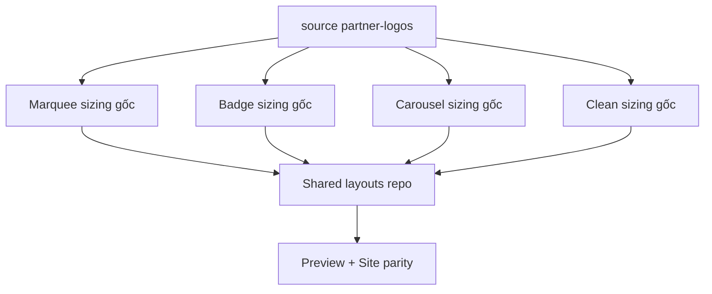

# I. Primer
## 1. TL;DR kiểu Feynman
- Anh đúng: em đã đi sai hướng ở vòng trước.
- Em lấy `Grid/Divider` làm chuẩn rồi ép `Marquee/Badge/Carousel/Clean` theo một sizing contract mới, trong khi source `C:\Users\VTOS\Downloads\partner-logos-section` không làm như vậy.
- Kết quả là 4 layout này bị “bung tùm lum” vì em đã tự bơm `min-w`, `min-h`, `padding` lớn hơn source thay vì bám đúng shell gốc của từng layout.
- Fix đúng bây giờ là bỏ tư duy “chuẩn hóa theo Grid/Divider”, quay về `source-faithful sizing` cho 4 layout còn lại.
- Tức là: mỗi layout sẽ có kích thước đúng kiểu source của chính nó, không dùng Grid làm benchmark nữa.

## 2. Elaboration & Self-Explanation
Sau khi đọc lại source thật trong `partner-logos-section`, em thấy vấn đề cốt lõi là em đã dùng sai chuẩn tham chiếu.

Source đang có triết lý rất rõ:
- `Grid`, `Clean`, `Divider`, `Badge`, `Carousel` đều có shell riêng.
- Chúng không cố cùng một hệ `min-w/min-h`.
- Chúng chỉ cùng chung tinh thần spacing gọn, nhưng mỗi layout có tỷ lệ riêng theo đúng tính chất layout đó.

Trong code repo hiện tại, 4 layout bị lệch vì em đã thêm các giá trị không bám source như:
- `Marquee`: `min-w-[220px]`, `280px`, `340px` + media wrapper rất to
- `Badge`: wrapper ảnh bị nâng lên theo logic tự chế, không còn pill rhythm của source
- `Carousel`: outer width + inner media cùng bị nới rộng hơn source, nên card bị phình
- `Clean`: thêm `min-w` module hóa theo logic benchmark, trong khi source clean là flex item rất nhẹ

Nói ngắn gọn:
- lỗi không phải là “chưa siết đủ”
- lỗi là “siết sai chuẩn”

Em đã chuẩn hóa theo một hệ mà source không dùng, nên nhìn càng ngày càng xa source.

## 3. Concrete Examples & Analogies
### a) Ví dụ cụ thể bám task
Trong source:
- `Badge` dùng pill rất gọn: logo nhỏ vừa đủ, padding mỏng, text cân.
- `Carousel` dùng card có khoảng đệm vừa phải, logo box không phình vô lý.
- `Clean` là các item rất nhẹ, không bị đóng khung thành module lớn.

Trong repo hiện tại:
- `Badge` bị nở wrapper ảnh quá mức.
- `Carousel` bị nở cả card lẫn media area.
- `Clean` bị thêm `min-w` nên mất cảm giác clean.
- `Marquee` bị chip/card dài hơn source.

### b) Analogy đời thường
Giống như có 4 món đồ mỗi món có size chuẩn riêng, nhưng em lại bắt cả 4 mặc cùng một size áo theo mẫu của món khác. Không phải áo chưa bó đủ, mà là mặc sai size chart ngay từ đầu.

# II. Audit Summary (Tóm tắt kiểm tra)
- Observation: source `partner-logos-section` cho `clean` dùng item rất nhẹ, không có `min-w` module hóa như repo hiện tại.
- Observation: source `badge` dùng pill compact với logo cỡ nhỏ-vừa ổn định, không có media wrapper nở lớn như hiện tại.
- Observation: source `carousel` dùng card width và inner logo box chặt hơn repo hiện tại.
- Observation: source `marquee` cũng giữ nhịp item gọn hơn, không dùng `min-w` lớn kiểu `220/280/340px` như repo hiện tại.
- Observation: repo hiện tại ở 4 layout này đang chứa nhiều class do em tự thêm, không tương ứng với source sizing.
- Inference: root cause là deviation khỏi source sizing contract, không phải thiếu một sizing contract chung.
- Decision: revert tư duy benchmark theo Grid/Divider, thay bằng restore sizing theo source cho từng layout.

# III. Root Cause & Counter-Hypothesis (Nguyên nhân gốc & Giả thuyết đối chứng)
## 1. Root Cause
### a) Triệu chứng quan sát được là gì
- Expected: Marquee, Badge, Carousel, Clean gọn, đúng nhịp như source folder.
- Actual: 4 layout bị phình, lệch nhịp, không giống source.

### b) Phạm vi ảnh hưởng
- 4 layout:
  - Marquee
  - Badge
  - Carousel
  - Clean
- Ảnh hưởng cả preview và site vì dùng chung shared components.

### c) Có tái hiện ổn định không? điều kiện tái hiện tối thiểu?
- Có. Chỉ cần mở preview/edit và chuyển qua 4 tab này là thấy khác source rõ.

### d) Mốc thay đổi gần nhất
- Lượt “tighten sizing contract” đã đưa thêm benchmark theo Grid/Divider, làm lệch thêm khỏi source.

### e) Dữ liệu nào đang thiếu để kết luận chắc chắn?
- Không thiếu blocker. Source và code hiện tại đã đủ evidence.

### f) Có giả thuyết thay thế hợp lý nào chưa bị loại trừ?
- “Chỉ cần siết thêm nữa”: sai, vì càng siết theo hệ sai càng lệch source.
- “Cần một global shared sizing contract”: không đúng với source, vì source giữ từng layout một rhythm riêng.
- “Do runtime image mode”: không phải vấn đề chính của feedback hiện tại.

### g) Rủi ro nếu fix sai nguyên nhân là gì?
- Càng chỉnh càng xa source.
- 4 layout sẽ tiếp tục mất cá tính riêng và vẫn nhìn sai.

### h) Tiêu chí pass/fail sau khi sửa?
- 4 layout nhìn gần source rõ rệt.
- Không còn `min-w/min-h/padding` phình quá mức do custom benchmark cũ.
- Preview và site cùng về đúng nhịp source.

## 2. Root Cause Confidence (Độ tin cậy nguyên nhân gốc)
- High — vì các class hiện tại lệch trực tiếp khỏi source, và source file là evidence chuẩn nhất mà anh yêu cầu bám theo.

# IV. Proposal (Đề xuất)
## 1. Hướng triển khai được chọn
- Bỏ benchmark theo `Grid/Divider` cho 4 layout.
- Refactor lại `Marquee`, `Badge`, `Carousel`, `Clean` theo kích thước và rhythm của source thật.
- Chỉ giữ lại phần cần thiết để hỗ trợ dữ liệu ảnh thật + `withName/logoOnly`, nhưng không tự bơm shell lớn nữa.

## 2. Các bước kỹ thuật chính
### a) Marquee
- Thu `min-w`, `padding`, media wrapper về gần source.
- Không để chip/card kéo dài bất thường.
- Giữ logo fit theo AR nhưng trong shell có nhịp giống source.

### b) Badge
- Kéo pill về compact source-like.
- Giảm wrapper ảnh và padding để badge nhìn gọn lại.
- Không module hóa badge như mini-card nữa.

### c) Carousel
- Thu outer card width và inner media box về gần source.
- Bỏ cảm giác card bị nở do double-sizing.
- Giữ swipe behavior hiện tại nhưng sizing quay về source.

### d) Clean
- Bỏ `min-w` benchmark hóa.
- Trả lại cảm giác item nhẹ, thoáng, không bị đóng khung quá mức.

### e) Guardrail
- Không đụng `Grid` và `Divider` trong lượt này.
- Chỉ sửa 4 layout user chỉ ra là đang sai.

## 3. Mermaid overview

# V. Files Impacted (Tệp bị ảnh hưởng)
- Sửa: `app/admin/home-components/partners/_components/PartnersMarqueeShared.tsx`
  - Vai trò hiện tại: marquee đang bị nở item shell so với source.
  - Thay đổi: kéo lại width/padding/media wrapper theo source-faithful sizing.

- Sửa: `app/admin/home-components/partners/_components/PartnersBadgeShared.tsx`
  - Vai trò hiện tại: badge đang bị nở wrapper ảnh và mất nhịp pill compact.
  - Thay đổi: trả lại compact pill sizing gần source.

- Sửa: `app/admin/home-components/partners/_components/PartnersCarouselShared.tsx`
  - Vai trò hiện tại: carousel đang bị phình card/media quá mức.
  - Thay đổi: thu card/media sizing về đúng nhịp source.

- Sửa: `app/admin/home-components/partners/_components/PartnersCleanShared.tsx`
  - Vai trò hiện tại: clean bị module hóa quá mức bằng `min-w` benchmark.
  - Thay đổi: trả lại item sizing nhẹ theo source.

- Không sửa: `PartnersGridShared.tsx`, `PartnersDividerShared.tsx`
  - Vai trò hiện tại: 2 layout này đang là phần ít bị user phản hồi ở vòng này.
  - Thay đổi: giữ nguyên để tránh mở rộng scope sai.

# VI. Execution Preview (Xem trước thực thi)
1. Đối chiếu trực tiếp source `partner-logos.tsx` cho 4 layout.
2. Gỡ các class sizing benchmark đã thêm trước đó.
3. Re-apply sizing source-faithful cho từng layout.
4. Giữ preview/site parity qua shared components.
5. Typecheck và commit local.

# VII. Verification Plan (Kế hoạch kiểm chứng)
- Static verification:
  - `bunx tsc --noEmit`
- Repro checklist:
  - Trong edit page, xem 4 layout `Marquee`, `Badge`, `Carousel`, `Clean` không còn phình bất thường.
  - So trực giác với source folder để xác nhận rhythm gần source hơn.
  - Preview và site cùng một shared sizing behavior.
  - Không làm regression ở Grid/Divider.

# VIII. Todo
1. Restore source-faithful sizing cho Marquee.
2. Restore source-faithful sizing cho Badge.
3. Restore source-faithful sizing cho Carousel.
4. Restore source-faithful sizing cho Clean.
5. Typecheck.
6. Commit local kèm spec.

# IX. Acceptance Criteria (Tiêu chí chấp nhận)
- 4 layout `Marquee`, `Badge`, `Carousel`, `Clean` không còn “bung tùm lum”.
- Kích thước các layout này nhìn bám source `partner-logos-section` hơn rõ rệt.
- Không còn các shell bị nở do benchmark sai theo Grid/Divider.
- Preview và site cùng khớp behavior mới.

# X. Risk / Rollback (Rủi ro / Hoàn tác)
- Rủi ro: quay sát source có thể làm một vài item nhỏ hơn bản vừa chỉnh trước.
- Giảm rủi ro: chỉ restore sizing shell, vẫn giữ support dữ liệu ảnh thật và AR.
- Rollback: thay đổi tập trung ở 4 shared files nên revert dễ.

# XI. Out of Scope (Ngoài phạm vi)
- Không chỉnh lại Grid/Divider trong lượt này.
- Không refactor uploader/schema/runtime image system.
- Không xử lý white-padding nằm sẵn trong file ảnh gốc.

# XII. Open Questions (Câu hỏi mở)
- Không còn blocker. Em sẽ mặc định coi source folder là chuẩn duy nhất cho 4 layout này, không dùng benchmark tự chế nữa.