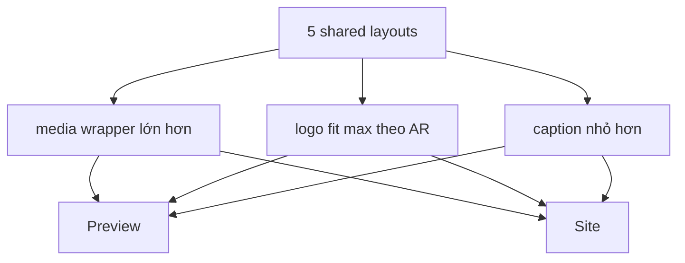

# I. Primer
## 1. TL;DR kiểu Feynman
- Đúng như anh nói: hiện chỉ `Grid` được làm kiểu ảnh khít sát khung.
- 5 layout còn lại (`Marquee`, `Badge`, `Carousel`, `Clean`, `Divider`) vẫn đang render logo theo kiểu icon-size, nên preview và site đều chưa “khít ảnh”.
- Em sẽ mở rộng cùng một nguyên tắc `image-first occupancy` sang cả 5 layout này, cho cả preview lẫn site.
- Mục tiêu là: logo to tối đa theo AR (Aspect Ratio - tỷ lệ ảnh), spacing nội bộ giảm tối đa, nhưng không crop và không méo.
- Em sẽ giữ từng layout đúng cá tính riêng, chỉ thay contract kích thước ảnh/card chứ không biến tất cả thành Grid.

## 2. Elaboration & Self-Explanation
Hiện tại codebase Partners đang ở trạng thái nửa cũ nửa mới:
- `Grid` đã được refactor sang tư duy mới: card/media wrapper lớn, ảnh fit tối đa, spacing rất ít.
- Nhưng 5 layout còn lại vẫn dùng class kiểu:
  - `w-5 h-5`
  - `w-6 h-6`
  - `w-10 h-10`
  - `w-12 h-12`
- Nghĩa là ảnh vẫn bị coi như icon nằm trong layout, chứ chưa phải nội dung chính cần chiếm diện tích tối đa.

Vì route edit `/admin/home-components/partners/[id]/edit` dùng `PartnersPreview` và site dùng `ComponentRenderer` với cùng shared layouts, nên nếu shared layout chưa đổi contract ảnh thì cả preview lẫn site đều sẽ còn cảm giác “ảnh chưa khít”.

Điểm quan trọng là: em sẽ không làm 5 layout còn lại giống hệt Grid. Mỗi layout sẽ giữ chất riêng:
- `Marquee`: vẫn là dải chạy ngang, nhưng mỗi item sẽ cho logo chiếm nhiều diện tích hơn trong chip/card.
- `Badge`: vẫn là pill/badge, nhưng logo sẽ bám khung hơn thay vì icon nhỏ.
- `Carousel`: vẫn là slide card, nhưng media area sẽ lớn hơn rõ rệt.
- `Clean`: vẫn tối giản, nhưng logo sẽ chiếm nhiều không gian thị giác hơn.
- `Divider`: vẫn là ô chia lưới có border, nhưng logo sẽ gần full ô hơn.

## 3. Concrete Examples & Analogies
### a) Ví dụ cụ thể bám task
Hiện tại ở `Carousel` mode:
- card rộng, nhưng phần logo chỉ là một ô nhỏ bên trong card
- nhìn card còn nhiều khoảng trắng hơn mức cần thiết

Sau khi sửa:
- card vẫn là carousel card
- nhưng phần media/logo sẽ chiếm gần hết không gian khả dụng của card
- tên nếu có chỉ chiếm 1 phần nhỏ còn lại
- logo ngang sẽ gần full chiều ngang vùng media

### b) Analogy đời thường
Giống 5 mẫu khung ảnh khác nhau đang cùng treo ảnh, nhưng mới chỉ có 1 mẫu khung được chỉnh viền mỏng sát ảnh. Em sẽ chỉnh tiếp 5 mẫu còn lại để ảnh cũng “ăn khung” đúng mức, nhưng không làm mất kiểu dáng riêng của từng khung.

# II. Audit Summary (Tóm tắt kiểm tra)
- Observation: `PartnersGridShared.tsx` đã dùng contract mới với `logoWrapperClassName` + `max-w-full max-h-full object-contain`.
- Observation: `PartnersMarqueeShared.tsx` vẫn dùng `logoClassName` kích thước nhỏ kiểu `w-5 h-5`, `w-12 h-12`.
- Observation: `PartnersBadgeShared.tsx` vẫn dùng `imageClassName` nhỏ kiểu `h-3.5 w-3.5`, `h-10 w-10`.
- Observation: `PartnersCarouselShared.tsx` vẫn bọc logo trong box nhỏ có padding riêng; logo chưa chiếm gần full card.
- Observation: `PartnersCleanShared.tsx` và `PartnersDividerShared.tsx` cũng vẫn dùng size icon-like cố định.
- Observation: route edit page `partners/[id]/edit/page.tsx` render `PartnersPreview`, nên shared layout nào chưa đổi thì preview cũng chưa đổi.
- Inference: root cause không nằm ở route edit hay site wiring nữa, mà nằm ở 5 shared layouts chưa được migrate sang image-first occupancy.
- Decision: mở rộng contract image-first cho toàn bộ 5 shared layouts còn lại, để preview/site cùng khớp.

# III. Root Cause & Counter-Hypothesis (Nguyên nhân gốc & Giả thuyết đối chứng)
## 1. Root Cause
### a) Triệu chứng quan sát được là gì
- Expected: mọi layout Partners đều cho ảnh logo khít sát khung tối đa, giống tinh thần Grid đã sửa.
- Actual: chỉ Grid đạt được điều đó; 5 layout còn lại vẫn còn logo nhỏ trong khung lớn.

### b) Phạm vi ảnh hưởng
- 5 layout còn lại của Partners:
  - Marquee
  - Badge
  - Carousel
  - Clean
  - Divider
- Ảnh hưởng cả preview và site runtime.

### c) Có tái hiện ổn định không? điều kiện tái hiện tối thiểu?
- Có. Chỉ cần chuyển style khỏi Grid trong màn edit hoặc site là sẽ thấy khác biệt ngay.

### d) Mốc thay đổi gần nhất
- Chỉ `Grid` được migrate sang occupancy contract mới ở các vòng fix trước.

### e) Dữ liệu nào đang thiếu để kết luận chắc chắn?
- Không thiếu blocker. Evidence đủ rõ từ code shared layouts hiện tại.

### f) Có giả thuyết thay thế hợp lý nào chưa bị loại trừ?
- Chỉ sửa route edit/page: không đúng vì route chỉ dùng shared components.
- Chỉ sửa site runtime image mode: không đủ vì preview cũng đang chưa khít ở 5 layout này.
- Chỉ tăng size class rời rạc từng layout: có thể đỡ phần nào nhưng vẫn không giải quyết theo contract thống nhất.

### g) Rủi ro nếu fix sai nguyên nhân là gì?
- 5 layout vẫn không đồng đều với Grid.
- Một số layout có thể bị to hơn nhưng vẫn còn spacing vô lý do chưa đổi cấu trúc media wrapper.

### h) Tiêu chí pass/fail sau khi sửa?
- Cả 6 layout đều cho cảm giác logo là nội dung chính, không còn icon nhỏ trong khung lớn.
- Preview và site cùng khớp behavior này.

## 2. Root Cause Confidence (Độ tin cậy nguyên nhân gốc)
- High — vì evidence trực tiếp nằm ở size classes và card structure của 5 shared layouts còn lại.

# IV. Proposal (Đề xuất)
## 1. Hướng triển khai được chọn
- Migrate 5 layout còn lại sang cùng triết lý `image-first occupancy`.
- Giữ khác biệt thị giác của từng layout.
- Ưu tiên sửa shared components để preview/site cùng hưởng.

## 2. Các bước kỹ thuật chính
### a) Marquee
- Tăng diện tích media trong mỗi chip/card chạy ngang.
- Với `withName`: logo chiếm phần lớn chiều cao item, tên chỉ là phần phụ.
- Với `logoOnly`: item gần như chỉ để hiển thị logo tối đa theo AR.

### b) Badge
- Giữ shape pill/badge nhưng giảm cảm giác icon nhỏ.
- Cho logo chiếm tối đa chiều cao khả dụng của badge.
- Rà lại padding ngang/dọc để viền sát nội dung hơn.

### c) Carousel
- Chia card thành `media area` và `caption area` rõ hơn.
- Giảm padding lồng nhau hiện tại.
- Để logo fit tối đa trong media area thay vì nằm trong một inner box nhỏ.

### d) Clean
- Giữ minimal look nhưng bỏ sizing icon cũ.
- Cho logo lớn hơn nhiều và cân lại gap text/logo.
- Nếu `logoOnly`, để logo là visual anchor chính.

### e) Divider
- Mỗi ô divider sẽ có media area lớn hơn.
- Logo chiếm gần full ô theo AR, text nếu có nằm dưới với khoảng cách rất nhỏ.

### f) Contract thống nhất
- Ở cả 5 layout, ưu tiên đổi từ `w/h cố định nhỏ` sang mẫu kiểu:
  - wrapper lớn hơn
  - `max-w-full max-h-full object-contain`
  - spacing cực mỏng
- Chỉ tinh chỉnh khác nhau ở wrapper height/shape cho từng layout.

## 3. Mermaid overview

# V. Files Impacted (Tệp bị ảnh hưởng)
- Sửa: `app/admin/home-components/partners/_components/PartnersMarqueeShared.tsx`
  - Vai trò hiện tại: layout chạy ngang với logo-size kiểu icon.
  - Thay đổi: tăng occupancy của logo trong item marquee, giảm spacing nội bộ.

- Sửa: `app/admin/home-components/partners/_components/PartnersBadgeShared.tsx`
  - Vai trò hiện tại: badge/pill với logo nhỏ.
  - Thay đổi: để logo bám khung badge hơn và giảm padding thừa.

- Sửa: `app/admin/home-components/partners/_components/PartnersCarouselShared.tsx`
  - Vai trò hiện tại: carousel card với inner box cho logo còn khá nhỏ.
  - Thay đổi: chuyển sang media-first card structure rõ hơn.

- Sửa: `app/admin/home-components/partners/_components/PartnersCleanShared.tsx`
  - Vai trò hiện tại: layout tối giản nhưng logo còn nhỏ kiểu icon.
  - Thay đổi: tăng diện tích logo và giảm gap không cần thiết.

- Sửa: `app/admin/home-components/partners/_components/PartnersDividerShared.tsx`
  - Vai trò hiện tại: ô divider có ảnh chưa chiếm đủ diện tích.
  - Thay đổi: tăng occupancy trong từng cell, giữ AR.

- Không dự kiến sửa logic lớn: `PartnersPreview.tsx`, `components/site/ComponentRenderer.tsx`
  - Vai trò hiện tại: chỉ wiring preview/site.
  - Thay đổi: chỉ sửa nếu cần để parity cuối cùng tuyệt đối.

# VI. Execution Preview (Xem trước thực thi)
1. Đọc lại 5 shared layouts còn lại.
2. Refactor từng layout sang image-first occupancy.
3. Giữ mode `withName` và `logoOnly` tương thích.
4. Kiểm tra parity preview/site qua shared components.
5. Typecheck và commit local.

# VII. Verification Plan (Kế hoạch kiểm chứng)
- Static verification:
  - `bunx tsc --noEmit`
- Repro checklist:
  - Trong trang edit Partners, đổi qua từng style và kiểm tra ảnh khít hơn rõ rệt.
  - So sánh preview với site runtime cho ít nhất 2–3 style ngoài Grid.
  - Bảo đảm logo giữ AR, không crop/méo.
  - `withName` vẫn đọc được tên, `logoOnly` không còn card rỗng chứa logo nhỏ.

# VIII. Todo
1. Migrate Marquee sang image-first occupancy.
2. Migrate Badge sang image-first occupancy.
3. Migrate Carousel sang image-first occupancy.
4. Migrate Clean và Divider sang image-first occupancy.
5. Rà parity preview/site.
6. Typecheck và commit local.

# IX. Acceptance Criteria (Tiêu chí chấp nhận)
- Không còn chuyện chỉ Grid khít ảnh còn 5 layout khác thì không.
- Cả preview và site của 5 layout còn lại đều cho logo to tối đa theo AR.
- Giữ được bản sắc từng layout, không biến tất cả thành Grid clone.
- Không làm vỡ mode `withName` / `logoOnly`.

# X. Risk / Rollback (Rủi ro / Hoàn tác)
- Rủi ro: nếu đẩy quá mạnh, một số layout có thể mất nhịp đặc trưng riêng.
- Rủi ro: text name ở `withName` có thể bị chật trong vài layout nhỏ.
- Giảm rủi ro: tinh chỉnh wrapper/caption riêng cho từng layout thay vì ép một công thức y hệt nhau.
- Rollback: thay đổi tập trung ở 5 shared components nên hoàn tác dễ.

# XI. Out of Scope (Ngoài phạm vi)
- Không refactor lại Grid trong lượt này trừ khi phát hiện regression.
- Không đổi schema dữ liệu hoặc uploader.
- Không xử lý white-padding nằm bên trong chính file ảnh gốc.

# XII. Open Questions (Câu hỏi mở)
- Không còn ambiguity lớn. Scope đã rõ: cả preview và site cho cả 5 layout còn lại.