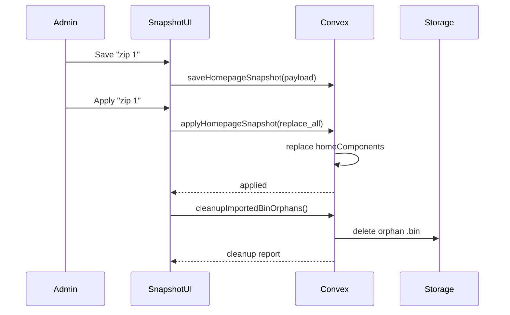

# I. Primer
## 1. TL;DR kiểu Feynman
- Em sẽ nâng “Tạo nhanh” từ 1 snapshot thành **kho profile giao diện** (zip1, zip2, ...), có nút **Áp dụng** để load đúng kiểu giao diện mong muốn.
- Theo yêu cầu anh, **mặc định load profile sẽ Replace toàn bộ home-components hiện có**.
- Em sẽ giữ import snapshot ở chế độ chỉ phục vụ homepage flow, còn import `/system/data` vẫn hoạt động riêng.
- Điểm fix quan trọng: sau import từ **cả 2 cơ chế** (quick snapshot và `/system/data`), hệ thống sẽ **tự dọn file `.bin` dư không còn tham chiếu** khỏi `/admin/media`.

## 2. Elaboration & Self-Explanation
- Hiện flow mới chỉ là “snapshot hiện tại” tại thời điểm mở dialog, nên anh chưa có cảm giác kho preset để đổi layout nhanh giữa nhiều phương án UI.
- Nâng cấp lần này sẽ thêm lớp lưu trữ profile trong DB (`homeComponentSnapshots`) với danh sách profile, metadata và thao tác Apply/Export/Delete.
- Khi bấm “Load kiểu 1”, hệ thống không append nữa mà **replace home-components** để đảm bảo nhìn ra đúng giao diện kiểu 1, không trộn với kiểu cũ.
- Về `.bin`: gốc rễ là MIME generic (`application/octet-stream`) hoặc extension không xác định trong pipeline upload/import. Em sẽ thêm cleanup tự động có điều kiện “không còn tham chiếu trong config/settings/module data” rồi mới xóa.

## 3. Concrete Examples & Analogies
- Ví dụ vận hành:
  - Team có profile `Landing-Clinic-v1`, `Landing-Clinic-v2`, `Landing-Clinic-v3`.
  - Chọn `v2` → Apply → homepage đổi ngay sang layout v2 (replace toàn bộ).
  - Nếu import bundle tạo ra 5 file `.bin` nhưng 3 file không được block nào dùng, hệ thống tự xóa 3 file dư; 2 file còn tham chiếu thì giữ.
- Analogy: giống tủ đồ có nhiều bộ outfit hoàn chỉnh; chọn bộ nào thì thay cả set, không trộn áo bộ này với quần bộ khác.

# II. Audit Summary (Tóm tắt kiểm tra)
- Observation:
  - Đã có `homeComponentSnapshots` table và `homepageSnapshots.ts` nhưng chưa có list/apply nhiều profile.
  - UI `HomepageSnapshotDialog` hiện chỉ làm việc với snapshot tức thời, chưa có “storage mode”.
  - Pipeline import ở quick snapshot và `MigrationBundleCard` đều có khả năng phát sinh `.bin` trong media khi MIME không chuẩn.
- Inference:
  - Cần bổ sung profile lifecycle APIs + UI list/profile actions.
  - Cần một cleanup mutation dùng chung cho cả 2 luồng import.
- Decision:
  - Triển khai profile-based snapshot manager + auto cleanup `.bin` hậu import.

# III. Root Cause & Counter-Hypothesis (Nguyên nhân gốc & Giả thuyết đối chứng)
1. Triệu chứng: chỉ có 1 snapshot “live”, không có kho kiểu giao diện để switch nhanh.
2. Phạm vi ảnh hưởng: UX team vận hành homepage, độ sạch media tại `/admin/media`, import flows snapshot + system/data.
3. Tái hiện: luôn tái hiện khi cần so sánh nhiều biến thể layout hoặc import có MIME thiếu rõ ràng.
4. Mốc thay đổi gần nhất: commit thay Smart Wizard bằng snapshot flow đã tạo nền tảng capture/import.
5. Dữ liệu thiếu: chưa có index/metadata đầy đủ cho profile listing (label, createdAt, lastAppliedAt).
6. Giả thuyết thay thế: “chỉ cần export nhiều zip bằng tay” không giải quyết apply nhanh trong UI và tracking trạng thái profile.
7. Rủi ro fix sai: xóa nhầm `.bin` còn tham chiếu thực tế.
8. Pass/fail: có thể tạo nhiều profile + apply replace chính xác + `.bin` dư tự dọn sau import.

- Root Cause Confidence: **High**
  - Lý do: code hiện tại có `saveHomepageSnapshot` nhưng chưa có luồng list/apply profile, và chưa có cleanup .bin hậu import.

```mermaid
flowchart TD
  A[Snapshot Dialog] --> B[Save Profile]
  B --> C[(homeComponentSnapshots)]
  C --> D[List Profiles]
  D --> E[Apply Profile]
  E --> F[Replace homeComponents]
  F --> G[Import media done]
  G --> H[Cleanup orphan .bin]
  H --> I[/admin/media sạch]
```

# IV. Proposal (Đề xuất)
- Option A (Recommend) — Confidence 92%
  - Theo đúng quyết định anh:
    - Kho profile: **Danh sách profile lưu DB + nút Áp dụng**.
    - Apply mode mặc định: **Replace toàn bộ home-components**.
    - `.bin` policy: **Tự xóa ngay nếu không tham chiếu**.
    - Áp dụng cho cả import từ quick snapshot và `/system/data`.

- Thiết kế chi tiết:
  - a) Snapshot profile lifecycle
    - `listHomepageSnapshots()`
    - `saveHomepageSnapshot({ label, payload })`
    - `applyHomepageSnapshot({ snapshotId, mode: replace_all })`
    - `removeHomepageSnapshot({ snapshotId })`
    - `exportHomepageSnapshot({ snapshotId })` (client ZIP builder dùng payload đã lưu)
  - b) UI storage mode
    - Tab “Profile đã lưu” trong `HomepageSnapshotDialog`.
    - Hành động: Save profile mới, Apply, Export ZIP, Delete.
    - Hiển thị metadata: số component, createdAt, version.
  - c) Auto cleanup `.bin` dư
    - Tạo mutation dùng chung: `storage.cleanupImportedBinOrphans({ folders?: string[] })`.
    - Thuật toán: chỉ xét record `images` có extension=`bin` hoặc filename kết thúc `.bin`; kiểm tra tham chiếu URL trong:
      1) `homeComponents.config`
      2) `settings.value`
      3) payload import hiện tại (nếu có)
    - Nếu không tham chiếu: xóa `images` record + storage object.
  - d) Gắn cleanup vào 2 luồng
    - Sau `importHomepageSnapshot` thành công.
    - Sau `migrationBundles.importBundle` thành công ở `MigrationBundleCard`.



# V. Files Impacted (Tệp bị ảnh hưởng)
- **Sửa:** `convex/homepageSnapshots.ts`
  - Vai trò hiện tại: capture/preflight/import snapshot cơ bản.
  - Thay đổi: thêm list/apply/remove profile + apply replace từ snapshot đã lưu.
- **Sửa:** `components/modules/homepage/HomepageSnapshotDialog.tsx`
  - Vai trò hiện tại: export/import snapshot tức thời.
  - Thay đổi: thêm storage mode (danh sách profile + apply/export/delete).
- **Sửa:** `convex/storage.ts`
  - Vai trò hiện tại: save/get/delete image, cleanup orphan chung.
  - Thay đổi: thêm cleanup `.bin` orphan chuyên cho hậu import.
- **Sửa:** `components/data/import-export/MigrationBundleCard.tsx`
  - Vai trò hiện tại: import `/system/data` bundle.
  - Thay đổi: gọi cleanup `.bin` orphan sau import thành công.
- **Sửa:** `lib/homepage-snapshot/client.ts`
  - Vai trò hiện tại: zip create/parse.
  - Thay đổi: hỗ trợ export theo snapshot payload đã lưu, giữ metadata profile.
- **Sửa (nhẹ):** `convex/schema.ts`
  - Vai trò hiện tại: có table snapshot.
  - Thay đổi: thêm index cần thiết nếu thiếu (vd `by_createdAt` đã có; cân nhắc `by_label`).

# VI. Execution Preview (Xem trước thực thi)
1. Bổ sung APIs profile lifecycle trong Convex.
2. Refactor dialog thành 2 mode: “Snapshot hiện tại” và “Kho profile”.
3. Implement apply replace-all từ profile payload.
4. Implement cleanup `.bin` orphan mutation an toàn (check tham chiếu trước xóa).
5. Nối cleanup call vào quick snapshot import + `/system/data` import.
6. Review tĩnh và typecheck.

# VII. Verification Plan (Kế hoạch kiểm chứng)
- Case 1: Lưu 3 profile (`zip1`,`zip2`,`zip3`) và thấy đủ trong danh sách.
- Case 2: Apply `zip2` → homepage chỉ còn layout/profile `zip2` (replace đúng).
- Case 3: Import quick snapshot có media `.bin` dư → sau import mở `/admin/media` xác nhận file dư đã biến mất.
- Case 4: Import `/system/data` bundle có `.bin` dư → cleanup chạy tự động tương tự.
- Case 5: `.bin` còn được tham chiếu thì **không bị xóa**.
- Static verify: `bunx tsc --noEmit`.

# VIII. Todo
- [ ] Thêm list/apply/remove snapshot profile APIs.
- [ ] Nâng UI dialog thành storage mode với danh sách profile + apply replace.
- [ ] Thêm cleanup `.bin` orphan mutation trong storage.
- [ ] Gắn cleanup vào 2 flow import (quick snapshot, `/system/data`).
- [ ] Typecheck + self-review edge cases.

# IX. Acceptance Criteria (Tiêu chí chấp nhận)
- Có thể lưu nhiều profile snapshot và apply từng profile từ UI.
- Apply profile mặc định replace toàn bộ home-components.
- Import từ quick snapshot hoặc `/system/data` đều tự dọn `.bin` dư không tham chiếu.
- Không xóa nhầm media `.bin` còn tham chiếu.

# X. Risk / Rollback (Rủi ro / Hoàn tác)
- Risk: false-positive orphan detection nếu scan tham chiếu thiếu bề mặt.
- Mitigation: chỉ xóa khi qua 2 điều kiện (đuôi `.bin` + không thấy URL trong config/settings).
- Rollback: tắt auto-cleanup call, giữ manual cleanup mutation để chạy chủ động.

# XI. Out of Scope (Ngoài phạm vi)
- Không đổi cơ chế import business modules của `/system/data` ngoài phần cleanup `.bin`.
- Không thêm sync cloud profile giữa nhiều deployment khác nhau.

# XII. Open Questions (Câu hỏi mở)
- Không còn ambiguity chính; yêu cầu đã rõ theo quyết định anh (DB profiles + replace + auto delete orphan `.bin`).