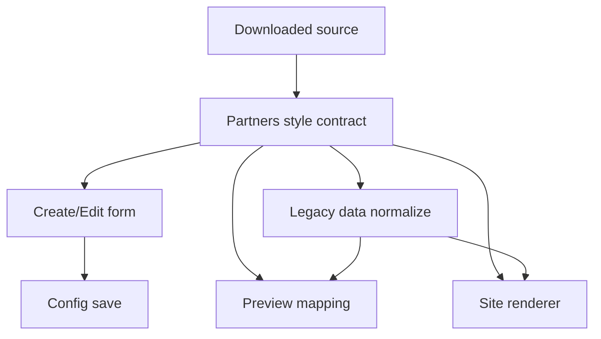

# I. Primer
## 1. TL;DR kiểu Feynman
- Hiện component Partners trong repo đang dùng 6 layout cũ, nhưng thư mục mới có 6 layout khác chuẩn mới hơn.
- Mình sẽ đổi hẳn contract của Partners sang bộ layout mới: `marquee | grid | badge | carousel | clean | divider`.
- Mọi chỗ dùng Partners sẽ được đồng bộ cùng một nguồn render: create, edit, preview, site render và các bề mặt điều hướng/liên quan trong SaaS.
- Vẫn giữ logic hệ thống đang có: single/dual color token, font override, preview device, upload logo, link logo, data cũ không bị vỡ.
- Vì source mới có thêm `subheading` và `align`, config của Partners sẽ được mở rộng để admin cấu hình được phần header.
- Carousel sẽ bám sát layout/interactions mới, không giữ kiểu carousel cũ của repo.

## 2. Elaboration & Self-Explanation
Partners hiện là một home-component đã được tách module khá rõ trong admin. Repo đang có các khối render shared riêng như `PartnersGridShared`, `PartnersMarqueeShared`, `PartnersFeaturedShared`... và site runtime cũng import lại chính các shared block đó để bảo đảm preview gần giống site.

Vấn đề là folder `partner-logos-section` mang theo một “bộ ngôn ngữ thiết kế” mới cho Partners. Bộ mới không chỉ đổi UI mà còn đổi luôn style contract: repo có `mono` và `featured`, còn source mới có `clean` và `divider`. Ngoài ra source mới có header giàu hơn với `heading`, `subheading`, `align`, trong khi config hiện tại chủ yếu mới lưu `title` và `style`.

Nếu chỉ copy UI từng layout mà không đổi contract, create/edit/site sẽ bị lệch: preview chọn một style nhưng site render theo mapping cũ; dữ liệu cũ không đủ field cho layout mới; system surfaces vẫn hiểu theo bộ style cũ. Vì vậy hướng đúng là thay contract một lần ở tầng types + preview tabs + admin form + site renderer, rồi cắm lại các shared render blocks theo source mới nhưng vẫn bọc bằng color/font token sẵn có của hệ thống.

Nói ngắn: mình không “dán” component source vào repo. Mình sẽ “dịch” source mới sang kiến trúc hiện có của VietAdmin để vừa giống layout mới, vừa không làm mất các cơ chế override màu, font, preview, và khả năng dùng lại ở site.

## 3. Concrete Examples & Analogies
### a) Ví dụ cụ thể bám task
Hiện edit page lưu config gần như kiểu này:
- `config.items`
- `config.style`

Sau rollout, config Partners sẽ theo hướng:
- `config.items`
- `config.style` với giá trị mới: `marquee | grid | badge | carousel | clean | divider`
- `config.subheading`
- `config.align`

Ví dụ record cũ:
```json
{
  "style": "featured",
  "items": [{ "url": "/logo-a.png", "link": "https://a.com", "name": "A" }]
}
```

Khi normalize để không vỡ dữ liệu cũ, có thể map runtime như sau:
- `featured -> grid` hoặc `featured -> clean` theo rule migration tương thích
- `mono -> marquee` theo fallback tương thích
- nếu thiếu `subheading` thì mặc định rỗng
- nếu thiếu `align` thì mặc định `center`

### b) Analogy đời thường
Giống như thay toàn bộ “mẫu gian trưng bày logo đối tác” trong showroom: không chỉ đổi poster ngoài mặt tiền, mà phải đổi cả menu chọn mẫu trong admin, cách lưu lựa chọn vào hệ thống, và cách render ra site cho khách xem. Nhưng hệ thống điện, màu đèn và font bảng hiệu vẫn dùng hạ tầng cũ của showroom.

# II. Audit Summary (Tóm tắt kiểm tra)
- Observation: source mới nằm tại `C:\Users\VTOS\Downloads\partner-logos-section\components\partner-logos.tsx`, chứa 6 variant `marquee | grid | badge | carousel | clean | divider` và có swipe carousel riêng.
- Observation: repo hiện dùng `PartnersStyle = 'grid' | 'marquee' | 'mono' | 'badge' | 'carousel' | 'featured'` tại `app/admin/home-components/partners/_types/index.ts`.
- Observation: preview admin đang map 6 style cũ trong `app/admin/home-components/partners/_components/PartnersPreview.tsx`.
- Observation: create surface tại `app/admin/home-components/create/partners/page.tsx`, edit surface tại `app/admin/home-components/partners/[id]/edit/page.tsx`, site render tại `components/site/ComponentRenderer.tsx` đều đang phụ thuộc style contract cũ.
- Observation: `lib/modules/configs/homepage.config.ts` và các route guide/redirect liên quan có nhắc tới Partners như một home-component chuẩn, nên rollout cần giữ tương thích toàn hệ thống chứ không chỉ riêng trang edit.
- Inference: nếu thay layout mà không thay style contract + normalize dữ liệu cũ, sẽ tạo mismatch giữa preview/admin/site và có nguy cơ record cũ không render như kỳ vọng.
- Decision: rollout toàn bộ Partners theo source mới, nhưng giữ nguyên kiến trúc shared-render + token màu/font + preview system của repo.

# III. Root Cause & Counter-Hypothesis (Nguyên nhân gốc & Giả thuyết đối chứng)
## 1. Root Cause
### a) Triệu chứng quan sát được là gì
- Expected: user muốn “các layout mới của home-component partner” áp dụng cho create, edit, system touchpoints và các bề mặt SaaS liên quan.
- Actual: repo vẫn đang neo vào bộ style cũ (`mono`, `featured`) và shared components cũ.

### b) Phạm vi ảnh hưởng
- User-facing: site render của Partners.
- Admin-facing: create/edit preview, style tabs, helper text, form config.
- Module/system-facing: các bề mặt điều hướng, config liên quan tới loại component Partners.

### c) Có tái hiện ổn định không
- Có, dựa trên code đọc được: mọi surface quan trọng đều đang hardcode contract style cũ.

### d) Mốc thay đổi gần nhất
- Có lịch sử refactor/spec riêng cho Partners trong `.factory/docs`, cho thấy component này đã từng được tối ưu riêng nhiều lần; vì vậy thay contract cần làm có kiểm soát để tránh lệch preview/site lần nữa.

### e) Dữ liệu nào còn thiếu
- Chưa đọc toàn bộ từng shared component cũ, nhưng đã đủ evidence để xác định vấn đề ở mức contract + mapping surfaces.

### f) Giả thuyết thay thế hợp lý chưa bị loại trừ
- Counter-hypothesis 1: chỉ cần reskin UI cho 4 style trùng tên là đủ. Bị loại vì user yêu cầu thay theo thư mục mới và source mới có 2 style mới thay 2 style cũ.
- Counter-hypothesis 2: giữ contract cũ rồi map ngầm source mới. Bị loại vì sẽ khó hiểu cho admin và tăng rủi ro mismatch create/edit/site.
- Counter-hypothesis 3: copy nguyên component source vào site thôi. Bị loại vì sẽ làm mất parity với token màu/font/preview/shared architecture hiện có.

### g) Rủi ro nếu fix sai nguyên nhân
- Preview và site tiếp tục lệch nhau.
- Record cũ có style `mono/featured` có thể render lỗi hoặc fallback khó đoán.
- Admin create/edit có thể lưu config thiếu field cho header mới.

### h) Tiêu chí pass/fail sau khi sửa
- Admin create/edit/site cùng hiểu một bộ style mới.
- Record cũ không crash và có fallback rõ ràng.
- Header mới (`title/subheading/align`) có thể cấu hình và preview đúng.
- Single/dual color + font override vẫn chạy như trước.

## 2. Root Cause Confidence (Độ tin cậy nguyên nhân gốc)
- High — vì evidence nằm trực tiếp ở type contract, preview mapping, create/edit pages và site renderer; đây là các điểm quyết định hành vi runtime của Partners.

# IV. Proposal (Đề xuất)
## 1. Hướng triển khai được chọn
- Thay hẳn bộ layout hiện tại của Partners theo source mới.
- Giữ lại logic chung của hệ thống: color token single/dual, font override, preview device/frame, image uploader, route structure, shared component reuse giữa preview/site.
- Mở rộng config để hỗ trợ `subheading` và `align` như source mới.
- Carousel bám sát interaction/layout mới từ source.

## 2. Các bước kỹ thuật chính
### a) Chuẩn hóa style contract và normalize dữ liệu cũ
- Đổi `PartnersStyle` thành: `grid | marquee | badge | carousel | clean | divider`.
- Thêm hàm normalize style cũ để tránh record cũ bị vỡ:
  - `mono -> marquee`
  - `featured -> grid` hoặc `clean` theo rule được chọn nhất quán trong code
- Thêm normalize cho `align` mặc định `center`, `subheading` mặc định rỗng.

### b) Mở rộng config admin của Partners
- Create/Edit sẽ lưu thêm:
  - `subheading?: string`
  - `align?: 'left' | 'center' | 'right'`
- Bổ sung UI nhập subheading + align selector ở form/edit surface.
- Giữ `title` làm heading chính để không phá contract chung của home-component wrapper.

### c) Thay các shared render blocks theo source mới
- Refactor hoặc thay thế các shared block hiện có để phản ánh đúng 6 layout mới.
- Dự kiến tách/điều chỉnh thành các block tương ứng:
  - `PartnersMarqueeShared`
  - `PartnersGridShared`
  - `PartnersBadgeShared`
  - `PartnersCarouselShared`
  - `PartnersCleanShared`
  - `PartnersDividerShared`
- Loại bỏ dependency thực tế khỏi `PartnersFeaturedShared`; `mono` không còn là style public.
- Header render nên được tách helper/shared block dùng chung để preview/site không lệch phần heading/subheading/alignment.

### d) Đồng bộ preview và site runtime
- `PartnersPreview.tsx` render đúng 6 style mới.
- `ComponentRenderer.tsx` cũng render đúng 6 style mới và dùng chung shared blocks tương ứng.
- Cùng một normalize path cho style/config để admin preview và site runtime ra kết quả giống nhau.

### e) Cập nhật các touchpoints liên quan trong SaaS
- Tabs style ở create/edit.
- Copy helper “kích thước logo tối ưu” theo 6 layout mới.
- Redirect/guide references không cần đổi route, nhưng cần rà nếu có label/style text gắn với layout cũ.
- Các bề mặt `/system/home-components` và surface module/config liên quan vẫn giữ compatibility vì loại component vẫn là `Partners`; chủ yếu cần đảm bảo config JSON mới không phá display/serialization.

## 3. Mermaid overview


# V. Files Impacted (Tệp bị ảnh hưởng)
## 1. UI admin
- Sửa: `app/admin/home-components/partners/_types/index.ts`
  - Vai trò hiện tại: định nghĩa `PartnersStyle` và `PartnerItem` cho toàn module.
  - Thay đổi: cập nhật style union mới và có thể bổ sung kiểu `align`/config helper.

- Sửa: `app/admin/home-components/partners/_lib/constants.ts`
  - Vai trò hiện tại: định nghĩa danh sách tab style cho preview/admin.
  - Thay đổi: đổi từ bộ style cũ sang `grid, marquee, badge, carousel, clean, divider`.

- Sửa: `app/admin/home-components/partners/_components/PartnersForm.tsx`
  - Vai trò hiện tại: form upload logo/link cho Partners.
  - Thay đổi: bổ sung field cấu hình header phụ như subheading và align nếu form này là nơi gom config chung.

- Sửa: `app/admin/home-components/create/partners/page.tsx`
  - Vai trò hiện tại: create surface cho Partners, lưu items + style và preview realtime.
  - Thay đổi: thêm state/config cho `subheading`, `align`, dùng bộ style mới, cập nhật helper copy theo layout mới.

- Sửa: `app/admin/home-components/partners/[id]/edit/page.tsx`
  - Vai trò hiện tại: edit surface, load/save config hiện có của Partners.
  - Thay đổi: normalize dữ liệu cũ, load/save fields mới, thay preview/style logic theo contract mới.

- Sửa: `app/admin/home-components/partners/_components/PartnersPreview.tsx`
  - Vai trò hiện tại: preview realtime cho create/edit và điều khiển style tabs.
  - Thay đổi: render 6 layout mới, truyền `subheading`, `align`, bỏ các style cũ public.

## 2. Shared render blocks
- Sửa: `app/admin/home-components/partners/_components/PartnersMarqueeShared.tsx`
  - Vai trò hiện tại: render marquee/mono dùng chung cho preview/site.
  - Thay đổi: bám visual mới của source marquee và bỏ nhánh mono public.

- Sửa: `app/admin/home-components/partners/_components/PartnersGridShared.tsx`
  - Vai trò hiện tại: render layout grid dùng chung.
  - Thay đổi: cập nhật structure/spacing/hover/header theo source mới.

- Sửa: `app/admin/home-components/partners/_components/PartnersBadgeShared.tsx`
  - Vai trò hiện tại: render badge layout dùng chung.
  - Thay đổi: bám visual mới từ source mới nhưng vẫn dùng token màu hệ thống.

- Sửa: `app/admin/home-components/partners/_components/PartnersCarouselShared.tsx`
  - Vai trò hiện tại: carousel kiểu cũ theo paging/grid.
  - Thay đổi: refactor sang swipe-track interaction bám source mới.

- Thêm hoặc Sửa lớn: `app/admin/home-components/partners/_components/PartnersCleanShared.tsx`
  - Vai trò hiện tại: chưa có.
  - Thay đổi: thêm layout clean mới dùng chung preview/site.

- Thêm hoặc Sửa lớn: `app/admin/home-components/partners/_components/PartnersDividerShared.tsx`
  - Vai trò hiện tại: chưa có.
  - Thay đổi: thêm layout divider mới dùng chung preview/site.

- Sửa/giảm vai trò: `app/admin/home-components/partners/_components/PartnersFeaturedShared.tsx`
  - Vai trò hiện tại: layout featured cũ.
  - Thay đổi: có thể ngừng dùng trong preview/site public; cân nhắc xóa nếu không còn reference.

## 3. Site/runtime/shared wiring
- Sửa: `components/site/ComponentRenderer.tsx`
  - Vai trò hiện tại: site runtime render Partners bằng shared blocks cũ.
  - Thay đổi: map đúng 6 style mới, thêm normalize dữ liệu cũ và truyền header config mới.

## 4. System/related surfaces
- Sửa nhỏ nếu cần: `app/admin/home-components/_shared/legacy/HomeComponentLegacyEditor.tsx`
  - Vai trò hiện tại: redirect legacy editor sang route chuyên biệt của Partners.
  - Thay đổi: chủ yếu không đổi route; chỉ rà để chắc không có assumption gắn với style cũ.

- Sửa nhỏ nếu cần: `app/system/huong-dan/_data/guides.ts`
  - Vai trò hiện tại: guide route liên quan tới create Partners.
  - Thay đổi: chỉ update nếu có text mô tả layout cũ ngay trong guide data.

# VI. Execution Preview (Xem trước thực thi)
1. Đọc kỹ các shared components hiện tại của Partners để bám style codebase và token API đang dùng.
2. Đổi type contract + preview tabs + normalize helpers cho style mới.
3. Mở rộng create/edit config với `subheading` và `align`.
4. Refactor/thêm shared layout components theo source mới, ưu tiên header shared thống nhất.
5. Nối lại `PartnersPreview` và `ComponentRenderer` để dùng chung render path.
6. Rà các touchpoints liên quan trong admin/system/legacy surfaces để tránh assumption style cũ.
7. Tự review tĩnh logic tương thích dữ liệu cũ, import/reference thừa và đường fallback.
8. Nếu user duyệt spec, bước implement xong sẽ chạy `bunx tsc --noEmit` theo rule repo vì có thay đổi TypeScript, rồi commit local, không push.

# VII. Verification Plan (Kế hoạch kiểm chứng)
- Static verification chính:
  - `bunx tsc --noEmit` sau khi đổi code TS/TSX.
- Code-path verification bằng đọc logic:
  - Create page lưu đúng `items/style/subheading/align`.
  - Edit page load config cũ và mới không crash.
  - Preview tabs hiển thị đúng 6 layout mới.
  - Site renderer hiểu `mono/featured` cũ qua normalize fallback.
- Repro checklist thủ công cho tester sau implement:
  - Tạo mới Partners với từng style và kiểm tra preview/site parity.
  - Mở record cũ style `mono`/`featured` để xác nhận fallback hợp lệ.
  - Kiểm tra single/dual color và font override vẫn đổi đúng trên 6 layout.
  - Kiểm tra `/system/home-components` và các route liên quan không vỡ điều hướng/serialization.

# VIII. Todo
1. Chuẩn hóa style contract mới và helper normalize dữ liệu cũ.
2. Mở rộng config Partners với subheading + align ở create/edit.
3. Refactor/thêm shared render blocks theo source mới.
4. Đồng bộ preview admin và site runtime cùng một mapping.
5. Rà bề mặt liên quan trong SaaS để loại bỏ assumption layout cũ.
6. Typecheck và commit local sau khi implement.

# IX. Acceptance Criteria (Tiêu chí chấp nhận)
- Partners chỉ còn dùng bộ style mới: `marquee | grid | badge | carousel | clean | divider` ở create/edit/preview/site.
- Layout hiển thị bám sát source mới nhưng vẫn dùng hệ thống single/dual color token và font override hiện có.
- Admin cấu hình được thêm `subheading` và `align` cho phần header.
- Preview và site render nhất quán cho cùng một config.
- Record cũ dùng `mono` hoặc `featured` không làm trang lỗi và có fallback rõ ràng.
- Các route liên quan như create/edit/system surfaces vẫn hoạt động bình thường về mặt wiring.

# X. Risk / Rollback (Rủi ro / Hoàn tác)
- Rủi ro lớn nhất là migration logic cho dữ liệu cũ nếu map `featured/mono` sang style mới không đúng kỳ vọng business.
- Rủi ro thứ hai là carousel mới có interaction khác, dễ lệch giữa preview và site nếu duplicate logic.
- Cách giảm rủi ro:
  - Dùng normalize helper dùng chung cho preview/site.
  - Giữ route và shape cơ bản của `items` không đổi.
  - Chỉ mở rộng config thay vì thay toàn bộ data model.
- Rollback:
  - Vì thay đổi tập trung trong module Partners shared, có thể rollback bằng revert commit nếu rollout không đạt kỳ vọng.

# XI. Out of Scope (Ngoài phạm vi)
- Không đổi schema business rộng hơn ngoài config cần thiết của Partners.
- Không refactor các home-component khác.
- Không thêm tool/script/productize mới chỉ để migrate data hàng loạt.
- Không tự push remote.

# XII. Open Questions (Câu hỏi mở)
- Không còn ambiguity blocker ở mức spec. Mặc định sẽ map dữ liệu cũ `mono/featured` sang style mới bằng normalize helper trong runtime/admin để bảo toàn tương thích khi implement.