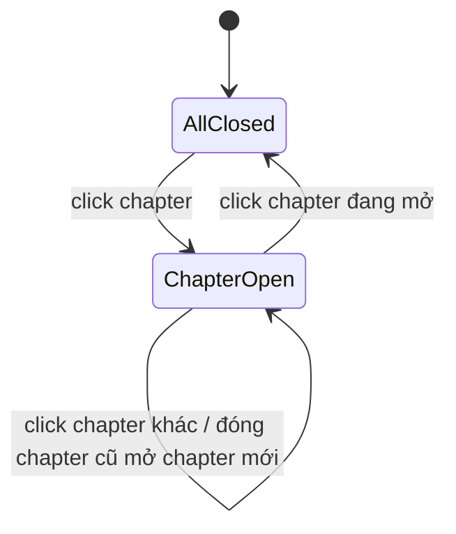

# I. Primer
## 1. TL;DR kiểu Feynman
- Refactor giao diện `/system/huong-dan` theo kiểu **accordion 1 mở duy nhất** (mở cái này thì đóng hết cái khác), giống sidebar admin.
- Trạng thái mặc định: **đóng tất cả** khi vào trang.
- UI chuyển sang **compact vừa (dễ đọc)**: giảm spacing/padding, giảm helper text dư thừa, nhìn “enterprise” hơn.
- Giữ nguyên scope dữ liệu và route bài `/system/huong-dan/{slug}`; chỉ chỉnh cách trình bày và tương tác.
- Search vẫn giữ, nhưng hiển thị gọn hơn và không chen text mô tả dài không cần thiết.

## 2. Elaboration & Self-Explanation
Hiện trang guide có quá nhiều block mở sẵn và nhiều chữ phụ, khiến cảm giác rối dù dữ liệu đúng. Cách xử lý tốt nhất là đổi từ “card stack” sang “list accordion” như menu kỹ thuật:
1) đóng toàn bộ lúc đầu,
2) user chủ động mở chương cần xem,
3) mỗi lần chỉ giữ 1 panel mở để giảm nhiễu.

Phần “enterprise” không phải làm màu tối giản quá mức, mà là: hierarchy rõ, spacing tiết kiệm, text trực diện, bỏ mô tả thừa. Mục tiêu là scan nhanh + click nhanh + không mệt mắt.

## 3. Concrete Examples & Analogies
- Ví dụ mong muốn: giống cảm giác mở nhóm “Website / Cài đặt / Người dùng” ở sidebar admin — chỉ mở thứ đang cần.
- Analogy: như tủ hồ sơ văn phòng, chỉ mở đúng 1 ngăn để lấy tài liệu; không mở hết tất cả ngăn cùng lúc.

# II. Audit Summary (Tóm tắt kiểm tra)
- Observation:
  - `GuidesTree.tsx` hiện render toàn bộ tree mở sẵn theo block lồng nhau, nhiều khoảng trống và mô tả hiển thị đồng thời.
  - `page.tsx` có hero + stats cards + search + tree, mật độ thông tin cao ở fold đầu.
  - Pattern accordion close-others đã có tinh thần tương tự trong `app/admin/components/Sidebar.tsx` qua `expandedMenu` (single expanded).
- Inference:
  - Có thể áp dụng state single-open cho guides tree để giảm rối ngay mà không đổi data model.
- Decision:
  - Ưu tiên refactor `GuidesTree` + giảm text/spacing ở `page.tsx` và `GuidesSearch`.

# III. Root Cause & Counter-Hypothesis (Nguyên nhân gốc & Giả thuyết đối chứng)
- Root Cause (nguyên nhân gốc):
  - UI đang “all-expanded, nhiều mô tả đồng thời”, làm cognitive load (tải nhận thức) cao.
- Root Cause Confidence: **High**
  - Lý do: cây nhiều tầng + mô tả đầy đủ ở mọi node khiến màn hình bị dày thông tin.

Trả lời 8 câu audit bắt buộc:
1. Triệu chứng: nhìn rối, khó scan nhanh.
2. Phạm vi: trang `/system/huong-dan` (index là chính).
3. Tái hiện: ổn định, luôn thấy khi dữ liệu guide nhiều.
4. Mốc thay đổi: sau khi mở rộng guides hub với nhiều chương/mục/bài.
5. Dữ liệu thiếu: chưa có heatmap click; không chặn quyết định UI lần này.
6. Giả thuyết thay thế: do quá nhiều đề mục; đúng một phần, nhưng vẫn giải quyết được bằng accordion + compact hierarchy.
7. Rủi ro fix sai: quá compact gây khó đọc.
8. Pass/fail: đóng hết mặc định, mở 1 đóng n, scan nhanh hơn, không mất khả năng tìm bài.

# IV. Proposal (Đề xuất)
1. Hành vi accordion:
   - Chỉ một chapter mở tại một thời điểm.
   - Mặc định vào trang: tất cả chapter đóng.
   - Click chapter đang mở: đóng lại.
2. Compact UI (mức vừa):
   - Giảm `gap/space-y`, giảm `p-5/p-4` về mức nhỏ hơn.
   - Tiêu đề giữ rõ cấp bậc, giảm text phụ.
   - Bỏ/ẩn helper text không cần thiết ở tree cards.
3. Search gọn:
   - Giữ input + result list.
   - Rút text “Kết quả tìm thấy” và metadata hiển thị ngắn hơn.
4. Giữ kiến trúc hiện tại:
   - Không đổi schema `guides.ts`.
   - Không đổi route slug và page article.

# V. Files Impacted (Tệp bị ảnh hưởng)
- **Sửa:** `app/system/huong-dan/_components/GuidesTree.tsx`
  - Vai trò hiện tại: render toàn bộ cây mở sẵn.
  - Thay đổi: thêm state accordion single-open, mặc định all closed, compact spacing.

- **Sửa:** `app/system/huong-dan/page.tsx`
  - Vai trò hiện tại: hero + stats + search + tree.
  - Thay đổi: tinh gọn header block, giảm khoảng cách, giảm text phụ.

- **Sửa:** `app/system/huong-dan/_components/GuidesSearch.tsx`
  - Vai trò hiện tại: search + kết quả.
  - Thay đổi: compact result rows, lược bỏ helper text dư.

- **Không đổi logic dữ liệu:** `app/system/huong-dan/_data/guides.ts`
  - Vai trò hiện tại: source đề mục.
  - Thay đổi: không bắt buộc trong phase này.

# VI. Execution Preview (Xem trước thực thi)
1. Refactor `GuidesTree` sang accordion state `openChapterKey` (single-open).
2. Set default state `null` để all closed.
3. Thu gọn class spacing/padding toàn tree.
4. Tinh gọn block đầu trang và search UI.
5. Static self-review: hierarchy rõ, click behavior đúng, không regress dark mode.

# VII. Verification Plan (Kế hoạch kiểm chứng)
- Theo guideline repo: không chạy lint/unit test.
- Có thay đổi TS/TSX: chạy `bunx tsc --noEmit`.
- Repro:
  1) Vào `/system/huong-dan` thấy tất cả chương đóng.
  2) Mở chương A rồi mở chương B => A tự đóng.
  3) Click lại chương B => đóng hoàn toàn.
  4) Search vẫn tìm đúng bài và điều hướng đúng slug.
  5) Giao diện gọn hơn, giảm helper text rõ rệt.

# VIII. Todo
- [ ] Đổi `GuidesTree` sang accordion single-open, default all closed.
- [ ] Giảm spacing/padding theo mức compact vừa.
- [ ] Lược bỏ helper text không cần ở tree/search/header.
- [ ] Giữ đầy đủ khả năng click vào bài và điều hướng slug.
- [ ] Chạy typecheck và self-review UI behavior.

# IX. Acceptance Criteria (Tiêu chí chấp nhận)
- Mặc định trang mở lên: tất cả chương đóng.
- Chỉ một chương được mở tại mọi thời điểm.
- UI gọn hơn (compact vừa), ít khoảng trắng và ít text phụ hơn bản hiện tại.
- Không mất chức năng search và mở bài `/system/huong-dan/{slug}`.

# X. Risk / Rollback (Rủi ro / Hoàn tác)
- Rủi ro:
  - Giảm spacing quá mạnh làm khó đọc.
  - Accordion logic sai có thể khiến không mở được panel.
- Rollback:
  - Revert 2–3 file UI (`GuidesTree`, `GuidesSearch`, `page.tsx`) về commit trước.

# XI. Out of Scope (Ngoài phạm vi)
- Thay đổi taxonomy chương/mục/bài.
- Viết nội dung chi tiết cho từng bài.
- Đồng bộ hành vi này sang global search Ctrl+K hệ thống.

# XII. Open Questions (Câu hỏi mở)
- Không còn ambiguity: đã chốt default đóng tất cả + compact vừa.