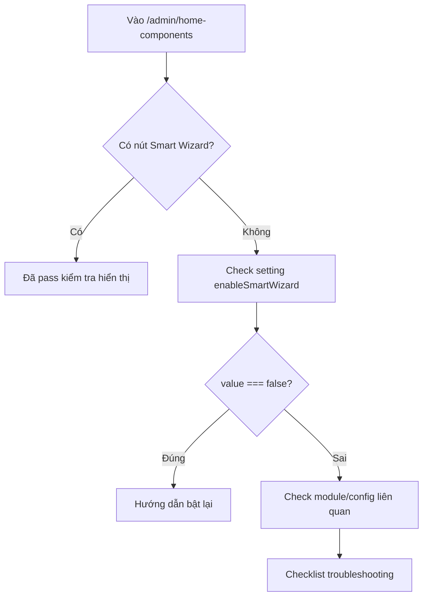

# I. Primer
## 1. TL;DR kiểu Feynman
- Mình sẽ thêm **1 bài hướng dẫn mới** trong kho `/system/huong-dan/{slug}` về Smart Wizard ở `/admin/home-components`.
- Bài này theo scope **Full**: cách bật/tắt, điều kiện hiển thị, và troubleshooting khi nút không hiện.
- Đặt bài vào chương **Home Components** (hợp nhất ngữ cảnh vì nút xuất hiện đúng tại admin home-components).
- Không đổi behavior hệ thống; chỉ bổ sung đề mục/bài hướng dẫn tĩnh trong kho guide.

## 2. Elaboration & Self-Explanation
Hiện user nhớ có nút Smart Wizard nhưng không chắc khi nào hiện/ẩn. Đây là dạng vấn đề vận hành lặp lại, cần một bài “chỉ đúng chỗ” để ai cũng tự kiểm tra được.

Evidence code đã audit:
- `app/admin/home-components/page.tsx`
  - lấy setting: `getModuleSetting({ moduleKey: 'homepage', settingKey: 'enableSmartWizard' })`
  - điều kiện hiển thị: `showWizard = wizardSetting?.value !== false`
  - render nút + dialog chỉ khi `showWizard` true.

Vì vậy bài guide nên mô tả rõ: đường đi, điều kiện, và checklist chẩn đoán khi mất nút.

## 3. Concrete Examples & Analogies
- Ví dụ thực tế: vào `/admin/home-components` không thấy nút “Smart Wizard” → mở bài `/system/huong-dan/admin-home-components-smart-wizard-toggle` để check lần lượt setting key, module key, và điều kiện render.
- Analogy: như công tắc đèn có “cầu dao tổng”; bài này chỉ rõ từng cầu dao cần bật để đèn sáng.

# II. Audit Summary (Tóm tắt kiểm tra)
- Observation:
  - Smart Wizard đã có logic condition rõ trong code page admin home-components.
  - Kho guide hiện đã có nhóm Home Components nhưng chưa có bài riêng cho Smart Wizard toggle/troubleshooting.
- Inference:
  - Cần thêm bài chuyên biệt để giảm hỏi lại và chuẩn hóa cách xử lý.
- Decision:
  - Thêm 1 article mới trong cụm **Home Components → Quản lý chung**.

# III. Root Cause & Counter-Hypothesis (Nguyên nhân gốc & Giả thuyết đối chứng)
- Root Cause (nguyên nhân gốc):
  - Thiếu bài hướng dẫn chuyên đề cho Smart Wizard nên team không có checklist chuẩn khi nút biến mất.
- Root Cause Confidence: **High**
  - Lý do: có logic kỹ thuật sẵn trong code, nhưng thiếu surface hướng dẫn tương ứng trong guide hub.

Trả lời 8 câu audit bắt buộc:
1. Triệu chứng: user không thấy nút Smart Wizard hoặc không biết cách bật/tắt.
2. Phạm vi: `/admin/home-components`, nhóm vận hành homepage.
3. Tái hiện: có, khi setting `enableSmartWizard` = false hoặc config liên quan lệch.
4. Mốc thay đổi: guide hub chưa có bài chuyên đề Smart Wizard.
5. Dữ liệu thiếu: chưa có telemetry về tần suất lỗi (không chặn viết guide).
6. Giả thuyết thay thế: lỗi UI CSS; vẫn cần check nhưng điều kiện render là giả thuyết chính cần ưu tiên.
7. Rủi ro fix sai: hướng dẫn thiếu bước, user xử lý sai tầng.
8. Tiêu chí pass/fail: đọc bài xong user tự xác định được vì sao nút hiện/ẩn và cách xử lý.

# IV. Proposal (Đề xuất)
- Thêm article mới trong registry guides:
  - `slug`: `admin-home-components-smart-wizard-toggle`
  - chapter: `Home Components`
  - section: `Quản lý chung`
  - subsection: `Smart Wizard`
  - title: `Bật/tắt Smart Wizard và xử lý khi nút không hiện`
  - keywords: `smart wizard`, `enableSmartWizard`, `home-components`, `troubleshooting`
  - relatedRoutes: `/admin/home-components`, `/system/huong-dan/admin-home-components-smart-wizard-toggle`
- Bài `/system/huong-dan/{slug}` sẽ có outline đầy đủ theo scope Full:
  - Mục tiêu tính năng
  - Cách bật/tắt theo setting
  - Điều kiện render thực tế trong code
  - Checklist lỗi “không thấy nút”
  - Cách verify sau khi xử lý

# V. Files Impacted (Tệp bị ảnh hưởng)
- **Sửa:** `app/system/huong-dan/_data/guides.ts`
  - Vai trò hiện tại: registry toàn bộ bài guide.
  - Thay đổi: thêm 1 entry article Smart Wizard vào cụm Home Components.

- **Sửa (nội dung bài hiển thị):** `app/system/huong-dan/[slug]/page.tsx`
  - Vai trò hiện tại: render template bài dựa trên slug.
  - Thay đổi: bổ sung mapping/section hiển thị outline chi tiết cho slug Smart Wizard (nếu đang dùng template chung, thêm nhánh nội dung cụ thể cho slug này).

# VI. Execution Preview (Xem trước thực thi)
1. Thêm article metadata vào `guides.ts`.
2. Bổ sung nội dung khung chi tiết cho slug Smart Wizard trong page article.
3. Kiểm tra tìm kiếm keyword trả ra bài mới.
4. Review tĩnh đảm bảo route và taxonomy đúng cụm Home Components.

# VII. Verification Plan (Kế hoạch kiểm chứng)
- Theo guideline repo: không chạy lint/unit test.
- Khi có thay đổi TS/TSX: chạy `bunx tsc --noEmit`.
- Repro:
  1) Search “smart wizard” trong `/system/huong-dan` thấy bài mới.
  2) Click mở đúng `/system/huong-dan/admin-home-components-smart-wizard-toggle`.
  3) Bài hiển thị đầy đủ phần bật/tắt + điều kiện hiển thị + troubleshooting.

# VIII. Todo
- [ ] Thêm bài Smart Wizard vào registry guides.
- [ ] Bổ sung nội dung hướng dẫn chi tiết theo scope Full cho slug mới.
- [ ] Verify search + route + hiển thị bài.
- [ ] Chạy typecheck và self-review.

# IX. Acceptance Criteria (Tiêu chí chấp nhận)
- Có bài mới trong `/system/huong-dan` về Smart Wizard.
- Bài thuộc nhóm Home Components, tìm thấy bằng keyword liên quan.
- Nội dung có đủ 3 phần: bật/tắt, điều kiện hiển thị, troubleshooting khi nút không hiện.

# X. Risk / Rollback (Rủi ro / Hoàn tác)
- Rủi ro: mô tả sai lệch với logic code hiện tại nếu không bám đúng condition.
- Giảm thiểu: trích dẫn trực tiếp condition đã audit trong `app/admin/home-components/page.tsx`.
- Rollback: revert các thay đổi ở registry guide + article mapping.

# XI. Out of Scope (Ngoài phạm vi)
- Thay đổi logic bật/tắt Smart Wizard trong admin.
- Refactor kiến trúc guide hub.
- Viết thêm các bài khác ngoài Smart Wizard trong request này.

# XII. Open Questions (Câu hỏi mở)
- Không còn ambiguity chính; đã chốt scope Full và vị trí chương phù hợp là Home Components.