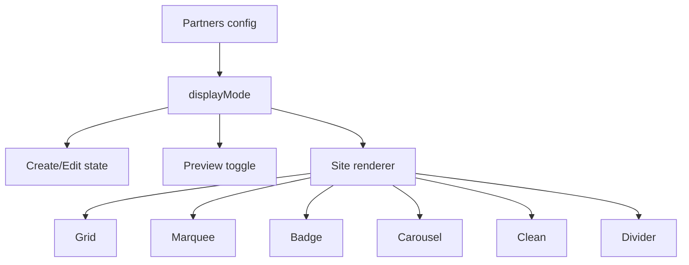

# I. Primer
## 1. TL;DR kiểu Feynman
- Logo trong Partners hiện đang quá nhỏ vì các shared layout đang fix class size khá thấp như `h-4`, `h-6`, `h-8` và còn chừa nhiều gap/padding.
- Mình sẽ thêm 1 config chung cho toàn bộ Partners: `displayMode = 'withName' | 'logoOnly'`.
- `withName`: vẫn hiện tên, nhưng logo sẽ to hơn khoảng x3 và giảm mạnh spacing/margin/padding thừa.
- `logoOnly`: ẩn tên ở tất cả 6 layout, logo/phần chứa logo sẽ to hơn khoảng x5 so với hiện trạng.
- Control sẽ có ở cả form và preview để dễ chọn và thấy ngay kết quả.
- Preview, edit, create và site sẽ dùng cùng 1 contract để không lệch nhau.

## 2. Elaboration & Self-Explanation
Hiện tại vấn đề không nằm ở một chỗ riêng lẻ mà nằm ở “contract render” của toàn bộ Partners. Mỗi layout đang tự quyết định kích thước logo bằng class riêng, ví dụ grid dùng `h-8 w-8`, badge preview chỉ `h-4 w-4`, clean/divider chỉ `h-6 w-6`, carousel cũng chỉ `h-5 w-5` trong block icon. Khi nhìn ở desktop hoặc preview width lớn, logo thành ra rất nhỏ, trong khi phần trống, padding, gap và header spacing lại chiếm nhiều diện tích hơn nội dung chính.

Yêu cầu mới không chỉ là “phóng to logo”, mà còn là thêm 2 mode hiển thị nội dung:
- mode có tên logo
- mode chỉ logo

Vì user đã chốt theo hướng recommend, mình sẽ áp dụng cho toàn bộ 6 layout, và mode `logoOnly` sẽ ẩn tên ở tất cả layout, kể cả marquee/clean/badge/carousel. Điều này có nghĩa là không nên fix tay từng layout một cách rời rạc; thay vào đó cần đưa về 1 config chung để create/edit/site đều hiểu giống nhau.

Nói đơn giản: thay vì mỗi layout tự quyết “logo to cỡ nào, có hiện tên không”, mình sẽ cho Partners một công tắc chung. Sau đó mỗi shared component đọc công tắc này để render phiên bản “logo + tên, logo to” hoặc “chỉ logo, logo rất to”.

## 3. Concrete Examples & Analogies
### a) Ví dụ cụ thể bám task
Hiện grid đang kiểu:
- logo `h-8 w-8`
- gap/padding tương đối rộng
- text vẫn chiếm 1 dòng bên dưới

Sau khi đổi:
- `displayMode: 'withName'`:
  - logo tăng mạnh, ví dụ lên cỡ `h-20..h-24` tùy layout/device
  - giảm `gap`, `padding`, `margin-top` để card tập trung vào logo
  - text vẫn hiện nhưng sát nội dung hơn
- `displayMode: 'logoOnly'`:
  - ẩn hẳn text
  - logo tăng thêm nữa, ví dụ `h-32..h-40` hoặc tăng block chứa logo tương ứng
  - card/track/grid nới theo logo thay vì theo text

### b) Analogy đời thường
Giống như làm lại kệ trưng bày trong showroom: trước đây bảng tên nhỏ, món trưng bày cũng nhỏ, xung quanh lại có quá nhiều khoảng trống nên nhìn “lọt thỏm”. Giờ mình sẽ có 2 chế độ:
- có nhãn: món trưng bày to, nhãn vẫn có nhưng gọn
- không nhãn: bỏ nhãn, dành gần hết diện tích cho món trưng bày

# II. Audit Summary (Tóm tắt kiểm tra)
- Observation: `PartnersGridShared.tsx` đang render logo ở mức `h-8 w-8` đến `h-10 w-10`, trong khi card có `p-4/p-5` và còn text bên dưới.
- Observation: `PartnersBadgeShared.tsx` đang nhỏ nhất ở preview/site, nhiều chỗ chỉ `h-3.5..h-5`.
- Observation: `PartnersCarouselShared.tsx` đang render logo trong icon block cỡ `h-5..h-6` với card spacing còn tương đối thoáng.
- Observation: `PartnersCleanShared.tsx` và `PartnersDividerShared.tsx` cũng chỉ đang ở `h-6..h-8`.
- Observation: `PartnersPreview.tsx` mới truyền style/title/subheading/align, chưa có contract nào cho “hiện tên hay chỉ logo”.
- Observation: `PartnersForm.tsx` hiện mới có subheading + align, chưa có control cho mode hiển thị nội dung logo.
- Inference: nếu chỉ tăng class size rời rạc mà không thêm config chung, create/edit/site sẽ lại lệch và khó maintain.
- Decision: thêm 1 field config chung cho cả module Partners để điều khiển display mode, sau đó scale lại từng layout theo mode.

# III. Root Cause & Counter-Hypothesis (Nguyên nhân gốc & Giả thuyết đối chứng)
## 1. Root Cause
### a) Triệu chứng quan sát được là gì
- Expected: logo phải đủ lớn để nhìn rõ, và user muốn có 2 chế độ `hiện tên` / `chỉ logo`.
- Actual: logo ở nhiều layout đang quá nhỏ so với khung và spacing; hệ thống chưa có khái niệm display mode chung.

### b) Phạm vi ảnh hưởng
- Admin create/edit preview của Partners.
- Site runtime render của Partners.
- Toàn bộ 6 layout mới: `grid | marquee | badge | carousel | clean | divider`.

### c) Có tái hiện ổn định không
- Có. Evidence nằm trực tiếp trong className size của từng shared component.

### d) Mốc thay đổi gần nhất
- Partners vừa được rollout sang bộ layout mới, nên việc tăng size và thêm mode nên bám đúng kiến trúc shared hiện tại thay vì vá thủ công.

### e) Dữ liệu nào đang thiếu
- Không thiếu blocker ở mức spec; chỉ còn bước implement cụ thể mapping size per layout/device.

### f) Có giả thuyết thay thế hợp lý nào chưa bị loại trừ
- Counter-hypothesis 1: chỉ tăng CSS ở grid/divider. Bị loại vì user chốt áp dụng toàn bộ 6 layout.
- Counter-hypothesis 2: chỉ phóng to logo nhưng giữ nguyên luôn text. Bị loại vì user yêu cầu thêm hẳn mode `chỉ logo`.
- Counter-hypothesis 3: chỉ thêm toggle ở preview. Bị loại vì sẽ không tạo config persisted cho site runtime.

### g) Rủi ro nếu fix sai nguyên nhân là gì
- Preview và site khác nhau.
- Một số layout vỡ cân bằng do chỉ tăng logo mà không giảm spacing.
- `logoOnly` có thể biến thành “ẩn tên nhưng khung vẫn như cũ”, dẫn tới vẫn phí diện tích.

### h) Tiêu chí pass/fail sau khi sửa
- Có thể chọn `withName` hoặc `logoOnly` trong admin.
- Site render đúng mode đã lưu.
- `withName` nhìn logo lớn hơn rõ rệt và khoảng trắng giảm mạnh.
- `logoOnly` ẩn tên ở tất cả layout và logo tăng rất rõ.

## 2. Root Cause Confidence (Độ tin cậy nguyên nhân gốc)
- High — vì nguyên nhân nằm ngay ở shared component sizing + thiếu config display mode; cả hai đều có evidence trực tiếp từ code hiện tại.

# IV. Proposal (Đề xuất)
## 1. Hướng triển khai được chọn
- Thêm field config chung: `displayMode: 'withName' | 'logoOnly'`.
- Áp dụng cho toàn bộ 6 layout Partners.
- `logoOnly` sẽ ẩn tên ở tất cả layout.
- Control có ở cả form và preview.

## 2. Các bước kỹ thuật chính
### a) Mở rộng contract types/config
- Bổ sung `PartnersDisplayMode` trong `_types/index.ts`.
- Thêm normalize helper để dữ liệu cũ default về `withName`.
- Create/Edit save/load thêm `displayMode`.

### b) Thêm UI control trong admin
- `PartnersForm.tsx`: thêm select hoặc segmented control cho `Hiện tên logo` / `Chỉ logo`.
- `PartnersPreview.tsx`: thêm toggle nhanh cạnh preview styles để đổi mode tức thời, đồng thời sync với state của page.

### c) Chuẩn hóa sizing tokens cho shared components
- Thay vì hardcode từng `h-4`, `h-6`, `h-8`, sẽ đưa vào props hoặc helper sizing theo mode.
- Hai profile chính:
  - `withName`: logo tăng khoảng x3, giảm gap/padding/margin mạnh
  - `logoOnly`: logo tăng khoảng x5, ẩn text hoàn toàn, thu gọn whitespace

### d) Refactor 6 shared layouts
- `PartnersGridShared`: card gọn lại, logo rất lớn hơn, text optional.
- `PartnersDividerShared`: ô grid ưu tiên logo, text optional.
- `PartnersBadgeShared`: badge mode có tên sẽ nở logo + co gap; mode chỉ logo sẽ gần như thành logo-pill.
- `PartnersCleanShared`: inline row sẽ đổi từ “logo + label nhỏ” sang “logo lớn + label vừa” hoặc “logo-only row”.
- `PartnersMarqueeShared`: chip marquee sẽ tăng mạnh icon/logo size; `logoOnly` bỏ label để track gọn và nổi logo hơn.
- `PartnersCarouselShared`: card carousel giảm padding thừa, block logo lớn hơn nhiều; `logoOnly` ẩn label và scale card theo logo.

### e) Đồng bộ site runtime
- `ComponentRenderer.tsx` đọc `displayMode` từ config, normalize nếu thiếu, rồi truyền vào tất cả shared layouts.

## 3. Mermaid overview

# V. Files Impacted (Tệp bị ảnh hưởng)
## 1. Shared / types
- Sửa: `app/admin/home-components/partners/_types/index.ts`
  - Vai trò hiện tại: định nghĩa style/align và normalize helpers.
  - Thay đổi: thêm `PartnersDisplayMode` + normalize helper mặc định `withName`.

## 2. UI admin
- Sửa: `app/admin/home-components/partners/_components/PartnersForm.tsx`
  - Vai trò hiện tại: cấu hình subheading/align + uploader.
  - Thay đổi: thêm control chọn `Hiện tên logo` / `Chỉ logo`.

- Sửa: `app/admin/home-components/create/partners/page.tsx`
  - Vai trò hiện tại: state create + save config + preview.
  - Thay đổi: thêm state `displayMode`, lưu config và truyền xuống preview/form.

- Sửa: `app/admin/home-components/partners/[id]/edit/page.tsx`
  - Vai trò hiện tại: load/save config Partners hiện có.
  - Thay đổi: load/save `displayMode`, đưa vào snapshot compare để detect changes đúng.

- Sửa: `app/admin/home-components/partners/_components/PartnersPreview.tsx`
  - Vai trò hiện tại: preview 6 layout.
  - Thay đổi: nhận `displayMode`, thêm toggle nhanh ở preview, truyền mode xuống shared layouts.

## 3. Shared layouts
- Sửa: `app/admin/home-components/partners/_components/PartnersGridShared.tsx`
  - Vai trò hiện tại: grid cards với logo nhỏ + tên cố định.
  - Thay đổi: scale lại logo/card/spacing và cho phép ẩn tên theo mode.

- Sửa: `app/admin/home-components/partners/_components/PartnersMarqueeShared.tsx`
  - Vai trò hiện tại: marquee chip logo + tên.
  - Thay đổi: hỗ trợ 2 mode và tăng mạnh kích thước logo.

- Sửa: `app/admin/home-components/partners/_components/PartnersBadgeShared.tsx`
  - Vai trò hiện tại: badge pill nhỏ, logo rất nhỏ.
  - Thay đổi: tăng logo mạnh, giảm spacing, hỗ trợ logo-only.

- Sửa: `app/admin/home-components/partners/_components/PartnersCarouselShared.tsx`
  - Vai trò hiện tại: card swipe-track logo + label.
  - Thay đổi: nới logo/icon block, giảm spacing, ẩn label ở mode logo-only.

- Sửa: `app/admin/home-components/partners/_components/PartnersCleanShared.tsx`
  - Vai trò hiện tại: inline clean row logo + name.
  - Thay đổi: scale logo/text theo mode và giảm khoảng trắng.

- Sửa: `app/admin/home-components/partners/_components/PartnersDividerShared.tsx`
  - Vai trò hiện tại: grid divider ô logo + name nhỏ.
  - Thay đổi: tăng logo mạnh, hỗ trợ ẩn text, tối ưu ô cho logo-only.

## 4. Site runtime
- Sửa: `components/site/ComponentRenderer.tsx`
  - Vai trò hiện tại: site render Partners từ config.
  - Thay đổi: normalize + truyền `displayMode` xuống toàn bộ layouts.

# VI. Execution Preview (Xem trước thực thi)
1. Đọc type/config hiện tại của Partners và thêm `displayMode`.
2. Nối state mới vào create/edit pages.
3. Thêm control ở form và preview.
4. Refactor 6 shared layouts để nhận `displayMode`.
5. Tạo sizing profile cho `withName` và `logoOnly` thay vì giữ size cứng như hiện tại.
6. Đồng bộ `ComponentRenderer` để site render đúng mode.
7. Tự review tĩnh các layout để chắc không còn text rò ra ở `logoOnly`.

# VII. Verification Plan (Kế hoạch kiểm chứng)
- Static verification:
  - `bunx tsc --noEmit` sau khi implement vì có thay đổi TS/TSX.
- Code-path verification:
  - Create lưu được `displayMode`.
  - Edit load record cũ không có field này vẫn fallback `withName`.
  - Preview đổi mode sẽ phản ánh ngay ở cả 6 layout.
  - Site runtime render giống preview cho cùng config.
- Repro checklist cho tester:
  - Với mỗi layout, bật `withName` và xác nhận logo lớn hơn rõ rệt, spacing đã gọn.
  - Chuyển sang `logoOnly` và xác nhận tên biến mất hoàn toàn.
  - So sánh mobile/tablet/desktop preview để chắc logo không bị vỡ hoặc tràn.

# VIII. Todo
1. Thêm `displayMode` vào contract và normalize helper.
2. Nối `displayMode` vào create/edit/config save-load.
3. Thêm control ở form và preview.
4. Refactor 6 shared layouts theo 2 profile kích thước mới.
5. Đồng bộ site renderer.
6. Typecheck và commit local sau implement.

# IX. Acceptance Criteria (Tiêu chí chấp nhận)
- Có 2 mode chung cho toàn bộ Partners: `Hiện tên logo` và `Chỉ logo`.
- `Hiện tên logo`: logo lớn hơn rõ rệt, text vẫn có, spacing thừa giảm mạnh.
- `Chỉ logo`: ẩn tên ở tất cả 6 layout, logo lớn hơn rất rõ.
- Preview/admin/site đồng nhất cho cùng config.
- Dữ liệu cũ không có `displayMode` vẫn render an toàn với fallback mặc định.

# X. Risk / Rollback (Rủi ro / Hoàn tác)
- Rủi ro chính: một số layout có thể bị overflow nếu tăng logo mạnh nhưng không co spacing tương ứng.
- Rủi ro phụ: preview toggle và form state có thể lệch nếu wiring không đồng bộ.
- Giảm rủi ro bằng cách dùng 1 field config chung và 1 logic truyền props thống nhất.
- Rollback: thay đổi tập trung trong module Partners nên có thể revert commit nếu visual chưa đạt.

# XI. Out of Scope (Ngoài phạm vi)
- Không đổi bộ 6 style của Partners.
- Không thêm layout mới.
- Không chỉnh các home-component khác ngoài Partners.
- Không thay đổi schema business rộng hơn ngoài config render của Partners.

# XII. Open Questions (Câu hỏi mở)
- Không còn ambiguity blocker. Mặc định sẽ đi theo hướng user đã chốt: áp dụng toàn bộ 6 layout, `logoOnly` ẩn tên ở tất cả layout, control có ở cả form và preview.