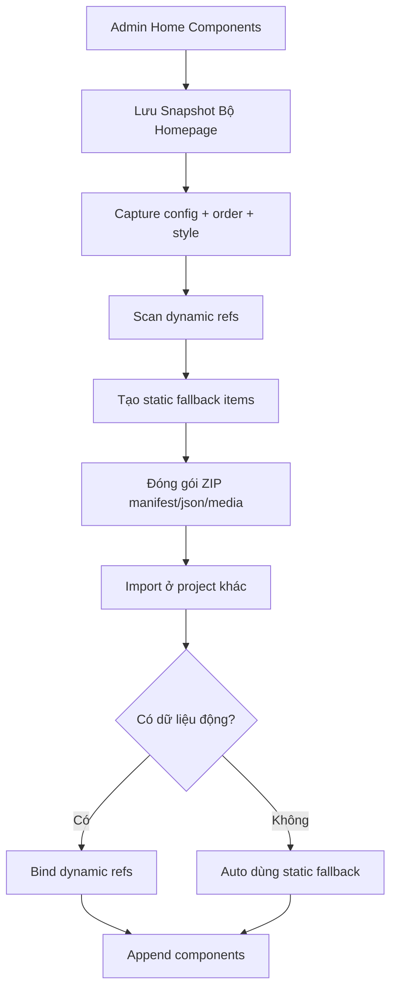
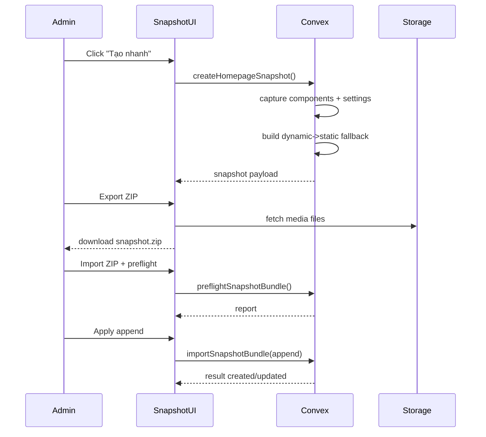

# I. Primer
## 1. TL;DR kiểu Feynman
- Mình sẽ giữ tên nút **“Tạo nhanh”**, nhưng đổi bản chất: không còn wizard template, mà dùng **Snapshot bộ homepage thật**.
- Team tạo homepage bình thường, rồi bấm lưu snapshot để đóng gói lại toàn bộ cấu hình + ảnh + style/layout + màu/font.
- Khi import qua dự án khác, nếu thiếu posts/services/products/categories thật thì hệ thống **tự fallback dữ liệu tĩnh** để không vỡ UI.
- File chia sẻ là **1 ZIP chuẩn** (đúng yêu cầu), bên trong có manifest + JSON + thư mục media + báo cáo cảnh báo.
- Mặc định import theo kiểu **append** (không đè component cũ), giảm rủi ro mất cấu hình đang chạy.

## 2. Elaboration & Self-Explanation
- Hiện tại “Tạo nhanh” đang tạo component theo template/wizard (industry + sequence), nên anh không hài lòng vì nó không phản ánh đúng “mẫu thật đã tinh chỉnh”.
- Hướng mới sẽ biến “Tạo nhanh” thành cơ chế **snapshot từ dữ liệu thật đang có**: nghĩa là cái gì team đã chỉnh tay ở `/admin/home-components` thì snapshot lấy lại gần như nguyên trạng.
- Snapshot không chỉ lưu `homeComponents.config`, mà còn gom các phụ thuộc quan trọng của homepage: thứ tự block, cấu hình style/layout, màu single/dual, custom font từ `homeComponentSystemConfig`, và media liên quan.
- Điểm mấu chốt để tránh lỗi import là lớp **Dynamic → Static Fallback**: với block cần dữ liệu thật, snapshot sẽ có “bản tĩnh dự phòng” (title + ảnh đại diện đầu tiên + hậu tố `[tĩnh]`) để render được ngay cả khi hệ đích thiếu dữ liệu.

## 3. Concrete Examples & Analogies
- Ví dụ cụ thể: snapshot có block `Blog` đang trỏ `selectedPostIds=[A,B,C]`.
  - Ở project đích không có A/B/C, importer sẽ tự tạo `staticItems` từ snapshot capture trước đó:
    - `Bài viết X [tĩnh]` + `thumbnail đầu tiên thời điểm chụp`.
  - UI vẫn hiện đúng layout, không crash, không empty lạ.
- Analogy đời thường: giống “đóng gói một gian hàng mẫu” đi hội chợ. Nếu địa điểm mới thiếu hàng thật, vẫn bày “mô hình trưng bày” để gian hàng hoạt động bình thường.

# II. Audit Summary (Tóm tắt kiểm tra)
- Observation:
  - Nút “Tạo nhanh” đang bật/tắt bằng setting `enableSmartWizard` trong `lib/modules/configs/homepage.config.ts`.
  - Admin page đang render `HomepageSmartWizardDialog` tại `app/admin/home-components/page.tsx`.
  - Wizard hiện hành tạo config từ `buildDefaultConfig(...sampleIds)` + `applyHomepageWizardPlan` (`convex/homepageWizard.ts`), tức là dựng từ template thay vì snapshot thực.
  - Repo đã có nền tảng export/import ZIP mạnh ở `migrationBundles` + `lib/migration-bundle/client.ts` (có media index, preflight, upload map).
- Inference:
  - Có thể tái dùng hạ tầng migration bundle để làm snapshot bundle, giảm rủi ro reinvent.
- Decision:
  - Thay Wizard UI hiện tại bằng Snapshot Manager UI, giữ label “Tạo nhanh”.

# III. Root Cause & Counter-Hypothesis (Nguyên nhân gốc & Giả thuyết đối chứng)
- Trả lời 8 câu audit (bắt buộc):
  1. Triệu chứng: “Tạo nhanh” không cho ra homepage đúng bản đã tinh chỉnh; actual = template-generated, expected = reusable snapshot thực.
  2. Phạm vi ảnh hưởng: admin homepage flow + reuse liên dự án + team workflow.
  3. Tái hiện: ổn định, cứ bấm tạo nhanh là đi theo template.
  4. Mốc thay đổi gần nhất: feature smart wizard đã tồn tại qua `HomepageSmartWizardDialog` + `homepageWizard.ts`.
  5. Thiếu dữ liệu: mapping bắt buộc theo từng component type cho fallback tĩnh (cần liệt kê explicit).
  6. Giả thuyết thay thế: không phải do data lỗi; do thiết kế feature hiện tại vốn là “wizard template”, nên mismatch kỳ vọng là structural.
  7. Rủi ro fix sai: import snapshot dễ mismatch ID/reference, dẫn tới block rỗng hoặc media sai.
  8. Pass/fail: import snapshot vào project sạch vẫn render homepage đầy đủ, kể cả khi thiếu dữ liệu động.
- Root Cause Confidence: **High**
  - Reason: code path hiện tại xác nhận rõ cơ chế wizard-template, không có snapshot lifecycle.
- Counter-hypothesis đã loại trừ:
  - “Chỉ cần thêm template mới là đủ” → không giải quyết reuse từ bản làm thật + không giải quyết export/import liên dự án + fallback lỗi thiếu data.

# IV. Proposal (Đề xuất)
- Option A (Recommend) — Confidence 90%
  - **Giải pháp đã chốt theo trả lời của anh**:
    - Snapshot scope: **theo bộ homepage**.
    - Import fallback: **luôn fallback tĩnh** khi thiếu dữ liệu động.
    - Export format: **ZIP 1 file chuẩn**.
    - Import strategy mặc định: **append như bản mới**.
- Thiết kế kỹ thuật:
  - a) Data contract mới `homeComponentSnapshots` (manifest + list components + dependency snapshot + media index + style system snapshot).
  - b) Thêm capture pipeline:
    - Read toàn bộ `homeComponents` theo order.
    - Resolve dynamic references theo type (Blog/ProductList/Services/...)
    - Freeze static fallback (title + first image + `[tĩnh]`).
  - c) Export/Import:
    - Reuse JSZip + preflight/report pattern từ migration bundle.
    - Tạo namespace riêng `snapshot-bundles/*` để không đụng migration cũ.
  - d) UI:
    - Nút “Tạo nhanh” mở Snapshot Dialog: `Tạo snapshot`, `Export ZIP`, `Import ZIP`, `Preflight`, `Apply (append)`.

# V. Files Impacted (Tệp bị ảnh hưởng)
- **Sửa:** `app/admin/home-components/page.tsx`
  - Vai trò hiện tại: render list + mở Smart Wizard.
  - Thay đổi: giữ nút “Tạo nhanh” nhưng chuyển dialog sang Snapshot Manager.
- **Sửa:** `lib/modules/configs/homepage.config.ts`
  - Vai trò hiện tại: setting `enableSmartWizard`.
  - Thay đổi: giữ key để tương thích ngược, đổi nhãn/meaning sang snapshot quick-create visibility.
- **Sửa:** `convex/homepageWizard.ts`
  - Vai trò hiện tại: apply plan template wizard.
  - Thay đổi: deprecate logic wizard, chuyển sang adapter gọi snapshot APIs hoặc giữ shim tương thích tạm thời.
- **Thêm:** `convex/homepageSnapshots.ts`
  - Vai trò mới: query/mutation snapshot lifecycle (create/list/get/export-prep/preflight/import/apply).
- **Thêm:** `lib/homepage-snapshot/types.ts`
  - Vai trò mới: schema/type cho manifest, component payload, dynamic refs, static fallback item.
- **Thêm:** `lib/homepage-snapshot/client.ts`
  - Vai trò mới: tạo/đọc ZIP (JSZip), parse media folder, checksum/report.
- **Thêm:** `components/modules/homepage/HomepageSnapshotDialog.tsx`
  - Vai trò mới: UI flow thay thế wizard.
- **Sửa:** `convex/homeComponentSystemConfig.ts`
  - Vai trò hiện tại: quản lý màu/font override.
  - Thay đổi: expose read contract cho snapshot capture (global font + type overrides) để tái lập chính xác.

# VI. Execution Preview (Xem trước thực thi)
1. Đọc và khóa contract data snapshot (types + manifest version).
2. Tạo Convex snapshot service (capture + fallback + preflight + import append).
3. Tạo client ZIP builder/parser cho snapshot (dựa pattern migration bundle).
4. Thay dialog UI từ Smart Wizard sang Snapshot Manager nhưng giữ label nút.
5. Nối wiring setting `enableSmartWizard` vào visibility mới.
6. Review tĩnh: type safety, null-safety, compatibility với dữ liệu cũ.

# VII. Verification Plan (Kế hoạch kiểm chứng)
- Repro checks (manual, không chạy test/lint theo guideline repo):
  - a) Tạo homepage mẫu có Blog/Product/Services + custom dual color + custom font.
  - b) Tạo snapshot và export ZIP.
  - c) Import vào project đích thiếu posts/services/products.
  - d) Xác nhận fallback `[tĩnh]` hiển thị đúng title + ảnh đầu tiên capture.
  - e) Xác nhận append mode không xóa component cũ.
- Static verification:
  - `bunx tsc --noEmit` (vì có thay đổi TS/code).
- Evidence cần thu khi bàn giao:
  - snapshot id, số component import, số fallback items generated, warning count preflight.

# VIII. Todo
- [ ] Định nghĩa snapshot schema v1 + versioning.
- [ ] Implement capture dynamic->static fallback theo từng component type trọng yếu.
- [ ] Implement export/import ZIP + media folder + preflight report.
- [ ] Thay Smart Wizard dialog bằng Snapshot dialog (giữ label “Tạo nhanh”).
- [ ] Triển khai append apply mặc định + guard không ghi đè dữ liệu cũ.
- [ ] Hoàn tất kiểm chứng manual + typecheck.

# IX. Acceptance Criteria (Tiêu chí chấp nhận)
- “Tạo nhanh” ở admin mở snapshot flow, không còn template wizard cũ.
- Snapshot lưu đầy đủ: component order/config/layout/style + màu single/dual + font override.
- Export tạo đúng **1 file ZIP** gồm manifest/json/media/reports.
- Import vào project thiếu data động vẫn render được nhờ fallback tĩnh có hậu tố `[tĩnh]` và ảnh đầu tiên snapshot.
- Import mặc định **append**, không xóa dữ liệu homepage sẵn có.

# X. Risk / Rollback (Rủi ro / Hoàn tác)
- Rủi ro:
  - Mapping fallback chưa đủ cho một số component type đặc thù.
  - Bundle lớn do media nhiều ảnh.
- Rollback:
  - Giữ cờ feature để bật lại dialog wizard cũ tạm thời.
  - Snapshot logic tách namespace, có thể disable không ảnh hưởng core CRUD home-components.

# XI. Out of Scope (Ngoài phạm vi)
- Không redesign UI editor của từng component.
- Không thay đổi business schema của posts/products/services ngoài nhu cầu snapshot fallback.
- Không productize thành sync realtime đa dự án (chỉ export/import bundle).

# XII. Open Questions (Câu hỏi mở)
- Cần ưu tiên top N component types nào cho fallback phase-1 (đề xuất: Blog, ProductList/Grid, Services, Category-related) để ship sớm và an toàn?