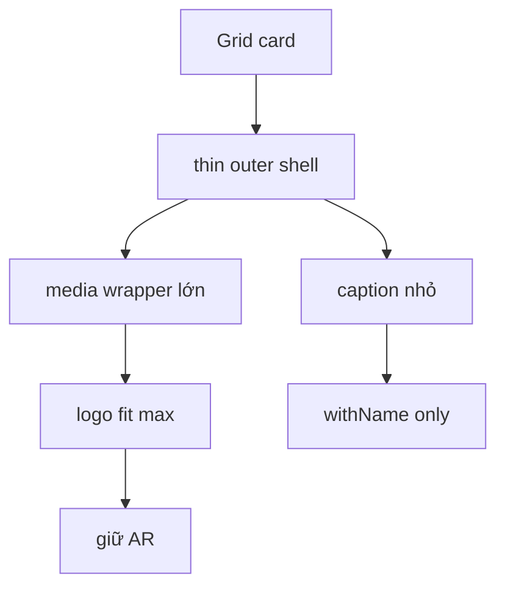

# I. Primer
## 1. TL;DR kiểu Feynman
- User muốn đổi triết lý Grid: không chỉ fix case 1–2 logo, mà mọi card đều phải để logo to tối đa theo đúng aspect ratio (AR - tỷ lệ khung hình).
- Nghĩa là card không còn là “khung rỗng chứa logo nhỏ”, mà trở thành “khung ôm sát logo”, chỉ chừa padding cưỡng bức rất ít.
- Với logo ngang kiểu 16:9, ảnh phải gần full chiều ngang card, spacing ngang chỉ còn mức rất nhỏ.
- Với logo dọc hoặc vuông, vẫn giữ AR gốc; phần dư còn lại là bắt buộc do hình học, không phải spacing cố tình.
- Em sẽ sửa Grid theo hướng image-first: card height/inner wrapper bám logo hơn, giảm padding/card chrome, và dùng vùng ảnh có kích thước lớn gần full card thay vì icon-sized logo ở giữa.

## 2. Elaboration & Self-Explanation
Lượt fix trước giải quyết đúng một phần nguyên nhân: grid quá rộng khi item ít. Nhưng feedback mới cho thấy root expectation của user còn mạnh hơn:
- không phải chỉ “đỡ thưa hơn”
- mà là “logo phải là nhân vật chính, to hết mức có thể trong card”

Hiện tại `PartnersGridShared.tsx` vẫn còn tư duy cũ:
- card có `p-4/p-5/p-6`
- logo render bằng class `h-* w-* object-contain`
- nghĩa là logo bị đối xử như một icon nằm trong card, không phải content chính chiếm gần hết card

Vì vậy dù đã co cụm grid theo số item, mỗi card vẫn còn nhiều khoảng đệm nội bộ quanh logo. Ở ảnh user mới gửi, vấn đề không còn chủ yếu là khoảng cách giữa hai card nữa, mà là khoảng trắng bên trong từng card:
- trái/phải logo còn dư nhiều
- trên/dưới logo cũng còn dư rõ
- cảm giác card lớn nhưng ảnh nhỏ

Cách sửa đúng bây giờ là đổi contract render của Grid:
1. Card phải có vùng media (khung ảnh) lớn gần full.
2. Logo phải fit theo `object-contain`, giữ nguyên AR.
3. Với logo ngang, chiều rộng vùng logo phải gần chạm mép trong card.
4. Với logo dọc/vuông, căn giữa theo trục dọc/ngang; khoảng trống còn lại là do AR khác nhau chứ không phải padding thừa.

Nói ngắn gọn: trước đây mình tối ưu “layout density”; giờ cần tối ưu tiếp “logo occupancy” (mức logo chiếm card).

## 3. Concrete Examples & Analogies
### a) Ví dụ cụ thể bám task
Nếu logo là ảnh website dạng ngang gần 16:9:
- hiện tại card rộng nhưng ảnh chỉ chiếm một phần nhỏ ở giữa
- sau khi sửa, ảnh sẽ chiếm gần toàn bộ bề ngang card, chỉ còn viền đệm rất mỏng
- theo trục dọc, ảnh vẫn được căn giữa để không méo hoặc bị crop

Nếu logo là ảnh vuông:
- ảnh không thể full ngang và full dọc cùng lúc nếu phải giữ AR
- khi đó em sẽ cho ảnh full tối đa trong khung media và căn giữa
- phần trắng dư là phần bắt buộc do khác tỷ lệ

### b) Analogy đời thường
Giống treo ảnh vào khung: hiện tại ảnh nhỏ nằm giữa một khung quá dày viền. User muốn viền mỏng gần như sát ảnh, nhưng vẫn không được bóp méo ảnh gốc.

# II. Audit Summary (Tóm tắt kiểm tra)
- Observation: `PartnersGridShared.tsx` hiện vẫn render logo bằng class kích thước cố định (`h-12 w-12`, `h-24 w-24`...) thay vì để logo chiếm gần full vùng card.
- Observation: card vẫn có padding khá lớn (`p-4/p-5/p-6`) và `min-h-*`, tạo khoảng đệm nội bộ đáng kể.
- Observation: source `partner-logos.tsx` dùng sizing nhỏ kiểu icon-like (`w-6 h-6`, `w-8 h-8`) vì source giả định logo vector/icon đồng đều; nhưng dữ liệu thật ở repo là ảnh screenshot/logo raster với AR khác nhau nhiều.
- Observation: `PreviewImage.tsx` chỉ bọc `AdminImage`, nên quyền quyết định ảnh to/nhỏ đang nằm chủ yếu ở class truyền từ `PartnersGridShared.tsx`.
- Inference: dùng nguyên contract source cho dữ liệu ảnh thật sẽ luôn khiến logo nhìn nhỏ trong card, vì source không thiết kế cho ảnh screenshot ngang lớn.
- Decision: giữ tinh thần source ở grid rhythm, nhưng thay contract size nội bộ card sang image-first để phù hợp dữ liệu thật của Partners.

# III. Root Cause & Counter-Hypothesis (Nguyên nhân gốc & Giả thuyết đối chứng)
## 1. Root Cause
### a) Triệu chứng quan sát được là gì
- Expected: logo trong mỗi card phải to gần full card, spacing ngang gần như chỉ còn viền mỏng.
- Actual: card đã đỡ thưa bên ngoài nhưng bên trong card logo vẫn nhỏ, còn nhiều khoảng trắng trái/phải/trên/dưới.

### b) Phạm vi ảnh hưởng
- Ảnh hưởng chính đến `Partners` style `grid`, cả preview và site.
- Rõ nhất ở dữ liệu logo dạng ảnh ngang như screenshot website hoặc wordmark dài.

### c) Có tái hiện ổn định không? điều kiện tái hiện tối thiểu?
- Có. Chỉ cần dùng 1–n logo dạng ảnh ngang trong Grid là thấy logo không tận dụng hết card.

### d) Mốc thay đổi gần nhất
- Lượt trước đã thêm adaptive density theo item count, nhưng chưa đổi triết lý sizing nội bộ của card.

### e) Dữ liệu nào đang thiếu để kết luận chắc chắn?
- Không thiếu blocker. Feedback user đã xác nhận yêu cầu rõ: mọi logo nên gần full card, giữ AR.

### f) Có giả thuyết thay thế hợp lý nào chưa bị loại trừ?
- Chỉ tiếp tục co grid wrapper: không giải quyết vì khoảng trắng nội bộ card vẫn còn.
- Chỉ giảm gap giữa cards: không giải quyết kích thước logo trong card.
- Crop ảnh để full card: trái với yêu cầu giữ AR.

### g) Rủi ro nếu fix sai nguyên nhân là gì?
- Logo vẫn nhìn nhỏ dù card sát nhau hơn.
- Hoặc logo bị ép méo/crop để “trông to”, làm sai yêu cầu.

### h) Tiêu chí pass/fail sau khi sửa?
- Logo ngang chiếm gần full chiều ngang card.
- Logo giữ AR, không bị crop hoặc méo.
- Khoảng dư còn lại chủ yếu do khác AR, không phải do padding cố tình.

## 2. Root Cause Confidence (Độ tin cậy nguyên nhân gốc)
- High — vì evidence nằm ngay trong class sizing/padding hiện tại của `PartnersGridShared.tsx`, và user đã nói rõ muốn “giữ AR, full gần sát”.

# IV. Proposal (Đề xuất)
## 1. Hướng triển khai được chọn
- Chuyển Grid sang image-first occupancy.
- Giữ adaptive density vừa thêm, nhưng ưu tiên tiếp theo là để logo chiếm gần full card.
- Không crop, không méo; chỉ fit tối đa trong khung media.

## 2. Các bước kỹ thuật chính
### a) Tách card thành 2 vùng rõ ràng
- `media wrapper` cho logo.
- `caption` cho tên logo nếu đang ở mode `withName`.

### b) Giảm mạnh padding card và đưa phần trống vào media wrapper có kiểm soát
- Card outer chỉ giữ border/radius/padding rất mỏng.
- Phần lớn chiều cao card dành cho media wrapper.
- Với `logoOnly`, media wrapper gần như full card.
- Với `withName`, media wrapper chiếm gần hết card trừ 1 dòng tên bên dưới.

### c) Đổi class ảnh từ size cố định sang fit theo wrapper
- Thay kiểu `h-12 w-12` hoặc `h-24 w-24` bằng class gần dạng:
  - `max-w-full max-h-full w-auto h-auto object-contain`
- Media wrapper sẽ có width/height đủ lớn để ảnh tự phóng tối đa theo AR.
- Với logo ngang, wrapper rộng hơn và không ép ảnh thành icon.

### d) Tinh chỉnh theo mode
- `withName`:
  - giữ 1 hàng tên phía dưới
  - logo chiếm tối đa phần trên
  - khoảng cách logo ↔ tên rất nhỏ
- `logoOnly`:
  - card gần như chỉ có media wrapper
  - padding cạnh giảm tối đa, cảm giác spacing nội bộ gần 1px như user muốn

### e) Giữ adaptive density đã làm, nhưng không phụ thuộc riêng case ít item nữa
- Mọi item đều được render theo contract full-occupancy mới.
- Khi item ít, wrapper co cụm vẫn giữ.
- Khi item nhiều, logo vẫn lớn hơn hiện tại trong từng card.

## 3. Mermaid overview

# V. Files Impacted (Tệp bị ảnh hưởng)
- Sửa: `app/admin/home-components/partners/_components/PartnersGridShared.tsx`
  - Vai trò hiện tại: render Grid card với logo-size cố định kiểu icon nằm giữa card.
  - Thay đổi: đổi sang card cấu trúc image-first, media wrapper lớn, padding mỏng, logo fit tối đa theo AR.

- Sửa: `app/admin/home-components/partners/_components/PartnersPreview.tsx`
  - Vai trò hiện tại: preview Grid dùng shared component hiện tại.
  - Thay đổi: chủ yếu giữ wiring, chỉ chỉnh nhẹ nếu cần để preview match contract mới tuyệt đối.

- Sửa nhỏ nếu cần: `components/site/ComponentRenderer.tsx`
  - Vai trò hiện tại: site render Partners Grid qua shared component.
  - Thay đổi: bảo đảm runtime site dùng đúng contract full-occupancy giống preview.

# VI. Execution Preview (Xem trước thực thi)
1. Đọc lại Grid card structure hiện tại.
2. Thay sizing cố định bằng media-wrapper occupancy.
3. Giảm mạnh padding/border spacing trong card.
4. Tối ưu riêng `withName` và `logoOnly`.
5. Đồng bộ preview/site.
6. Review tĩnh và typecheck.

# VII. Verification Plan (Kế hoạch kiểm chứng)
- Static verification:
  - `bunx tsc --noEmit`
- Repro checklist:
  - Logo ngang 16:9 trong Grid chiếm gần full chiều ngang card.
  - Logo vuông/dọc vẫn giữ AR, căn giữa.
  - `withName`: tên vẫn đọc được, logo vẫn chiếm đa số diện tích card.
  - `logoOnly`: card gần như full logo, không còn cảm giác icon nhỏ nằm giữa.
  - 2 item và nhiều item đều giữ rhythm ổn.

# VIII. Todo
1. Chuyển Grid card sang image-first occupancy.
2. Giảm mạnh padding nội bộ card.
3. Tối ưu media wrapper cho `withName` và `logoOnly`.
4. Đồng bộ preview/site.
5. Typecheck và commit local sau implement.

# IX. Acceptance Criteria (Tiêu chí chấp nhận)
- Logo trong Grid to hơn rõ rệt ở mọi item count, không chỉ 1–2 item.
- Logo ngang gần full bề ngang card, spacing cạnh chỉ còn rất ít.
- Logo vẫn giữ nguyên AR, không méo, không crop.
- `withName` và `logoOnly` đều nhìn hợp lý, không còn cảm giác card rỗng chứa logo nhỏ.

# X. Risk / Rollback (Rủi ro / Hoàn tác)
- Rủi ro: nếu đẩy quá sát, một số logo có viền trắng sẵn trong file ảnh vẫn trông như còn spacing.
- Rủi ro: nếu media wrapper quá cao, tên trong `withName` có thể bị chật.
- Giảm rủi ro: giữ caption 1 dòng nhỏ và fit logo trong wrapper thay vì scale mù quáng.
- Rollback: thay đổi tập trung ở Grid shared nên hoàn tác dễ.

# XI. Out of Scope (Ngoài phạm vi)
- Không refactor 5 layout còn lại trong lượt này.
- Không đổi uploader, schema, hay contract dữ liệu logo.
- Không xử lý trimming viền trắng bên trong file ảnh gốc.

# XII. Open Questions (Câu hỏi mở)
- Không còn ambiguity lớn. Em sẽ mặc định ưu tiên đúng yêu cầu user: logo full tối đa theo AR, spacing card chỉ chừa mức tối thiểu.