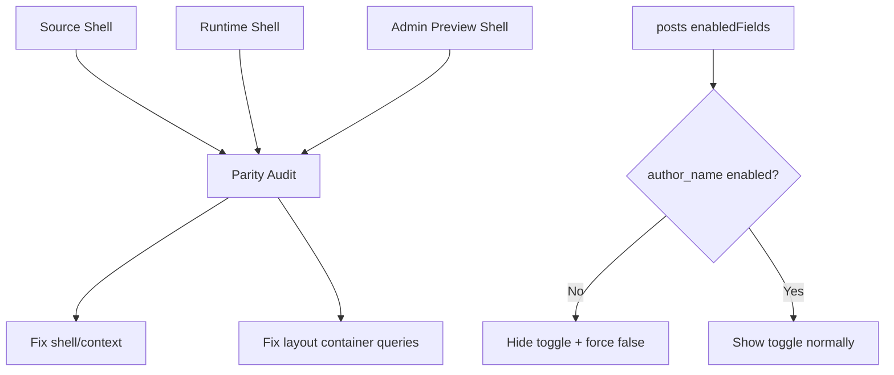

# I. Primer
## 1. TL;DR kiểu Feynman
- Đây không chỉ là lỗi responsive đơn thuần, mà là lỗi `preview parity drift` giữa admin preview và runtime layout.
- Nghĩa là: code layout có thể đúng theo source, nhưng khi đặt vào preview shell khác context container/breakpoint thì desktop/tablet/mobile vẫn lệch.
- Với blog home-component hiện tại, drift đang xảy ra vì admin preview shell và runtime/site shell chưa cho `BlogSectionShared` sống trong cùng loại layout context như source/runtime.
- Song song đó, toggle `Hiện tác giả` cũng đang drift khỏi contract hệ thống vì chưa bám module field `author_name` của posts.
- Spec tốt hơn phải sửa theo 2 lớp: `preview parity context` và `author-field gating`.

## 2. Elaboration & Self-Explanation
- Gợi ý của bạn rất đúng: “không chỉ hỏi layout code có đúng không, mà phải hỏi preview shell có cùng layout context với runtime không?”. Đây là điểm mấu chốt.
- Trong source `blog-homecomponent`, layout được render bên trong một preview shell cụ thể có `@container`, width cố định theo device, padding/ring/border khác nhau. Các layout lại dùng nhiều `container queries` như `@[600px]`, `@[900px]`, `@md`, `@lg`.
- Nếu admin preview của repo không tái tạo đúng context đó, thì cùng một layout code vẫn có thể hiển thị khác. Đó chính là `preview parity drift`.
- Nói cách khác: drift không nhất thiết đến từ code sai; nó đến từ việc cùng code nhưng sống trong hai “phòng” khác nhau. Một phòng có container đúng, phòng còn lại thì không.
- Với vụ blog này, cần audit theo tư duy parity drift:
  1. Layout source có đúng không?
  2. Runtime/site context có gì?
  3. Admin preview context có gì khác?
  4. Chênh lệch nào làm grid/breakpoint/layout drift?
- Về phần tác giả, đây là drift kiểu behavior/config. Module posts đã có source of truth là enabled fields runtime. Blog home-component create/edit chưa follow source of truth đó, nên toggle tác giả đang lệch khỏi hệ thống.

## 3. Concrete Examples & Analogies
- Ví dụ cụ thể 1:
  - Source `Layout1` dùng `@[600px]` và `@[900px]`, nghĩa là grid phụ thuộc vào container width chứ không chỉ viewport width.
  - Nếu preview admin bọc layout trong container không đúng hoặc không truyền đúng `@container` context, grid sẽ lệch dù markup giống nhau.
- Ví dụ cụ thể 2:
  - Site runtime có thể đúng vì đang render trong page/container thật.
  - Admin preview lại render trong card shell có padding/border/max-width khác, dẫn tới “desktop nhìn như tablet”, hoặc tablet không xuống đúng cột.
- Ví dụ cụ thể 3:
  - `app/admin/posts/create/page.tsx` chỉ hiện field tác giả nếu `enabledFields.has('author_name')`.
  - Blog home-component hiện chưa làm như vậy, nên UI create/edit blog bị drift với module runtime config.
- Analogy đời thường:
  - Cùng một bộ nội thất đặt vào căn phòng 20m² và căn phòng 35m² sẽ nhìn khác dù đồ y hệt. Preview parity drift chính là vậy: cùng code, khác “căn phòng render”.

# II. Audit Summary (Tóm tắt kiểm tra)
- Observation:
  - `BlogPreview.tsx` đã được cải thiện shell preview, nhưng chưa có bằng chứng là preview context đã parity hoàn toàn với runtime/source context.
  - `BlogSectionShared.tsx` đang là shared renderer cho 6 layout nhưng chưa được audit lại đầy đủ theo lens `preview parity drift`.
  - Source `blog-homecomponent` dùng preview shell + `@container` + container-query classes rất nhiều.
  - `posts.config.ts` định nghĩa field `author_name` mặc định disabled.
  - `app/admin/posts/create/page.tsx` / `app/admin/posts/[id]/edit/page.tsx` đang bám `listEnabledModuleFields` để hiện/ẩn field tác giả.
- Inference:
  - Lỗi hiện tại cần xem là parity drift giữa preview và runtime, không chỉ là bug CSS từng layout.
  - Tác giả là drift về config source of truth.
- Decision:
  - Sửa theo hướng parity-first: so context preview/source/runtime trước, rồi mới chỉnh class/layout cụ thể.

# III. Root Cause & Counter-Hypothesis (Nguyên nhân gốc & Giả thuyết đối chứng)
## 1. Root Cause Confidence
- High.
- Lý do: insight parity drift khớp trực tiếp với evidence đã đọc từ source shell, `BlogPreview.tsx`, `BlogSectionShared.tsx`, và pattern runtime field gating của module posts.

## 2. Root Cause
1. Triệu chứng quan sát được là gì (expected vs actual)?
   - Expected: admin preview và runtime/site cho blog phải gần như cùng một layout behavior ở desktop/tablet/mobile; toggle tác giả phải biến mất khi module posts tắt field tác giả.
   - Actual: preview vẫn lệch ở nhiều layout; toggle tác giả vẫn độc lập với module runtime config.
2. Phạm vi ảnh hưởng?
   - 6 layout blog trong create/edit preview.
   - UI create/edit blog liên quan `showAuthor`.
3. Có tái hiện ổn định không?
   - Có, vì preview shell/layout context và author gating logic hiện là code chung.
4. Mốc thay đổi gần nhất?
   - Đã port layout và shell một phần, nhưng chưa audit bằng lens parity drift.
5. Dữ liệu nào đang thiếu?
   - Thiếu bước đối chiếu có cấu trúc giữa `source shell` ↔ `preview shell` ↔ `runtime shell` cho từng breakpoint.
6. Có giả thuyết thay thế hợp lý nào chưa bị loại trừ?
   - Một số layout có thể còn sai class riêng, nhưng vẫn phải giải quyết parity drift trước.
7. Rủi ro nếu fix sai nguyên nhân?
   - Vá từng layout bằng mắt sẽ không trị dứt điểm vì drift đến từ context render.
8. Tiêu chí pass/fail sau khi sửa?
   - Preview create/edit không còn drift rõ rệt so runtime/source ở cả 6 layout; tác giả bị ẩn và forced false khi module field tắt.

## 3. Counter-Hypothesis (Giả thuyết đối chứng)
- Giả thuyết A: Chỉ layout code sai.
  - Không đủ. Có thể đúng một phần nhưng không giải thích được vì site đúng mà preview lệch.
- Giả thuyết B: Chỉ shell preview sai.
  - Cũng chưa đủ. Cần đối chiếu cả shell lẫn class responsive/container bên trong layout.
- Giả thuyết C: Chỉ cần ẩn nút tác giả ở UI.
  - Không đủ. Cần ép default/save path để config không drift khỏi runtime source of truth.

# IV. Proposal (Đề xuất)
## 1. Hướng thực hiện đề xuất
- Option A (Recommend) — Confidence 95%
  - Thực hiện audit parity drift có cấu trúc cho blog preview:
    1. So `source preview shell`
    2. So `runtime/site shell`
    3. So `admin preview shell`
    4. So class responsive/container của từng layout
  - Sau đó fix theo 2 lớp:
    - lớp context/shell parity
    - lớp layout/container-query parity
  - Đồng thời nối `author_name` runtime field gating vào blog create/edit/form/save path.
- Option B — Confidence 57%
  - Chỉ tinh chỉnh class/layout theo mắt và ẩn nút tác giả.
  - Tradeoff: nhanh nhưng dễ lặp lỗi lần 3 như bạn nói.

## 2. Implementation concept
### a) Preview parity drift fix
- Tạo checklist parity cho từng bề mặt:
  - source demo shell
  - runtime site shell
  - admin preview shell
- Với mỗi layout 1-6:
  - đối chiếu `container query classes`
  - đối chiếu số cột, gap, width thumbnail, line clamp, text scale, alignment
- Nếu cần, `BlogPreview.tsx` sẽ được chỉnh tiếp để parity context tốt hơn.
- `BlogSectionShared.tsx` sẽ được chỉnh để giữ classes sát source hơn ở các breakpoint container.

### b) Author-field gating fix
- Trong create/edit blog:
  - query `api.admin.modules.listEnabledModuleFields({ moduleKey: 'posts' })`
  - derive `authorFieldEnabled`
- Nếu `authorFieldEnabled === false`:
  - không render control `Hiện tác giả`
  - default state `showAuthor=false`
  - khi load edit: effective `showAuthor=false`
  - khi save: persist `showAuthor=false`

## 3. Mermaid diagram

# V. Files Impacted (Tệp bị ảnh hưởng)
- Sửa: `E:\NextJS\study\admin-ui-aistudio\system-vietadmin-nextjs\app\admin\home-components\blog\_components\BlogPreview.tsx`
  - Vai trò hiện tại: shell preview admin.
  - Thay đổi: hoàn thiện parity context nếu audit cho thấy shell còn drift với source/runtime.
- Sửa: `E:\NextJS\study\admin-ui-aistudio\system-vietadmin-nextjs\app\admin\home-components\blog\_components\BlogSectionShared.tsx`
  - Vai trò hiện tại: render 6 layout.
  - Thay đổi: port/restore container-query parity cho từng layout 1-6.
- Sửa: `E:\NextJS\study\admin-ui-aistudio\system-vietadmin-nextjs\app\admin\home-components\blog\_components\BlogForm.tsx`
  - Vai trò hiện tại: render controls cấu hình blog.
  - Thay đổi: ẩn control `Hiện tác giả` khi `author_name` disabled.
- Sửa: `E:\NextJS\study\admin-ui-aistudio\system-vietadmin-nextjs\app\admin\home-components\create\blog\page.tsx`
  - Vai trò hiện tại: create blog home-component.
  - Thay đổi: nối enabled fields của posts module, set default/showAuthor theo field thật.
- Sửa: `E:\NextJS\study\admin-ui-aistudio\system-vietadmin-nextjs\app\admin\home-components\blog\[id]\edit\page.tsx`
  - Vai trò hiện tại: edit blog home-component.
  - Thay đổi: effective gating cho `showAuthor`, hide control, force save false.
- Có thể sửa: `E:\NextJS\study\admin-ui-aistudio\system-vietadmin-nextjs\app\admin\home-components\blog\_types\index.ts`
  - Vai trò hiện tại: normalize config.
  - Thay đổi: nếu cần helper normalize effective `showAuthor` theo runtime field availability.

# VI. Execution Preview (Xem trước thực thi)
1. So sánh có cấu trúc giữa source preview shell, runtime shell và admin preview shell.
2. Audit từng layout 1-6 theo checklist parity drift.
3. Chỉnh `BlogPreview.tsx` nếu shell/context còn drift.
4. Chỉnh `BlogSectionShared.tsx` để container-query parity sát source hơn.
5. Nối `listEnabledModuleFields('posts')` vào create/edit blog.
6. Ẩn toggle tác giả trong `BlogForm` khi field tắt.
7. Force `showAuthor=false` ở create/edit/save path khi field tắt.
8. Static self-review.
9. Chạy `bunx tsc --noEmit`.
10. Commit local.

# VII. Verification Plan (Kế hoạch kiểm chứng)
- Static verification:
  - `bunx tsc --noEmit`
- Repro checklist:
  - Create/edit blog: test 6 layout × 3 device.
  - So preview với source demo và so logic tổng thể với runtime/site.
  - Vào `/system/modules/posts`, tắt `author_name`, rồi mở create/edit blog:
    - không thấy toggle `Hiện tác giả`
    - save ra config có `showAuthor=false`
- Pass/fail:
  - Không còn parity drift rõ rệt giữa preview và runtime/source.
  - Tác giả bám đúng module setting runtime.

# VIII. Todo
1. Audit parity drift source/runtime/admin preview cho blog.
2. Fix shell/context parity nếu còn lệch.
3. Fix responsive/container-query parity cho layout1..layout6.
4. Nối enabled fields của posts module vào create/edit blog.
5. Ẩn và force false cho `showAuthor` khi `author_name` bị tắt.
6. Chạy `bunx tsc --noEmit`.
7. Commit local.

# IX. Acceptance Criteria (Tiêu chí chấp nhận)
- Preview 6 layout blog trong admin không còn drift rõ rệt so với runtime/source ở desktop/tablet/mobile.
- Lỗi không tái diễn theo pattern “site đúng nhưng preview lệch” do context khác.
- Khi `author_name` tắt ở module posts, create/edit blog mặc định `showAuthor=false`, không hiện toggle, và save luôn false.
- `bunx tsc --noEmit` pass.
- Có commit local, không push.

# X. Risk / Rollback (Rủi ro / Hoàn tác)
- Rủi ro 1: sửa parity quá sát source có thể đổi nhẹ desktop preview hiện tại.
  - Giảm thiểu: ưu tiên bám source of truth, không tự sáng tác layout mới.
- Rủi ro 2: config cũ có `showAuthor=true` nhưng module field đã tắt.
  - Giảm thiểu: effective gating + force save false.
- Rollback:
  - Revert commit cục bộ nếu cần.

# XI. Out of Scope (Ngoài phạm vi)
- Không sửa site runtime nếu runtime đã đúng.
- Không refactor module posts ngoài việc reuse pattern enabled fields hiện có.
- Không đụng FAQ/home-component khác.

# XII. Open Questions (Câu hỏi mở)
- Không còn ambiguity; note `preview parity drift` của bạn đã giúp chốt đúng root cause và nâng spec lên rõ ràng hơn.